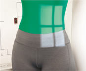
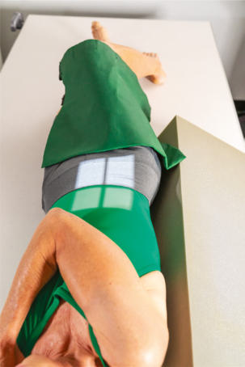
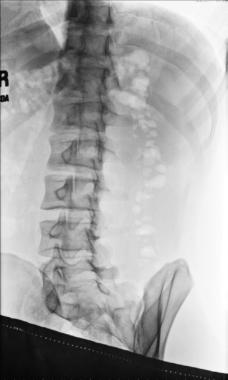

# Rx coloană lombară: poziționare oblică posterioară (sau anterioară)

  📷 Radiografie Convențională (Rx)
  <strong>Actualizat:</strong> 2026-09-15
  <strong>Autor:</strong> Departamentul de Radiologie / Referință Bontrager

---

-   __1. Rezumat Clinic & Indicații__

    ---

    === "Indicații Clinice"

        - Defectele pars interarticularis (de exemplu, spondiloliza); se obțin incidențe oblice atât dreaptă, cât și stângă.

    === "Ghid Național IRIS"

        !!! info "Referință Primară: Ghidul Național IRIS (Ordinul MS 1342/2012)"
            - **Capitol Ghid IRIS:** *Coloană vertebrală*
            - **Grad de Recomandare:** **Grad A**
            - **Nivel de Iradiere Estimată:** `Clasa 2 (Foarte mică ~ 1.0 - 1.5 mSv)`

            [:octicons-search-16: Deschide Ghidul IRIS](../../iris.md){ .md-button .md-button--primary } [:material-open-in-new: Aplicația Oficială PWA](https://radiologie-pediatrica.ro/iris/){ .md-button target="_blank" rel="noopener" }

-   __2. Poziționare & Centrare Fascicul__

    ---

    - **Poziție Pacient:** Pacient: poziții oblice posterioară sau anterioară; pacientul în poziție semisupină (oblică posterioară dreaptă [RPO] și oblică posterioară stângă [LPO]) sau semipronă (oblică anterioară dreaptă [RAO] și oblică anterioară stângă [LAO]), cu brațele extinse și capul pe pernă.; Regiune anatomică: se rotește corpul la 45° și se aliniază coloana vertebrală cu linia mediană a mesei și/sau cu receptorul de imagine; oblicitatea de 50° este cea mai bună pentru articulațiile zigapofizare L1–L2. Se asigură rotația egală a umerilor și bazinului (pelvisului). Se flectează genunchii pentru stabilitate și se aduce brațul cel mai îndepărtat de receptorul de imagine peste torace (Fig. 9.31). Se susțin umerii și bazinul (pelvisul) cu bureți radiotransparenți pentru menținerea poziției. Acest suport este recomandat cu fermitate pentru a preveni apucarea de către pacienți a marginii mesei de examinare, ceea ce poate duce la prinderea degetelor mâinii.
    - **Punct de Centrare Fascicul:** perpendicular pe receptorul de imagine. Raza centrală se orientează spre L3 la nivelul marginii costale inferioare (1 la 2 țoli [2.5 la 5 cm]) deasupra crestei iliace (corespunzător L4-L5) și 2 țoli (5 cm) medial față de spina iliacă anterosuperioară de partea ridicată. Se centrează receptorul de imagine pe raza centrală.
    - **Distanță Focar-Film (DFF / SID):** 100 cm
    - **Comandă Respiratorie:** Apnee pe durata expunerii, la sfârșitul expirului. COLOANĂ LOMBARĂ DE RUTINĂ AP (sau PA) oblică—laterală posterioară sau anterioară L5–S1

-   __3. Parametri Tehnici Expunere__

    ---

    | Parametru Tehnic | Valoare Configurare Generator / Tub |
    |:-----------------|:-------------------------------------|
    | **Tensiune Tub (kV)** | 75-90 kV |
    | **Sarcină / Produs Curent-Timp (mAs)** | DE CONFIGURAT PE APARAT |
    | **Distanță Focar-Film (DFF / SID)** | 100 cm |
    | **Grilă Antidifuzoare (Bucky)** | Cu grilă antidifuzoare Bucky |
    | **Dimensiune Focar** | Focar Mare (1.0 - 1.2 mm) |
    | **Camere de Ionizare AEC** | Camerele laterale (sau camera centrală, în funcție de regiune) |
    | **Colimare Fascicul** | dimensiunea câmpului la aria de interes diagnostic. Expunere optimă pentru receptorul de imagine, expunere și contrast. Evidențiere clară a marginilor osoase și a desenului trabecular al coloanei lombare. Fără mișcare. Fig. 9.32 RPO la 45° a coloanei lombare. Pedicul (L2); pars interarticularis (L3); articulație zigapofizară (L3-4); proces articular superior (L5); proces articular inferior (L4); corp (L2); proces transvers (L3). Fig. 9.33 RPO la 45° a coloanei lombare. Fig. 9.31 RPO la 45° în ortostatism a coloanei lombare, evidențiind articulațiile zigapofizare drepte (casetă). LPO evidențiază articulațiile zigapofizare stângi. 30 (24) (30) |
    | **Filtrare Tub** | Totală ≥ 2.5 mm Al echivalent |

-   __4. Criterii de Calitate & Reușită Imagine__

    ---

    - Vizualizarea articulațiilor zigapofizare (RPO și LPO evidențiază partea inferioară; RAO și LAO evidențiază partea superioară) (Fig. 9.32 și 9.33). Poziție
    - rotație precisă de 45° a pacientului, indicată prin articulațiile zigapofizare și pediculul (ochiul câinelui Scottie) deschise între linia mediană și aspectul lateral al marginii vertebrale.
    - Dacă pediculul este evidențiat mai aproape de marginea vertebrală a liniei mediane și se vede mai puțin din pedicul, aceasta indică suprarotație. Dacă pediculul este evidențiat lateral pe marginea corpului vertebral, cu mai multă lamă (corpul câinelui Scottie) evidențiată, aceasta indică subrotație.2

-   __5. Protecție Radiologică (ALARA)__

    ---

    - Ecranare gonadică și a organelor radiosensibile conform procedurilor locale de radioprotecție ALARA.
    - Colimare strictă la aria de interes pentru limitarea radiației difuze.
    - Verificarea posibilității unei sarcini la pacientele de vârstă fertilă înainte de expunere.

### 🖼️ Imagini

<figure class="protocol-image-card" markdown>

<figcaption><strong>Fig. 9.32 RPO la 45° a coloanei lombare.</strong> — Poziționarea pacientului conform Ghidului Bontrager (Fig. 9.32 RPO la 45° a coloanei lombare.)</figcaption>

</figure>

<figure class="protocol-image-card" markdown>

<figcaption><strong>Fig. 9.33 RPO la 45° a coloanei lombare.</strong> — Aspect radiografic de referință conform Ghidului Bontrager (Fig. 9.33 RPO la 45° a coloanei lombare.)</figcaption>

</figure>

<figure class="protocol-image-card" markdown>

![Fig. 9.31 RPO la 45° în ortostatism a coloanei lombare, evidențiind partea dreaptă (imagine inserată) [fragment incomplet în sursă]](../../assets/images/protocols/bontrager/rx-coloana-lombara-posterior-or-anterior-oblique-positions-bontrager/fig_3.jpeg)

<figcaption><strong>Fig. 9.31 RPO la 45° în ortostatism a coloanei lombare, evidențiind partea dreaptă (imagine inserată) [fragment incomplet în sursă]</strong> — Aspect radiografic de referință conform Ghidului Bontrager (Fig. 9.31 RPO la 45° în ortostatism a coloanei lombare, evidențiind partea dreaptă (casetă))</figcaption>

</figure>

<figure class="protocol-image-card" markdown>

<figcaption><strong>Figura 4</strong> — Aspect radiografic de referință conform Ghidului Bontrager (Figura 4)</figcaption>

</figure>

=== "Ghid Rapid de Execuție"

    1. **Identificarea și verificarea pacientului:** verificare identitate, zonă de examinat, consimțământ conform procedurii și evaluarea posibilității unei sarcini, când este relevantă.
    2. **Pregătire:** îndepărtarea oricăror obiecte radiopace (bijuterii, agrafe, fermoare, proteze, pansamente dense).
    3. **Poziționare precisă:** alinierea receptorului de imagine și a tubului la distanța prescrisă (100 cm).
    4. **Colimare strictă:** adaptarea fasciculului strict la regiunea de diagnostic pentru scăderea iradierii și reducerea radiației difuze.
    5. **Radioprotecție:** verificarea [politicii RX](../radioprotectie.md), cu măsuri distincte pentru pacient, personal și însoțitor.

## Surse de documentare

- [Bontrager's Textbook of Radiographic Positioning (Ed. 9/10), Pagina 360](https://www.elsevier.com/books/textbook-of-radiographic-positioning-and-related-anatomy/lampignano/978-0-323-65367-1)
