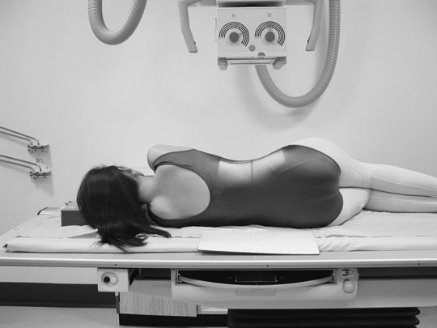
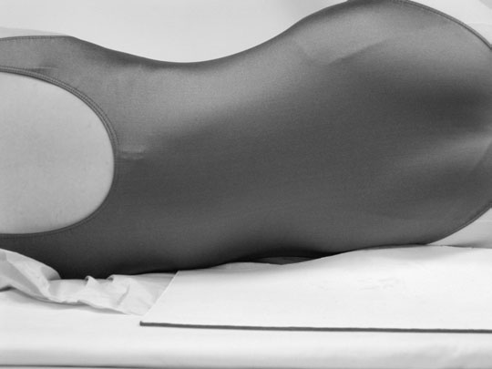
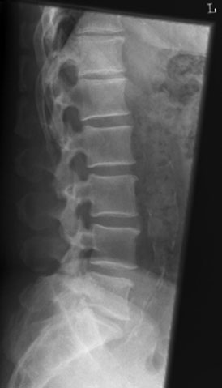
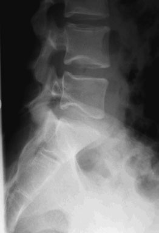
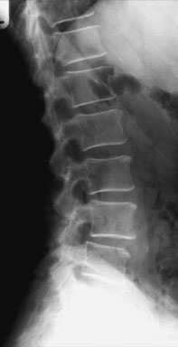
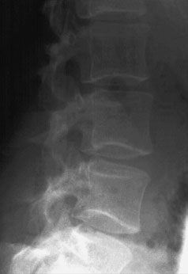

# Rx Coloană Lombară Profil (Lateral) - basic

  📷 Radiografie Convențională (Rx)
  <strong>Actualizat:</strong> 2026-09-16
  <strong>Autor:</strong> Departamentul de Radiologie / Referință Clark (Ed. 12)

---

-   __1. Rezumat Clinic & Indicații__

    ---

    === "Indicații Clinice"

        - same conditions apply ca la thoracic coloană vertebrală.
        - Transitional vertebre (see diagram opposite) sunt common la lumbosacral junction și poate make counting level de abnormality difficult. sacralized L5 has shape similar la S1, cu large procese transverse, și este partially incorporated into upper Sacru. converse este lumbarization de S1, în which corp și appendages de S1 resemble L5 și Articulații Sacroiliace sunt often reduced în height. These anomalies poate cause errors în counting level de abnormality, în which case twelfth rib și thoracic vertebra trebuie să fie seen clearly la enable counting down de la above. This este de particular importance when plain imagini sunt used la confirm level de abnormality detected pe other imaging modalities, e.g. MRI.

    === "Ghid Național IRIS"

        !!! info "Referință Primară: Ghidul Național IRIS (Ordinul MS 1342/2012)"
            - **Capitol Ghid IRIS:** *Ghidul Național IRIS*
            - **Grad de Recomandare:** **De verificat pe indicație; fără grad atribuit automat**
            - **Nivel de Iradiere Estimată:** `De verificat pentru examinarea și populația selectate`

            [:octicons-search-16: Deschide Ghidul IRIS](../../iris.md){ .md-button .md-button--primary } [:material-open-in-new: Aplicația Oficială PWA](https://radiologie-pediatrica.ro/iris/){ .md-button target="_blank" rel="noopener" }
-   __2. Poziționare & Centrare Fascicul__

    ---

    - **Poziție Pacient:** • pacientul este culcat pe either side pe masa radiologică. If there este orice grade de scoliosis, then most appropriate Profil (lateral) poziție will fie astfel încât concavity de curve este spre X-ray tube.
• brațele trebuie să fie raised și resting pe pillow în front de pacientul’s cap. genunchii și hips sunt flectat pentru stability.
• plan coronal running through centre de coloană vertebrală trebuie să coincide cu, și fie perpendicular la, linia mediană Bucky.
• Non-opaque pads poate fie plasat under waist și genunchi, ca necessary, la bring Coloană Vertebrală paralel cu film radiologic.
• caseta este centred la nivelul lower costal margin.
• expunere trebuie să fie made pe arrested expiration.
• This incidență poate also fie undertaken Ortostatism cu pacientul în ortostatism sau Poziție Șezândă.
    - **Punct de Centrare Fascicul:** • se orientează raza centrală centrală la drept-angles la line de procese spinoase și spre point 7.5 cm anterior la third lumbar spinous process la nivelul lower costal margin.
    - **Distanță Focar-Film (DFF / SID):** 100 cm
    - **Comandă Respiratorie:** Apnee pe durata expunerii (apnee în inspir pentru torace; expir pentru Abdomen/bazin).

-   __3. Parametri Tehnici Expunere__

    ---

    | Parametru Tehnic | Valoare Configurare Generator / Tub |
    |:-----------------|:-------------------------------------|
    | **Tensiune Tub (kV)** | DE CONFIGURAT PE APARAT |
    | **Sarcină / Produs Curent-Timp (mAs)** | Conform AEC / grosime anatomică |
    | **Distanță Focar-Film (DFF / SID)** | 100 cm |
    | **Grilă Antidifuzoare (Bucky)** | Cu grilă antidifuzoare Bucky |
    | **Dimensiune Focar** | Focar Mic (0.6 mm) |
    | **Camere de Ionizare AEC** | Camerele laterale (sau camera centrală funcție de regiune) |
    | **Colimare Fascicul** | Colimare strictă la aria anatomică de interes diagnostic |
    | **Filtrare Tub** | Totală ≥ 2.5 mm Al echivalent (conform Clark: 3.0 mm Al eq.) |

-   __4. Criterii de Calitate & Reușită Imagine__

    ---

    - imagine trebuie să include T12 downwards, pentru include lumbar sacral junction.
    - Ideally, incidență will produce clear incidență through centre de intervertebral disc space, cu individual vertebral endplates superimposed.
    - cortices la posterior și anterior margins de vertebral corp trebuie să also fie superimposed.
    - imaging factors selected trebuie să produce imagine densitate optică sufficient pentru diagnosis de la T12 la L5/S1, including procese spinoase. Incorrect – Coloană Vertebrală nu paralel cu table
    - Erori de evitat / remedii: High-contrast imagini will result în insufficient sau high imagine densitate optică over areas de high sau low pacient densitate optică, i.e. procese spinoase și L5/S1. high kVp sau use de other wide-latitude techniques este recommended.
    - Erori de evitat / remedii: procese spinoase poate easily fie excluded de la imagine ca result de overzealous collimation.
    - Erori de evitat / remedii: Poor superimposition de anterior și posterior margins de vertebral corpuri este indication that pacientul was rolled too far forward sau backward during initial positioning (i.e. mean plan sagital nu paralel la casetă).

-   __5. Protecție Radiologică (ALARA)__

    ---

    - Ecranare gonadică cu șorț plumbat dacă gonadele sunt în apropierea fasciculului util (regula ALARA).
    - Colimare precisă la dimensiunea anatomică strict necesară pentru reducerea dozei și a radiației difuze.
    - Verificarea posibilității unei sarcini la pacientele de vârstă fertilă înainte de expunere.

!!! note "Observații Clinice & Tehnice"
    piece de lead rubber sau other attenuator plasat behind pacientul will reduce scatter incident pe film radiologic. This will improve overall imagine quality ca well ca reduce chance de automatic expunere control error.
184 Lumbar transitional vertebra Rudimentary disc la S1/S2 Inappropriately high-contrast imagine Poor superimposition de anterior și posterior vertebral corp margins due la poor positioning

### 🖼️ Imagini

<figure class="protocol-image-card" markdown>

<figcaption><strong>Figura 1: Aspect radiografic / Poziționare (Clark Ed. 12)</strong> — Poziționare pacient și centrare fascicul conform Clark (Ed. 12)</figcaption>

</figure>

<figure class="protocol-image-card" markdown>

<figcaption><strong>Figura 2: Aspect radiografic / Poziționare (Clark Ed. 12)</strong> — Aspect radiografic / ghid de poziționare conform tratatului Clark (Ed. 12)</figcaption>

</figure>

<figure class="protocol-image-card" markdown>

<figcaption><strong>Figura 3: Aspect radiografic / Poziționare (Clark Ed. 12)</strong> — Aspect radiografic / ghid de poziționare conform tratatului Clark (Ed. 12)</figcaption>

</figure>

<figure class="protocol-image-card" markdown>

<figcaption><strong>abnormality difficult. sacralized L5 has shape similar la S1,</strong> — Aspect radiografic / ghid de poziționare conform tratatului Clark (Ed. 12)</figcaption>

</figure>

<figure class="protocol-image-card" markdown>

<figcaption><strong>errors în counting level de abnormality, în which case the</strong> — Aspect radiografic / ghid de poziționare conform tratatului Clark (Ed. 12)</figcaption>

</figure>

<figure class="protocol-image-card" markdown>

<figcaption><strong>Figura 6: Aspect radiografic / Poziționare (Clark Ed. 12)</strong> — Aspect radiografic / ghid de poziționare conform tratatului Clark (Ed. 12)</figcaption>

</figure>

=== "Ghid Rapid de Execuție"

    1. **Identificarea și verificarea pacientului:** verificare identitate, zonă de examinat, consimțământ conform procedurii și evaluarea posibilității unei sarcini, când este relevantă.
    2. **Pregătire:** îndepărtarea oricăror obiecte radiopace (bijuterii, agrafe, fermoare, proteze, pansamente dense).
    3. **Poziționare precisă:** alinierea receptorului de imagine și a tubului la distanța prescrisă (100 cm).
    4. **Colimare strictă:** adaptarea fasciculului strict la regiunea de diagnostic pentru scăderea iradierii și reducerea radiației difuze.
    5. **Radioprotecție:** verificarea [politicii RX](../radioprotectie.md), cu măsuri distincte pentru pacient, personal și însoțitor.

## Surse de documentare

- [Clark's Positioning in Radiography (Ed. 12), Pagina 198](../../assets/protocols/sources/Clark___Positioning_in_Radiography__12th_edition.pdf#page=198)
