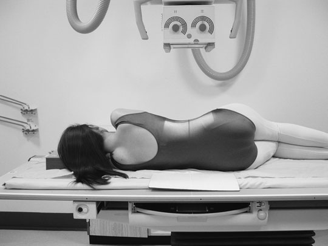
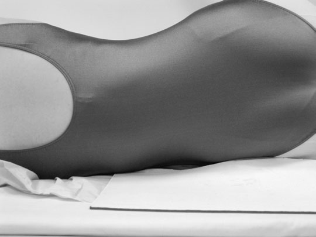
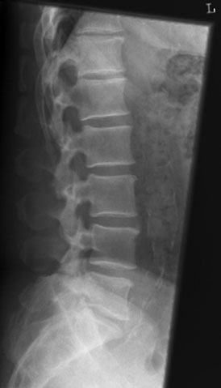
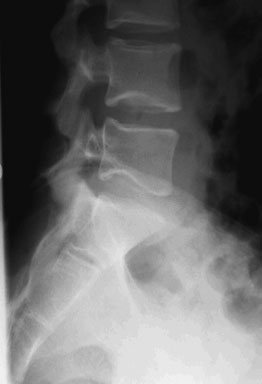
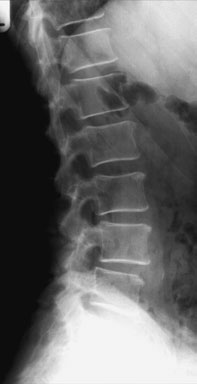
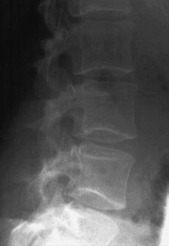

# Radiografie a coloanei lombare – profil (lateral) – de bază

  📷 Radiografie Convențională (Rx)
  <strong>Actualizat:</strong> 2026-09-16
  <strong>Autor:</strong> Departamentul de Radiologie / Referință Clark (Ed. 12)

---

-   __1. Rezumat Clinic & Indicații__

    ---

    === "Indicații Clinice"

        - Se aplică aceleași condiții ca la coloana vertebrală toracică.
        - Vertebrele de tranziție (vezi diagrama alăturată) sunt frecvente la joncțiunea lombosacrată și pot face dificilă numărarea nivelului anomaliei. L5 sacralizată are o formă similară cu S1, cu procese transverse mari, și este parțial încorporată în sacrul superior. Opusul este lombarizarea S1, în care corpul și elementele S1 seamănă cu L5, iar articulațiile sacroiliace sunt adesea reduse în înălțime. Aceste anomalii pot cauza erori în numărarea nivelului anomaliei, caz în care coasta a douăsprezecea și vertebra toracică trebuie vizualizate clar pentru a permite numărarea descendentă de sus în jos. Acest lucru are o importanță deosebită când imaginile simple sunt utilizate pentru confirmarea nivelului anomaliei detectate prin alte modalități imagistice, de exemplu RMN.

    === "Ghid Național IRIS"

        !!! info "Referință Primară: Ghidul Național IRIS (Ordinul MS 1342/2012)"
            - **Capitol Ghid IRIS:** *Ghidul Național IRIS*
            - **Grad de Recomandare:** **De verificat pe indicație; fără grad atribuit automat**
            - **Nivel de Iradiere Estimată:** `De verificat pentru examinarea și populația selectate`

            [:octicons-search-16: Deschide Ghidul IRIS](../../iris.md){ .md-button .md-button--primary } [:material-open-in-new: Aplicația Oficială PWA](https://radiologie-pediatrica.ro/iris/){ .md-button target="_blank" rel="noopener" }
-   __2. Poziționare & Centrare Fascicul__

    ---

    - **Poziție Pacient:** • Pacientul este culcat pe oricare dintre părți pe masa radiologică. Dacă există orice grad de scolioză, atunci cea mai adecvată poziție de profil va fi astfel încât concavitatea curburii să fie orientată spre tubul radiologic.
• Brațele trebuie ridicate și sprijinite pe o pernă în fața capului pacientului. Genunchii și șoldurile sunt flectate pentru stabilitate.
• Planul coronal care trece prin centrul coloanei vertebrale trebuie să coincidă cu linia mediană a Bucky și să fie perpendicular pe aceasta.
• Tampoane radiotransparente pot fi plasate sub talie și genunchi, după cum este necesar, pentru a aduce coloana vertebrală paralel cu filmul radiologic.
• Caseta este centrată la nivelul marginii costale inferioare.
• Expunerea trebuie efectuată în apnee la sfârșitul expirului.
• Această incidență poate fi efectuată și în ortostatism, cu pacientul în picioare, sau în poziție șezândă.
    - **Punct de Centrare Fascicul:** • se orientează raza centrală perpendicular pe linia proceselor spinoase și spre un punct situat la 7.5 cm anterior față de procesul spinos lombar al treilea, la nivelul marginii costale inferioare.
    - **Distanță Focar-Film (DFF / SID):** 100 cm
    - **Comandă Respiratorie:** Apnee pe durata expunerii (apnee în inspir pentru torace; expir pentru Abdomen/bazin).

-   __3. Parametri Tehnici Expunere__

    ---

    | Parametru Tehnic | Valoare Configurare Generator / Tub |
    |:-----------------|:-------------------------------------|
    | **Tensiune Tub (kV)** | DE CONFIGURAT PE APARAT |
    | **Sarcină / Produs Curent-Timp (mAs)** | Conform AEC / grosimii anatomice |
    | **Distanță Focar-Film (DFF / SID)** | 100 cm |
    | **Grilă Antidifuzoare (Bucky)** | Cu grilă antidifuzoare Bucky |
    | **Dimensiune Focar** | Focar Mic (0.6 mm) |
    | **Camere de Ionizare AEC** | Camerele laterale (sau camera centrală, în funcție de regiune) |
    | **Colimare Fascicul** | Colimare strictă la aria anatomică de interes diagnostic |
    | **Filtrare Tub** | Totală ≥ 2.5 mm Al echivalent (conform Clark: 3.0 mm Al echivalent) |

-   __4. Criterii de Calitate & Reușită Imagine__

    ---

    - Imaginea trebuie să includă de la T12 în jos, pentru a include joncțiunea lombosacrată.
    - În mod ideal, incidența va produce o imagine clară prin centrul spațiului discului intervertebral, cu platourile vertebrale individuale suprapuse.
    - Corticalele marginilor posterioare și anterioare ale corpului vertebral trebuie, de asemenea, să fie suprapuse.
    - Factorii de expunere selectați trebuie să producă o densitate optică a imaginii suficientă pentru diagnostic de la T12 la L5/S1, inclusiv pentru procesele spinoase. Incorect – coloana vertebrală nu este paralelă cu masa
    - Erori de evitat / remedii: Imaginile cu contrast ridicat vor duce la o densitate optică insuficientă sau ridicată a imaginii în zonele cu densitate optică a pacientului mare sau mică, respectiv procesele spinoase și L5/S1. Se recomandă kVp ridicat sau utilizarea altor tehnici cu latitudine largă.
    - Erori de evitat / remedii: Procesele spinoase pot fi excluse cu ușurință din imagine ca urmare a colimării excesive.
    - Erori de evitat / remedii: Suprapunerea deficitară a marginilor anterioare și posterioare ale corpurilor vertebrale indică faptul că pacientul a fost rotit prea mult înainte sau înapoi în timpul poziționării inițiale (adică planul sagital median nu este paralel cu caseta).

-   __5. Protecție Radiologică (ALARA)__

    ---

    - Ecranare gonadică cu șorț plumbat dacă gonadele sunt în apropierea fasciculului util (regula ALARA).
    - Colimare precisă la dimensiunea anatomică strict necesară pentru reducerea dozei și a radiației difuze.
    - Verificarea posibilității unei sarcini la pacientele de vârstă fertilă înainte de expunere.

!!! note "Observații Clinice & Tehnice"
    O bucată de cauciuc plumbat sau un alt atenuator plasat în spatele pacientului va reduce radiația secundară incidentă pe filmul radiologic. Aceasta va îmbunătăți calitatea generală a imaginii și va reduce, de asemenea, posibilitatea unei erori de control al expunerii automate.
184 Vertebră lombară de tranziție Disc rudimentar la S1/S2 Imagine cu contrast necorespunzător Suprapunere deficitară a marginilor anterioare și posterioare ale corpurilor vertebrale din cauza poziționării necorespunzătoare

### 🖼️ Imagini

<figure class="protocol-image-card" markdown>

<figcaption><strong>Figura 1: Aspect radiografic / Poziționare (Clark Ed. 12)</strong> — Poziționarea pacientului și centrarea fasciculului conform Clark (Ed. 12)</figcaption>

</figure>

<figure class="protocol-image-card" markdown>

<figcaption><strong>Figura 2: Aspect radiografic / Poziționare (Clark Ed. 12)</strong> — Aspect radiografic / ghid de poziționare conform tratatului Clark (Ed. 12)</figcaption>

</figure>

<figure class="protocol-image-card" markdown>

<figcaption><strong>Figura 3: Aspect radiografic / Poziționare (Clark Ed. 12)</strong> — Aspect radiografic / ghid de poziționare conform tratatului Clark (Ed. 12)</figcaption>

</figure>

<figure class="protocol-image-card" markdown>

<figcaption><strong>anomalie dificilă. L5 sacralizată are o formă similară cu S1,</strong> — Aspect radiografic / ghid de poziționare conform tratatului Clark (Ed. 12)</figcaption>

</figure>

<figure class="protocol-image-card" markdown>

<figcaption><strong>erori în numărarea nivelului anomaliei, caz în care</strong> — Aspect radiografic / ghid de poziționare conform tratatului Clark (Ed. 12)</figcaption>

</figure>

<figure class="protocol-image-card" markdown>

<figcaption><strong>Figura 6: Aspect radiografic / Poziționare (Clark Ed. 12)</strong> — Aspect radiografic / ghid de poziționare conform tratatului Clark (Ed. 12)</figcaption>

</figure>

=== "Ghid Rapid de Execuție"

    1. **Identificarea și verificarea pacientului:** verificare identitate, zonă de examinat, consimțământ conform procedurii și evaluarea posibilității unei sarcini, când este relevantă.
    2. **Pregătire:** îndepărtarea oricăror obiecte radiopace (bijuterii, agrafe, fermoare, proteze, pansamente dense).
    3. **Poziționare precisă:** alinierea receptorului de imagine și a tubului la distanța prescrisă (100 cm).
    4. **Colimare strictă:** adaptarea fasciculului strict la regiunea de diagnostic pentru scăderea iradierii și reducerea radiației difuze.
    5. **Radioprotecție:** verificarea [politicii RX](../radioprotectie.md), cu măsuri distincte pentru pacient, personal și însoțitor.

## Surse de documentare

- [Clark's Positioning in Radiography (Ed. 12), Pagina 198](https://books.google.com/books/about/Clark_s_Positioning_in_Radiography.html?id=Xxu6MwEACAAJ)
