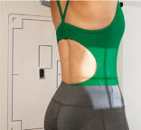
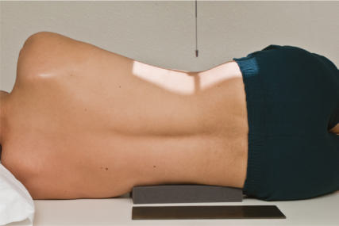
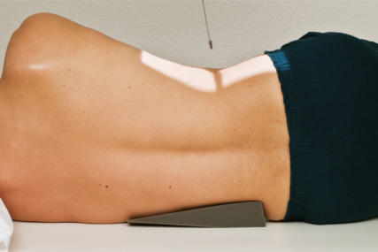
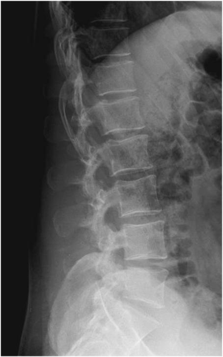

# Rx Coloană Lombară Profil (Lateral)

  📷 Radiografie Convențională (Rx)
  <strong>Actualizat:</strong> 2026-09-15
  <strong>Autor:</strong> Departamentul de Radiologie / Referință Bontrager

---

-   __1. Rezumat Clinic & Indicații__

    ---

    === "Indicații Clinice"

        - pathology of the lumbar vertebrae including suspiciune de fractură, spondylolisthesis, neoplastic processes, and osteoporosis

    === "Ghid Național IRIS"

        !!! info "Referință Primară: Ghidul Național IRIS (Ordinul MS 1342/2012)"
            - **Capitol Ghid IRIS:** *Ghidul Național IRIS*
            - **Grad de Recomandare:** **De verificat pe indicație; fără grad atribuit automat**
            - **Nivel de Iradiere Estimată:** `De verificat pentru examinarea și populația selectate`

            [:octicons-search-16: Deschide Ghidul IRIS](../../iris.md){ .md-button .md-button--primary } [:material-open-in-new: Aplicația Oficială PWA](https://radiologie-pediatrica.ro/iris/){ .md-button target="_blank" rel="noopener" }
-   __2. Poziționare & Centrare Fascicul__

    ---

    - **Poziție Pacient:** Pacient: Incidență de Profil (Lateral) Place patient in the lateral Decubit position, with head on pillow, knees flexed, with support between knees and ankles to better maintain a true Incidență de Profil (Lateral) and ensure patient comfort.; Regiune anatomică: Align midcoronal plane to CR and midline of table and/or IR (Fig. 9.34). Place radiolucent support under waist as needed to place the long axis of the spine near parallel to the table (palpating spinous processes to determine; see NOTES). Ensure that Absența rotației anatomice: clavicule echidistante față de linia apofizelor spinoase of thorax or Bazin (Pelvis) exists.
    - **Punct de Centrare Fascicul:** perpendicular to IR (see NOTES). More open collimation 14 × 17 inches (35 × 43 cm): Center to level of creasta iliacă (corespunzător L4-L5) (L4–L5). This projection includes lumbar vertebrae, Sacru, and possibly Coccis. Tighter collimation 11 × 14 inches (30 × 35 cm): Center to L3 at the level of the lower costal margin (1.5 inches [4 cm] above creasta iliacă (corespunzător L4-L5)). This includes the five lumbar vertebrae. Center IR to CR.
    - **Distanță Focar-Film (DFF / SID):** 100 cm
    - **Comandă Respiratorie:** Suspend respiration on expiration.

-   __3. Parametri Tehnici Expunere__

    ---

    | Parametru Tehnic | Valoare Configurare Generator / Tub |
    |:-----------------|:-------------------------------------|
    | **Tensiune Tub (kV)** | 80-90 kV |
    | **Sarcină / Produs Curent-Timp (mAs)** | DE CONFIGURAT PE APARAT |
    | **Distanță Focar-Film (DFF / SID)** | 100 cm |
    | **Grilă Antidifuzoare (Bucky)** | Cu grilă antidifuzoare Bucky |
    | **Dimensiune Focar** | Focar Mare (1.0 - 1.2 mm) |
    | **Camere de Ionizare AEC** | Camerele laterale (sau camera centrală funcție de regiune) |
    | **Colimare Fascicul** | Field Size Collimate on four sides to anatomy of interest. |
    | **Filtrare Tub** | Totală ≥ 2.5 mm Al echivalent |

-   __4. Criterii de Calitate & Reușită Imagine__

    ---

    - Intervertebral foramina L1–L4, vertebral bodies, intervertebral joints, spinous processes, and L5–S1 junction.
    - Depending on the recommended field size used, the entire Sacru may also be included (Figs. 9.36 and 9.37). Position
    - Spinal column aligned parallel to the IR, as indicated by open intervertebral foramina and open intervertebral joint spaces.
    - Absența rotației anatomice: clavicule echidistante față de linia apofizelor spinoase is indicated by superimposed greater sciatic notches and posterior vertebral bodies.
    - Collimation field size to area of interest. Exposure
    - Optimal image receptor exposure and contrast. Clear demonstration of bony margins and trabecular markings of lumbar vertebrae.
    - no motion. 5° caudad Fig. 9.35 Left lateral lumbar (CR 5° caudad). Fig. 9.36 Lateral lumbar. (Modified from Standring S, editor: Gray’s Anatomy, ed 41, Philadelphia, 2016, Elsevier.)

-   __5. Protecție Radiologică (ALARA)__

    ---

    - Ecranare gonadică și a organelor radiosensibile conform procedurilor locale de radioprotecție ALARA.
    - Colimare strictă la aria de interes pentru limitarea radiației difuze.
    - Verificarea posibilității unei sarcini la pacientele de vârstă fertilă înainte de expunere.

!!! note "Observații Clinice & Tehnice"
    S: Although the average male patient (and some female patients) requires no CR angle, a patient with a wider Bazin (Pelvis) and a narrow thorax may require a 5° to 8° caudad angle even with support, as shown in Fig. 9.35. Fig. 9.34 Left lateral lumbar (Raza centrală (RC) perpendiculară pe receptorul de imagine). Coloană Lombară ROUTINE AP (or PA) Oblique—posterior or anterior Lateral Lateral L5–S1 35 (30) (35)

### 🖼️ Imagini

<figure class="protocol-image-card" markdown>

<figcaption><strong>Fig. 9.34 Left lateral lumbar (Raza centrală (RC) perpendiculară pe receptorul de imagine).</strong> — Poziționare pacient conform Ghidului Bontrager (Fig. 9.34 Left lateral lumbar (CR perpendicular to IR).)</figcaption>

</figure>

<figure class="protocol-image-card" markdown>

<figcaption><strong>Fig. 9.35 Left lateral lumbar (CR 5° caudad).</strong> — Aspect radiografic de referință conform Ghidului Bontrager (Fig. 9.35 Left lateral lumbar (CR 5° caudad).)</figcaption>

</figure>

<figure class="protocol-image-card" markdown>

<figcaption><strong>Fig. 9.36 Lateral lumbar. (Modified from Standring S, editor: Gray’s</strong> — Aspect radiografic de referință conform Ghidului Bontrager (Fig. 9.36 Lateral lumbar. (Modified from Standring S, editor: Gray’s)</figcaption>

</figure>

<figure class="protocol-image-card" markdown>

<figcaption><strong>Figura 4</strong> — Aspect radiografic de referință conform Ghidului Bontrager (Figura 4)</figcaption>

</figure>

=== "Ghid Rapid de Execuție"

    1. **Identificarea și verificarea pacientului:** verificare identitate, zonă de examinat, consimțământ conform procedurii și evaluarea posibilității unei sarcini, când este relevantă.
    2. **Pregătire:** îndepărtarea oricăror obiecte radiopace (bijuterii, agrafe, fermoare, proteze, pansamente dense).
    3. **Poziționare precisă:** alinierea receptorului de imagine și a tubului la distanța prescrisă (100 cm).
    4. **Colimare strictă:** adaptarea fasciculului strict la regiunea de diagnostic pentru scăderea iradierii și reducerea radiației difuze.
    5. **Radioprotecție:** verificarea [politicii RX](../radioprotectie.md), cu măsuri distincte pentru pacient, personal și însoțitor.

## Surse de documentare

- [Bontrager's Textbook of Radiographic Positioning (Ed. 9/10), Pagina 361](https://www.elsevier.com/books/textbook-of-radiographic-positioning-and-related-anatomy/lampignano/978-0-323-65367-1)
