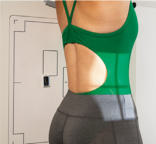
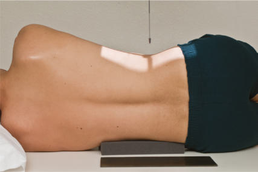
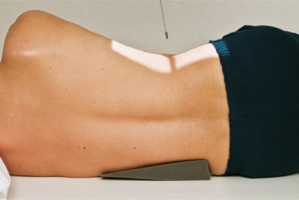
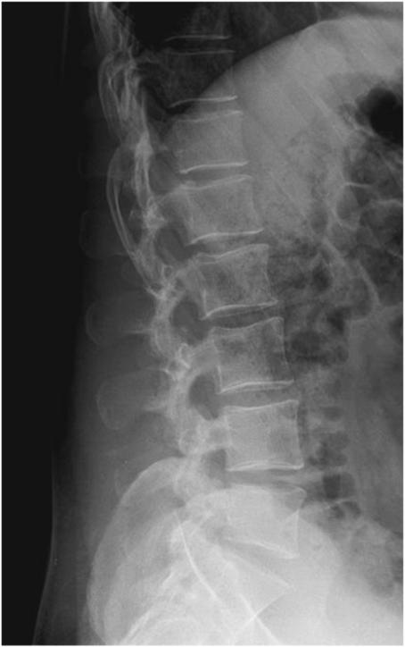

# Radiografie a coloanei lombare – profil (lateral)

  📷 Radiografie Convențională (Rx)
  <strong>Actualizat:</strong> 2026-09-15
  <strong>Autor:</strong> Departamentul de Radiologie / Referință Bontrager

---

-   __1. Rezumat Clinic & Indicații__

    ---

    === "Indicații Clinice"

        - Patologia coloanei lombare, inclusiv suspiciunea de fractură, spondilolistezisul, procesele neoplazice și osteoporoza

    === "Ghid Național IRIS"

        !!! info "Referință Primară: Ghidul Național IRIS (Ordinul MS 1342/2012)"
            - **Capitol Ghid IRIS:** *Coloană vertebrală*
            - **Grad de Recomandare:** **Grad A**
            - **Nivel de Iradiere Estimată:** `Clasa 2 (Foarte mică ~ 1.0 - 1.5 mSv)`

            [:octicons-search-16: Deschide Ghidul IRIS](../../iris.md){ .md-button .md-button--primary } [:material-open-in-new: Aplicația Oficială PWA](https://radiologie-pediatrica.ro/iris/){ .md-button target="_blank" rel="noopener" }

-   __2. Poziționare & Centrare Fascicul__

    ---

    - **Poziție Pacient:** Pacient: Incidență de profil (lateral). Se plasează pacientul în decubit lateral, cu capul pe pernă, genunchii flectați, cu un suport între genunchi și glezne pentru a menține mai bine incidența de profil (lateral) adevărată și pentru a asigura confortul pacientului.; Regiune anatomică: Se aliniază planul mediocoronal cu raza centrală și cu linia mediană a mesei și/sau a receptorului de imagine (Fig. 9.34). Se plasează un suport radiotransparent sub talie, după cum este necesar, pentru a poziționa axul longitudinal al coloanei vertebrale aproape paralel cu masa (se palpează procesele spinoase pentru determinare; vezi NOTE). Se verifică absența rotației: claviculele sunt riguros echidistante față de linia proceselor spinoase; toracele sau bazinul (bazin (pelvis)) sunt prezente.
    - **Punct de Centrare Fascicul:** perpendicular pe receptorul de imagine (vezi NOTE). Colimare mai largă 14 × 17 țoli (35 × 43 cm): se centrează la nivelul crestei iliace (corespunzător L4-L5) (L4–L5). Această incidență include coloana lombară, sacrul și posibil coccisul. Colimare mai strânsă 11 × 14 țoli (30 × 35 cm): se centrează la L3, la nivelul marginii costale inferioare (1.5 țoli [4 cm] deasupra crestei iliace (corespunzător L4-L5)). Aceasta include cele cinci vertebre lombare. Se centrează receptorul de imagine pe raza centrală.
    - **Distanță Focar-Film (DFF / SID):** 100 cm
    - **Comandă Respiratorie:** Apnee pe durata expunerii, la sfârșitul expirului.

-   __3. Parametri Tehnici Expunere__

    ---

    | Parametru Tehnic | Valoare Configurare Generator / Tub |
    |:-----------------|:-------------------------------------|
    | **Tensiune Tub (kV)** | 80-90 kV |
    | **Sarcină / Produs Curent-Timp (mAs)** | DE CONFIGURAT PE APARAT |
    | **Distanță Focar-Film (DFF / SID)** | 100 cm |
    | **Grilă Antidifuzoare (Bucky)** | Cu grilă antidifuzoare Bucky |
    | **Dimensiune Focar** | Focar Mare (1.0 - 1.2 mm) |
    | **Camere de Ionizare AEC** | Camerele laterale (sau camera centrală, în funcție de regiune) |
    | **Colimare Fascicul** | Dimensiunea câmpului Colimați pe cele patru laturi la regiunea anatomică de interes. |
    | **Filtrare Tub** | Totală ≥ 2.5 mm Al echivalent |

-   __4. Criterii de Calitate & Reușită Imagine__

    ---

    - Găurile intervertebrale L1–L4, corpurile vertebrale, articulațiile intervertebrale, procesele spinoase și joncțiunea L5–S1.
    - În funcție de dimensiunea recomandată a câmpului utilizat, poate fi inclus și întregul sacru (Fig. 9.36 și 9.37). poziție
    - Coloana vertebrală este aliniată paralel cu receptorul de imagine (RI), după cum indică deschiderea găurilor intervertebrale și a spațiilor articulare intervertebrale.
    - Absența rotației anatomice: echidistanța claviculelor față de linia apofizelor spinoase este indicată prin suprapunerea incizurilor ischiadice mari și a corpurilor vertebrale posterioare.
    - Colimarea câmpului la dimensiunea ariei de interes diagnostic. Expunere
    - Expunere optimă a receptorului de imagine și contrast. Evidențiere clară a marginilor osoase și a desenului trabecular al coloanei lombare.
    - fără mișcare. 5° caudal Fig. 9.35 incidență lombară stângă de profil (raza centrală 5° caudal). Fig. 9.36 incidență lombară de profil. (Modificat după Standring S, editor: Gray’s Anatomy, ediția 41, Philadelphia, 2016, Elsevier.)

-   __5. Protecție Radiologică (ALARA)__

    ---

    - Ecranare gonadică și a organelor radiosensibile conform procedurilor locale de radioprotecție ALARA.
    - Colimare strictă la aria de interes pentru limitarea radiației difuze.
    - Verificarea posibilității unei sarcini la pacientele de vârstă fertilă înainte de expunere.

!!! note "Observații Clinice & Tehnice"
    S: Deși pacientul bărbat mediu (și unii pacienți de sex feminin) nu necesită un unghi al razei centrale, pacientul cu bazin mai lat (bazin (pelvis)) și torace îngust poate necesita un unghi caudal de 5° la 8°, chiar și cu suport, după cum se vede în Fig. 9.35. Fig. 9.34 incidență lombară stângă de profil (raza centrală (RC) perpendiculară pe receptorul de imagine). Coloană lombară DE RUTINĂ AP (sau PA) oblică—posterior sau anterior lateral lateral L5–S1 35 (30) (35)

### 🖼️ Imagini

<figure class="protocol-image-card" markdown>

<figcaption><strong>Fig. 9.34 incidență lombară stângă de profil (raza centrală (RC) perpendiculară pe receptorul de imagine).</strong> — Poziționarea pacientului conform Ghidului Bontrager (Fig. 9.34 incidență lombară stângă de profil (raza centrală perpendiculară pe receptorul de imagine).)</figcaption>

</figure>

<figure class="protocol-image-card" markdown>

<figcaption><strong>Fig. 9.35 incidență lombară stângă de profil (raza centrală 5° caudal).</strong> — Aspect radiografic de referință conform Ghidului Bontrager (Fig. 9.35 incidență lombară stângă de profil (raza centrală 5° caudal).)</figcaption>

</figure>

<figure class="protocol-image-card" markdown>

<figcaption><strong>Fig. 9.36 incidență lombară de profil. (Modificat după Standring S, editor: Gray’s</strong> — Aspect radiografic de referință conform Ghidului Bontrager (Fig. 9.36 incidență lombară de profil. (Modificat după Standring S, editor: Gray’s)</figcaption>

</figure>

<figure class="protocol-image-card" markdown>

<figcaption><strong>Figura 4</strong> — Aspect radiografic de referință conform Ghidului Bontrager (Figura 4)</figcaption>

</figure>

=== "Ghid Rapid de Execuție"

    1. **Identificarea și verificarea pacientului:** verificare identitate, zonă de examinat, consimțământ conform procedurii și evaluarea posibilității unei sarcini, când este relevantă.
    2. **Pregătire:** îndepărtarea oricăror obiecte radiopace (bijuterii, agrafe, fermoare, proteze, pansamente dense).
    3. **Poziționare precisă:** alinierea receptorului de imagine și a tubului la distanța prescrisă (100 cm).
    4. **Colimare strictă:** adaptarea fasciculului strict la regiunea de diagnostic pentru scăderea iradierii și reducerea radiației difuze.
    5. **Radioprotecție:** verificarea [politicii RX](../radioprotectie.md), cu măsuri distincte pentru pacient, personal și însoțitor.

## Surse de documentare

- [Bontrager's Textbook of Radiographic Positioning (Ed. 9/10), Pagina 361](https://www.elsevier.com/books/textbook-of-radiographic-positioning-and-related-anatomy/lampignano/978-0-323-65367-1)
