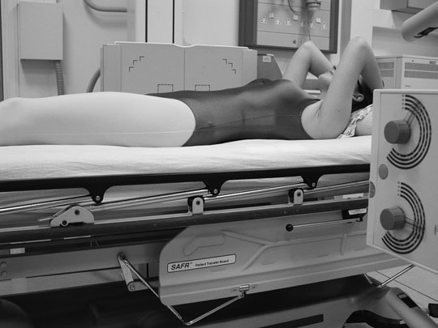
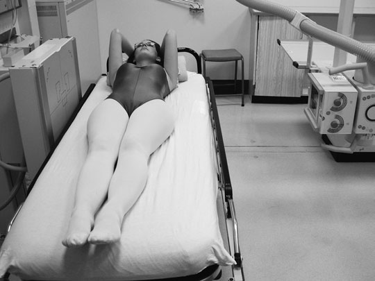
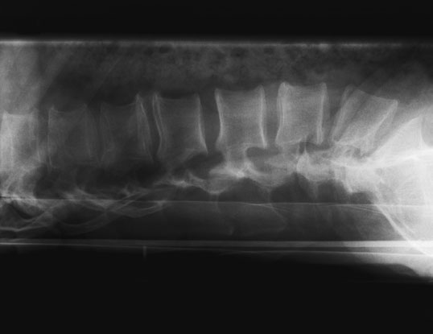
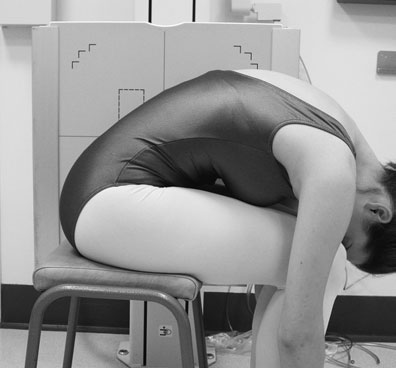
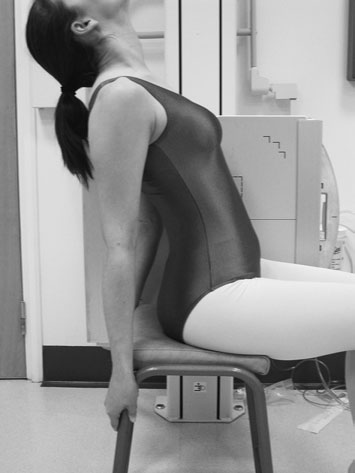
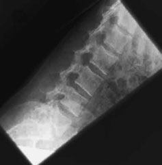
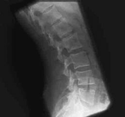

# Rx Coloană Lombară Profil (Lateral) Fascicul Orizontal

  📷 Radiografie Convențională (Rx)
  <strong>Actualizat:</strong> 2026-09-16
  <strong>Autor:</strong> Departamentul de Radiologie / Referință Clark (Ed. 12)

---

-   __1. Rezumat Clinic & Indicații__

    ---

    === "Indicații Clinice"

        - 185 6 Coloană Lombară Profil (lateral) Fascicul Orizontal pacient cu suspected suspiciune de fractură la Coloană Lombară trebuie să nu fie moved de la casualty trolley fără medical supervision. Similarly, pacientul trebuie să nu fie moved into Profil (lateral) decubit poziție în these circumstances. This will necessitate use de Fascicul Orizontal technique în order la obtain second incidență required pentru complete examination.

    === "Ghid Național IRIS"

        !!! info "Referință Primară: Ghidul Național IRIS (Ordinul MS 1342/2012)"
            - **Capitol Ghid IRIS:** *Ghidul Național IRIS*
            - **Grad de Recomandare:** **De verificat pe indicație; fără grad atribuit automat**
            - **Nivel de Iradiere Estimată:** `De verificat pentru examinarea și populația selectate`

            [:octicons-search-16: Deschide Ghidul IRIS](../../iris.md){ .md-button .md-button--primary } [:material-open-in-new: Aplicația Oficială PWA](https://radiologie-pediatrica.ro/iris/){ .md-button target="_blank" rel="noopener" }
-   __2. Poziționare & Centrare Fascicul__

    ---

    - **Poziție Pacient:** • trauma trolley este plasat adjacent la stativ vertical Bucky.
• se ajustează poziție de trolley astfel încât lower costal margin de pacientul coincides cu vertical central line de Bucky și planul mediosagital este paralel cu casetă.
• Bucky trebuie să fie raised sau lowered astfel încât pacient’s mid-plan coronal este coincident cu linia mediană casetă within Bucky, along its axa longitudinală.
• If possible, brațele trebuie să fie raised above capul.

• This incidență poate fie performed Decubit dorsal, but it este most commonly performed Ortostatism cu pacientul așezat pe scaun pe stool cu either side pe / sprijinit de stativ vertical Bucky.
• așezat pe scaun poziție este preferred, since apparent flexion și extension de lumbar region este less likely la fie due la movement de Șold articulații when using Ortostatism poziție.
• dorsal surface de trunk trebuie să fie la drept-angles la caseta și Coloană Vertebrală paralel cu casetă.
• pentru first expunere pacientul leans forward, flexing lumbar region ca far ca possible, și grips front de seat la assist în maintaining poziție.
• pentru second expunere pacientul then leans backward, extending lumbar region ca far ca possible, și grips back de seat sau another support plasat behind pacientul.
• caseta este centred la nivelul lower costal margin, și Expunerea se efectuează în apnee la sfârșitul expirului complet.
    - **Punct de Centrare Fascicul:** • Direct raza centrală orizontală centrală paralel la line joining anterior superior iliac spines și spre point 7.5 cm anterior la third lumbar spinous process la nivelul lower costal margin.

• se orientează raza centrală centrală la drept-angles la film radiologic și spre point 7.5 cm anterior la third lumbar spinous process la nivelul lower costal margin.
    - **Distanță Focar-Film (DFF / SID):** 100 cm
    - **Comandă Respiratorie:** Apnee pe durata expunerii (apnee în inspir pentru torace; expir pentru Abdomen/bazin).

-   __3. Parametri Tehnici Expunere__

    ---

    | Parametru Tehnic | Valoare Configurare Generator / Tub |
    |:-----------------|:-------------------------------------|
    | **Tensiune Tub (kV)** | DE CONFIGURAT PE APARAT |
    | **Sarcină / Produs Curent-Timp (mAs)** | Conform AEC / grosime anatomică |
    | **Distanță Focar-Film (DFF / SID)** | 100 cm |
    | **Grilă Antidifuzoare (Bucky)** | Cu grilă antidifuzoare Bucky |
    | **Dimensiune Focar** | Focar Mic (0.6 mm) |
    | **Camere de Ionizare AEC** | Camerele laterale (sau camera centrală funcție de regiune) |
    | **Colimare Fascicul** | Colimare strictă la aria anatomică de interes diagnostic |
    | **Filtrare Tub** | Totală ≥ 2.5 mm Al echivalent (conform Clark: 3.0 mm Al eq.) |

-   __4. Criterii de Calitate & Reușită Imagine__

    ---

    - Refer la Profil (lateral) lumbar coloană vertebrală (p. 183).
    - Extreme care trebuie să fie taken if using automatic expunere control. chamber selected trebuie să fie directly în line cu vertebre, otherwise incorrect expunere will result.
    - If manual expunere este selected, them higher expunere will fie required than cu Decubit dorsal Profil (lateral). This este due la effect de gravity pe intern organs, causing them la lie either side de coloană vertebrală. Fascicul Orizontal Refer la Profil (lateral) lumbar coloană vertebrală (p. 183). toate de aria de interes diagnostic trebuie să fie included pe ambele incidențe.
    - Erori de evitat / remedii: Extreme care trebuie să fie taken if using automatic expunere control. chamber selected trebuie să fie directly în line cu vertebre, otherwise incorrect expunere will result.
    - Erori de evitat / remedii: If manual expunere este selected, higher expunere will fie required than cu Decubit dorsal Profil (lateral). This este due la effect de gravity pe intern organs, causing them la lie either side de coloană vertebrală.
    - Erori de evitat / remedii: short expunere time este desirable, ca it este difficult pentru pacientul la remain stable. 186 Flexion Extension Flexion Extension

-   __5. Protecție Radiologică (ALARA)__

    ---

    - Ecranare gonadică cu șorț plumbat dacă gonadele sunt în apropierea fasciculului util (regula ALARA).
    - Colimare precisă la dimensiunea anatomică strict necesară pentru reducerea dozei și a radiației difuze.
    - Verificarea posibilității unei sarcini la pacientele de vârstă fertilă înainte de expunere.

!!! note "Observații Clinice & Tehnice"
    Pregătirea pacientului prin îndepărtarea tuturor accesoriilor radio-opace.

### 🖼️ Imagini

<figure class="protocol-image-card" markdown>

<figcaption><strong>pacient cu suspected suspiciune de fractură la Coloană Lombară</strong> — Poziționare pacient și centrare fascicul conform Clark (Ed. 12)</figcaption>

</figure>

<figure class="protocol-image-card" markdown>

<figcaption><strong>Figura 2: Aspect radiografic / Poziționare (Clark Ed. 12)</strong> — Aspect radiografic / ghid de poziționare conform tratatului Clark (Ed. 12)</figcaption>

</figure>

<figure class="protocol-image-card" markdown>

<figcaption><strong>Figura 3: Aspect radiografic / Poziționare (Clark Ed. 12)</strong> — Aspect radiografic / ghid de poziționare conform tratatului Clark (Ed. 12)</figcaption>

</figure>

<figure class="protocol-image-card" markdown>

<figcaption><strong>Figura 4: Aspect radiografic / Poziționare (Clark Ed. 12)</strong> — Aspect radiografic / ghid de poziționare conform tratatului Clark (Ed. 12)</figcaption>

</figure>

<figure class="protocol-image-card" markdown>

<figcaption><strong>Figura 5: Aspect radiografic / Poziționare (Clark Ed. 12)</strong> — Aspect radiografic / ghid de poziționare conform tratatului Clark (Ed. 12)</figcaption>

</figure>

<figure class="protocol-image-card" markdown>

<figcaption><strong>Figura 6: Aspect radiografic / Poziționare (Clark Ed. 12)</strong> — Aspect radiografic / ghid de poziționare conform tratatului Clark (Ed. 12)</figcaption>

</figure>

<figure class="protocol-image-card" markdown>

<figcaption><strong>Figura 7: Aspect radiografic / Poziționare (Clark Ed. 12)</strong> — Aspect radiografic / ghid de poziționare conform tratatului Clark (Ed. 12)</figcaption>

</figure>

=== "Ghid Rapid de Execuție"

    1. **Identificarea și verificarea pacientului:** verificare identitate, zonă de examinat, consimțământ conform procedurii și evaluarea posibilității unei sarcini, când este relevantă.
    2. **Pregătire:** îndepărtarea oricăror obiecte radiopace (bijuterii, agrafe, fermoare, proteze, pansamente dense).
    3. **Poziționare precisă:** alinierea receptorului de imagine și a tubului la distanța prescrisă (100 cm).
    4. **Colimare strictă:** adaptarea fasciculului strict la regiunea de diagnostic pentru scăderea iradierii și reducerea radiației difuze.
    5. **Radioprotecție:** verificarea [politicii RX](../radioprotectie.md), cu măsuri distincte pentru pacient, personal și însoțitor.

## Surse de documentare

- [Clark's Positioning in Radiography (Ed. 12), Pagina 200](../../assets/protocols/sources/Clark___Positioning_in_Radiography__12th_edition.pdf#page=200)
