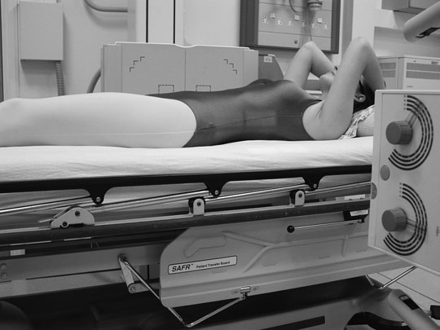
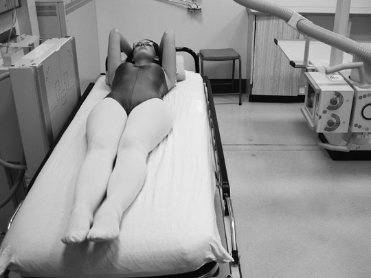
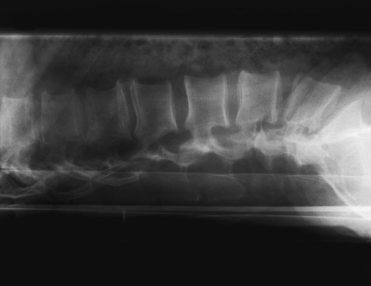
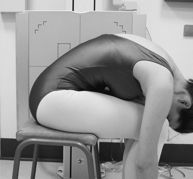
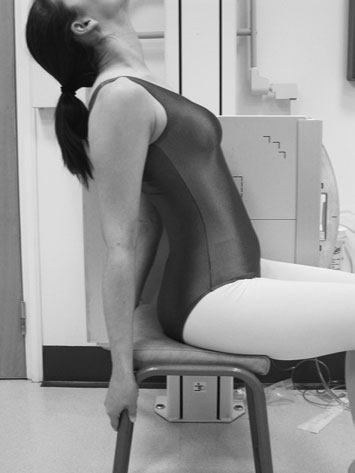
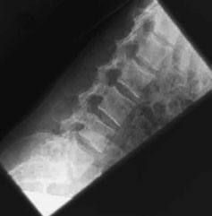
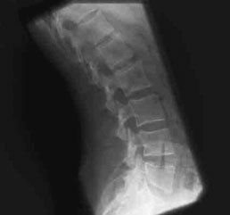

# Radiografie a coloanei lombare – profil (lateral) – fascicul orizontal

  📷 Radiografie Convențională (Rx)
  <strong>Actualizat:</strong> 2026-09-16
  <strong>Autor:</strong> Departamentul de Radiologie / Referință Clark (Ed. 12)

---

-   __1. Rezumat Clinic & Indicații__

    ---

    === "Indicații Clinice"

        - 185 6 Coloană lombară – profil (lateral) – fascicul orizontal. Pacientul cu suspiciune de fractură a coloanei lombare nu trebuie deplasat de pe targa de traumă fără supraveghere medicală. În mod similar, pacientul nu trebuie deplasat în poziție de decubit lateral în aceste situații. Acest lucru va necesita utilizarea tehnicii cu fascicul orizontal pentru obținerea celei de-a doua incidențe necesare examinării complete.

    === "Ghid Național IRIS"

        !!! info "Referință Primară: Ghidul Național IRIS (Ordinul MS 1342/2012)"
            - **Capitol Ghid IRIS:** *Ghidul Național IRIS*
            - **Grad de Recomandare:** **De verificat pe indicație; fără grad atribuit automat**
            - **Nivel de Iradiere Estimată:** `De verificat pentru examinarea și populația selectate`

            [:octicons-search-16: Deschide Ghidul IRIS](../../iris.md){ .md-button .md-button--primary } [:material-open-in-new: Aplicația Oficială PWA](https://radiologie-pediatrica.ro/iris/){ .md-button target="_blank" rel="noopener" }
-   __2. Poziționare & Centrare Fascicul__

    ---

    - **Poziție Pacient:** • Targa de traumă este plasată adiacent stativului vertical Bucky.
• Se ajustează poziția tărgii astfel încât marginea costală inferioară a pacientului să coincidă cu linia centrală verticală a Bucky, iar planul mediosagital să fie paralel cu caseta.
• Bucky trebuie ridicat sau coborât astfel încât planul coronal median al pacientului să coincidă cu linia mediană a casetei în interiorul Bucky, de-a lungul axei sale longitudinale.
• Dacă este posibil, brațele trebuie ridicate deasupra capului.

• Această incidență poate fi efectuată în decubit dorsal, dar este cel mai frecvent efectuată în ortostatism, cu pacientul așezat pe un scaun sau pe un taburet, cu una dintre laturi sprijinită de stativul vertical Bucky.
• Poziția așezat este preferată, deoarece flexia și extensia aparentă a regiunii lombare este mai puțin probabil să se datoreze mișcării articulațiilor șoldurilor atunci când se utilizează poziția în ortostatism.
• Suprafața dorsală a trunchiului trebuie să fie perpendiculară pe casetă, iar coloana vertebrală paralelă cu caseta.
• Pentru prima expunere, pacientul se apleacă înainte, flectând regiunea lombară cât mai mult posibil, și se prinde de partea anterioară a șezutului pentru a ajuta la menținerea poziției.
• Pentru a doua expunere, pacientul se apleacă apoi înapoi, extinzând regiunea lombară cât mai mult posibil, și se prinde de partea posterioară a șezutului sau de un alt suport plasat în spatele pacientului.
• Caseta este centrată la nivelul marginii costale inferioare, iar expunerea se efectuează în apnee la sfârșitul expirului complet.
    - **Punct de Centrare Fascicul:** • Se direcționează raza centrală orizontală paralel cu linia care unește spinele iliace anterosuperioare și spre un punct situat la 7.5 cm anterior de procesul spinos al celei de-a treia vertebre lombare, la nivelul marginii costale inferioare.

• Se orientează raza centrală perpendicular pe filmul radiologic și spre un punct situat la 7.5 cm anterior de procesul spinos al celei de-a treia vertebre lombare, la nivelul marginii costale inferioare.
    - **Distanță Focar-Film (DFF / SID):** 100 cm
    - **Comandă Respiratorie:** Apnee pe durata expunerii (apnee în inspir pentru torace; expir pentru Abdomen/bazin).

-   __3. Parametri Tehnici Expunere__

    ---

    | Parametru Tehnic | Valoare Configurare Generator / Tub |
    |:-----------------|:-------------------------------------|
    | **Tensiune Tub (kV)** | DE CONFIGURAT PE APARAT |
    | **Sarcină / Produs Curent-Timp (mAs)** | Conform AEC / grosimii anatomice |
    | **Distanță Focar-Film (DFF / SID)** | 100 cm |
    | **Grilă Antidifuzoare (Bucky)** | Cu grilă antidifuzoare Bucky |
    | **Dimensiune Focar** | Focar Mic (0.6 mm) |
    | **Camere de Ionizare AEC** | Camerele laterale (sau camera centrală, în funcție de regiune) |
    | **Colimare Fascicul** | Colimare strictă la aria anatomică de interes diagnostic |
    | **Filtrare Tub** | Totală ≥ 2.5 mm Al echivalent (conform Clark: 3.0 mm Al echivalent) |

-   __4. Criterii de Calitate & Reușită Imagine__

    ---

    - Consultați coloana vertebrală lombară de profil (lateral) (p. 183).
    - Este necesară o atenție deosebită dacă se utilizează controlul automat al expunerii. Camera selectată trebuie să fie direct aliniată cu vertebrele; în caz contrar, va rezulta o expunere incorectă.
    - Dacă se selectează expunerea manuală, va fi necesară o expunere mai mare decât în cazul incidenței de profil (lateral) în decubit dorsal. Acest lucru se datorează efectului gravitației asupra organelor interne, determinându-le să se dispună de o parte și de alta a coloanei vertebrale. Fascicul orizontal. Consultați coloana vertebrală lombară de profil (lateral) (p. 183). Întreaga arie de interes diagnostic trebuie inclusă pe ambele incidențe.
    - Erori de evitat / remedii: Este necesară o atenție deosebită dacă se utilizează controlul automat al expunerii. Camera selectată trebuie să fie direct aliniată cu vertebrele; în caz contrar, va rezulta o expunere incorectă.
    - Erori de evitat / remedii: Dacă se selectează expunerea manuală, va fi necesară o expunere mai mare decât în cazul incidenței de profil (lateral) în decubit dorsal. Acest lucru se datorează efectului gravitației asupra organelor interne, determinându-le să se dispună de o parte și de alta a coloanei vertebrale.
    - Erori de evitat / remedii: Este de dorit un timp scurt de expunere, deoarece pacientului îi este dificil să rămână stabil. 186 Flexie Extensie Flexie Extensie

-   __5. Protecție Radiologică (ALARA)__

    ---

    - Ecranare gonadică cu șorț plumbat dacă gonadele sunt în apropierea fasciculului util (regula ALARA).
    - Colimare precisă la dimensiunea anatomică strict necesară pentru reducerea dozei și a radiației difuze.
    - Verificarea posibilității unei sarcini la pacientele de vârstă fertilă înainte de expunere.

!!! note "Observații Clinice & Tehnice"
    Pregătirea pacientului prin îndepărtarea tuturor accesoriilor radio-opace.

### 🖼️ Imagini

<figure class="protocol-image-card" markdown>

<figcaption><strong>pacient cu suspiciune de fractură a coloanei lombare</strong> — Poziționarea pacientului și centrarea fasciculului conform Clark (Ed. 12)</figcaption>

</figure>

<figure class="protocol-image-card" markdown>

<figcaption><strong>Figura 2: Aspect radiografic / Poziționare (Clark Ed. 12)</strong> — Aspect radiografic / ghid de poziționare conform tratatului Clark (Ed. 12)</figcaption>

</figure>

<figure class="protocol-image-card" markdown>

<figcaption><strong>Figura 3: Aspect radiografic / Poziționare (Clark Ed. 12)</strong> — Aspect radiografic / ghid de poziționare conform tratatului Clark (Ed. 12)</figcaption>

</figure>

<figure class="protocol-image-card" markdown>

<figcaption><strong>Figura 4: Aspect radiografic / Poziționare (Clark Ed. 12)</strong> — Aspect radiografic / ghid de poziționare conform tratatului Clark (Ed. 12)</figcaption>

</figure>

<figure class="protocol-image-card" markdown>

<figcaption><strong>Figura 5: Aspect radiografic / Poziționare (Clark Ed. 12)</strong> — Aspect radiografic / ghid de poziționare conform tratatului Clark (Ed. 12)</figcaption>

</figure>

<figure class="protocol-image-card" markdown>

<figcaption><strong>Figura 6: Aspect radiografic / Poziționare (Clark Ed. 12)</strong> — Aspect radiografic / ghid de poziționare conform tratatului Clark (Ed. 12)</figcaption>

</figure>

<figure class="protocol-image-card" markdown>

<figcaption><strong>Figura 7: Aspect radiografic / Poziționare (Clark Ed. 12)</strong> — Aspect radiografic / ghid de poziționare conform tratatului Clark (Ed. 12)</figcaption>

</figure>

=== "Ghid Rapid de Execuție"

    1. **Identificarea și verificarea pacientului:** verificare identitate, zonă de examinat, consimțământ conform procedurii și evaluarea posibilității unei sarcini, când este relevantă.
    2. **Pregătire:** îndepărtarea oricăror obiecte radiopace (bijuterii, agrafe, fermoare, proteze, pansamente dense).
    3. **Poziționare precisă:** alinierea receptorului de imagine și a tubului la distanța prescrisă (100 cm).
    4. **Colimare strictă:** adaptarea fasciculului strict la regiunea de diagnostic pentru scăderea iradierii și reducerea radiației difuze.
    5. **Radioprotecție:** verificarea [politicii RX](../radioprotectie.md), cu măsuri distincte pentru pacient, personal și însoțitor.

## Surse de documentare

- [Clark's Positioning in Radiography (Ed. 12), Pagina 200](https://books.google.com/books/about/Clark_s_Positioning_in_Radiography.html?id=Xxu6MwEACAAJ)
