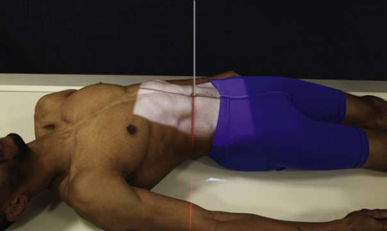
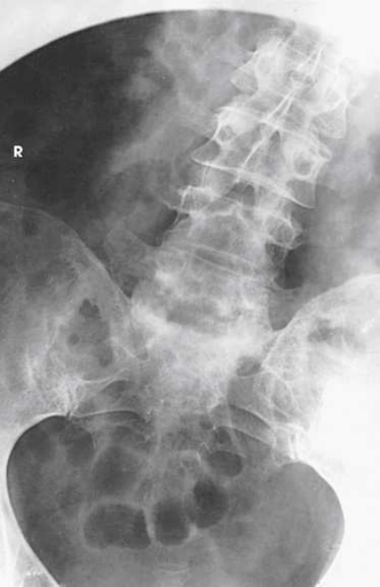

# Rx Coloană Lombară: Spinal Fusion — Incidență Antero-Posterioară (AP) — Right and left bending (Merrill)

  📷 Radiografie Convențională (Rx)
  <strong>Actualizat:</strong> 2026-09-16
  <strong>Autor:</strong> Referință Merrill

---

-   __1. Rezumat Clinic & Indicații__

    ---

    === "Indicații Clinice"

        - Conform reperelor anatomice standard din tratat

    === "Ghid Național IRIS"

        !!! info "Referință Primară: Ghidul Național IRIS (Ordinul MS 1342/2012)"
            - **Capitol Ghid IRIS:** *Ghidul Național IRIS*
            - **Grad de Recomandare:** **De verificat pe indicație; fără grad atribuit automat**
            - **Nivel de Iradiere Estimată:** `De verificat pentru examinarea și populația selectate`

            [:octicons-search-16: Deschide Ghidul IRIS](../../iris.md){ .md-button .md-button--primary } [:material-open-in-new: Aplicația Oficială PWA](https://radiologie-pediatrica.ro/iris/){ .md-button target="_blank" rel="noopener" }
-   __2. Poziționare & Centrare Fascicul__

    ---

    - **Poziție Pacient:** se așază pacientul în Decubit dorsal poziție și se centrează MSP de corp la linia mediană grilă. These bending poziții poate also fie performed cu pacientul în ortostatism.; Take first radiografie cu maximum drept bending. Take second radiografie cu maximum stâng bending. la obtain equal bending force throughout coloană vertebrală when pacientul este Decubit dorsal, cross pacientul’s membru inferior pe opposite side la fie flectat over other membru inferior. drept bending requires stâng membru inferior la fie crossed over drept. Move pacientul’s heels spre side that este flectat. se imobilizează heels cu săculeți cu nisip. Move umerii directly lateral ca far ca possible fără rotating Bazin (bazin (pelvis)) (Fig. 9.142). se efectuează ecranarea gonadelor cu șorț plumbat.
    - **Punct de Centrare Fascicul:** perpendicular pe level de third lumbar vertebra, 1 la 1.5 inches (2.5 la 3.8 cm) above crestele iliace pe MSP Se centrează receptorul de imagine pe raza centrală.
    - **Distanță Focar-Film (DFF / SID):** Nespecificat în fragmentul extras; de verificat în sursă
    - **Comandă Respiratorie:** apnee (oprirea respirației).

-   __3. Parametri Tehnici Expunere__

    ---

    | Parametru Tehnic | Valoare Configurare Generator / Tub |
    |:-----------------|:-------------------------------------|
    | **Tensiune Tub (kV)** | DE CONFIGURAT PE APARAT |
    | **Sarcină / Produs Curent-Timp (mAs)** | DE CONFIGURAT PE APARAT |
    | **Distanță Focar-Film (DFF / SID)** | Nespecificat în fragmentul extras; de verificat în sursă |
    | **Grilă Antidifuzoare (Bucky)** | DE CONFIGURAT PE APARAT |
    | **Dimensiune Focar** | DE CONFIGURAT PE APARAT |
    | **Camere de Ionizare AEC** | DE CONFIGURAT PE APARAT |
    | **Colimare Fascicul** | Adjust câmp de iradiere la 10 × 12 inches (24 × 30 cm) sau 14 × 17 inches (35 × 43 cm) pe collimator. Place marker de lateralitate (D/S) în collimated expunere field. |
    | **Filtrare Tub** | DE CONFIGURAT PE APARAT |

-   __4. Criterii de Calitate & Reușită Imagine__

    ---

    - Criterii radiologice de calitate imaginii:
    - Evidence de corect collimation și presence de marker de lateralitate (D/S) plasat clear de anatomy de interest
    - Site de spinal fusion centrat și including superior și inferior vertebre
    - Absența rotației anatomice (simetrie bilaterală perfectă) de Bazin (bazin (pelvis)) (simetric ilia)
    - Bending directions correctly identified cu appropriate lead markeri
    - Bony detalii trabeculare osoase și surrounding soft tissues

-   __5. Protecție Radiologică (ALARA)__

    ---

    - Nespecificat în fragmentul extras; de verificat în sursă

!!! note "Observații Clinice & Tehnice"
    Conform reperelor anatomice standard din tratat

### 🖼️ Imagini

<figure class="protocol-image-card" markdown>

<figcaption><strong>Merrill — pagina PDF 773, imaginea 1</strong> — Imagine din fragmentul sursă; asocierea necesită revizie.</figcaption>

</figure>

<figure class="protocol-image-card" markdown>

<figcaption><strong>Merrill — pagina PDF 774, imaginea 2</strong> — Imagine din fragmentul sursă; asocierea necesită revizie.</figcaption>

</figure>

<figure class="protocol-image-card" markdown>

<figcaption><strong>Merrill — pagina PDF 775, imaginea 3</strong> — Imagine din fragmentul sursă; asocierea necesită revizie.</figcaption>

</figure>

=== "Ghid Rapid de Execuție"

    1. **Identificarea și verificarea pacientului:** verificare identitate, zonă de examinat, consimțământ conform procedurii și evaluarea posibilității unei sarcini, când este relevantă.
    2. **Pregătire:** îndepărtarea oricăror obiecte radiopace (bijuterii, agrafe, fermoare, proteze, pansamente dense).
    3. **Poziționare precisă:** alinierea receptorului de imagine și a tubului la distanța prescrisă (Nespecificat în fragmentul extras; de verificat în sursă).
    4. **Colimare strictă:** adaptarea fasciculului strict la regiunea de diagnostic pentru scăderea iradierii și reducerea radiației difuze.
    5. **Radioprotecție:** verificarea [politicii RX](../radioprotectie.md), cu măsuri distincte pentru pacient, personal și însoțitor.

## Surse de documentare

- [Merrill’s Atlas, 9. Vertebral Column, pagini PDF 772–775](../../assets/protocols/sources/a56d45c16829_Merrills_Atlas_of_Radiographic_Positioning__Procedures_3Vol_Set.pdf#page=772)

## Fragmente sursă traduse (referință tehnică)

### anatomy

coloană lombară, în maximum drept și stâng bending (lateral flexion) (Figs. 9.143 și 9.144). These studies sunt used la evaluate integrity
de spinal fusion și sunt usually performed 6 months after fusion procedure. This procedure poate also fie used în pacienți cu early scoliosis
la determine presence de structural change when bending la drept și stâng. studies poate fie used la localize herniated disk, ca vizualizat
prin limitation de mișcare la site de lesion.

### collimation

• Adjust câmp de iradiere la 10 × 12 inches (24 × 30 cm) sau 14 × 17 inches (35 × 43 cm) pe collimator. Place marker de lateralitate (D/S) în collimated expunere field.

### cr

• perpendicular pe level de third lumbar vertebra, 1 la 1.5 inches (2.5 la 3.8 cm) above crestele iliace pe MSP
• Se centrează receptorul de imagine pe raza centrală.

### criteria

Criterii radiologice de calitate imaginii:
• Evidence de corect collimation și presence de marker de lateralitate (D/S) plasat clear de anatomy de interest
• Site de spinal fusion centrat și including superior și inferior vertebre
• Absența rotației anatomice (simetrie bilaterală perfectă) de bazinul (simetric ilia)
• Bending directions correctly identified cu appropriate lead markeri
• Bony detalii trabeculare osoase și surrounding soft tissues

### part_pos

• Take first radiografie cu maximum drept bending. Take second radiografie cu maximum stâng bending.
• la obtain equal bending force throughout coloană vertebrală when pacientul este în decubit dorsal, cross pacientul’s membru inferior pe opposite side la fie flectat
over other membru inferior. drept bending requires stâng membru inferior la fie crossed over drept.
• Move pacientul’s heels spre side that este flectat. se imobilizează heels cu săculeți cu nisip.
• Move umerii directly lateral ca far ca possible fără rotating bazinul (Fig. 9.142).
• se efectuează ecranarea gonadelor cu șorț plumbat.

### patient_pos

• se așază pacientul în decubit dorsal și se centrează MSP de corp la linia mediană grilă. These bending poziții poate also fie
performed cu pacientul în ortostatism.

### respiration

apnee (oprirea respirației).

### tech

poziționat prin manufacturer sau department protocol pentru corect anatomy display orientation; raza centrală plate: 10 × 12 inches (24 ×
30 cm) sau 14 × 17 inches (35 × 43 cm) longitudinal pentru fiecare expunere. receptorul de imagine size este determined prin number de vertebral segments la fie imaged.

