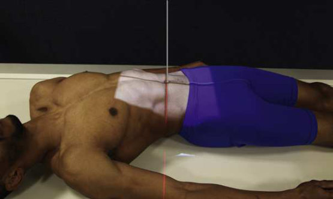
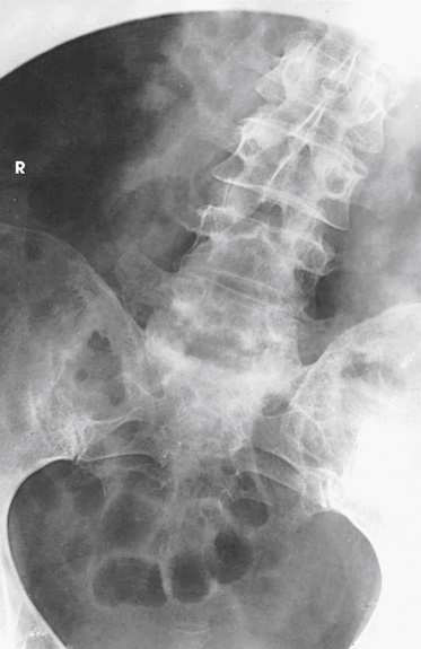

# Rx Coloană Lombară: Fuziune vertebrală — Incidență antero-posterioară (AP) — Înclinare spre dreapta și spre stânga (Merrill)

  📷 Radiografie Convențională (Rx)
  <strong>Actualizat:</strong> 2026-09-16
  <strong>Autor:</strong> Referință Merrill

---

-   __1. Rezumat Clinic & Indicații__

    ---

    === "Indicații Clinice"

        - Conform reperelor anatomice standard din tratat

    === "Ghid Național IRIS"

        !!! info "Referință Primară: Ghidul Național IRIS (Ordinul MS 1342/2012)"
            - **Capitol Ghid IRIS:** *Ghidul Național IRIS*
            - **Grad de Recomandare:** **De verificat pe indicație; fără grad atribuit automat**
            - **Nivel de Iradiere Estimată:** `De verificat pentru examinarea și populația selectate`

            [:octicons-search-16: Deschide Ghidul IRIS](../../iris.md){ .md-button .md-button--primary } [:material-open-in-new: Aplicația Oficială PWA](https://radiologie-pediatrica.ro/iris/){ .md-button target="_blank" rel="noopener" }
-   __2. Poziționare & Centrare Fascicul__

    ---

    - **Poziție Pacient:** se așază pacientul în decubit dorsal și se centrează MSP al corpului pe linia mediană a grilei. Aceste poziții de înclinare pot fi efectuate și cu pacientul în ortostatism.; Se efectuează prima radiografie cu înclinare maximă spre dreapta. Se efectuează a doua radiografie cu înclinare maximă spre stânga. Pentru a obține o forță egală de înclinare pe toată lungimea coloanei vertebrale atunci când pacientul este în decubit dorsal, se trece membrul inferior al pacientului peste partea opusă pentru a fi flectat peste celălalt membru inferior. Înclinarea spre dreapta necesită trecerea membrului inferior stâng peste cel drept. Se deplasează călcâiele pacientului spre partea care este flectată. Se imobilizează călcâiele cu săculeți cu nisip. Se deplasează umerii direct lateral, cât mai mult posibil, fără rotirea bazinului (Fig. 9.142). Se efectuează ecranarea gonadelor cu șorț plumbat.
    - **Punct de Centrare Fascicul:** perpendicular pe nivelul celei de-a treia vertebre lombare, la 1 la 1.5 inches (2.5 la 3.8 cm) deasupra crestelor iliace, pe MSP. Se centrează receptorul de imagine pe raza centrală.
    - **Distanță Focar-Film (DFF / SID):** Nespecificat în fragmentul extras; de verificat în sursă
    - **Comandă Respiratorie:** apnee (oprirea respirației).

-   __3. Parametri Tehnici Expunere__

    ---

    | Parametru Tehnic | Valoare Configurare Generator / Tub |
    |:-----------------|:-------------------------------------|
    | **Tensiune Tub (kV)** | DE CONFIGURAT PE APARAT |
    | **Sarcină / Produs Curent-Timp (mAs)** | DE CONFIGURAT PE APARAT |
    | **Distanță Focar-Film (DFF / SID)** | Nespecificat în fragmentul extras; de verificat în sursă |
    | **Grilă Antidifuzoare (Bucky)** | DE CONFIGURAT PE APARAT |
    | **Dimensiune Focar** | DE CONFIGURAT PE APARAT |
    | **Camere de Ionizare AEC** | DE CONFIGURAT PE APARAT |
    | **Colimare Fascicul** | Se ajustează câmpul de iradiere la 10 × 12 inches (24 × 30 cm) sau 14 × 17 inches (35 × 43 cm) pe colimator. Se plasează markerul de lateralitate (D/S) în câmpul de expunere colimat. |
    | **Filtrare Tub** | DE CONFIGURAT PE APARAT |

-   __4. Criterii de Calitate & Reușită Imagine__

    ---

    - Criterii radiologice de calitate a imaginii:
    - Evidențierea colimării corecte și prezența markerului de lateralitate (D/S), plasat fără a se suprapune peste anatomia de interes
    - Sediul fuziunii vertebrale centrat și incluzând vertebrele superioară și inferioară
    - Absența rotației anatomice (simetrie bilaterală perfectă) a bazinului (ilii simetrici)
    - Direcțiile de înclinare identificate corect cu markeri de plumb adecvați
    - Detalii trabeculare osoase și țesuturile moi înconjurătoare

-   __5. Protecție Radiologică (ALARA)__

    ---

    - Nespecificat în fragmentul extras; de verificat în sursă

!!! note "Observații Clinice & Tehnice"
    Conform reperelor anatomice standard din tratat

### 🖼️ Imagini

<figure class="protocol-image-card" markdown>

<figcaption><strong>Merrill — pagina 773, imaginea 1</strong> — Imagine din fragmentul sursă; asocierea necesită revizie.</figcaption>

</figure>

<figure class="protocol-image-card" markdown>

<figcaption><strong>Merrill — pagina 774, imaginea 2</strong> — Imagine din fragmentul sursă; asocierea necesită revizie.</figcaption>

</figure>

<figure class="protocol-image-card" markdown>

<figcaption><strong>Merrill — pagina 775, imaginea 3</strong> — Imagine din fragmentul sursă; asocierea necesită revizie.</figcaption>

</figure>

=== "Ghid Rapid de Execuție"

    1. **Identificarea și verificarea pacientului:** verificare identitate, zonă de examinat, consimțământ conform procedurii și evaluarea posibilității unei sarcini, când este relevantă.
    2. **Pregătire:** îndepărtarea oricăror obiecte radiopace (bijuterii, agrafe, fermoare, proteze, pansamente dense).
    3. **Poziționare precisă:** alinierea receptorului de imagine și a tubului la distanța prescrisă (Nespecificat în fragmentul extras; de verificat în sursă).
    4. **Colimare strictă:** adaptarea fasciculului strict la regiunea de diagnostic pentru scăderea iradierii și reducerea radiației difuze.
    5. **Radioprotecție:** verificarea [politicii RX](../radioprotectie.md), cu măsuri distincte pentru pacient, personal și însoțitor.

## Surse de documentare

- [Merrill’s Atlas, 9. Vertebral Column, pagini 772–775](https://books.google.com/books/about/Merrill_s_Atlas_of_Radiographic_Position.html?id=BM0lEQAAQBAJ)

## Fragmente sursă traduse (referință tehnică)

### anatomie

coloana lombară în înclinare maximă spre dreapta și spre stânga (flexie laterală) (Fig. 9.143 și 9.144). Aceste examinări sunt utilizate pentru evaluarea integrității fuziunii vertebrale și sunt efectuate de obicei la 6 months după procedura de fuziune. Această procedură poate fi utilizată și la pacienții cu scolioză incipientă pentru a determina prezența modificărilor structurale la înclinarea spre dreapta și spre stânga. Examinările pot fi utilizate pentru localizarea discului herniat, evidențiat prin limitarea mișcării la sediul leziunii.

### colimare

• Se ajustează câmpul de iradiere la 10 × 12 inches (24 × 30 cm) sau 14 × 17 inches (35 × 43 cm) pe colimator. Se plasează markerul de lateralitate (D/S) în câmpul de expunere colimat.

### raza centrală

• perpendicular pe nivelul celei de-a treia vertebre lombare, la 1 la 1.5 inches (2.5 la 3.8 cm) deasupra crestelor iliace, pe MSP
• Se centrează receptorul de imagine pe raza centrală.

### criterii

Criterii radiologice de calitate a imaginii:
• Dovezi de colimare corectă și prezența markerului de lateralitate (D/S), plasat clar în afara anatomiei de interes
• Sediul fuziunii vertebrale centrat și incluzând vertebrele superioară și inferioară
• Absența rotației anatomice (simetrie bilaterală perfectă) a bazinului (ilii simetrici)
• Direcțiile de înclinare identificate corect cu markeri de plumb adecvați
• Detalii osoase trabeculare și țesuturi moi adiacente

### part_pos

• Se efectuează prima radiografie cu înclinare maximă spre dreapta. Se efectuează a doua radiografie cu înclinare maximă spre stânga.
• Pentru a obține o forță egală de înclinare pe toată lungimea coloanei vertebrale atunci când pacientul este în decubit dorsal, se trece membrul inferior al pacientului peste partea opusă pentru a fi flectat peste celălalt membru inferior. Înclinarea spre dreapta necesită trecerea membrului inferior stâng peste cel drept.
• Se deplasează călcâiele pacientului spre partea care este flectată. Se imobilizează călcâiele cu săculeți cu nisip.
• Se deplasează umerii direct lateral, cât mai mult posibil, fără rotirea bazinului (Fig. 9.142).
• Se efectuează ecranarea gonadelor cu șorț plumbat.

### patient_pos

• se așază pacientul în decubit dorsal și se centrează MSP al corpului pe linia mediană a grilei. Aceste poziții de înclinare pot fi efectuate și cu pacientul în ortostatism.

### respirație

apnee (oprirea respirației).

### tehnică

poziționat conform protocolului producătorului sau al departamentului pentru afișarea corectă a orientării anatomice; placa pentru raza centrală: 10 × 12 inches (24 × 30 cm) sau 14 × 17 inches (35 × 43 cm), dispusă longitudinal pentru fiecare expunere. Dimensiunea receptorului de imagine este determinată de numărul segmentelor vertebrale care trebuie imaginate.

