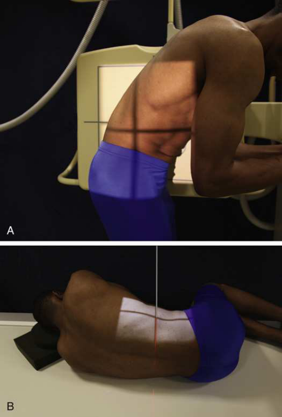
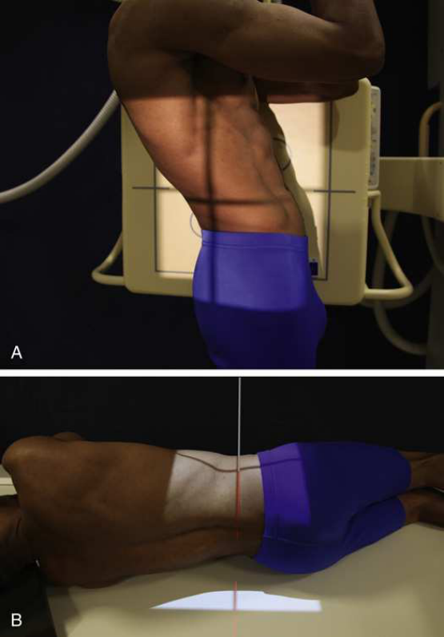
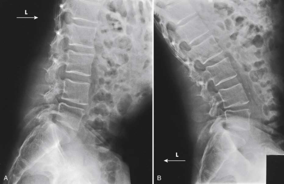

# Rx Coloană Lombară: Spinal Fusion — Incidență de Profil (Lateral) — Profil (Drept sau Stâng) Flexion and extension (Merrill)

  📷 Radiografie Convențională (Rx)
  <strong>Actualizat:</strong> 2026-09-16
  <strong>Autor:</strong> Referință Merrill

---

-   __1. Rezumat Clinic & Indicații__

    ---

    === "Indicații Clinice"

        - Conform reperelor anatomice standard din tratat

    === "Ghid Național IRIS"

        !!! info "Referință Primară: Ghidul Național IRIS (Ordinul MS 1342/2012)"
            - **Capitol Ghid IRIS:** *Ghidul Național IRIS*
            - **Grad de Recomandare:** **De verificat pe indicație; fără grad atribuit automat**
            - **Nivel de Iradiere Estimată:** `De verificat pentru examinarea și populația selectate`

            [:octicons-search-16: Deschide Ghidul IRIS](../../iris.md){ .md-button .md-button--primary } [:material-open-in-new: Aplicația Oficială PWA](https://radiologie-pediatrica.ro/iris/){ .md-button target="_blank" rel="noopener" }
-   __2. Poziționare & Centrare Fascicul__

    ---

    - **Poziție Pacient:** se ajustează pacient în ortostatism sau lateral Decubit poziție. se centrează plan mediocoronal la linia mediană grilă.; Flexion Se instruiește pacientul să bend forward, la se flectează coloană vertebrală ca much ca possible (Fig. 9.145). Extension Se instruiește pacientul să bend backward, la se extinde coloană vertebrală ca much ca possible (Fig. 9.146). se imobilizează pacient la prevent movement, if needed. se centrează receptorul de imagine la nivelul spinal fusion. se efectuează ecranarea gonadelor cu șorț plumbat.
    - **Punct de Centrare Fascicul:** perpendicular pe spinal fusion area sau L3.
    - **Distanță Focar-Film (DFF / SID):** Nespecificat în fragmentul extras; de verificat în sursă
    - **Comandă Respiratorie:** apnee (oprirea respirației).

-   __3. Parametri Tehnici Expunere__

    ---

    | Parametru Tehnic | Valoare Configurare Generator / Tub |
    |:-----------------|:-------------------------------------|
    | **Tensiune Tub (kV)** | DE CONFIGURAT PE APARAT |
    | **Sarcină / Produs Curent-Timp (mAs)** | DE CONFIGURAT PE APARAT |
    | **Distanță Focar-Film (DFF / SID)** | Nespecificat în fragmentul extras; de verificat în sursă |
    | **Grilă Antidifuzoare (Bucky)** | DE CONFIGURAT PE APARAT |
    | **Dimensiune Focar** | DE CONFIGURAT PE APARAT |
    | **Camere de Ionizare AEC** | DE CONFIGURAT PE APARAT |
    | **Colimare Fascicul** | Se ajustează câmpul de iradiere la formatul 35 × 43 cm pe colimator. Place marker de lateralitate (D/S) în collimated expunere field. |
    | **Filtrare Tub** | DE CONFIGURAT PE APARAT |

-   __4. Criterii de Calitate & Reușită Imagine__

    ---

    - Criterii radiologice de calitate imaginii:
    - Evidence de corect collimation și presence de marker de lateralitate (D/S) plasat clear de anatomy de interest
    - Site de spinal fusion în center de radiografie
    - Absența rotației anatomice (simetrie bilaterală perfectă) de coloană vertebrală (posterior margins de vertebral corpuri sunt superimposed)
    - Hyperflexion și hyperextension identification markeri correctly used pentru fiecare respective incidență
    - Bony detalii trabeculare osoase și surrounding soft tissues

-   __5. Protecție Radiologică (ALARA)__

    ---

    - Nespecificat în fragmentul extras; de verificat în sursă

!!! note "Observații Clinice & Tehnice"
    Conform reperelor anatomice standard din tratat

### 🖼️ Imagini

<figure class="protocol-image-card" markdown>

<figcaption><strong>Merrill — pagina PDF 776, imaginea 1</strong> — Imagine din fragmentul sursă; asocierea necesită revizie.</figcaption>

</figure>

<figure class="protocol-image-card" markdown>

<figcaption><strong>Merrill — pagina PDF 777, imaginea 2</strong> — Imagine din fragmentul sursă; asocierea necesită revizie.</figcaption>

</figure>

<figure class="protocol-image-card" markdown>

<figcaption><strong>Merrill — pagina PDF 778, imaginea 3</strong> — Imagine din fragmentul sursă; asocierea necesită revizie.</figcaption>

</figure>

=== "Ghid Rapid de Execuție"

    1. **Identificarea și verificarea pacientului:** verificare identitate, zonă de examinat, consimțământ conform procedurii și evaluarea posibilității unei sarcini, când este relevantă.
    2. **Pregătire:** îndepărtarea oricăror obiecte radiopace (bijuterii, agrafe, fermoare, proteze, pansamente dense).
    3. **Poziționare precisă:** alinierea receptorului de imagine și a tubului la distanța prescrisă (Nespecificat în fragmentul extras; de verificat în sursă).
    4. **Colimare strictă:** adaptarea fasciculului strict la regiunea de diagnostic pentru scăderea iradierii și reducerea radiației difuze.
    5. **Radioprotecție:** verificarea [politicii RX](../radioprotectie.md), cu măsuri distincte pentru pacient, personal și însoțitor.

## Surse de documentare

- [Merrill’s Atlas, 9. Vertebral Column, pagini PDF 775–779](../../assets/protocols/sources/a56d45c16829_Merrills_Atlas_of_Radiographic_Positioning__Procedures_3Vol_Set.pdf#page=775)

## Fragmente sursă traduse (referință tehnică)

### anatomy

Two lateral incidențe de coloană vertebrală sunt taken în flexion (Fig. 9.147A) și extension (see Fig. 9.147B), la determine whether mișcare este present în
area de spinal fusion, indicating nonunion, sau la localize herniated disk ca vizualizat prin limitation de mișcare la site de lesion.

### collimation

• Se ajustează câmpul de iradiere la formatul 35 × 43 cm pe colimator. Place marker de lateralitate (D/S) în collimated expunere field.

### cr

• perpendicular pe spinal fusion area sau L3.

### criteria

Criterii radiologice de calitate imaginii:
• Evidence de corect collimation și presence de marker de lateralitate (D/S) plasat clear de anatomy de interest
• Site de spinal fusion în center de radiografie
• Absența rotației anatomice (simetrie bilaterală perfectă) de coloană vertebrală (posterior margins de vertebral corpuri sunt superimposed)
• Hyperflexion și hyperextension identification markeri correctly used pentru fiecare respective incidență
• Bony detalii trabeculare osoase și surrounding soft tissues

### part_pos

Flexion
• Se instruiește pacientul să bend forward, la se flectează coloană vertebrală ca much ca possible (Fig. 9.145).
Extension
• Se instruiește pacientul să bend backward, la se extinde coloană vertebrală ca much ca possible (Fig. 9.146).
• se imobilizează pacient la prevent movement, if needed.
• se centrează receptorul de imagine la nivelul spinal fusion.
• se efectuează ecranarea gonadelor cu șorț plumbat.

### patient_pos

• se ajustează pacient în ortostatism sau lateral recumbent poziție.
• se centrează plan mediocoronal la linia mediană grilă.

### respiration

apnee (oprirea respirației).

### tech

poziționat prin manufacturer sau department protocol pentru corect anatomy display orientation; raza centrală plate: 14 × 17 inches
(35 × 43 cm) longitudinal pentru fiecare expunere.

