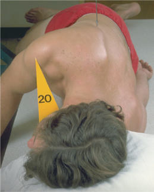
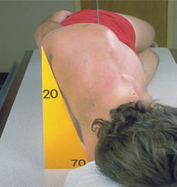
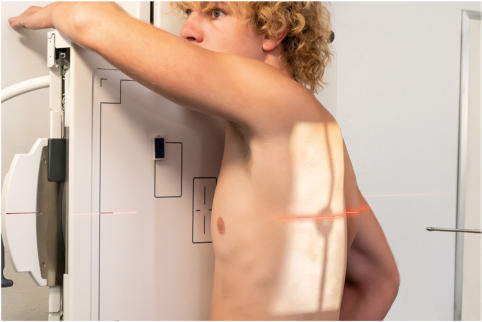
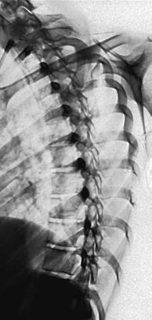

# Rx Coloană Toracală ANTERIOR OR POSTERIOR Oblică

  📷 Radiografie Convențională (Rx)
  <strong>Actualizat:</strong> 2026-09-15
  <strong>Autor:</strong> Departamentul de Radiologie / Referință Bontrager

---

-   __1. Rezumat Clinic & Indicații__

    ---

    === "Indicații Clinice"

        - Pathology involving zygapophyseal articulații de Coloană Toracală
        - ambele drept și stâng oblic incidențe sunt taken pentru comparison.

    === "Ghid Național IRIS"

        !!! info "Referință Primară: Ghidul Național IRIS (Ordinul MS 1342/2012)"
            - **Capitol Ghid IRIS:** *Ghidul Național IRIS*
            - **Grad de Recomandare:** **De verificat pe indicație; fără grad atribuit automat**
            - **Nivel de Iradiere Estimată:** `De verificat pentru examinarea și populația selectate`

            [:octicons-search-16: Deschide Ghidul IRIS](../../iris.md){ .md-button .md-button--primary } [:material-open-in-new: Aplicația Oficială PWA](https://radiologie-pediatrica.ro/iris/){ .md-button target="_blank" rel="noopener" }
-   __2. Poziționare & Centrare Fascicul__

    ---

    - **Poziție Pacient:** Pacient: oblic anterior sau posterior Decubit sau Ortostatism poziții Initially poziție pacient în lateral Decubit poziție (preferred), cu cap pe pillow și genunchi flectat. pentru Ortostatism poziție, ensure equal distribution de weight pe ambele picioare.; Regiune anatomică: se rotește corp 20° de la true lateral la create a 70° oblic de la plane de table. Ensure equal rotație de umeri și Bazin (bazin (pelvis)). Flex hips, genunchi, și brațe pentru stability ca needed. Align spinal column la raza centrală și linia mediană mesei și/sau receptorul de imagine. posterior Incidență Oblică (Decubit) LPO sau RPO: Place braț nearest table up și forward; braț nearest tube down și posterior (Fig. 8.86). anterior Incidență Oblică (Decubit) LAO sau RAO: Place braț nearest table down și posterior; braț nearest tube up și forward (Fig. 8.87). Ortostatism anterior Incidență Oblică Distribute pacient’s weight equally pe ambele picioare. Rotate total corp, umeri, și Bazin (bazin (pelvis)) 20° anterior de la lateral. Flex Cot și place braț nearest receptorul de imagine pe Șold. Raise opposite braț și rest pe top de cap (Fig. 8.88).
    - **Punct de Centrare Fascicul:** perpendicular pe receptorul de imagine. Raza centrală se orientează spre T7 (3 la 4 inches [8 la 10 cm] below incizura jugulară (manubriul sternal) sau 2 inches [5 cm] below sternal angle). Se centrează receptorul de imagine pe raza centrală.
    - **Distanță Focar-Film (DFF / SID):** 100 cm
    - **Comandă Respiratorie:** Apnee pe durata expunerii pe Expir complet.

-   __3. Parametri Tehnici Expunere__

    ---

    | Parametru Tehnic | Valoare Configurare Generator / Tub |
    |:-----------------|:-------------------------------------|
    | **Tensiune Tub (kV)** | 80-95 kV |
    | **Sarcină / Produs Curent-Timp (mAs)** | DE CONFIGURAT PE APARAT |
    | **Distanță Focar-Film (DFF / SID)** | 100 cm |
    | **Grilă Antidifuzoare (Bucky)** | Cu grilă antidifuzoare Bucky |
    | **Dimensiune Focar** | Focar Mare (1.0 - 1.2 mm) |
    | **Camere de Ionizare AEC** | Camerele laterale (sau camera centrală funcție de regiune) |
    | **Colimare Fascicul** | Collimate pe two sides de anatomy (four sides if possible) |
    | **Filtrare Tub** | Totală ≥ 2.5 mm Al echivalent |

-   __4. Criterii de Calitate & Reușită Imagine__

    ---

    - Zygapophyseal articulații: anterior oblic poziții (RAO și LAO) evidențiază downside zygapophyseal articulații (Figs. 8.89 și 8.90), și posterior oblic poziții (RPO și LPO) evidențiază upside articulații. poziție:
    - zygapophyseal articulații de side de interest trebuie să fie open. However, amount de kyphosis will determine how many zygapophyseal articulații will fie clar vizibil(e). expunere:
    - optim receptorul de imagine expunere și contrast. Clear demonstration de bony margins și trabecular markings de coloană toracală. R Fig. 8.89 RAO Coloană Toracală. Zygapophyseal articulații R Fig. 8.90 RAO Coloană Toracală.

-   __5. Protecție Radiologică (ALARA)__

    ---

    - Ecranare gonadică și a organelor radiosensibile conform procedurilor locale de radioprotecție ALARA.
    - Colimare strictă la aria de interes pentru limitarea radiației difuze.
    - Verificarea posibilității unei sarcini la pacientele de vârstă fertilă înainte de expunere.

!!! note "Observații Clinice & Tehnice"
    pacient’s thorax este 20° de la lateral; some type de angle guide poate fie used la determine correct rotație (see Figs. 8.86 și 8.87). radiografii poate fie taken ca posterior sau anterior obliques. anterior obliques sunt recommended because de significantly lower Mamografie (Sân) dose. Coloană Toracală SPECIAL oblic Fig. 8.86 posterior oblic (RPO). Fig. 8.87 anterior oblic (LAO). Fig. 8.88 Ortostatism anterior oblic (RAO) Coloană Toracală.

### 🖼️ Imagini

<figure class="protocol-image-card" markdown>

<figcaption><strong>Fig. 8.86 posterior oblic</strong> — Poziționare pacient conform Ghidului Bontrager (Fig. 8.86 posterior oblic)</figcaption>

</figure>

<figure class="protocol-image-card" markdown>

<figcaption><strong>Fig. 8.87 anterior oblic</strong> — Aspect radiografic de referință conform Ghidului Bontrager (Fig. 8.87 anterior oblic)</figcaption>

</figure>

<figure class="protocol-image-card" markdown>

<figcaption><strong>Fig. 8.88 Ortostatism anterior oblic (RAO) Coloană Toracală.</strong> — Aspect radiografic de referință conform Ghidului Bontrager (Fig. 8.88 în ortostatism anterior oblic (RAO) thoracic coloană vertebrală.)</figcaption>

</figure>

<figure class="protocol-image-card" markdown>

<figcaption><strong>Fig. 8.89 RAO thoracic</strong> — Aspect radiografic de referință conform Ghidului Bontrager (Fig. 8.89 RAO thoracic)</figcaption>

</figure>

<figure class="protocol-image-card" markdown>

<figcaption><strong>Fig. 8.90 RAO Coloană Toracală.</strong> — Aspect radiografic de referință conform Ghidului Bontrager (Fig. 8.90 RAO thoracic coloană vertebrală.)</figcaption>

</figure>

=== "Ghid Rapid de Execuție"

    1. **Identificarea și verificarea pacientului:** verificare identitate, zonă de examinat, consimțământ conform procedurii și evaluarea posibilității unei sarcini, când este relevantă.
    2. **Pregătire:** îndepărtarea oricăror obiecte radiopace (bijuterii, agrafe, fermoare, proteze, pansamente dense).
    3. **Poziționare precisă:** alinierea receptorului de imagine și a tubului la distanța prescrisă (100 cm).
    4. **Colimare strictă:** adaptarea fasciculului strict la regiunea de diagnostic pentru scăderea iradierii și reducerea radiației difuze.
    5. **Radioprotecție:** verificarea [politicii RX](../radioprotectie.md), cu măsuri distincte pentru pacient, personal și însoțitor.

## Surse de documentare

- [Bontrager's Textbook of Radiographic Positioning (Ed. 9/10), Pagina 344](https://www.elsevier.com/books/textbook-of-radiographic-positioning-and-related-anatomy/lampignano/978-0-323-65367-1)
