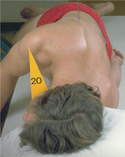
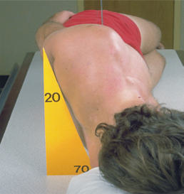
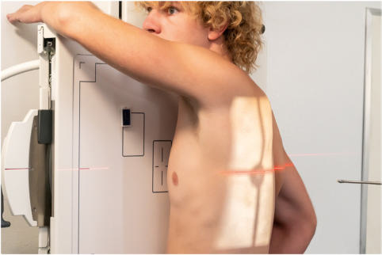
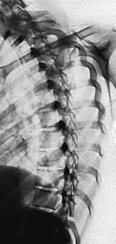

# Rx Coloană Toracală ANTERIOR SAU POSTERIOR Oblică

  📷 Radiografie Convențională (Rx)
  <strong>Actualizat:</strong> 2026-09-15
  <strong>Autor:</strong> Departamentul de Radiologie / Referință Bontrager

---

-   __1. Rezumat Clinic & Indicații__

    ---

    === "Indicații Clinice"

        - Patologie care implică articulațiile zigapofizare ale coloanei toracale
        - Se efectuează ambele incidențe oblice, dreaptă și stângă, pentru comparație.

    === "Ghid Național IRIS"

        !!! info "Referință Primară: Ghidul Național IRIS (Ordinul MS 1342/2012)"
            - **Capitol Ghid IRIS:** *Ghidul Național IRIS*
            - **Grad de Recomandare:** **De verificat pe indicație; fără grad atribuit automat**
            - **Nivel de Iradiere Estimată:** `De verificat pentru examinarea și populația selectate`

            [:octicons-search-16: Deschide Ghidul IRIS](../../iris.md){ .md-button .md-button--primary } [:material-open-in-new: Aplicația Oficială PWA](https://radiologie-pediatrica.ro/iris/){ .md-button target="_blank" rel="noopener" }
-   __2. Poziționare & Centrare Fascicul__

    ---

    - **Poziție Pacient:** Pacient: incidență oblică anterioară sau posterioară, în decubit sau ortostatism. Inițial, poziționarea pacientului în decubit lateral (preferată), cu capul pe o pernă și genunchiul flectat. Pentru poziția în ortostatism, se asigură distribuirea egală a greutății pe ambele picioare.; Regiune anatomică: se rotește corpul cu 20° față de profilul adevărat pentru a crea o incidență oblică de 70° față de planul mesei. Se asigură rotația egală a umerilor și bazinului. Se flectează șoldurile, genunchii și brațele pentru stabilitate, după cum este necesar. Se aliniază coloana vertebrală cu raza centrală și cu linia mediană a mesei și/sau a receptorului de imagine. Incidență oblică posterioară (decubit) LPO sau RPO: se poziționează brațul cel mai apropiat de masă în sus și anterior; brațul cel mai apropiat de tub în jos și posterior (Fig. 8.86). Incidență oblică anterioară (decubit) LAO sau RAO: se poziționează brațul cel mai apropiat de masă în jos și posterior; brațul cel mai apropiat de tub în sus și anterior (Fig. 8.87). Incidență oblică anterioară în ortostatism: se distribuie egal greutatea pacientului pe ambele picioare. Se rotește întregul corp, umerii și bazinul cu 20° anterior față de profil. Se flectează cotul și se poziționează brațul cel mai apropiat de receptorul de imagine pe șold. Se ridică brațul opus și se sprijină pe creștetul capului (Fig. 8.88).
    - **Punct de Centrare Fascicul:** perpendicular pe receptorul de imagine. Raza centrală se orientează spre T7 (3 la 4 inches [8 la 10 cm] sub incizura jugulară (manubriul sternal) sau 2 inches [5 cm] sub unghiul sternal). Se centrează receptorul de imagine pe raza centrală.
    - **Distanță Focar-Film (DFF / SID):** 100 cm
    - **Comandă Respiratorie:** Apnee pe durata expunerii, în expir complet.

-   __3. Parametri Tehnici Expunere__

    ---

    | Parametru Tehnic | Valoare Configurare Generator / Tub |
    |:-----------------|:-------------------------------------|
    | **Tensiune Tub (kV)** | 80-95 kV |
    | **Sarcină / Produs Curent-Timp (mAs)** | DE CONFIGURAT PE APARAT |
    | **Distanță Focar-Film (DFF / SID)** | 100 cm |
    | **Grilă Antidifuzoare (Bucky)** | Cu grilă antidifuzoare Bucky |
    | **Dimensiune Focar** | Focar Mare (1.0 - 1.2 mm) |
    | **Camere de Ionizare AEC** | Camerele laterale (sau camera centrală, în funcție de regiune) |
    | **Colimare Fascicul** | Colimează pe două laturi ale anatomiei (patru laturi dacă este posibil) |
    | **Filtrare Tub** | Totală ≥ 2.5 mm Al echivalent |

-   __4. Criterii de Calitate & Reușită Imagine__

    ---

    - Articulațiile zigapofizare: pozițiile oblice anterioare (RAO și LAO) evidențiază articulațiile zigapofizare situate inferior (Fig. 8.89 și 8.90), iar pozițiile oblice posterioare (RPO și LPO) evidențiază articulațiile situate superior. Poziție:
    - articulațiile zigapofizare de pe partea de interes trebuie să fie deschise. Cu toate acestea, gradul de cifoză va determina câte articulații zigapofizare vor fi vizibile clar. Expunere:
    - expunere optimă a receptorului de imagine și contrast. Evidențiere clară a marginilor osoase și a desenului trabecular al coloanei toracale. R Fig. 8.89 RAO Coloană Toracală. Articulații zigapofizare R Fig. 8.90 RAO Coloană Toracală.

-   __5. Protecție Radiologică (ALARA)__

    ---

    - Ecranare gonadică și a organelor radiosensibile conform procedurilor locale de radioprotecție ALARA.
    - Colimare strictă la aria de interes pentru limitarea radiației difuze.
    - Verificarea posibilității unei sarcini la pacientele de vârstă fertilă înainte de expunere.

!!! note "Observații Clinice & Tehnice"
    toracele pacientului este la 20° față de lateral; se poate utiliza un ghid de unghi pentru determinarea rotației corecte (vezi Fig. 8.86 și 8.87). Radiografiile pot fi efectuate ca incidențe oblice posterioare sau anterioare. Incidențele oblice anterioare sunt recomandate datorită dozei semnificativ mai mici. Coloană toracală, incidență oblică specială Fig. 8.86 incidență oblică posterioară (RPO). Fig. 8.87 incidență oblică anterioară (LAO). Fig. 8.88 incidență oblică anterioară în ortostatism (RAO), coloana toracală.

### 🖼️ Imagini

<figure class="protocol-image-card" markdown>

<figcaption><strong>Fig. 8.86 oblic posterior</strong> — Poziționare pacient conform Ghidului Bontrager (Fig. 8.86 oblic posterior)</figcaption>

</figure>

<figure class="protocol-image-card" markdown>

<figcaption><strong>Fig. 8.87 oblic anterior</strong> — Aspect radiografic de referință conform Ghidului Bontrager (Fig. 8.87 oblic anterior)</figcaption>

</figure>

<figure class="protocol-image-card" markdown>

<figcaption><strong>Fig. 8.88 ortostatism oblic anterior (RAO) Coloană Toracală.</strong> — Aspect radiografic de referință conform Ghidului Bontrager (Fig. 8.88 în ortostatism, oblic anterior (RAO), coloană vertebrală toracală.)</figcaption>

</figure>

<figure class="protocol-image-card" markdown>

<figcaption><strong>Fig. 8.89 RAO toracal</strong> — Aspect radiografic de referință conform Ghidului Bontrager (Fig. 8.89 RAO toracal)</figcaption>

</figure>

<figure class="protocol-image-card" markdown>

<figcaption><strong>Fig. 8.90 RAO Coloană Toracală.</strong> — Aspect radiografic de referință conform Ghidului Bontrager (Fig. 8.90 RAO coloană vertebrală toracală.)</figcaption>

</figure>

=== "Ghid Rapid de Execuție"

    1. **Identificarea și verificarea pacientului:** verificare identitate, zonă de examinat, consimțământ conform procedurii și evaluarea posibilității unei sarcini, când este relevantă.
    2. **Pregătire:** îndepărtarea oricăror obiecte radiopace (bijuterii, agrafe, fermoare, proteze, pansamente dense).
    3. **Poziționare precisă:** alinierea receptorului de imagine și a tubului la distanța prescrisă (100 cm).
    4. **Colimare strictă:** adaptarea fasciculului strict la regiunea de diagnostic pentru scăderea iradierii și reducerea radiației difuze.
    5. **Radioprotecție:** verificarea [politicii RX](../radioprotectie.md), cu măsuri distincte pentru pacient, personal și însoțitor.

## Surse de documentare

- [Bontrager's Textbook of Radiographic Positioning (Ed. 9/10), Pagina 344](https://www.elsevier.com/books/textbook-of-radiographic-positioning-and-related-anatomy/lampignano/978-0-323-65367-1)
