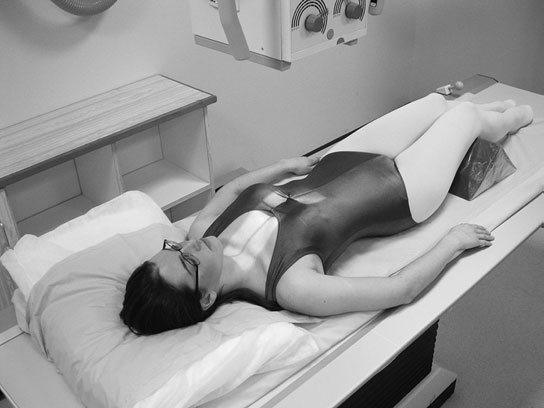
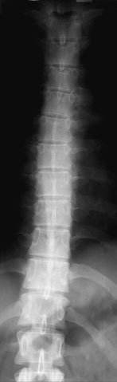
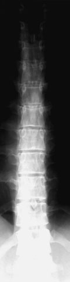
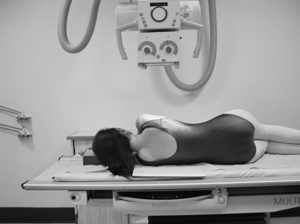
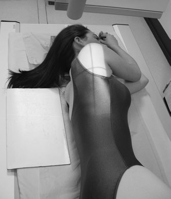
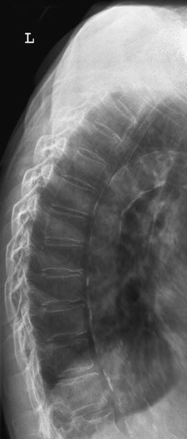

# Rx Coloană Toracală Antero-Posterior (AP) - basic

  📷 Radiografie Convențională (Rx)
  <strong>Actualizat:</strong> 2026-09-16
  <strong>Autor:</strong> Departamentul de Radiologie / Referință Clark (Ed. 12)

---

-   __1. Rezumat Clinic & Indicații__

    ---

    === "Indicații Clinice"

        - presence de intact pedicles este important sign în excluding metastatic disease. Pedicles sunt more difficult la see pe underexposed sau rotit film radiologic.

    === "Ghid Național IRIS"

        !!! info "Referință Primară: Ghidul Național IRIS (Ordinul MS 1342/2012)"
            - **Capitol Ghid IRIS:** *Ghidul Național IRIS*
            - **Grad de Recomandare:** **De verificat pe indicație; fără grad atribuit automat**
            - **Nivel de Iradiere Estimată:** `De verificat pentru examinarea și populația selectate`

            [:octicons-search-16: Deschide Ghidul IRIS](../../iris.md){ .md-button .md-button--primary } [:material-open-in-new: Aplicația Oficială PWA](https://radiologie-pediatrica.ro/iris/){ .md-button target="_blank" rel="noopener" }
-   __2. Poziționare & Centrare Fascicul__

    ---

    - **Poziție Pacient:** • pacientul este poziționat Decubit dorsal pe masa radiologică, cu planul mediosagital perpendicular pe tabletop și coincident cu linia mediană Bucky.
• upper edge de casetă, which trebuie să fie la least 40 cm long pentru adult, trebuie să fie la level just below prominence de cartilaj tiroid (mărul lui Adam) la ensure that upper Coloană Toracală sunt included.
• Make expunere pe arrested inspiration. This will cause cupole diafragmatice la move down over upper lumbar vertebra, thus reducing chance de large densitate optică difference appearing pe imagine de la superimposition de Torace (Câmpuri Pulmonare).

• Usually undertaken cu pacientul în Profil (lateral) decubit poziție pe masa radiologică, although this incidență poate also fie performed Ortostatism.
• planul mediosagital trebuie să fie paralel cu casetă și linia mediană axilla coincident cu linia mediană mesei sau Bucky.
• brațele trebuie să fie raised well above capul.
• capul poate fie sprijinit cu pillow, și pads poate fie plasat între genunchi pentru pacientul’s comfort.
• upper edge de caseta trebuie să fie la least 40 cm în length și trebuie să fie poziționat 3–4 cm above spinous process de C7.
    - **Punct de Centrare Fascicul:** • se orientează raza centrală centrală la drept-angles la caseta și spre point 2.5 cm below sternal angle.
• Collimate tightly la coloană vertebrală.

• raza centrală trebuie să fie la drept-angles la axa longitudinală de Coloană Toracală. This poate require caudal angulation.
• Centre 5 cm anterior la spinous process de T6/7. This este usually found just below inferior angle de Omoplat (Scapulă) (assuming brațele sunt raised), which este easily palpable.
    - **Distanță Focar-Film (DFF / SID):** 100 cm
    - **Comandă Respiratorie:** Apnee pe durata expunerii (apnee în inspir pentru torace; expir pentru Abdomen/bazin).

-   __3. Parametri Tehnici Expunere__

    ---

    | Parametru Tehnic | Valoare Configurare Generator / Tub |
    |:-----------------|:-------------------------------------|
    | **Tensiune Tub (kV)** | 80 kV |
    | **Sarcină / Produs Curent-Timp (mAs)** | Conform AEC / grosime anatomică |
    | **Distanță Focar-Film (DFF / SID)** | 100 cm |
    | **Grilă Antidifuzoare (Bucky)** | Cu grilă antidifuzoare Bucky |
    | **Dimensiune Focar** | Focar Mic (0.6 mm) |
    | **Camere de Ionizare AEC** | Camerele laterale (sau camera centrală funcție de regiune) |
    | **Colimare Fascicul** | Colimare strictă la aria anatomică de interes diagnostic |
    | **Filtrare Tub** | Totală ≥ 2.5 mm Al echivalent (conform Clark: 3.0 mm Al eq.) |

-   __4. Criterii de Calitate & Reușită Imagine__

    ---

    - imagine trebuie să include vertebre de la C7 la L1.
    - imagine densitate optică trebuie să fie sufficient la evidențiază bony detail pentru upper ca well ca thoracic lower vertebre.
    - upper two sau three vertebre poate nu fie evidențiat due la superimposition de umerii.
    - Look pentru absence de rib pe L1 la lower margine de imagine. This will ensure that T12 has been included within field.
    - posterior Coaste (Grilaj Costal) trebuie să fie superimposed, thus indicating that pacientul was nu rotit too far forwards sau backwards.
    - trabeculae de vertebre trebuie să fie clearly vizibil, evidențiind absence de movement unsharpness.
    - imagine densitate optică trebuie să fie adecvat pentru diagnosis pentru ambele upper și lower Coloană Toracală. use de widelatitude imaging system/technique este therefore desirable. 180
    - Erori de evitat / remedii: caseta și fascicul sunt often centred too low, thereby excluding upper Coloană Toracală de la imagine.
    - Erori de evitat / remedii: lower vertebre sunt also often nu included. L1 poate fie identified easily prin fact that it usually will nu have rib attached la it.
    - Erori de evitat / remedii: High radiographic contrast (see below) causes high densitate optică over upper vertebre și low densitate optică over lower vertebra.

-   __5. Protecție Radiologică (ALARA)__

    ---

    - Ecranare gonadică cu șorț plumbat dacă gonadele sunt în apropierea fasciculului util (regula ALARA).
    - Colimare precisă la dimensiunea anatomică strict necesară pentru reducerea dozei și a radiației difuze.
    - Verificarea posibilității unei sarcini la pacientele de vârstă fertilă înainte de expunere.

!!! note "Observații Clinice & Tehnice"
    • This region has extremely high subject contrast. This este due la superimposition de air-filled trachea over upper Coloană Toracală. This produces relatively lucent area și high densitate optică pe radiografie. Cord și Siluetă Cardiovasculară și ficat superimposed over lower Coloană Toracală will attenuate more X-rays și yield much lower film radiologic densitate optică.
(contd) 1st–4th TV superimposed prin airfilled trachea 5th și 12th TV superimposed prin dense shadows de Cord și Siluetă Cardiovasculară și gt vessels also etajul abdominal superior Trachea Cord și Siluetă Cardiovasculară cupole diafragmatice 1st LV Radiographic contrast too high Lower contrast producing acceptable densitate optică pentru upper și lower vertebra

### 🖼️ Imagini

<figure class="protocol-image-card" markdown>

<figcaption><strong>• High radiographic contrast (see below) causes high densitate optică over</strong> — Poziționare pacient și centrare fascicul conform Clark (Ed. 12)</figcaption>

</figure>

<figure class="protocol-image-card" markdown>

<figcaption><strong>area și high densitate optică pe radiografie. Cord și Siluetă Cardiovasculară și ficat</strong> — Aspect radiografic / ghid de poziționare conform tratatului Clark (Ed. 12)</figcaption>

</figure>

<figure class="protocol-image-card" markdown>

<figcaption><strong>Figura 3: Aspect radiografic / Poziționare (Clark Ed. 12)</strong> — Aspect radiografic / ghid de poziționare conform tratatului Clark (Ed. 12)</figcaption>

</figure>

<figure class="protocol-image-card" markdown>

<figcaption><strong>• radiographer poate employ number de strategies la</strong> — Aspect radiografic / ghid de poziționare conform tratatului Clark (Ed. 12)</figcaption>

</figure>

<figure class="protocol-image-card" markdown>

<figcaption><strong>reduce high radiographic contrast associated cu this</strong> — Aspect radiografic / ghid de poziționare conform tratatului Clark (Ed. 12)</figcaption>

</figure>

<figure class="protocol-image-card" markdown>

<figcaption><strong>will usually lower radiographic contrast, thus demon-</strong> — Aspect radiografic / ghid de poziționare conform tratatului Clark (Ed. 12)</figcaption>

</figure>

=== "Ghid Rapid de Execuție"

    1. **Identificarea și verificarea pacientului:** verificare identitate, zonă de examinat, consimțământ conform procedurii și evaluarea posibilității unei sarcini, când este relevantă.
    2. **Pregătire:** îndepărtarea oricăror obiecte radiopace (bijuterii, agrafe, fermoare, proteze, pansamente dense).
    3. **Poziționare precisă:** alinierea receptorului de imagine și a tubului la distanța prescrisă (100 cm).
    4. **Colimare strictă:** adaptarea fasciculului strict la regiunea de diagnostic pentru scăderea iradierii și reducerea radiației difuze.
    5. **Radioprotecție:** verificarea [politicii RX](../radioprotectie.md), cu măsuri distincte pentru pacient, personal și însoțitor.

## Surse de documentare

- [Clark's Positioning in Radiography (Ed. 12), Pagina 194](../../assets/protocols/sources/Clark___Positioning_in_Radiography__12th_edition.pdf#page=194)
