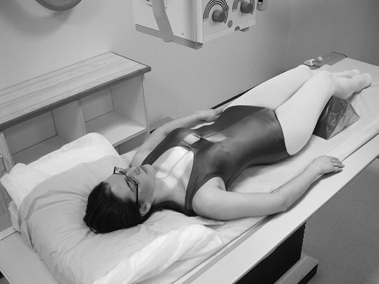
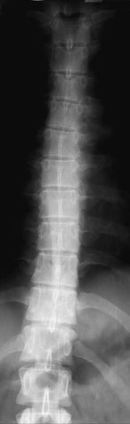
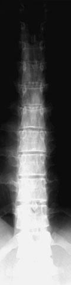
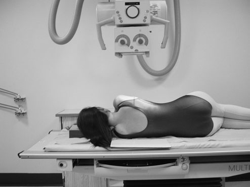
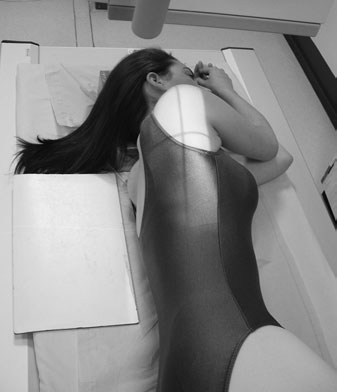
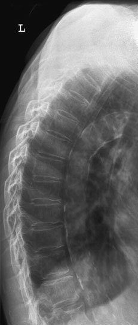

# Rx Coloană Toracală Antero-Posterior (AP) - de bază

  📷 Radiografie Convențională (Rx)
  <strong>Actualizat:</strong> 2026-09-16
  <strong>Autor:</strong> Departamentul de Radiologie / Referință Clark (Ed. 12)

---

-   __1. Rezumat Clinic & Indicații__

    ---

    === "Indicații Clinice"

        - Prezența pediculilor intacți este un semn important pentru excluderea bolii metastatice. Pediculii sunt mai dificil de vizualizat pe o imagine radiologică subexpusă sau rotită.

    === "Ghid Național IRIS"

        !!! info "Referință Primară: Ghidul Național IRIS (Ordinul MS 1342/2012)"
            - **Capitol Ghid IRIS:** *Ghidul Național IRIS*
            - **Grad de Recomandare:** **De verificat pe indicație; fără grad atribuit automat**
            - **Nivel de Iradiere Estimată:** `De verificat pentru examinarea și populația selectate`

            [:octicons-search-16: Deschide Ghidul IRIS](../../iris.md){ .md-button .md-button--primary } [:material-open-in-new: Aplicația Oficială PWA](https://radiologie-pediatrica.ro/iris/){ .md-button target="_blank" rel="noopener" }
-   __2. Poziționare & Centrare Fascicul__

    ---

    - **Poziție Pacient:** • pacientul este poziționat în Decubit dorsal pe masa radiologică, cu planul mediosagital perpendicular pe masa radiologică și coincident cu linia mediană a Bucky.
• marginea superioară a casetei, care trebuie să aibă o lungime de cel puțin 40 cm pentru adult, trebuie să fie la nivelul situat imediat sub proeminența cartilajului tiroid (mărul lui Adam), pentru a asigura includerea Coloanei Toracale superioare.
• Se efectuează expunerea în apnee după inspirație. Aceasta va determina coborârea cupolelor diafragmatice peste vertebrele lombare superioare, reducând astfel posibilitatea apariției unei diferențe mari de densitate optică pe imagine, din cauza suprapunerii Toracelui (Câmpurilor Pulmonare).

• De obicei se efectuează cu pacientul în poziție de Decubit lateral (profil) pe masa radiologică, deși această incidență poate fi realizată și în Ortostatism.
• planul mediosagital trebuie să fie paralel cu caseta, iar linia mediană axilară coincidentă cu linia mediană a mesei sau a Bucky.
• brațele trebuie să fie ridicate bine deasupra capului.
• capul poate fi sprijinit pe o pernă, iar între genunchi pot fi plasate suporturi pentru confortul pacientului.
• marginea superioară a casetei trebuie să aibă o lungime de cel puțin 40 cm și trebuie poziționată la 3–4 cm deasupra apofizei spinoase a C7.
    - **Punct de Centrare Fascicul:** • se orientează raza centrală la unghi drept față de casetă și spre un punct situat la 2.5 cm sub unghiul sternal.
• Se colimează strâns la nivelul coloanei vertebrale.

• raza centrală trebuie să fie perpendiculară pe axa longitudinală a Coloanei Toracale. Acest lucru poate necesita angulație caudală.
• Se centrează la 5 cm anterior de apofiza spinoasă a T6/7. Aceasta se găsește de obicei chiar sub unghiul inferior al Omoplatului (Scapulei) (presupunând că brațele sunt ridicate), care este ușor palpabil.
    - **Distanță Focar-Film (DFF / SID):** 100 cm
    - **Comandă Respiratorie:** Apnee pe durata expunerii (apnee în inspir pentru torace; expir pentru Abdomen/bazin).

-   __3. Parametri Tehnici Expunere__

    ---

    | Parametru Tehnic | Valoare Configurare Generator / Tub |
    |:-----------------|:-------------------------------------|
    | **Tensiune Tub (kV)** | 80 kV |
    | **Sarcină / Produs Curent-Timp (mAs)** | Conform AEC / grosimii anatomice |
    | **Distanță Focar-Film (DFF / SID)** | 100 cm |
    | **Grilă Antidifuzoare (Bucky)** | Cu grilă antidifuzoare Bucky |
    | **Dimensiune Focar** | Focar Mic (0.6 mm) |
    | **Camere de Ionizare AEC** | Camerele laterale (sau camera centrală, în funcție de regiune) |
    | **Colimare Fascicul** | Colimare strictă la aria anatomică de interes diagnostic |
    | **Filtrare Tub** | Totală ≥ 2.5 mm Al echivalent (conform Clark: 3.0 mm Al echivalent) |

-   __4. Criterii de Calitate & Reușită Imagine__

    ---

    - imaginea trebuie să includă vertebrele de la C7 la L1.
    - densitatea optică a imaginii trebuie să fie suficientă pentru evidențierea detaliilor osoase atât ale vertebrelor toracale superioare, cât și ale celor inferioare.
    - primele două sau trei vertebre pot să nu fie evidențiate din cauza suprapunerii umerilor.
    - Se caută absența coastei la nivelul L1, la marginea inferioară a imaginii. Aceasta va asigura includerea T12 în câmp.
    - Coastele posterioare (Grilajul Costal) trebuie să fie suprapuse, indicând astfel că pacientul nu a fost rotit prea mult anterior sau posterior.
    - trabeculele vertebrelor trebuie să fie clar vizibile, evidențiind absența neclarității de mișcare.
    - densitatea optică a imaginii trebuie să fie adecvată pentru diagnostic atât pentru porțiunea superioară, cât și pentru porțiunea inferioară a Coloanei Toracale. Prin urmare, utilizarea unui sistem/unei tehnici de imagistică cu latitudine largă este de dorit. 180
    - Erori de evitat / remedii: caseta și fasciculul sunt adesea centrate prea jos, excluzând astfel porțiunea superioară a Coloanei Toracale din imagine.
    - Erori de evitat / remedii: vertebrele inferioare nu sunt, de asemenea, adesea incluse. L1 poate fi identificată ușor prin faptul că, de obicei, nu are o coastă atașată.
    - Erori de evitat / remedii: contrastul radiografic ridicat (vezi mai jos) determină o densitate optică ridicată la nivelul vertebrelor superioare și o densitate optică scăzută la nivelul vertebrelor inferioare.

-   __5. Protecție Radiologică (ALARA)__

    ---

    - Ecranare gonadică cu șorț plumbat dacă gonadele sunt în apropierea fasciculului util (regula ALARA).
    - Colimare precisă la dimensiunea anatomică strict necesară pentru reducerea dozei și a radiației difuze.
    - Verificarea posibilității unei sarcini la pacientele de vârstă fertilă înainte de expunere.

!!! note "Observații Clinice & Tehnice"
    • Această regiune prezintă un contrast de subiect extrem de mare. Acest lucru se datorează suprapunerii traheei pline cu aer peste porțiunea superioară a Coloanei Toracale. Aceasta produce o zonă relativ radiotransparentă și o densitate optică ridicată pe radiografie. Cordul și Silueta Cardiovasculară, precum și ficatul, suprapuse peste porțiunea inferioară a Coloanei Toracale, vor atenua mai multe raze X și vor produce o densitate optică mult mai scăzută pe imaginea radiologică.
(continuare) TV 1–4 suprapuse prin traheea plină cu aer TV 5 și 12 suprapuse prin opacitățile dense ale Cordului și Siluetei Cardiovasculare și ale vaselor mari, precum și prin etajul abdominal superior Trahee Cord și Siluetă Cardiovasculară cupole diafragmatice LV 1 Contrast radiografic prea mare Contrast mai redus, care produce o densitate optică acceptabilă pentru vertebrele superioare și inferioare

### 🖼️ Imagini

<figure class="protocol-image-card" markdown>

<figcaption><strong>• Contrastul radiografic ridicat (vezi mai jos) determină o densitate optică ridicată la nivelul</strong> — Poziționarea pacientului și centrarea fasciculului conform Clark (Ed. 12)</figcaption>

</figure>

<figure class="protocol-image-card" markdown>

<figcaption><strong>zonei și o densitate optică ridicată pe radiografie. Cordul și Silueta Cardiovasculară, precum și ficatul</strong> — Aspect radiografic / ghid de poziționare conform tratatului Clark (Ed. 12)</figcaption>

</figure>

<figure class="protocol-image-card" markdown>

<figcaption><strong>Figura 3: Aspect radiografic / Poziționare (Clark Ed. 12)</strong> — Aspect radiografic / ghid de poziționare conform tratatului Clark (Ed. 12)</figcaption>

</figure>

<figure class="protocol-image-card" markdown>

<figcaption><strong>• radiograful poate utiliza mai multe strategii pentru a</strong> — Aspect radiografic / ghid de poziționare conform tratatului Clark (Ed. 12)</figcaption>

</figure>

<figure class="protocol-image-card" markdown>

<figcaption><strong>reduce contrastul radiografic ridicat asociat cu această</strong> — Aspect radiografic / ghid de poziționare conform tratatului Clark (Ed. 12)</figcaption>

</figure>

<figure class="protocol-image-card" markdown>

<figcaption><strong>va reduce de obicei contrastul radiografic, demonstrând astfel</strong> — Aspect radiografic / ghid de poziționare conform tratatului Clark (Ed. 12)</figcaption>

</figure>

=== "Ghid Rapid de Execuție"

    1. **Identificarea și verificarea pacientului:** verificare identitate, zonă de examinat, consimțământ conform procedurii și evaluarea posibilității unei sarcini, când este relevantă.
    2. **Pregătire:** îndepărtarea oricăror obiecte radiopace (bijuterii, agrafe, fermoare, proteze, pansamente dense).
    3. **Poziționare precisă:** alinierea receptorului de imagine și a tubului la distanța prescrisă (100 cm).
    4. **Colimare strictă:** adaptarea fasciculului strict la regiunea de diagnostic pentru scăderea iradierii și reducerea radiației difuze.
    5. **Radioprotecție:** verificarea [politicii RX](../radioprotectie.md), cu măsuri distincte pentru pacient, personal și însoțitor.

## Surse de documentare

- [Clark's Positioning in Radiography (Ed. 12), Pagina 194](https://books.google.com/books/about/Clark_s_Positioning_in_Radiography.html?id=Xxu6MwEACAAJ)
