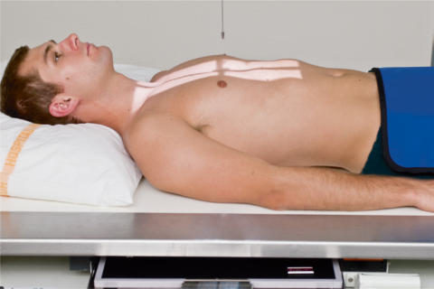
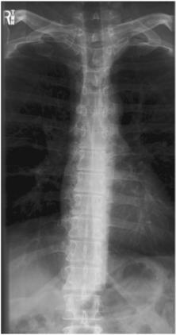
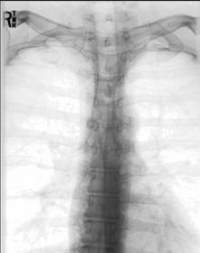
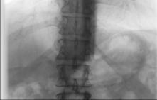

# Rx Coloană Toracală AP (Antero-Posterior)

  📷 Radiografie Convențională (Rx)
  <strong>Actualizat:</strong> 2026-09-15
  <strong>Autor:</strong> Departamentul de Radiologie / Referință Bontrager

---

-   __1. Rezumat Clinic & Indicații__

    ---

    === "Indicații Clinice"

        - Pathology involving Coloană Toracală, such ca compression suspiciune de fractură, subluxation, sau kyphosis

    === "Ghid Național IRIS"

        !!! info "Referință Primară: Ghidul Național IRIS (Ordinul MS 1342/2012)"
            - **Capitol Ghid IRIS:** *Ghidul Național IRIS*
            - **Grad de Recomandare:** **De verificat pe indicație; fără grad atribuit automat**
            - **Nivel de Iradiere Estimată:** `De verificat pentru examinarea și populația selectate`

            [:octicons-search-16: Deschide Ghidul IRIS](../../iris.md){ .md-button .md-button--primary } [:material-open-in-new: Aplicația Oficială PWA](https://radiologie-pediatrica.ro/iris/){ .md-button target="_blank" rel="noopener" }
-   __2. Poziționare & Centrare Fascicul__

    ---

    - **Poziție Pacient:** Pacient: Decubit și Ortostatism poziție pacient Decubit dorsal (preferred) cu brațe la side și cap pe table sau pe thin pillow. If pacient cannot tolerate Decubit dorsal poziție, place Ortostatism cu brațe la side și weight evenly distributed pe ambele picioare. anode heel effect will create more uniform receptor expunere throughout Coloană Toracală. Place pacient so more intense aspect de fascicul (cathode side) este over thoracolumbar region de coloană vertebrală.; Regiune anatomică: Align plan mediosagital la raza centrală și linia mediană mesei și/sau receptorul de imagine (Fig. 8.80). Flex genunchi și hips la reduce thoracic curvature. Se verifică absența rotației: claviculele sunt riguros echidistante față de linia proceselor spinoase thorax sau Bazin (bazin (pelvis)) exists.
    - **Punct de Centrare Fascicul:** perpendicular pe receptorul de imagine. Raza centrală se orientează spre T7 (3 la 4 inches [8 la 10 cm] below incizura jugulară (manubriul sternal) sau 1 la 2 inches [2.5 la 5 cm] below sternal angle). Centering este similar la that used cu AP Torace. Se centrează receptorul de imagine pe raza centrală.
    - **Distanță Focar-Film (DFF / SID):** 100 cm
    - **Comandă Respiratorie:** Apnee pe durata expunerii pe expiration. Expiration reduces air volume în thorax pentru more uniform brightness și imagine contrast. Coloană Toracală ROUTINE AP lateral Fig. 8.80 AP Coloană Toracală.

-   __3. Parametri Tehnici Expunere__

    ---

    | Parametru Tehnic | Valoare Configurare Generator / Tub |
    |:-----------------|:-------------------------------------|
    | **Tensiune Tub (kV)** | 75-90 kV |
    | **Sarcină / Produs Curent-Timp (mAs)** | DE CONFIGURAT PE APARAT |
    | **Distanță Focar-Film (DFF / SID)** | 100 cm |
    | **Grilă Antidifuzoare (Bucky)** | Cu grilă antidifuzoare Bucky |
    | **Dimensiune Focar** | Focar Mare (1.0 - 1.2 mm) |
    | **Camere de Ionizare AEC** | Camerele laterale (sau camera centrală funcție de regiune) |
    | **Colimare Fascicul** | Collimate pe two sides de anatomy (four sides if possible) |
    | **Filtrare Tub** | Totală ≥ 2.5 mm Al echivalent |

-   __4. Criterii de Calitate & Reușită Imagine__

    ---

    - Thoracic vertebral corpuri, intervertebral spații articulare, spinous și procese transverse, posterior Coaste (Grilaj Costal), și costovertebral articulations (Figs. 8.81 și 8.82). poziție
    - spinal column de la C7 la L1 centrat pe linia mediană receptorul de imagine.
    - Absența rotației anatomice: clavicule echidistante față de linia apofizelor spinoase indicated prin articulații sternoclaviculare echidistant față de coloană vertebrală.
    - Collimation la aria de interes diagnostic. expunere
    - optim receptorul de imagine expunere și contrast. Clear demonstration de bony margins și trabecular markings de coloană toracală.
    - fără mișcare. Fig. 8.81 AP Coloană Toracală. corp (T12) corp (T8) First rib posterior rib (T9) stâng Claviculă Fig. 8.82 AP Coloană Toracală.

-   __5. Protecție Radiologică (ALARA)__

    ---

    - Ecranare gonadică și a organelor radiosensibile conform procedurilor locale de radioprotecție ALARA.
    - Colimare strictă la aria de interes pentru limitarea radiației difuze.
    - Verificarea posibilității unei sarcini la pacientele de vârstă fertilă înainte de expunere.

### 🖼️ Imagini

<figure class="protocol-image-card" markdown>

<figcaption><strong>Fig. 8.80 AP Coloană Toracală.</strong> — Poziționare pacient conform Ghidului Bontrager (Fig. 8.80 AP thoracic coloană vertebrală.)</figcaption>

</figure>

<figure class="protocol-image-card" markdown>

<figcaption><strong>Fig. 8.81 AP Coloană Toracală.</strong> — Aspect radiografic de referință conform Ghidului Bontrager (Fig. 8.81 AP thoracic coloană vertebrală.)</figcaption>

</figure>

<figure class="protocol-image-card" markdown>

<figcaption><strong>Fig. 8.82 AP Coloană Toracală.</strong> — Aspect radiografic de referință conform Ghidului Bontrager (Fig. 8.82 AP thoracic coloană vertebrală.)</figcaption>

</figure>

<figure class="protocol-image-card" markdown>

<figcaption><strong>Figura 4</strong> — Aspect radiografic de referință conform Ghidului Bontrager (Figura 4)</figcaption>

</figure>

=== "Ghid Rapid de Execuție"

    1. **Identificarea și verificarea pacientului:** verificare identitate, zonă de examinat, consimțământ conform procedurii și evaluarea posibilității unei sarcini, când este relevantă.
    2. **Pregătire:** îndepărtarea oricăror obiecte radiopace (bijuterii, agrafe, fermoare, proteze, pansamente dense).
    3. **Poziționare precisă:** alinierea receptorului de imagine și a tubului la distanța prescrisă (100 cm).
    4. **Colimare strictă:** adaptarea fasciculului strict la regiunea de diagnostic pentru scăderea iradierii și reducerea radiației difuze.
    5. **Radioprotecție:** verificarea [politicii RX](../radioprotectie.md), cu măsuri distincte pentru pacient, personal și însoțitor.

## Surse de documentare

- [Bontrager's Textbook of Radiographic Positioning (Ed. 9/10), Pagina 342](https://www.elsevier.com/books/textbook-of-radiographic-positioning-and-related-anatomy/lampignano/978-0-323-65367-1)
