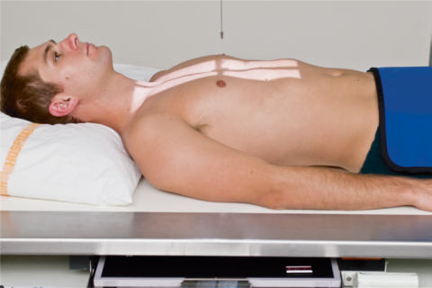
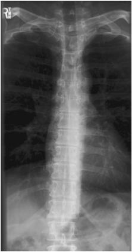
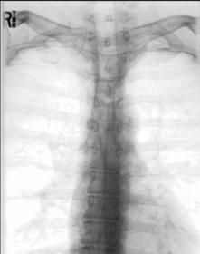
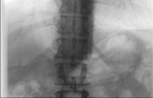

# Rx Coloană Toracală AP (Antero-Posterior)

  📷 Radiografie Convențională (Rx)
  <strong>Actualizat:</strong> 2026-09-15
  <strong>Autor:</strong> Departamentul de Radiologie / Referință Bontrager

---

-   __1. Rezumat Clinic & Indicații__

    ---

    === "Indicații Clinice"

        - Patologie care implică Coloana Toracală, cum ar fi compresia, suspiciunea de fractură, subluxația sau cifoza

    === "Ghid Național IRIS"

        !!! info "Referință Primară: Ghidul Național IRIS (Ordinul MS 1342/2012)"
            - **Capitol Ghid IRIS:** *Ghidul Național IRIS*
            - **Grad de Recomandare:** **De verificat pe indicație; fără grad atribuit automat**
            - **Nivel de Iradiere Estimată:** `De verificat pentru examinarea și populația selectate`

            [:octicons-search-16: Deschide Ghidul IRIS](../../iris.md){ .md-button .md-button--primary } [:material-open-in-new: Aplicația Oficială PWA](https://radiologie-pediatrica.ro/iris/){ .md-button target="_blank" rel="noopener" }
-   __2. Poziționare & Centrare Fascicul__

    ---

    - **Poziție Pacient:** Pacient: poziția pacientului în Decubit și Ortostatism Decubit dorsal (preferat), cu brațele pe lângă corp și capul pe masă sau pe o pernă subțire. Dacă pacientul nu poate tolera poziția în Decubit dorsal, se plasează în Ortostatism, cu brațele pe lângă corp și greutatea distribuită uniform pe ambele picioare. Efectul de călcâi al anodului va crea o expunere mai uniformă a receptorului pe întreaga Coloană Toracală. Se poziționează pacientul astfel încât aspectul mai intens al fasciculului (partea catodică) să fie deasupra regiunii toracolombare a coloanei vertebrale.; Regiune anatomică: Se aliniază planul mediosagital cu raza centrală și cu linia mediană a mesei și/sau a receptorului de imagine (Fig. 8.80). Se flectează genunchii și șoldurile pentru a reduce curbura toracică. Se verifică absența rotației: claviculele sunt riguros echidistante față de linia proceselor spinoase ale toracelui sau Bazinului (bazin (pelvis)) exists.
    - **Punct de Centrare Fascicul:** perpendicular pe receptorul de imagine. Raza centrală se orientează spre T7 (3 la 4 inches [8 la 10 cm] sub incizura jugulară (manubriul sternal) sau 1 la 2 inches [2.5 la 5 cm] sub unghiul sternal). Centrarea este similară cu cea utilizată pentru AP Torace. Se centrează receptorul de imagine pe raza centrală.
    - **Distanță Focar-Film (DFF / SID):** 100 cm
    - **Comandă Respiratorie:** Apnee pe durata expunerii în expir. Expirul reduce volumul de aer din torace pentru o luminozitate și un contrast mai uniforme ale imaginii. Coloană Toracală DE RUTINĂ AP profil Fig. 8.80 AP Coloană Toracală.

-   __3. Parametri Tehnici Expunere__

    ---

    | Parametru Tehnic | Valoare Configurare Generator / Tub |
    |:-----------------|:-------------------------------------|
    | **Tensiune Tub (kV)** | 75-90 kV |
    | **Sarcină / Produs Curent-Timp (mAs)** | DE CONFIGURAT PE APARAT |
    | **Distanță Focar-Film (DFF / SID)** | 100 cm |
    | **Grilă Antidifuzoare (Bucky)** | Cu grilă antidifuzoare Bucky |
    | **Dimensiune Focar** | Focar Mare (1.0 - 1.2 mm) |
    | **Camere de Ionizare AEC** | Camerele laterale (sau camera centrală, în funcție de regiune) |
    | **Colimare Fascicul** | Colimează pe două laturi ale anatomiei (patru laturi dacă este posibil) |
    | **Filtrare Tub** | Totală ≥ 2.5 mm Al echivalent |

-   __4. Criterii de Calitate & Reușită Imagine__

    ---

    - Corpurile vertebrale toracale, spațiile articulare intervertebrale, apofizele spinoase și transverse, coastele posterioare (Grilajul Costal) și articulațiile costovertebrale (Figs. 8.81 și 8.82). poziție
    - coloana vertebrală de la C7 la L1 centrată pe linia mediană a receptorului de imagine.
    - Absența rotației anatomice: claviculele echidistante față de linia apofizelor spinoase, indicată prin articulațiile sternoclaviculare echidistante față de coloana vertebrală.
    - Colimare la aria de interes diagnostic. Expunere
    - expunere optimă a receptorului de imagine și contrast. Demonstrarea clară a marginilor osoase și a desenului trabecular al coloanei toracale.
    - fără mișcare. Fig. 8.81 AP Coloană Toracală. corp (T12) corp (T8) Prima coastă coastă posterioară (T9) stâng Claviculă Fig. 8.82 AP Coloană Toracală.

-   __5. Protecție Radiologică (ALARA)__

    ---

    - Ecranare gonadică și a organelor radiosensibile conform procedurilor locale de radioprotecție ALARA.
    - Colimare strictă la aria de interes pentru limitarea radiației difuze.
    - Verificarea posibilității unei sarcini la pacientele de vârstă fertilă înainte de expunere.

### 🖼️ Imagini

<figure class="protocol-image-card" markdown>

<figcaption><strong>Fig. 8.80 AP Coloană Toracală.</strong> — Poziționare pacient conform Ghidului Bontrager (Fig. 8.80 AP coloană vertebrală toracală.)</figcaption>

</figure>

<figure class="protocol-image-card" markdown>

<figcaption><strong>Fig. 8.81 AP Coloană Toracală.</strong> — Aspect radiografic de referință conform Ghidului Bontrager (Fig. 8.81 AP coloană vertebrală toracală.)</figcaption>

</figure>

<figure class="protocol-image-card" markdown>

<figcaption><strong>Fig. 8.82 AP Coloană Toracală.</strong> — Aspect radiografic de referință conform Ghidului Bontrager (Fig. 8.82 AP coloană vertebrală toracală.)</figcaption>

</figure>

<figure class="protocol-image-card" markdown>

<figcaption><strong>Figura 4</strong> — Aspect radiografic de referință conform Ghidului Bontrager (Figura 4)</figcaption>

</figure>

=== "Ghid Rapid de Execuție"

    1. **Identificarea și verificarea pacientului:** verificare identitate, zonă de examinat, consimțământ conform procedurii și evaluarea posibilității unei sarcini, când este relevantă.
    2. **Pregătire:** îndepărtarea oricăror obiecte radiopace (bijuterii, agrafe, fermoare, proteze, pansamente dense).
    3. **Poziționare precisă:** alinierea receptorului de imagine și a tubului la distanța prescrisă (100 cm).
    4. **Colimare strictă:** adaptarea fasciculului strict la regiunea de diagnostic pentru scăderea iradierii și reducerea radiației difuze.
    5. **Radioprotecție:** verificarea [politicii RX](../radioprotectie.md), cu măsuri distincte pentru pacient, personal și însoțitor.

## Surse de documentare

- [Bontrager's Textbook of Radiographic Positioning (Ed. 9/10), Pagina 342](https://www.elsevier.com/books/textbook-of-radiographic-positioning-and-related-anatomy/lampignano/978-0-323-65367-1)
