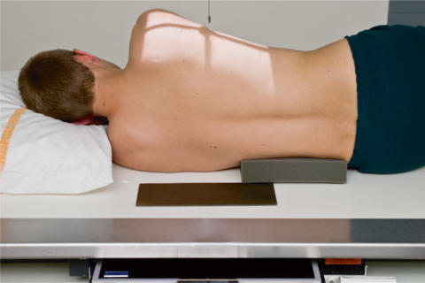
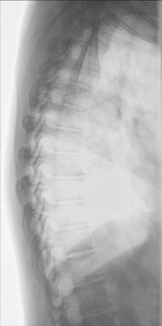

# Rx Coloană Toracală Profil (Lateral)

  📷 Radiografie Convențională (Rx)
  <strong>Actualizat:</strong> 2026-09-15
  <strong>Autor:</strong> Departamentul de Radiologie / Referință Bontrager

---

-   __1. Rezumat Clinic & Indicații__

    ---

    === "Indicații Clinice"

        - Pathology involving the Coloană Toracală, such as compression suspiciune de fractură, subluxation, or kyphosis

    === "Ghid Național IRIS"

        !!! info "Referință Primară: Ghidul Național IRIS (Ordinul MS 1342/2012)"
            - **Capitol Ghid IRIS:** *Ghidul Național IRIS*
            - **Grad de Recomandare:** **De verificat pe indicație; fără grad atribuit automat**
            - **Nivel de Iradiere Estimată:** `De verificat pentru examinarea și populația selectate`

            [:octicons-search-16: Deschide Ghidul IRIS](../../iris.md){ .md-button .md-button--primary } [:material-open-in-new: Aplicația Oficială PWA](https://radiologie-pediatrica.ro/iris/){ .md-button target="_blank" rel="noopener" }
-   __2. Poziționare & Centrare Fascicul__

    ---

    - **Poziție Pacient:** Pacient: Lateral Decubit or Ortostatism Position Position patient in the lateral Decubit position, with head on pillow and knees flexed. For the Ortostatism position, place arms outstretched, with weight evenly distributed on both feet.; Regiune anatomică: Align posterior half of thorax (between midcoronal plane and posterior aspect of thorax) to CR and midline of table and/or IR (Fig. 8.83). Raise patient’s arms to right angles to body with elbows flexed. Support waist so entire spine is near parallel to table. Palpate spinous processes to determine alignment (see NOTE 2). Flex hips and knees, with support between the knees. Ensure that Absența rotației anatomice: clavicule echidistante față de linia apofizelor spinoase of shoulders or Bazin (Pelvis) exists.
    - **Punct de Centrare Fascicul:** perpendicular to long axis of Coloană Toracală (see NOTE 2). Direct CR to T7 (3 to 4 inches [8 to 10 cm] below incizura jugulară (manubriul sternal) or 7 to 8 inches [18 to 20 cm] below the vertebra proeminentă (apofiza spinoasă C7)). Center IR to CR.
    - **Distanță Focar-Film (DFF / SID):** 100 cm
    - **Comandă Respiratorie:** technique requires a minimum of 2 or 3 seconds of exposure time with a low mA setting.

-   __3. Parametri Tehnici Expunere__

    ---

    | Parametru Tehnic | Valoare Configurare Generator / Tub |
    |:-----------------|:-------------------------------------|
    | **Tensiune Tub (kV)** | 80-95 kV |
    | **Sarcină / Produs Curent-Timp (mAs)** | DE CONFIGURAT PE APARAT |
    | **Distanță Focar-Film (DFF / SID)** | 100 cm |
    | **Grilă Antidifuzoare (Bucky)** | Cu grilă antidifuzoare Bucky |
    | **Dimensiune Focar** | Focar Mare (1.0 - 1.2 mm) |
    | **Camere de Ionizare AEC** | Camerele laterale (sau camera centrală funcție de regiune) |
    | **Colimare Fascicul** | Collimate on two sides of anatomy (four sides if possible) |
    | **Filtrare Tub** | Totală ≥ 2.5 mm Al echivalent |

-   __4. Criterii de Calitate & Reușită Imagine__

    ---

    - Thoracic vertebral bodies, intervertebral joint spaces, and intervertebral foramina.
    - T1 to T3 will not be well visualized.
    - Obtain a lateral image using a cervicothoracic (swimmer’s) lateral if the upper thoracic vertebrae are of special interest (Figs. 8.84 and 8.85). Position
    - Intervertebral disk spaces should be open.
    - Absența rotației anatomice: clavicule echidistante față de linia apofizelor spinoase indicated by superimposition of posterior aspects of vertebral bodies.
    - Because of greater OID on one side, the posterior Coaste (Grilaj Costal) will not be directly superimposed, especially if a patient has a wide thorax. Absența rotației anatomice: clavicule echidistante față de linia apofizelor spinoase indicated by less than ½ inch (1.25 cm) of space between posterior Coaste (Grilaj Costal).
    - Collimation to area of interest. Exposure
    - Optimal image receptor exposure and contrast. Clear demonstration of bony margins and trabecular markings of thoracic vertebrae.
    - no motion.

-   __5. Protecție Radiologică (ALARA)__

    ---

    - Ecranare gonadică și a organelor radiosensibile conform procedurilor locale de radioprotecție ALARA.
    - Colimare strictă la aria de interes pentru limitarea radiației difuze.
    - Verificarea posibilității unei sarcini la pacientele de vârstă fertilă înainte de expunere.

!!! note "Observații Clinice & Tehnice"
    The optimal amount of support under the waist will cause the lower vertebrae to be the same distance from the tabletop as the upper vertebrae. A patient with wide hips will require substantially more support under the waist to prevent sag. A patient with broad shoulders may require a 10° to 15° cephalic CR angle if waist is not supported. No AEC with breathing technique. Coloană Toracală ROUTINE AP Lateral Fig. 8.83 Left lateral Coloană Toracală, with proper waist support. Fig. 8.84 Lateral thoracic with breathing technique. Intervertebral joint space Thoracic vertebral bodies Intervertebral foramina (R and L) Fig. 8.85 Lateral Coloană Toracală.

### 🖼️ Imagini

<figure class="protocol-image-card" markdown>

<figcaption><strong>Fig. 8.83 Left lateral Coloană Toracală, with proper waist support.</strong> — Poziționare pacient conform Ghidului Bontrager (Fig. 8.83 Left lateral thoracic spine, with proper waist support.)</figcaption>

</figure>

<figure class="protocol-image-card" markdown>

<figcaption><strong>Fig. 8.84 Lateral thoracic</strong> — Aspect radiografic de referință conform Ghidului Bontrager (Fig. 8.84 Lateral thoracic)</figcaption>

</figure>

<figure class="protocol-image-card" markdown>

<figcaption><strong>Fig. 8.85 Lateral Coloană Toracală.</strong> — Aspect radiografic de referință conform Ghidului Bontrager (Fig. 8.85 Lateral thoracic spine.)</figcaption>

</figure>

=== "Ghid Rapid de Execuție"

    1. **Identificarea și verificarea pacientului:** verificare identitate, zonă de examinat, consimțământ conform procedurii și evaluarea posibilității unei sarcini, când este relevantă.
    2. **Pregătire:** îndepărtarea oricăror obiecte radiopace (bijuterii, agrafe, fermoare, proteze, pansamente dense).
    3. **Poziționare precisă:** alinierea receptorului de imagine și a tubului la distanța prescrisă (100 cm).
    4. **Colimare strictă:** adaptarea fasciculului strict la regiunea de diagnostic pentru scăderea iradierii și reducerea radiației difuze.
    5. **Radioprotecție:** verificarea [politicii RX](../radioprotectie.md), cu măsuri distincte pentru pacient, personal și însoțitor.

## Surse de documentare

- [Bontrager's Textbook of Radiographic Positioning (Ed. 9/10), Pagina 343](https://www.elsevier.com/books/textbook-of-radiographic-positioning-and-related-anatomy/lampignano/978-0-323-65367-1)
