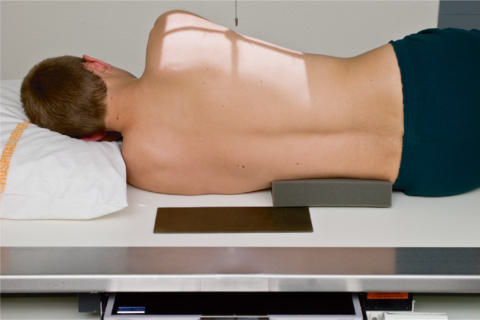
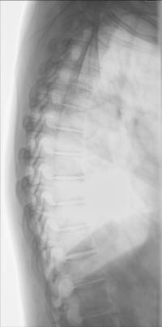

# Rx Coloană Toracală Profil (Lateral)

  📷 Radiografie Convențională (Rx)
  <strong>Actualizat:</strong> 2026-09-15
  <strong>Autor:</strong> Departamentul de Radiologie / Referință Bontrager

---

-   __1. Rezumat Clinic & Indicații__

    ---

    === "Indicații Clinice"

        - Patologie care implică Coloana Toracală, cum ar fi compresia, suspiciunea de fractură, subluxația sau cifoza

    === "Ghid Național IRIS"

        !!! info "Referință Primară: Ghidul Național IRIS (Ordinul MS 1342/2012)"
            - **Capitol Ghid IRIS:** *Coloană vertebrală*
            - **Grad de Recomandare:** **Grad A**
            - **Nivel de Iradiere Estimată:** `Clasa 2 (Foarte mică ~ 0.7 - 1.0 mSv)`

            [:octicons-search-16: Deschide Ghidul IRIS](../../iris.md){ .md-button .md-button--primary } [:material-open-in-new: Aplicația Oficială PWA](https://radiologie-pediatrica.ro/iris/){ .md-button target="_blank" rel="noopener" }

-   __2. Poziționare & Centrare Fascicul__

    ---

    - **Poziție Pacient:** Pacient: poziția pacientului în Decubit lateral sau Ortostatism, în poziție de Decubit lateral, cu capul pe o pernă și genunchii flectați. Pentru poziția în Ortostatism, se plasează brațele întinse, cu greutatea distribuită uniform pe ambele picioare.; Regiune anatomică: Se aliniază jumătatea posterioară a toracelui (între planul mediocoronal și aspectul posterior al toracelui) cu raza centrală și cu linia mediană a mesei și/sau a receptorului de imagine (Fig. 8.83). Se ridică brațele pacientului la unghiuri drepte față de corp, cu coatele flectate. Se susține talia astfel încât întreaga coloană vertebrală să fie aproape paralelă cu masa. Se palpează apofizele spinoase pentru a determina alinierea (vezi NOTA 2). Se flectează șoldurile și genunchii, cu suport între genunchi. Se verifică absența rotației: claviculele sunt riguros echidistante față de linia proceselor spinoase ale umerilor sau Bazinului (bazin (pelvis)) exists.
    - **Punct de Centrare Fascicul:** perpendiculară pe axa longitudinală a Coloanei Toracale (vezi NOTA 2). Raza centrală se orientează spre T7 (3 la 4 țoli [8 la 10 cm] sub incizura jugulară (manubriul sternal) sau 7 la 8 țoli [18 la 20 cm] sub vertebra proeminentă (apofiza spinoasă C7)). Se centrează receptorul de imagine pe raza centrală.
    - **Distanță Focar-Film (DFF / SID):** 100 cm
    - **Comandă Respiratorie:** tehnica necesită un timp minim de expunere de 2 sau 3 secunde, cu o valoare mA scăzută.

-   __3. Parametri Tehnici Expunere__

    ---

    | Parametru Tehnic | Valoare Configurare Generator / Tub |
    |:-----------------|:-------------------------------------|
    | **Tensiune Tub (kV)** | 80-95 kV |
    | **Sarcină / Produs Curent-Timp (mAs)** | DE CONFIGURAT PE APARAT |
    | **Distanță Focar-Film (DFF / SID)** | 100 cm |
    | **Grilă Antidifuzoare (Bucky)** | Cu grilă antidifuzoare Bucky |
    | **Dimensiune Focar** | Focar Mare (1.0 - 1.2 mm) |
    | **Camere de Ionizare AEC** | Camerele laterale (sau camera centrală, în funcție de regiune) |
    | **Colimare Fascicul** | Colimează pe două laturi ale anatomiei (patru laturi dacă este posibil) |
    | **Filtrare Tub** | Totală ≥ 2.5 mm Al echivalent |

-   __4. Criterii de Calitate & Reușită Imagine__

    ---

    - Corpurile vertebrale toracale, spațiile articulare intervertebrale și găurile intervertebrale.
    - T1 la T3 nu vor fi bine vizualizate.
    - Se obține o imagine de profil utilizând incidența latero-cervicotoracică (a înotătorului) dacă porțiunea superioară a coloanei toracale prezintă un interes deosebit (Figs. 8.84 și 8.85). poziție
    - Spațiile discale intervertebrale trebuie să fie deschise.
    - Absența rotației anatomice: claviculele echidistante față de linia apofizelor spinoase, indicată prin suprapunerea aspectelor posterioare ale corpurilor vertebrale.
    - Din cauza OID mai mare pe o parte, coastele posterioare (Grilajul Costal) nu vor fi suprapuse direct, în special dacă pacientul are torace lat. Absența rotației anatomice: claviculele echidistante față de linia apofizelor spinoase, indicată printr-un spațiu mai mic de ½ țol (1.25 cm) între coastele posterioare (Grilajul Costal).
    - Colimare la aria de interes diagnostic. Expunere
    - expunere optimă a receptorului de imagine și contrast. Demonstrarea clară a marginilor osoase și a desenului trabecular al coloanei toracale.
    - fără mișcare.

-   __5. Protecție Radiologică (ALARA)__

    ---

    - Ecranare gonadică și a organelor radiosensibile conform procedurilor locale de radioprotecție ALARA.
    - Colimare strictă la aria de interes pentru limitarea radiației difuze.
    - Verificarea posibilității unei sarcini la pacientele de vârstă fertilă înainte de expunere.

!!! note "Observații Clinice & Tehnice"
    o cantitate optimă de suport sub talie va determina ca vertebrele inferioare să fie la aceeași distanță de masa radiologică precum vertebrele superioare. pacientul cu șolduri late va necesita un suport considerabil mai mare sub talie pentru a preveni lăsarea. pacientul cu umeri lați poate necesita o angulație cefalică a razei centrale de 10° la 15° dacă talia nu este sprijinită. fără AEC, cu Tehnică de estompare prin respirație superficială (tehnică de respirație). Coloană Toracală DE RUTINĂ AP profil Fig. 8.83 profil stâng Coloană Toracală, cu suport corect pentru talie. Fig. 8.84 profil toracal cu Tehnică de estompare prin respirație superficială (tehnică de respirație). Spații articulare intervertebrale Corpuri vertebrale toracale Găuri intervertebrale (D și S) Fig. 8.85 profil Coloană Toracală.

### 🖼️ Imagini

<figure class="protocol-image-card" markdown>

<figcaption><strong>Fig. 8.83 profil stâng Coloană Toracală, cu suport corect pentru talie.</strong> — Poziționare pacient conform Ghidului Bontrager (Fig. 8.83 incidență de profil stângă a coloanei vertebrale toracale, cu suport lombar corect.)</figcaption>

</figure>

<figure class="protocol-image-card" markdown>

<figcaption><strong>Fig. 8.84 incidență de profil a coloanei toracale</strong> — Aspect radiografic de referință conform Ghidului Bontrager (Fig. 8.84 incidență de profil a coloanei toracale)</figcaption>

</figure>

<figure class="protocol-image-card" markdown>

<figcaption><strong>Fig. 8.85 incidență de profil a coloanei toracale.</strong> — Aspect radiografic de referință conform Ghidului Bontrager (Fig. 8.85 incidență de profil a coloanei vertebrale toracale.)</figcaption>

</figure>

=== "Ghid Rapid de Execuție"

    1. **Identificarea și verificarea pacientului:** verificare identitate, zonă de examinat, consimțământ conform procedurii și evaluarea posibilității unei sarcini, când este relevantă.
    2. **Pregătire:** îndepărtarea oricăror obiecte radiopace (bijuterii, agrafe, fermoare, proteze, pansamente dense).
    3. **Poziționare precisă:** alinierea receptorului de imagine și a tubului la distanța prescrisă (100 cm).
    4. **Colimare strictă:** adaptarea fasciculului strict la regiunea de diagnostic pentru scăderea iradierii și reducerea radiației difuze.
    5. **Radioprotecție:** verificarea [politicii RX](../radioprotectie.md), cu măsuri distincte pentru pacient, personal și însoțitor.

## Surse de documentare

- [Bontrager's Textbook of Radiographic Positioning (Ed. 9/10), Pagina 343](https://www.elsevier.com/books/textbook-of-radiographic-positioning-and-related-anatomy/lampignano/978-0-323-65367-1)
