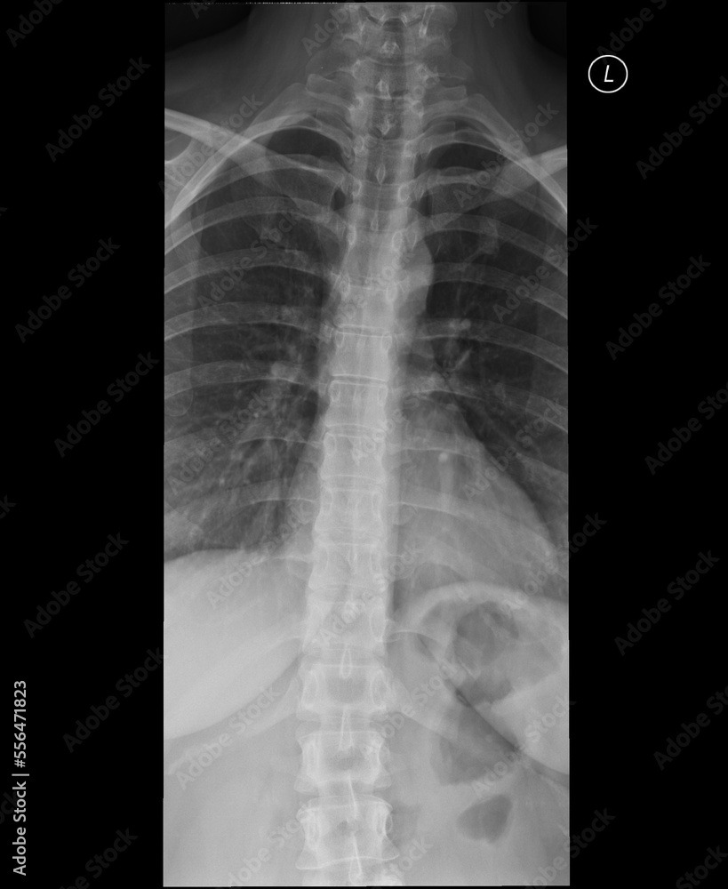

# Rx Coloană Toracală (Față & Profil)

  📷 Radiografie Convențională (Rx)
  <strong>Actualizat:</strong> 2026-09-13
  <strong>Autor:</strong> Departamentul de Radiologie

---

-   __1. Rezumat Clinic & Indicații__

    ---

    === "Indicații Clinice"

        - Dorsalgii cronice, cifoză dorsală accentuată (boala Scheuermann)
        - Suspiciune tasare vertebrală osteoporotică
        - Traumatisme toracale cu durere pe linia mediană posterioară
        - Screening scolioză toracală

    === "Ghid Național IRIS"

        !!! info "Referință Primară: Ghidul Național IRIS (Ordinul MS 1342/2012)"
            - **Capitol Ghid IRIS:** *Coloană vertebrală*
            - **Grad de Recomandare:** **Grad B**
            - **Nivel de Iradiere Estimată:** `Clasa 2 (Foarte mică ~ 0.7 mSv)`

            [:octicons-search-16: Deschide Ghidul IRIS](../../iris.md){ .md-button .md-button--primary } [:material-open-in-new: Aplicația Oficială PWA](https://radiologie-pediatrica.ro/iris/){ .md-button target="_blank" rel="noopener" }
-   __2. Poziționare & Centrare Fascicul__

    ---

    - **Poziție Pacient:** AP în ortostatism sau decubit dorsal; profil în ortostatism ori adaptat stării pacientului. În traumatism, fără mobilizare forțată, cu tehnică cu rază orizontală când este indicată.
    - **Punct de Centrare Fascicul:** Nivel T7 (la 8-10 cm sub furculița sternală pe Față)
    - **Distanță Focar-Film (DFF / SID):** 100 - 115 cm
    - **Comandă Respiratorie:** Față: apnee în expir; Profil: respirație superficială liniștită în timpul unei expuneri prelungite (estompează coastele și desenul pulmonar)

-   __3. Parametri Tehnici Expunere__

    ---

    | Parametru Tehnic | Valoare Configurare Generator / Tub |
    |:-----------------|:-------------------------------------|
    | **Tensiune Tub (kV)** | 75 - 85 (Față); 80 - 90 (Profil) kV |
    | **Sarcină / Produs Curent-Timp (mAs)** | 25 - 50 (AEC) |
    | **Distanță Focar-Film (DFF / SID)** | 100 - 115 cm |
    | **Grilă Antidifuzoare (Bucky)** | Cu grilă antidifuzoare Bucky |
    | **Dimensiune Focar** | Focar Mare sau Mic |
    | **Camere de Ionizare AEC** | Camera centrală activată |
    | **Colimare Fascicul** | Longitudinală strictă pe lățimea corpilor vertebrali (aprox. 15 cm) |
    | **Filtrare Tub** | Totală ≥ 2.5 mm Al |

-   __4. Criterii de Calitate & Reușită Imagine__

    ---

    - Includerea tuturor celor 12 vertebre toracale (T1 la T12)
    - Înălțimea corpilor vertebrali și spațiile discale vizibile clar fără rotație
    - Găurile de conjugare vizualizate clar pe profil

-   __5. Protecție Radiologică (ALARA)__

    ---

    - Ecranarea pacientului se stabilește conform politicii RX actualizate; fără aplicare automată din template.
    - Colimare laterală strânsă

!!! note "Observații Clinice & Tehnice"
    Efectul de toc (anode heel effect) poate fi utilizat orientând catodul spre partea inferioară a toracelui pentru o densitate mai uniformă.

=== "Ghid Rapid de Execuție"

    1. **Identificarea și verificarea pacientului:** verificare identitate, zonă de examinat, consimțământ conform procedurii și evaluarea posibilității unei sarcini, când este relevantă.
    2. **Pregătire:** îndepărtarea oricăror obiecte radiopace (bijuterii, agrafe, fermoare, proteze, pansamente dense).
    3. **Poziționare precisă:** alinierea receptorului de imagine și a tubului la distanța prescrisă (100 - 115 cm).
    4. **Colimare strictă:** adaptarea fasciculului strict la regiunea de diagnostic pentru scăderea iradierii și reducerea radiației difuze.
    5. **Radioprotecție:** verificarea [politicii RX](../radioprotectie.md), cu măsuri distincte pentru pacient, personal și însoțitor.

## Imagini reprezentative

Adobe · CC · https://as1.ftcdn.net

## Surse și revizuire

- [Comisia Europeană (EUR 16260) — Criterii de calitate în radiodiagnostic](https://op.europa.eu/en/publication-detail/-/publication/d3d77212-5290-414e-8e37-27fde43b5925) — *Comisia Europeană*
- [ACR-SPR Practice Parameter for General Radiography (Digital Radiography)](https://www.acr.org/-/media/ACR/Files/Practice-Parameters/GeneralRad.pdf) — *ACR*
- [Radiopaedia — X-ray Positioning and Projections Reference](https://radiopaedia.org/articles/x-ray-positioning-and-projections-1) — *Radiopaedia*
- [Merrill’s_Atlas_of_Radiographic_Positioning_&amp;_Procedures_3Vol_Set.pdf](../../assets/protocols/sources/a56d45c16829_Merrills_Atlas_of_Radiographic_Positioning__Procedures_3Vol_Set.pdf) (Document local (PDF): Merrill’s_Atlas_of_Radiographic_Positioning_&amp;_Procedures_3Vol_Set.pdf) — *Document instituțional intern*

Revizuit de: oxus · 2026-09-15

Poziționare revizuită: [NNUH, ghid RX v8, p.36](https://www.nnuh.nhs.uk/publication/download/justification-criteria-technique-guide-for-plain-radiological-examinations-version-8/).
