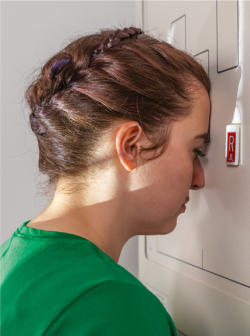
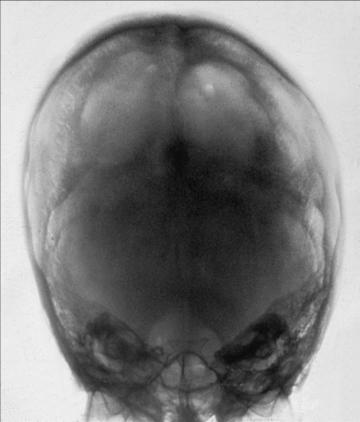

# Rx Craniu SERIES PA Axială (Metoda Haas)

  📷 Radiografie Convențională (Rx)
  <strong>Actualizat:</strong> 2026-09-15
  <strong>Autor:</strong> Departamentul de Radiologie / Referință Bontrager

---

-   __1. Rezumat Clinic & Indicații__

    ---

    === "Indicații Clinice"

        - Craniu suspiciune de fractură (medial and lateral displacement), neoplastic processes, and Paget disease This is an alternative projection for patients who cannot flex the neck sufficiently for AP axial (Incidență AP Axială (Metoda Towne)) projection. It can also be performed for hypersthenic and bariatric patients with limited range of cervical motion. It results in magnification of the occipital area but in lower doses to facial structures and the thyroid gland. This projection is not recommended when the occipital bone is the area of interest because of excessive magnification.

    === "Ghid Național IRIS"

        !!! info "Referință Primară: Ghidul Național IRIS (Ordinul MS 1342/2012)"
            - **Capitol Ghid IRIS:** *Ghidul Național IRIS*
            - **Grad de Recomandare:** **De verificat pe indicație; fără grad atribuit automat**
            - **Nivel de Iradiere Estimată:** `De verificat pentru examinarea și populația selectate`

            [:octicons-search-16: Deschide Ghidul IRIS](../../iris.md){ .md-button .md-button--primary } [:material-open-in-new: Aplicația Oficială PWA](https://radiologie-pediatrica.ro/iris/){ .md-button target="_blank" rel="noopener" }
-   __2. Poziționare & Centrare Fascicul__

    ---

    - **Poziție Pacient:** Pacient: Remove all metallic or plastic objects from patient’s head and neck. Take radiograph with patient in the Ortostatism or Decubit Ventral position.; Regiune anatomică: Rest patient’s nose and forehead against the table/imaging device surface. Flex neck, bringing oMl perpendicular to IR (Fig. 11.122). Align MSP to CR and to the midline of the grid or table/imaging device surface. Ensure that Absența rotației anatomice: clavicule echidistante față de linia apofizelor spinoase or tilt exists (MSP perpendicular to IR).
    - **Punct de Centrare Fascicul:** Angle CR 25° cephalad to OML. Center CR to MSP and 1½ inches (4 cm) inferior to the inion and exit 1½ inches (4 cm) superior to nasion. Center IR to projected CR.
    - **Distanță Focar-Film (DFF / SID):** 100 cm
    - **Comandă Respiratorie:** Suspend respiration. Fig. 11.122 PA axial—CR 25° cephalad to OML, Ortostatism and Decubit Ventral (inset). Craniu SERIES SPECIAL SMV PA axial (Metoda Haas)

-   __3. Parametri Tehnici Expunere__

    ---

    | Parametru Tehnic | Valoare Configurare Generator / Tub |
    |:-----------------|:-------------------------------------|
    | **Tensiune Tub (kV)** | 75-90 kV |
    | **Sarcină / Produs Curent-Timp (mAs)** | DE CONFIGURAT PE APARAT |
    | **Distanță Focar-Film (DFF / SID)** | 100 cm |
    | **Grilă Antidifuzoare (Bucky)** | Cu grilă antidifuzoare Bucky |
    | **Dimensiune Focar** | Focar Mare (1.0 - 1.2 mm) |
    | **Camere de Ionizare AEC** | Camerele laterale (sau camera centrală funcție de regiune) |
    | **Colimare Fascicul** | Collimate on four sides to anatomy of interest. |
    | **Filtrare Tub** | Totală ≥ 2.5 mm Al echivalent |

-   __4. Criterii de Calitate & Reușită Imagine__

    ---

    - Occipital bone, petrous pyramids, and foramen magnum are demonstrated, with the dorsum sellae and posterior clinoid processes visualized in the shadow of the foramen magnum (Figs. 11.123 and 11.124). Position:
    - Absența rotației anatomice: clavicule echidistante față de linia apofizelor spinoase is evident, as indicated by bilateral symmetric petrous ridges.
    - Dorsum sellae and posterior clinoid processes are visualized in the foramen magnum, which indicates correct CR angle and proper neck flexion and extension.
    - no tilt as evidenced by correct placement of anterior clinoid processes within the middle of the foramen magnum.
    - Collimation to area of interest. Exposure:
    - Optimal image receptor exposure and contrast are sufficient to visualize occipital bone and sellar structures within foramen magnum.
    - Sharp bony margins indicate no motion. L Fig. 11.123 PA axial. Mastoids L Petrous ridge Dorsum sellae Posterior clinoids Foramen magnum Fig. 11.124 PA axial. 24 30 R

-   __5. Protecție Radiologică (ALARA)__

    ---

    - Ecranare gonadică și a organelor radiosensibile conform procedurilor locale de radioprotecție ALARA.
    - Colimare strictă la aria de interes pentru limitarea radiației difuze.
    - Verificarea posibilității unei sarcini la pacientele de vârstă fertilă înainte de expunere.

### 🖼️ Imagini

<figure class="protocol-image-card" markdown>

<figcaption><strong>Fig. 11.122 PA axial—CR 25° cephalad to OML, Ortostatism and Decubit Ventral</strong> — Poziționare pacient conform Ghidului Bontrager (Fig. 11.122 PA axial—CR 25° cephalad to OML, erect and prone)</figcaption>

</figure>

<figure class="protocol-image-card" markdown>

<figcaption><strong>Fig. 11.123 PA axial.</strong> — Aspect radiografic de referință conform Ghidului Bontrager (Fig. 11.123 PA axial.)</figcaption>

</figure>

<figure class="protocol-image-card" markdown>

<figcaption><strong>Fig. 11.124 PA axial.</strong> — Aspect radiografic de referință conform Ghidului Bontrager (Fig. 11.124 PA axial.)</figcaption>

</figure>

=== "Ghid Rapid de Execuție"

    1. **Identificarea și verificarea pacientului:** verificare identitate, zonă de examinat, consimțământ conform procedurii și evaluarea posibilității unei sarcini, când este relevantă.
    2. **Pregătire:** îndepărtarea oricăror obiecte radiopace (bijuterii, agrafe, fermoare, proteze, pansamente dense).
    3. **Poziționare precisă:** alinierea receptorului de imagine și a tubului la distanța prescrisă (100 cm).
    4. **Colimare strictă:** adaptarea fasciculului strict la regiunea de diagnostic pentru scăderea iradierii și reducerea radiației difuze.
    5. **Radioprotecție:** verificarea [politicii RX](../radioprotectie.md), cu măsuri distincte pentru pacient, personal și însoțitor.

## Surse de documentare

- [Bontrager's Textbook of Radiographic Positioning (Ed. 9/10), Pagina 442](https://www.elsevier.com/books/textbook-of-radiographic-positioning-and-related-anatomy/lampignano/978-0-323-65367-1)
