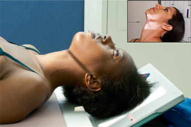
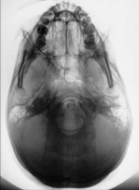

# Rx Craniu SERIES SUBMENTOVERTICAL (SMV) PROJECTION

  📷 Radiografie Convențională (Rx)
  <strong>Actualizat:</strong> 2026-09-15
  <strong>Autor:</strong> Departamentul de Radiologie / Referință Bontrager

---

-   __1. Rezumat Clinic & Indicații__

    ---

    === "Indicații Clinice"

        - Advanced bony pathology of the inner temporal bone structures (Craniu base)
        - Possible basal Craniu suspiciune de fractură

    === "Ghid Național IRIS"

        !!! info "Referință Primară: Ghidul Național IRIS (Ordinul MS 1342/2012)"
            - **Capitol Ghid IRIS:** *Ghidul Național IRIS*
            - **Grad de Recomandare:** **De verificat pe indicație; fără grad atribuit automat**
            - **Nivel de Iradiere Estimată:** `De verificat pentru examinarea și populația selectate`

            [:octicons-search-16: Deschide Ghidul IRIS](../../iris.md){ .md-button .md-button--primary } [:material-open-in-new: Aplicația Oficială PWA](https://radiologie-pediatrica.ro/iris/){ .md-button target="_blank" rel="noopener" }
-   __2. Poziționare & Centrare Fascicul__

    ---

    - **Poziție Pacient:** Pacient: Remove all metal, plastic, and other removable objects from patient’s head. Take radiograph with patient in an Ortostatism or Decubit Dorsal position. The Ortostatism position is recommended using an Ortostatism table or an upright imaging device (Fig. 11.119, inset). A wheelchair can also be used. A wheelchair offers support for the back and provides greater stability in maintaining the position. (Ensure wheels are locked before positioning patient.); Regiune anatomică: Raise the patient’s chin and hyperextend the neck if possible until ioMl is parallel to iR (see NOTE). Rest patient’s head on vertex. Align MsP perpendicular to the midline of the grid or table/ imaging device surface, avoiding tilt or rotation. Decubit Dorsal With the patient in the Decubit Dorsal position, extend patient’s head over end of table and support grid cassette and head as shown in Fig. 11.119, keeping ioMl parallel to iR and perpendicular to CR. Place a positioning sponge/pillow under the patient’s back to support neck extension. Ortostatism If patient is unable to extend the neck sufficiently, compensate by angling CR to remain perpendicular to ioMl. Depending on the equipment used, IR also may be angled to maintain the perpendicular relationship with CR (e.g., with an adjustable upright imaging device).
    - **Punct de Centrare Fascicul:** is perpendicular to the infraorbitomeatal line (IOML). Center 1½ inch (4 cm) inferior to mandibular symphysis, or midway between the gonions (approximately ¾ inch [2 cm] anterior to level of EAM). Center IR to CR.
    - **Distanță Focar-Film (DFF / SID):** 100 cm
    - **Comandă Respiratorie:** Suspend respiration. Fig. 11.119 SMV tabletop with grid cassette (inset demonstrates use of upright imaging device). Raza centrală perpendiculară to IOML. Craniu SERIES SPECIAL SMV

-   __3. Parametri Tehnici Expunere__

    ---

    | Parametru Tehnic | Valoare Configurare Generator / Tub |
    |:-----------------|:-------------------------------------|
    | **Tensiune Tub (kV)** | 75-85 kV |
    | **Sarcină / Produs Curent-Timp (mAs)** | DE CONFIGURAT PE APARAT |
    | **Distanță Focar-Film (DFF / SID)** | 100 cm |
    | **Grilă Antidifuzoare (Bucky)** | Cu grilă antidifuzoare Bucky |
    | **Dimensiune Focar** | Focar Mic (0.6 mm) |
    | **Camere de Ionizare AEC** | Camerele laterale (sau camera centrală funcție de regiune) |
    | **Colimare Fascicul** | Collimate on four sides to anatomy of interest. |
    | **Filtrare Tub** | Totală ≥ 2.5 mm Al echivalent |

-   __4. Criterii de Calitate & Reușită Imagine__

    ---

    - Foramen ovale and spinosum, Mandibulă, sphenoid and posterior ethmoid sinuses, mastoid processes, petrous ridges, hard palate, foramen magnum, and occipital bone are demonstrated (Figs. 11.120 and 11.121). Position:
    - Correct extension of neck and relationship between IOML and CR as indicated by mandibular mentum anterior to the ethmoid sinuses.
    - Absența rotației anatomice: clavicule echidistante față de linia apofizelor spinoase evidenced by the MSP parallel to edge of IR.
    - no tilt evidenced by equal distance between mandibular ramus and lateral cranial cortex.
    - Example: If the distance on the left side between the ramus and lateral Craniu is greater on the left than the right, the cranial vertex is tilted to the left.
    - Collimation to area of interest. Exposure:
    - Optimal image receptor exposure and contrast are sufficient to visualize clearly outline of ethmoid and sphenoid sinuses and cranial foramen.
    - Sharp bony margins indicate no motion. Sphenoid and ethmoid sinuses Occipital bone R Mastoid process Mandibular condyle Foramen ovale and spinosum Foramen magnum Mentum Petrous pyramids Fig. 11.121 SMV. R Fig. 11.120 SMV.

-   __5. Protecție Radiologică (ALARA)__

    ---

    - Ecranare gonadică și a organelor radiosensibile conform procedurilor locale de radioprotecție ALARA.
    - Colimare strictă la aria de interes pentru limitarea radiației difuze.
    - Verificarea posibilității unei sarcini la pacientele de vârstă fertilă înainte de expunere.

!!! note "Observații Clinice & Tehnice"
    This position is uncomfortable for patients in the Ortostatism or the Decubit Dorsal position; perform it as quickly as possible.

### 🖼️ Imagini

<figure class="protocol-image-card" markdown>

<figcaption><strong>Fig. 11.119 SMV tabletop with grid cassette (inset demonstrates use</strong> — Poziționare pacient conform Ghidului Bontrager (Fig. 11.119 SMV tabletop with grid cassette (inset demonstrates use)</figcaption>

</figure>

<figure class="protocol-image-card" markdown>

<figcaption><strong>Fig. 11.121 SMV.</strong> — Aspect radiografic de referință conform Ghidului Bontrager (Fig. 11.121 SMV.)</figcaption>

</figure>

<figure class="protocol-image-card" markdown>

<figcaption><strong>Fig. 11.120 SMV.</strong> — Aspect radiografic de referință conform Ghidului Bontrager (Fig. 11.120 SMV.)</figcaption>

</figure>

=== "Ghid Rapid de Execuție"

    1. **Identificarea și verificarea pacientului:** verificare identitate, zonă de examinat, consimțământ conform procedurii și evaluarea posibilității unei sarcini, când este relevantă.
    2. **Pregătire:** îndepărtarea oricăror obiecte radiopace (bijuterii, agrafe, fermoare, proteze, pansamente dense).
    3. **Poziționare precisă:** alinierea receptorului de imagine și a tubului la distanța prescrisă (100 cm).
    4. **Colimare strictă:** adaptarea fasciculului strict la regiunea de diagnostic pentru scăderea iradierii și reducerea radiației difuze.
    5. **Radioprotecție:** verificarea [politicii RX](../radioprotectie.md), cu măsuri distincte pentru pacient, personal și însoțitor.

## Surse de documentare

- [Bontrager's Textbook of Radiographic Positioning (Ed. 9/10), Pagina 441](https://www.elsevier.com/books/textbook-of-radiographic-positioning-and-related-anatomy/lampignano/978-0-323-65367-1)
