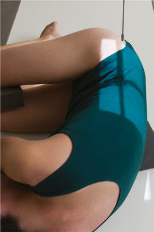
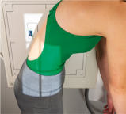
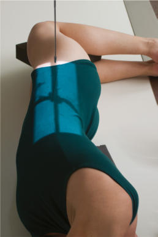
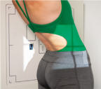

# Rx HYPEREXTENSION AND HYPERFLEXION LATERAL POSITIONS (- SPINAL FUSION SERIES)

  📷 Radiografie Convențională (Rx)
  <strong>Actualizat:</strong> 2026-09-15
  <strong>Autor:</strong> Departamentul de Radiologie / Referință Bontrager

---

-   __1. Rezumat Clinic & Indicații__

    ---

    === "Indicații Clinice"

        - Assessment of mobility at a spinal fusion site Two images are obtained with the patient in the Incidență de Profil (Lateral) (one in hyperflexion and one in hyperextension). Right- and leftbending positions also are generally part of a spinal fusion series and are the same as for the scolioză / vicii de postură ale coloanei series on pp. *** to ***.

    === "Ghid Național IRIS"

        !!! info "Referință Primară: Ghidul Național IRIS (Ordinul MS 1342/2012)"
            - **Capitol Ghid IRIS:** *Ghidul Național IRIS*
            - **Grad de Recomandare:** **De verificat pe indicație; fără grad atribuit automat**
            - **Nivel de Iradiere Estimată:** `De verificat pentru examinarea și populația selectate`

            [:octicons-search-16: Deschide Ghidul IRIS](../../iris.md){ .md-button .md-button--primary } [:material-open-in-new: Aplicația Oficială PWA](https://radiologie-pediatrica.ro/iris/){ .md-button target="_blank" rel="noopener" }
-   __2. Poziționare & Centrare Fascicul__

    ---

    - **Poziție Pacient:** Pacient: Incidență de Profil (Lateral) Place patient in Ortostatism (preferred) or lateral Decubit position. (see NOTES). Place lower edge of IR 1 to 2 inches (2.5 to 5 cm) below creasta iliacă (corespunzător L4-L5).; Regiune anatomică: Align midcoronal plane to CR and midline of table and/or IR. Hyperflexion Using Bazin (Pelvis) as fulcrum, ask patient to assume hyperflexed position while remaining within collimation field size (Fig. 9.60). Hyperextension Using Bazin (Pelvis) as fulcrum, ask patient to move torso posteriorly as far as possible to hyperextend long axis of body (Fig. 9.61). Ensure that Absența rotației anatomice: clavicule echidistante față de linia apofizelor spinoase of thorax or Bazin (Pelvis) exists.
    - **Punct de Centrare Fascicul:** perpendicular to IR. Direct CR to site of fusion if known or to center of IR.
    - **Distanță Focar-Film (DFF / SID):** 100 cm
    - **Comandă Respiratorie:** Suspend respiration on expiration.

-   __3. Parametri Tehnici Expunere__

    ---

    | Parametru Tehnic | Valoare Configurare Generator / Tub |
    |:-----------------|:-------------------------------------|
    | **Tensiune Tub (kV)** | 80-95 kV |
    | **Sarcină / Produs Curent-Timp (mAs)** | DE CONFIGURAT PE APARAT |
    | **Distanță Focar-Film (DFF / SID)** | 100 cm |
    | **Grilă Antidifuzoare (Bucky)** | Cu grilă antidifuzoare Bucky |
    | **Dimensiune Focar** | Focar Mare (1.0 - 1.2 mm) |
    | **Camere de Ionizare AEC** | Camerele laterale (sau camera centrală funcție de regiune) |
    | **Colimare Fascicul** | Field Size Collimate on four sides to anatomy of interest. |
    | **Filtrare Tub** | Totală ≥ 2.5 mm Al echivalent |

-   __4. Criterii de Calitate & Reușită Imagine__

    ---

    - Thoracic and lumbar vertebra including 1 to 2 inches (2.5 to 5 cm) of the creasta iliacă (corespunzător L4-L5)s (Figs. 9.62 and 9.63). Position
    - Spinal column aligned parallel to the IR, as indicated by open intervertebral foramina and open intervertebral joint spaces.
    - Absența rotației anatomice: clavicule echidistante față de linia apofizelor spinoase indicated by superimposed greater sciatic notches and posterior vertebral bodies.
    - Collimation field size to area of interest. Exposure
    - Optimal image receptor exposure and contrast. Clear demonstration of bony margins and trabecular markings of thoracic and lumbar vertebrae.
    - no motion. Fig. 9.60 Lateral—hyperflexion. Fig. 9.61 Lateral—hyperextension.

-   __5. Protecție Radiologică (ALARA)__

    ---

    - Ecranare gonadică și a organelor radiosensibile conform procedurilor locale de radioprotecție ALARA.
    - Colimare strictă la aria de interes pentru limitarea radiației difuze.
    - Verificarea posibilității unei sarcini la pacientele de vârstă fertilă înainte de expunere.

!!! note "Observații Clinice & Tehnice"
    S: Projection is frequently performed with patient standing Ortostatism or sitting on a stool, first leaning forward as far as possible, gripping the stool legs, and then leaning backward as far as possible, gripping the back of the stool to maintain this position. The Bazin (Pelvis) must remain as stationary as possible during positioning. The Bazin (Pelvis) acts as a fulcrum (pivot point) during changes in position. Flexion SPINAL FUSION SERIES ROUTINE PA—R and L bending Lateralhyperextension and hyperflexion

### 🖼️ Imagini

<figure class="protocol-image-card" markdown>

<figcaption><strong>Fig. 9.60 Lateral—hyperflexion.</strong> — Poziționare pacient conform Ghidului Bontrager (Fig. 9.60 Lateral—hyperflexion.)</figcaption>

</figure>

<figure class="protocol-image-card" markdown>

<figcaption><strong>Fig. 9.61 Lateral—hyperextension.</strong> — Aspect radiografic de referință conform Ghidului Bontrager (Fig. 9.61 Lateral—hyperextension.)</figcaption>

</figure>

<figure class="protocol-image-card" markdown>

<figcaption><strong>Figura 3</strong> — Aspect radiografic de referință conform Ghidului Bontrager (Figura 3)</figcaption>

</figure>

<figure class="protocol-image-card" markdown>

<figcaption><strong>Figura 4</strong> — Aspect radiografic de referință conform Ghidului Bontrager (Figura 4)</figcaption>

</figure>

=== "Ghid Rapid de Execuție"

    1. **Identificarea și verificarea pacientului:** verificare identitate, zonă de examinat, consimțământ conform procedurii și evaluarea posibilității unei sarcini, când este relevantă.
    2. **Pregătire:** îndepărtarea oricăror obiecte radiopace (bijuterii, agrafe, fermoare, proteze, pansamente dense).
    3. **Poziționare precisă:** alinierea receptorului de imagine și a tubului la distanța prescrisă (100 cm).
    4. **Colimare strictă:** adaptarea fasciculului strict la regiunea de diagnostic pentru scăderea iradierii și reducerea radiației difuze.
    5. **Radioprotecție:** verificarea [politicii RX](../radioprotectie.md), cu măsuri distincte pentru pacient, personal și însoțitor.

## Surse de documentare

- [Bontrager's Textbook of Radiographic Positioning (Ed. 9/10), Pagina 370](https://www.elsevier.com/books/textbook-of-radiographic-positioning-and-related-anatomy/lampignano/978-0-323-65367-1)
