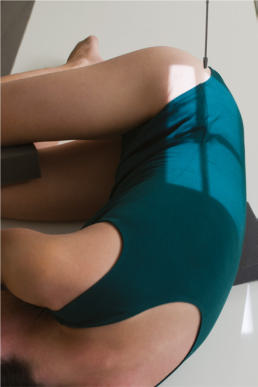
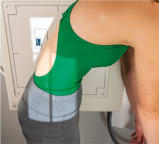
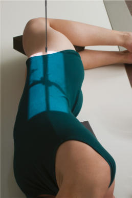
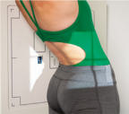

# Rx Hiperextensie și hiperflexie — poziționare în incidență de profil (seria pentru fuziune spinală)

  📷 Radiografie Convențională (Rx)
  <strong>Actualizat:</strong> 2026-09-15
  <strong>Autor:</strong> Departamentul de Radiologie / Referință Bontrager

---

-   __1. Rezumat Clinic & Indicații__

    ---

    === "Indicații Clinice"

        - Evaluarea mobilității la locul fuziunii spinale. Se obțin două imagini cu pacientul în incidență de profil (una în hiperflexie și una în hiperextensie). Pozițiile de înclinare spre dreapta și spre stânga fac, de asemenea, în general, parte din seria pentru fuziune spinală și sunt identice cu cele pentru seria de scolioză/vicii de postură ale coloanei, conform pp. *** până la ***.

    === "Ghid Național IRIS"

        !!! info "Referință Primară: Ghidul Național IRIS (Ordinul MS 1342/2012)"
            - **Capitol Ghid IRIS:** *Ghidul Național IRIS*
            - **Grad de Recomandare:** **De verificat pe indicație; fără grad atribuit automat**
            - **Nivel de Iradiere Estimată:** `De verificat pentru examinarea și populația selectate`

            [:octicons-search-16: Deschide Ghidul IRIS](../../iris.md){ .md-button .md-button--primary } [:material-open-in-new: Aplicația Oficială PWA](https://radiologie-pediatrica.ro/iris/){ .md-button target="_blank" rel="noopener" }
-   __2. Poziționare & Centrare Fascicul__

    ---

    - **Poziție Pacient:** Pacient: incidență de profil. Plasați pacientul în ortostatism (preferabil) sau în decubit lateral (vezi NOTE). Plasați marginea inferioară a receptorului de imagine la 1 la 2 inches (2.5 la 5 cm) sub creasta iliacă (corespunzător L4-L5). Regiune anatomică: aliniați planul mediocoronal cu raza centrală și cu linia mediană a mesei și/sau a receptorului de imagine. Hiperflexie: folosind bazinul ca punct de sprijin, cereți pacientului să adopte o poziție hiperflectată, rămânând în limitele câmpului de colimare (Fig. 9.60). Hiperextensie: folosind bazinul ca punct de sprijin, cereți pacientului să deplaseze trunchiul posterior cât mai mult posibil pentru a hiperextinde axa longitudinală a corpului (Fig. 9.61). Se verifică absența rotației: claviculele sunt riguros echidistante față de linia proceselor spinoase toracale sau bazinul este vizibil.
    - **Punct de Centrare Fascicul:** perpendicular pe receptorul de imagine. Raza centrală se orientează spre locul fuziunii, dacă este cunoscut, sau spre centrul receptorului de imagine.
    - **Distanță Focar-Film (DFF / SID):** 100 cm
    - **Comandă Respiratorie:** Apnee pe durata expunerii, la sfârșitul expirului.

-   __3. Parametri Tehnici Expunere__

    ---

    | Parametru Tehnic | Valoare Configurare Generator / Tub |
    |:-----------------|:-------------------------------------|
    | **Tensiune Tub (kV)** | 80-95 kV |
    | **Sarcină / Produs Curent-Timp (mAs)** | DE CONFIGURAT PE APARAT |
    | **Distanță Focar-Film (DFF / SID)** | 100 cm |
    | **Grilă Antidifuzoare (Bucky)** | Cu grilă antidifuzoare Bucky |
    | **Dimensiune Focar** | Focar Mare (1.0 - 1.2 mm) |
    | **Camere de Ionizare AEC** | Camerele laterale (sau camera centrală, în funcție de regiune) |
    | **Colimare Fascicul** | Dimensiunea câmpului Colimați pe cele patru laturi la regiunea anatomică de interes. |
    | **Filtrare Tub** | Totală ≥ 2.5 mm Al echivalent |

-   __4. Criterii de Calitate & Reușită Imagine__

    ---

    - Vertebrele toracale și lombare, incluzând 1 la 2 inches (2.5 la 5 cm) din creasta iliacă (corespunzător L4-L5) (Figs. 9.62 și 9.63). Poziție
    - Coloana vertebrală este aliniată paralel cu receptorul de imagine (RI), după cum indică deschiderea găurilor intervertebrale și a spațiilor articulare intervertebrale.
    - Absența rotației anatomice: clavicule echidistante față de linia apofizelor spinoase, indicată prin suprapunerea incizurilor sciatice mari și a corpilor vertebrali posteriori.
    - Colimarea câmpului la dimensiunea ariei de interes diagnostic. Expunere
    - Expunere și contrast optime la receptorul de imagine. Demonstrarea clară a marginilor osoase și a desenului trabecular al coloanei toracale și lombare.
    - fără mișcare. Fig. 9.60 profil—hiperflexie. Fig. 9.61 profil—hiperextensie.

-   __5. Protecție Radiologică (ALARA)__

    ---

    - Ecranare gonadică și a organelor radiosensibile conform procedurilor locale de radioprotecție ALARA.
    - Colimare strictă la aria de interes pentru limitarea radiației difuze.
    - Verificarea posibilității unei sarcini la pacientele de vârstă fertilă înainte de expunere.

!!! note "Observații Clinice & Tehnice"
    Incidența este efectuată frecvent cu pacientul în ortostatism sau așezat pe un scaun, aplecându-se înainte cât mai mult posibil, ținându-se de părțile laterale ale scaunului, apoi aplecându-se înapoi cât mai mult posibil, ținându-se de spătarul scaunului pentru a menține această poziție. Bazinul trebuie să rămână cât mai staționar posibil în timpul poziționării. Bazinul acționează ca punct de sprijin în timpul schimbărilor de poziție. Flexie; SERIA PENTRU FUZIUNE SPINALĂ DE RUTINĂ PA—înclinare spre dreapta și spre stânga; profil în hiperextensie și hiperflexie

### 🖼️ Imagini

<figure class="protocol-image-card" markdown>

<figcaption><strong>Fig. 9.60 profil—hiperflexie.</strong> — Poziționare pacient conform Ghidului Bontrager (Fig. 9.60 profil—hiperflexie.)</figcaption>

</figure>

<figure class="protocol-image-card" markdown>

<figcaption><strong>Fig. 9.61 profil—hiperextensie.</strong> — Aspect radiografic de referință conform Ghidului Bontrager (Fig. 9.61 profil—hiperextensie.)</figcaption>

</figure>

<figure class="protocol-image-card" markdown>

<figcaption><strong>Figura 3</strong> — Aspect radiografic de referință conform Ghidului Bontrager (Figura 3)</figcaption>

</figure>

<figure class="protocol-image-card" markdown>

<figcaption><strong>Figura 4</strong> — Aspect radiografic de referință conform Ghidului Bontrager (Figura 4)</figcaption>

</figure>

=== "Ghid Rapid de Execuție"

    1. **Identificarea și verificarea pacientului:** verificare identitate, zonă de examinat, consimțământ conform procedurii și evaluarea posibilității unei sarcini, când este relevantă.
    2. **Pregătire:** îndepărtarea oricăror obiecte radiopace (bijuterii, agrafe, fermoare, proteze, pansamente dense).
    3. **Poziționare precisă:** alinierea receptorului de imagine și a tubului la distanța prescrisă (100 cm).
    4. **Colimare strictă:** adaptarea fasciculului strict la regiunea de diagnostic pentru scăderea iradierii și reducerea radiației difuze.
    5. **Radioprotecție:** verificarea [politicii RX](../radioprotectie.md), cu măsuri distincte pentru pacient, personal și însoțitor.

## Surse de documentare

- [Bontrager's Textbook of Radiographic Positioning (Ed. 9/10), Pagina 370](https://www.elsevier.com/books/textbook-of-radiographic-positioning-and-related-anatomy/lampignano/978-0-323-65367-1)
