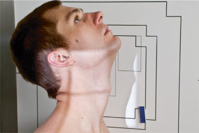
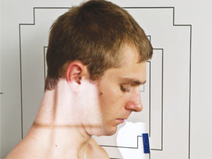
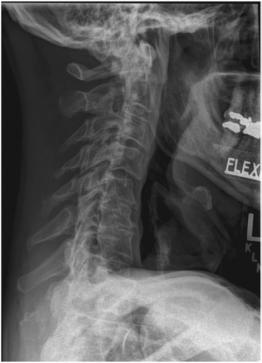
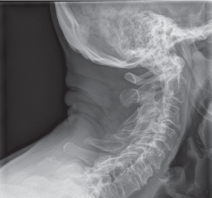
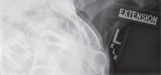

# Rx HYPERFLEXION AND HYPEREXTENSION LATERAL POSITIONS (- Coloană Cervicală)

  📷 Radiografie Convențională (Rx)
  <strong>Actualizat:</strong> 2026-09-15
  <strong>Autor:</strong> Departamentul de Radiologie / Referință Bontrager

---

-   __1. Rezumat Clinic & Indicații__

    ---

    === "Indicații Clinice"

        - Functional study to demonstrate anteroposterior vertebral mobility
        - Frequently performed to rule out “whiplash” type of injury or to follow up after spinal fusion surgery

    === "Ghid Național IRIS"

        !!! info "Referință Primară: Ghidul Național IRIS (Ordinul MS 1342/2012)"
            - **Capitol Ghid IRIS:** *Ghidul Național IRIS*
            - **Grad de Recomandare:** **De verificat pe indicație; fără grad atribuit automat**
            - **Nivel de Iradiere Estimată:** `De verificat pentru examinarea și populația selectate`

            [:octicons-search-16: Deschide Ghidul IRIS](../../iris.md){ .md-button .md-button--primary } [:material-open-in-new: Aplicația Oficială PWA](https://radiologie-pediatrica.ro/iris/){ .md-button target="_blank" rel="noopener" }
-   __2. Poziționare & Centrare Fascicul__

    ---

    - **Poziție Pacient:** Pacient: Ortostatism Incidență de Profil (Lateral) Place patient in Ortostatism Incidență de Profil (Lateral), either sitting or standing, with arms at sides.; Regiune anatomică: Align midcoronal plane to CR and midline of table and/or IR. Ensure a true Incidență de Profil (Lateral), with Absența rotației anatomice: clavicule echidistante față de linia apofizelor spinoase of Bazin (Pelvis), shoulders, or head. Relax and depress shoulders as far as possible (weights on each arm may be used). For hyperflexion: Depress chin until it touches the Torace or as much as patient can tolerate (do not allow patient to move forward to ensure that entire cervical is included on IR) (Fig. 8.65). For hyperextension: Raise chin and tilt head back as much as possible (do not allow patient to move backward to ensure that entire Coloană Cervicală is included on IR) (Fig. 8.66).
    - **Punct de Centrare Fascicul:** perpendicular to IR. Direct CR horizontally to C4 (level of upper margin of thyroid cartilage). Center IR to CR.
    - **Distanță Focar-Film (DFF / SID):** 180 cm
    - **Comandă Respiratorie:** Suspend respiration on full expiration.

-   __3. Parametri Tehnici Expunere__

    ---

    | Parametru Tehnic | Valoare Configurare Generator / Tub |
    |:-----------------|:-------------------------------------|
    | **Tensiune Tub (kV)** | 70-85 kV |
    | **Sarcină / Produs Curent-Timp (mAs)** | DE CONFIGURAT PE APARAT |
    | **Distanță Focar-Film (DFF / SID)** | 180 cm |
    | **Grilă Antidifuzoare (Bucky)** | Fără grilă (expunere directă) |
    | **Dimensiune Focar** | Focar Mare (1.0 - 1.2 mm) |
    | **Camere de Ionizare AEC** | DE CONFIGURAT PE APARAT |
    | **Colimare Fascicul** | Collimate on four sides to anatomy of interest. |
    | **Filtrare Tub** | Totală ≥ 2.5 mm Al echivalent |

-   __4. Criterii de Calitate & Reușită Imagine__

    ---

    - C1 through C7 should be included on IR, although C7 may not be completely visualized on some patients (Figs. 8.67 and 8.68). Position
    - Absența rotației anatomice: clavicule echidistante față de linia apofizelor spinoase of head is indicated by superimposition of mandibular rami.
    - For hyperflexion: Spinous processes should be well separated.
    - For hyperextension: Spinous processes should be in close proximity. Exposure
    - Optimal image receptor exposure and contrast. Clear demonstration of soft tissue margins, including margins of the trachea, and of bony margins and trabecular markings of cervical vertebrae.
    - no motion. Fig. 8.67 Hyperflexion. Fig. 8.68 Hyperextension.

-   __5. Protecție Radiologică (ALARA)__

    ---

    - Ecranare gonadică și a organelor radiosensibile conform procedurilor locale de radioprotecție ALARA.
    - Colimare strictă la aria de interes pentru limitarea radiației difuze.
    - Verificarea posibilității unei sarcini la pacientele de vârstă fertilă înainte de expunere.

!!! note "Observații Clinice & Tehnice"
    These are uncomfortable for patient; do not keep patient in these positions longer than necessary. Coloană Cervicală SPECIAL Cervicothoracic lateral (Swimmer’s) Lateral—hyperflexion and hyperextension Fig. 8.65 Hyperflexion. Fig. 8.66 Hyperextension.

### 🖼️ Imagini

<figure class="protocol-image-card" markdown>

<figcaption><strong>Fig. 8.65 Hyperflexion.</strong> — Poziționare pacient conform Ghidului Bontrager (Fig. 8.65 Hyperflexion.)</figcaption>

</figure>

<figure class="protocol-image-card" markdown>

<figcaption><strong>Fig. 8.66 Hyperextension.</strong> — Aspect radiografic de referință conform Ghidului Bontrager (Fig. 8.66 Hyperextension.)</figcaption>

</figure>

<figure class="protocol-image-card" markdown>

<figcaption><strong>Fig. 8.67 Hyperflexion.</strong> — Aspect radiografic de referință conform Ghidului Bontrager (Fig. 8.67 Hyperflexion.)</figcaption>

</figure>

<figure class="protocol-image-card" markdown>

<figcaption><strong>Fig. 8.68 Hyperextension.</strong> — Aspect radiografic de referință conform Ghidului Bontrager (Fig. 8.68 Hyperextension.)</figcaption>

</figure>

<figure class="protocol-image-card" markdown>

<figcaption><strong>Figura 5</strong> — Aspect radiografic de referință conform Ghidului Bontrager (Figura 5)</figcaption>

</figure>

=== "Ghid Rapid de Execuție"

    1. **Identificarea și verificarea pacientului:** verificare identitate, zonă de examinat, consimțământ conform procedurii și evaluarea posibilității unei sarcini, când este relevantă.
    2. **Pregătire:** îndepărtarea oricăror obiecte radiopace (bijuterii, agrafe, fermoare, proteze, pansamente dense).
    3. **Poziționare precisă:** alinierea receptorului de imagine și a tubului la distanța prescrisă (180 cm).
    4. **Colimare strictă:** adaptarea fasciculului strict la regiunea de diagnostic pentru scăderea iradierii și reducerea radiației difuze.
    5. **Radioprotecție:** verificarea [politicii RX](../radioprotectie.md), cu măsuri distincte pentru pacient, personal și însoțitor.

## Surse de documentare

- [Bontrager's Textbook of Radiographic Positioning (Ed. 9/10), Pagina 338](https://www.elsevier.com/books/textbook-of-radiographic-positioning-and-related-anatomy/lampignano/978-0-323-65367-1)
