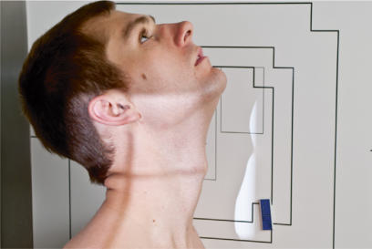
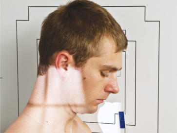
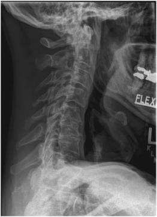
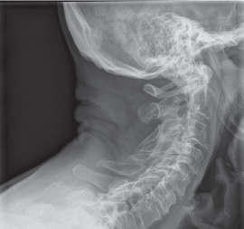
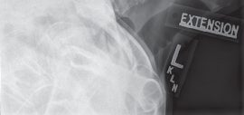

# Rx HIPERFLEXIE ȘI HIPEREXTENSIE, PROFIL Poziționare (- Coloană Cervicală)

  📷 Radiografie Convențională (Rx)
  <strong>Actualizat:</strong> 2026-09-15
  <strong>Autor:</strong> Departamentul de Radiologie / Referință Bontrager

---

-   __1. Rezumat Clinic & Indicații__

    ---

    === "Indicații Clinice"

        - Studiu funcțional pentru evidențierea mobilității vertebrale anteroposterioare
        - Efectuată frecvent pentru excluderea unui traumatism de tip „whiplash” sau pentru urmărirea după intervenția chirurgicală de fuziune spinală

    === "Ghid Național IRIS"

        !!! info "Referință Primară: Ghidul Național IRIS (Ordinul MS 1342/2012)"
            - **Capitol Ghid IRIS:** *Coloană vertebrală & Traumatisme*
            - **Grad de Recomandare:** **Grad A**
            - **Nivel de Iradiere Estimată:** `Clasa 1 (Minimă < 0.2 mSv)`

            [:octicons-search-16: Deschide Ghidul IRIS](../../iris.md){ .md-button .md-button--primary } [:material-open-in-new: Aplicația Oficială PWA](https://radiologie-pediatrica.ro/iris/){ .md-button target="_blank" rel="noopener" }

-   __2. Poziționare & Centrare Fascicul__

    ---

    - **Poziție Pacient:** Pacient: Ortostatism, incidență de profil (lateral), fie așezat, fie în ortostatism, cu brațele pe lângă corp.; Regiune anatomică: Aliniați planul mediocoronal cu raza centrală și linia mediană a mesei și/sau receptorul de imagine. Asigurați o incidență de profil adevărată, cu absența rotației anatomice: clavicule echidistante față de linia apofizelor spinoase, bazin, umeri sau cap. Relaxați și coborâți umerii cât mai mult posibil (se pot folosi greutăți pe fiecare braț). Pentru hiperflexie: coborâți bărbia până când atinge toracele sau cât poate tolera pacientul (nu permiteți pacientului să se deplaseze înainte, pentru a vă asigura că întreaga coloană cervicală este inclusă pe receptorul de imagine) (Fig. 8.65). Pentru hiperextensie: ridicați bărbia și înclinați capul posterior cât mai mult posibil (nu permiteți pacientului să se deplaseze posterior, pentru a vă asigura că întreaga coloană cervicală este inclusă pe receptorul de imagine) (Fig. 8.66).
    - **Punct de Centrare Fascicul:** perpendicular pe receptorul de imagine. Orientați raza centrală orizontal spre C4 (la nivelul marginii superioare a cartilajului tiroid (mărul lui Adam)). Centrați receptorul de imagine pe raza centrală.
    - **Distanță Focar-Film (DFF / SID):** 180 cm
    - **Comandă Respiratorie:** Apnee pe durata expunerii, în expir complet.

-   __3. Parametri Tehnici Expunere__

    ---

    | Parametru Tehnic | Valoare Configurare Generator / Tub |
    |:-----------------|:-------------------------------------|
    | **Tensiune Tub (kV)** | 70-85 kV |
    | **Sarcină / Produs Curent-Timp (mAs)** | DE CONFIGURAT PE APARAT |
    | **Distanță Focar-Film (DFF / SID)** | 180 cm |
    | **Grilă Antidifuzoare (Bucky)** | Fără grilă (expunere directă) |
    | **Dimensiune Focar** | Focar Mare (1.0 - 1.2 mm) |
    | **Camere de Ionizare AEC** | DE CONFIGURAT PE APARAT |
    | **Colimare Fascicul** | Colimați pe cele patru laturi la anatomia de interes. |
    | **Filtrare Tub** | Totală ≥ 2.5 mm Al echivalent |

-   __4. Criterii de Calitate & Reușită Imagine__

    ---

    - C1 până la C7 trebuie să fie incluse pe receptorul de imagine, deși C7 poate să nu fie vizualizată complet la unii pacienți (Fig. 8.67 și 8.68). Poziție
    - Absența rotației anatomice: claviculele echidistante față de linia apofizelor spinoase ale capului sunt indicate prin suprapunerea ramurilor mandibulare.
    - Pentru hiperflexie: apofizele spinoase trebuie să fie bine distanțate.
    - Pentru hiperextensie: apofizele spinoase trebuie să fie foarte apropiate. Expunere
    - Expunere și contrast optime ale receptorului de imagine. Evidențiere clară a marginilor părților moi, inclusiv marginile traheei, precum și a marginilor osoase și a desenului trabecular al coloanei cervicale.
    - Fără mișcare. Fig. 8.67 Hiperflexie. Fig. 8.68 Hiperextensie.

-   __5. Protecție Radiologică (ALARA)__

    ---

    - Ecranare gonadică și a organelor radiosensibile conform procedurilor locale de radioprotecție ALARA.
    - Colimare strictă la aria de interes pentru limitarea radiației difuze.
    - Verificarea posibilității unei sarcini la pacientele de vârstă fertilă înainte de expunere.

!!! note "Observații Clinice & Tehnice"
    Acestea sunt inconfortabile pentru pacient; nu mențineți pacientul în aceste poziții mai mult decât este necesar. Coloană cervicală SPECIALĂ. Incidență de profil cervicotoracică (înotătorului), profil—hiperflexie și hiperextensie. Fig. 8.65 Hiperflexie. Fig. 8.66 Hiperextensie.

### 🖼️ Imagini

<figure class="protocol-image-card" markdown>

<figcaption><strong>Fig. 8.65 Hiperflexie.</strong> — Poziționarea pacientului conform Ghidului Bontrager (Fig. 8.65 Hiperflexie.)</figcaption>

</figure>

<figure class="protocol-image-card" markdown>

<figcaption><strong>Fig. 8.66 Hiperextensie.</strong> — Aspect radiografic de referință conform Ghidului Bontrager (Fig. 8.66 Hiperextensie.)</figcaption>

</figure>

<figure class="protocol-image-card" markdown>

<figcaption><strong>Fig. 8.67 Hiperflexie.</strong> — Aspect radiografic de referință conform Ghidului Bontrager (Fig. 8.67 Hiperflexie.)</figcaption>

</figure>

<figure class="protocol-image-card" markdown>

<figcaption><strong>Fig. 8.68 Hiperextensie.</strong> — Aspect radiografic de referință conform Ghidului Bontrager (Fig. 8.68 Hiperextensie.)</figcaption>

</figure>

<figure class="protocol-image-card" markdown>

<figcaption><strong>Figura 5</strong> — Aspect radiografic de referință conform Ghidului Bontrager (Figura 5)</figcaption>

</figure>

=== "Ghid Rapid de Execuție"

    1. **Identificarea și verificarea pacientului:** verificare identitate, zonă de examinat, consimțământ conform procedurii și evaluarea posibilității unei sarcini, când este relevantă.
    2. **Pregătire:** îndepărtarea oricăror obiecte radiopace (bijuterii, agrafe, fermoare, proteze, pansamente dense).
    3. **Poziționare precisă:** alinierea receptorului de imagine și a tubului la distanța prescrisă (180 cm).
    4. **Colimare strictă:** adaptarea fasciculului strict la regiunea de diagnostic pentru scăderea iradierii și reducerea radiației difuze.
    5. **Radioprotecție:** verificarea [politicii RX](../radioprotectie.md), cu măsuri distincte pentru pacient, personal și însoțitor.

## Surse de documentare

- [Bontrager's Textbook of Radiographic Positioning (Ed. 9/10), Pagina 338](https://www.elsevier.com/books/textbook-of-radiographic-positioning-and-related-anatomy/lampignano/978-0-323-65367-1)
