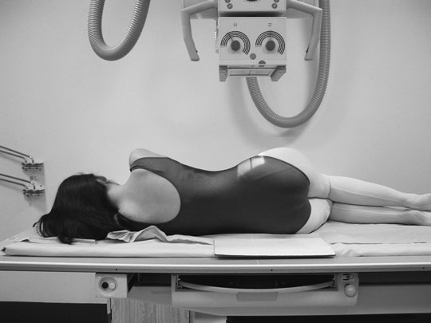
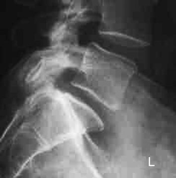
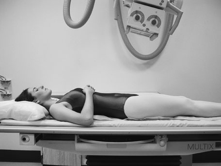
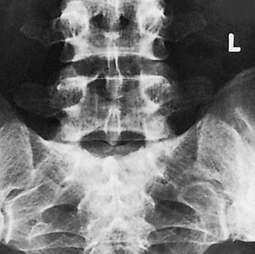
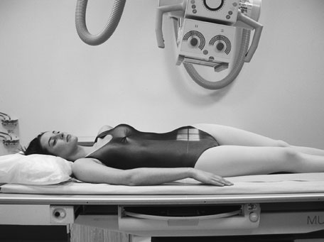
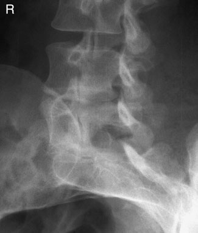

# Rx Joncțiune Lombo-Sacrată (L5-S1) Profil (Lateral)

  📷 Radiografie Convențională (Rx)
  <strong>Actualizat:</strong> 2026-09-16
  <strong>Autor:</strong> Departamentul de Radiologie / Referință Clark (Ed. 12)

---

-   __1. Rezumat Clinic & Indicații__

    ---

    === "Indicații Clinice"

        - 189 6 Lumbo-sacral junction Antero-posterior (AP) lumbo-sacral articulation este nu always evidențiat well pe Antero-posterior (AP) lumbar coloană vertebrală, due la Oblică direction de articulation resulting de la lumbar lordosis. This incidență poate fie requested la specifically evidențiază this articulation.

    === "Ghid Național IRIS"

        !!! info "Referință Primară: Ghidul Național IRIS (Ordinul MS 1342/2012)"
            - **Capitol Ghid IRIS:** *Ghidul Național IRIS*
            - **Grad de Recomandare:** **De verificat pe indicație; fără grad atribuit automat**
            - **Nivel de Iradiere Estimată:** `De verificat pentru examinarea și populația selectate`

            [:octicons-search-16: Deschide Ghidul IRIS](../../iris.md){ .md-button .md-button--primary } [:material-open-in-new: Aplicația Oficială PWA](https://radiologie-pediatrica.ro/iris/){ .md-button target="_blank" rel="noopener" }
-   __2. Poziționare & Centrare Fascicul__

    ---

    - **Poziție Pacient:** • pacientul este culcat pe either side pe masa radiologică, cu brațele raised și mâinile resting pe pillow. Genunchii și șoldurile sunt ușor flectate pentru stabilitate și confort.
• Fața dorsală trunchiului trebuie să fie perpendiculară (în unghi drept) pe casetă. Alinierea corectă se verifică prin palparea crestelor iliace sau spinelor iliace postero-superioare.
• plan coronal running through centre de coloană vertebrală trebuie să coincide cu, și fie perpendicular la, linia mediană Bucky.
• caseta este centred la nivelul fifth lumbar spinous process.
• Non-opaque pads poate fie plasat under waist și genunchi, ca necessary, la bring Coloană Vertebrală paralel cu casetă.

• pacientul este poziționat Decubit dorsal pe masa radiologică și este then rotit la drept și stâng sides în turn astfel încât plan mediosagital este la un unghi de approximately 45 grade la tabletop.
• șoldurile și genunchi sunt flectat și pacientul este sprijinit cu 45-grade foam pads plasat under trunk pe raised side.
• caseta este displaced cranially la level la coincide cu raza centrală centrală.
    - **Punct de Centrare Fascicul:** • se orientează raza centrală centrală la drept-angles la lumbo-sacral region și spre point 7.5 cm anterior la fifth lumbar spinous process. This este found la nivelul tubercle de crestele iliace sau midway între level de upper margine de crestele iliace și spină iliacă antero-superioară (SIAS).
• If pacientul has particularly large hips și coloană vertebrală este nu paralel cu tabletop, then five-grade caudal angulation poate fie required la clear spații articulare.

• se orientează raza centrală centrală 10–20 grade cranially de la vertical și spre linia mediană la nivelul anterior superior iliac spines.
• grade de angulation de raza centrală este normally greater pentru females than pentru males și will fie less pentru greater grade de flexion la șoldurile și genunchi.
    - **Distanță Focar-Film (DFF / SID):** 100 cm
    - **Comandă Respiratorie:** Apnee pe durata expunerii (apnee în inspir pentru torace; expir pentru Abdomen/bazin).

-   __3. Parametri Tehnici Expunere__

    ---

    | Parametru Tehnic | Valoare Configurare Generator / Tub |
    |:-----------------|:-------------------------------------|
    | **Tensiune Tub (kV)** | DE CONFIGURAT PE APARAT |
    | **Sarcină / Produs Curent-Timp (mAs)** | Conform AEC / grosime anatomică |
    | **Distanță Focar-Film (DFF / SID)** | 100 cm |
    | **Grilă Antidifuzoare (Bucky)** | Cu grilă antidifuzoare Bucky |
    | **Dimensiune Focar** | Focar Mic (0.6 mm) |
    | **Camere de Ionizare AEC** | Camerele laterale (sau camera centrală funcție de regiune) |
    | **Colimare Fascicul** | Colimare strictă la aria anatomică de interes diagnostic |
    | **Filtrare Tub** | Totală ≥ 2.5 mm Al echivalent (conform Clark: 3.0 mm Al eq.) |

-   __4. Criterii de Calitate & Reușită Imagine__

    ---

    - aria de interes diagnostic trebuie să include fifth lumbar vertebra și first sacral segment.
    - clear spații articulare trebuie să fie evidențiat.
    - posterior elements de L5 trebuie să appear în ‘Scottie dog’ configuration (see Oblică lumbar coloană vertebrală, p. 187).
    - Erori de evitat / remedii: common error este la centre too medially, thus excluding posterior elements de vertebre de la imagine.

-   __5. Protecție Radiologică (ALARA)__

    ---

    - This projection requires a relatively large exposure so should not be undertaken as a routine projection. The Profil (Lateral) lumbar spine should be evaluated and a further projection for the L5/S1 junction considered if this region is not demonstrated to a diagnostic standard. 188
    - Ecranare gonadică cu șorț plumbat dacă gonadele sunt în apropierea fasciculului util (regula ALARA).
    - Colimare precisă la dimensiunea anatomică strict necesară pentru reducerea dozei și a radiației difuze.
    - Verificarea posibilității unei sarcini la pacientele de vârstă fertilă înainte de expunere.

!!! note "Observații Clinice & Tehnice"
    Pregătirea pacientului prin îndepărtarea tuturor accesoriilor radio-opace.

### 🖼️ Imagini

<figure class="protocol-image-card" markdown>

<figcaption><strong>tion poate fie required la clear spații articulare.</strong> — Poziționare pacient și centrare fascicul conform Clark (Ed. 12)</figcaption>

</figure>

<figure class="protocol-image-card" markdown>

<figcaption><strong>• clear spații articulare trebuie să fie evidențiat.</strong> — Aspect radiografic / ghid de poziționare conform tratatului Clark (Ed. 12)</figcaption>

</figure>

<figure class="protocol-image-card" markdown>

<figcaption><strong>• grade de angulation de raza centrală este normally greater</strong> — Aspect radiografic / ghid de poziționare conform tratatului Clark (Ed. 12)</figcaption>

</figure>

<figure class="protocol-image-card" markdown>

<figcaption><strong>Figura 4: Aspect radiografic / Poziționare (Clark Ed. 12)</strong> — Aspect radiografic / ghid de poziționare conform tratatului Clark (Ed. 12)</figcaption>

</figure>

<figure class="protocol-image-card" markdown>

<figcaption><strong>Figura 5: Aspect radiografic / Poziționare (Clark Ed. 12)</strong> — Aspect radiografic / ghid de poziționare conform tratatului Clark (Ed. 12)</figcaption>

</figure>

<figure class="protocol-image-card" markdown>

<figcaption><strong>Figura 6: Aspect radiografic / Poziționare (Clark Ed. 12)</strong> — Aspect radiografic / ghid de poziționare conform tratatului Clark (Ed. 12)</figcaption>

</figure>

=== "Ghid Rapid de Execuție"

    1. **Identificarea și verificarea pacientului:** verificare identitate, zonă de examinat, consimțământ conform procedurii și evaluarea posibilității unei sarcini, când este relevantă.
    2. **Pregătire:** îndepărtarea oricăror obiecte radiopace (bijuterii, agrafe, fermoare, proteze, pansamente dense).
    3. **Poziționare precisă:** alinierea receptorului de imagine și a tubului la distanța prescrisă (100 cm).
    4. **Colimare strictă:** adaptarea fasciculului strict la regiunea de diagnostic pentru scăderea iradierii și reducerea radiației difuze.
    5. **Radioprotecție:** verificarea [politicii RX](../radioprotectie.md), cu măsuri distincte pentru pacient, personal și însoțitor.

## Surse de documentare

- [Clark's Positioning in Radiography (Ed. 12), Pagina 203](../../assets/protocols/sources/Clark___Positioning_in_Radiography__12th_edition.pdf#page=203)
