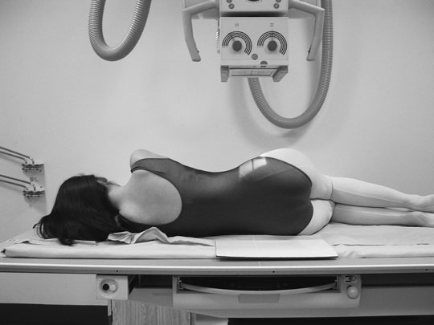
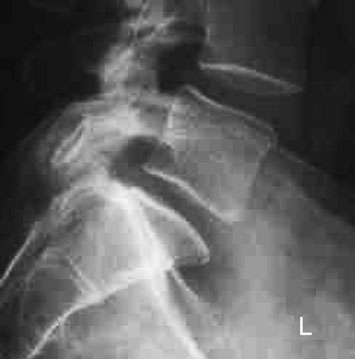
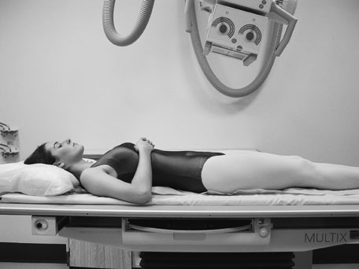
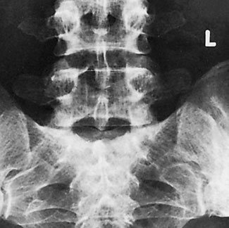
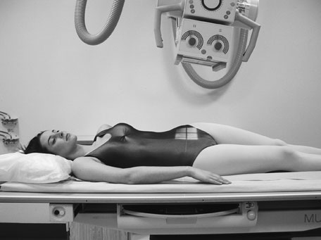
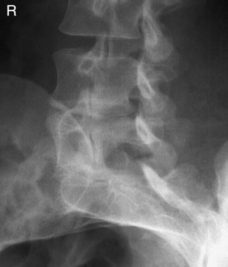

# Rx Joncțiune lombosacrată (L5–S1) — Incidență de profil (lateral)

  📷 Radiografie Convențională (Rx)
  <strong>Actualizat:</strong> 2026-09-16
  <strong>Autor:</strong> Departamentul de Radiologie / Referință Clark (Ed. 12)

---

-   __1. Rezumat Clinic & Indicații__

    ---

    === "Indicații Clinice"

        - 189 6 Joncțiunea lombosacrată Incidența antero-posterioară (AP) a articulației lombosacrate nu este întotdeauna bine evidențiată pe incidența antero-posterioară (AP) a coloanei lombare, din cauza direcției oblice a articulației, rezultată din lordoza lombară. Această incidență poate fi solicitată pentru a evidenția în mod specific această articulație.

    === "Ghid Național IRIS"

        !!! info "Referință Primară: Ghidul Național IRIS (Ordinul MS 1342/2012)"
            - **Capitol Ghid IRIS:** *Ghidul Național IRIS*
            - **Grad de Recomandare:** **De verificat pe indicație; fără grad atribuit automat**
            - **Nivel de Iradiere Estimată:** `De verificat pentru examinarea și populația selectate`

            [:octicons-search-16: Deschide Ghidul IRIS](../../iris.md){ .md-button .md-button--primary } [:material-open-in-new: Aplicația Oficială PWA](https://radiologie-pediatrica.ro/iris/){ .md-button target="_blank" rel="noopener" }
-   __2. Poziționare & Centrare Fascicul__

    ---

    - **Poziție Pacient:** • Pacientul este culcat pe oricare dintre părți pe masa radiologică, cu brațele ridicate și mâinile sprijinite pe pernă. Genunchii și șoldurile sunt ușor flectate pentru stabilitate și confort.
• Fața dorsală a trunchiului trebuie să fie perpendiculară (în unghi drept) pe casetă. Alinierea corectă se verifică prin palparea crestelor iliace sau a spinelor iliace postero-superioare.
• Planul coronal care trece prin centrul coloanei vertebrale trebuie să coincidă cu linia mediană a sistemului Bucky și să fie perpendicular pe aceasta.
• Caseta este centrată la nivelul procesului spinos al celei de-a cincea vertebre lombare.
• La nevoie, se pot plasa suporturi radiotransparente sub talie și genunchi, pentru a aduce coloana vertebrală paralel cu caseta.

• Pacientul este poziționat în decubit dorsal pe masa radiologică, apoi este rotit pe rând spre dreapta și spre stânga, astfel încât planul mediosagital să formeze un unghi de aproximativ 45 grade cu suprafața mesei.
• Șoldurile și genunchii sunt flectați, iar pacientul este sprijinit cu suporturi din spumă de 45 grade, plasate sub trunchi pe partea ridicată.
• Caseta este deplasată cranial până la nivelul corespunzător razei centrale.
    - **Punct de Centrare Fascicul:** • Se orientează raza centrală perpendicular pe regiunea lombo-sacrată, către un punct situat la 7.5 cm anterior de procesul spinos al celei de-a cincea vertebre lombare. Acesta se află la nivelul tuberculului crestei iliace sau la jumătatea distanței dintre nivelul marginii superioare a crestei iliace și spina iliacă antero-superioară (SIAS).
• Dacă pacientul are șolduri deosebit de late și coloana vertebrală nu este paralelă cu suprafața mesei, poate fi necesară o angulație caudală de cinci grade pentru a degaja spațiile articulare.

• Se orientează raza centrală cranial, la 10–20 grade față de verticală, către linia mediană, la nivelul spinelor iliace antero-superioare.
• Angulația razei centrale este în mod normal mai mare la femei decât la bărbați și scade pe măsură ce crește flexia șoldurilor și genunchilor.
    - **Distanță Focar-Film (DFF / SID):** 100 cm
    - **Comandă Respiratorie:** Apnee pe durata expunerii (apnee în inspir pentru torace; expir pentru Abdomen/bazin).

-   __3. Parametri Tehnici Expunere__

    ---

    | Parametru Tehnic | Valoare Configurare Generator / Tub |
    |:-----------------|:-------------------------------------|
    | **Tensiune Tub (kV)** | DE CONFIGURAT PE APARAT |
    | **Sarcină / Produs Curent-Timp (mAs)** | Conform AEC / grosimii anatomice |
    | **Distanță Focar-Film (DFF / SID)** | 100 cm |
    | **Grilă Antidifuzoare (Bucky)** | Cu grilă antidifuzoare Bucky |
    | **Dimensiune Focar** | Focar Mic (0.6 mm) |
    | **Camere de Ionizare AEC** | Camerele laterale (sau camera centrală, în funcție de regiune) |
    | **Colimare Fascicul** | Colimare strictă la aria anatomică de interes diagnostic |
    | **Filtrare Tub** | Totală ≥ 2.5 mm Al echivalent (conform Clark: 3.0 mm Al echivalent) |

-   __4. Criterii de Calitate & Reușită Imagine__

    ---

    - Aria de interes diagnostic trebuie să includă a cincea vertebră lombară și primul segment sacrat.
    - Spațiile articulare libere trebuie să fie evidențiate.
    - Elementele posterioare ale L5 trebuie să apară în configurația „câinelui Scottie” (vezi Coloană lombară oblică, p. 187).
    - Erori de evitat / remedii: eroarea frecventă este centrarea prea medială, excluzând astfel elementele posterioare ale vertebrelor din imagine.

-   __5. Protecție Radiologică (ALARA)__

    ---

    - Această incidență necesită o expunere relativ mare, astfel încât nu trebuie efectuată ca incidență de rutină. Incidența de profil a coloanei lombare trebuie evaluată, iar efectuarea unei incidențe suplimentare pentru joncțiunea L5/S1 trebuie luată în considerare dacă această regiune nu este evidențiată la un standard diagnostic. 188
    - Ecranare gonadică cu șorț plumbat dacă gonadele sunt în apropierea fasciculului util (regula ALARA).
    - Colimare precisă la dimensiunea anatomică strict necesară pentru reducerea dozei și a radiației difuze.
    - Verificarea posibilității unei sarcini la pacientele de vârstă fertilă înainte de expunere.

!!! note "Observații Clinice & Tehnice"
    Pregătirea pacientului prin îndepărtarea tuturor accesoriilor radio-opace.

### 🖼️ Imagini

<figure class="protocol-image-card" markdown>

<figcaption><strong>țiunea poate fi necesară pentru a degaja spațiile articulare.</strong> — Poziționarea pacientului și centrarea fasciculului conform Clark (Ed. 12)</figcaption>

</figure>

<figure class="protocol-image-card" markdown>

<figcaption><strong>• spațiile articulare libere trebuie să fie evidențiate.</strong> — Aspect radiografic / ghid de poziționare conform tratatului Clark (Ed. 12)</figcaption>

</figure>

<figure class="protocol-image-card" markdown>

<figcaption><strong>• gradul de angulație a razei centrale este în mod normal mai mare</strong> — Aspect radiografic / ghid de poziționare conform tratatului Clark (Ed. 12)</figcaption>

</figure>

<figure class="protocol-image-card" markdown>

<figcaption><strong>Figura 4: Aspect radiografic / Poziționare (Clark Ed. 12)</strong> — Aspect radiografic / ghid de poziționare conform tratatului Clark (Ed. 12)</figcaption>

</figure>

<figure class="protocol-image-card" markdown>

<figcaption><strong>Figura 5: Aspect radiografic / Poziționare (Clark Ed. 12)</strong> — Aspect radiografic / ghid de poziționare conform tratatului Clark (Ed. 12)</figcaption>

</figure>

<figure class="protocol-image-card" markdown>

<figcaption><strong>Figura 6: Aspect radiografic / Poziționare (Clark Ed. 12)</strong> — Aspect radiografic / ghid de poziționare conform tratatului Clark (Ed. 12)</figcaption>

</figure>

=== "Ghid Rapid de Execuție"

    1. **Identificarea și verificarea pacientului:** verificare identitate, zonă de examinat, consimțământ conform procedurii și evaluarea posibilității unei sarcini, când este relevantă.
    2. **Pregătire:** îndepărtarea oricăror obiecte radiopace (bijuterii, agrafe, fermoare, proteze, pansamente dense).
    3. **Poziționare precisă:** alinierea receptorului de imagine și a tubului la distanța prescrisă (100 cm).
    4. **Colimare strictă:** adaptarea fasciculului strict la regiunea de diagnostic pentru scăderea iradierii și reducerea radiației difuze.
    5. **Radioprotecție:** verificarea [politicii RX](../radioprotectie.md), cu măsuri distincte pentru pacient, personal și însoțitor.

## Surse de documentare

- [Clark's Positioning in Radiography (Ed. 12), Pagina 203](https://books.google.com/books/about/Clark_s_Positioning_in_Radiography.html?id=Xxu6MwEACAAJ)
