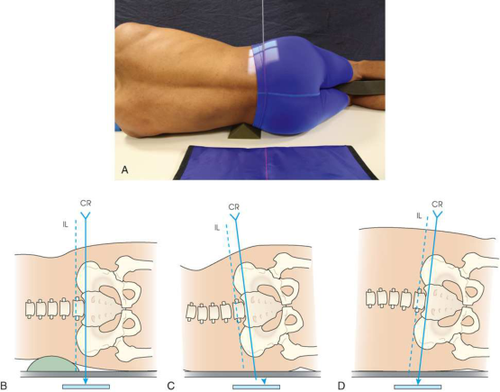
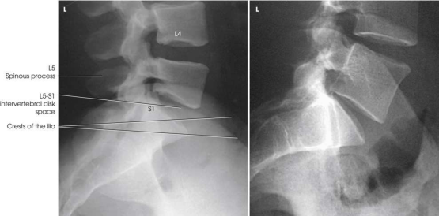

# Rx L5–S1 Lumbosacral Junction — Incidență de Profil (Lateral) — Profil (Drept sau Stâng) (Merrill)

  📷 Radiografie Convențională (Rx)
  <strong>Actualizat:</strong> 2026-09-16
  <strong>Autor:</strong> Referință Merrill

---

-   __1. Rezumat Clinic & Indicații__

    ---

    === "Indicații Clinice"

        - Conform reperelor anatomice standard din tratat

    === "Ghid Național IRIS"

        !!! info "Referință Primară: Ghidul Național IRIS (Ordinul MS 1342/2012)"
            - **Capitol Ghid IRIS:** *Ghidul Național IRIS*
            - **Grad de Recomandare:** **De verificat pe indicație; fără grad atribuit automat**
            - **Nivel de Iradiere Estimată:** `De verificat pentru examinarea și populația selectate`

            [:octicons-search-16: Deschide Ghidul IRIS](../../iris.md){ .md-button .md-button--primary } [:material-open-in-new: Aplicația Oficială PWA](https://radiologie-pediatrica.ro/iris/){ .md-button target="_blank" rel="noopener" }
-   __2. Poziționare & Centrare Fascicul__

    ---

    - **Poziție Pacient:** Examine L5–S1 lumbosacral region cu pacientul în lateral Decubit poziție.; cu pacientul în Decubit poziție, se ajustează pillow la place MSP de capul în same plane cu coloană vertebrală. Adjust MCP de corp (passing through șoldurile și umeri) aliniat perpendicular pe receptorul de imagine (RI). se flectează pacient’s Cot și se ajustează dependent braț în poziție în unghi drept față de corp (Fig. 9.93A). se flectează pacient’s hips și genunchi, superimpose genunchii, și place support între them. ca described pentru Incidență de Profil (lateral), place radiolucent support under lower thorax și adjust it astfel încât axa longitudinală de coloană vertebrală este horizon̍ al (see Fig. 9.93A). This este preferred method. se efectuează ecranarea gonadelor cu șorț plumbat.
    - **Punct de Centrare Fascicul:** ridicat spină iliacă antero-superioară (SIAS) (spină iliacă antero-superioară (SIAS)) este easily palpated și found în toate pacienți when culcat pe side. spină iliacă antero-superioară (SIAS) provides standardized și precis reference point de la which la se centrează L5–S1 junction. Center pe plan coronal 2 inches (5 cm) posterior la spină iliacă antero-superioară (SIAS) și 1.5 inches (3.8 cm) inferior la crestele iliace. Se centrează receptorul de imagine pe raza centrală. When coloană vertebrală cannot fie poziționat orizontal, raza centrală este înclinat 5 grade caudally pentru male pacienți și 8 grade caudally pentru female pacienți. Francis 20 identified alternative technique la show open L5–S1 intervertebral disk space when coloană vertebrală este nu orizontal: 1. cu pacientul în Incidență de Profil (lateral), locate ambele creste iliace. 2. Draw imaginary line între two points (interiliac plane). 3. Adjust raza centrală angulation la fie paralel cu interiliac line (see Fig. 9.93B–D).
    - **Distanță Focar-Film (DFF / SID):** Nespecificat în fragmentul extras; de verificat în sursă
    - **Comandă Respiratorie:** apnee (oprirea respirației).

-   __3. Parametri Tehnici Expunere__

    ---

    | Parametru Tehnic | Valoare Configurare Generator / Tub |
    |:-----------------|:-------------------------------------|
    | **Tensiune Tub (kV)** | DE CONFIGURAT PE APARAT |
    | **Sarcină / Produs Curent-Timp (mAs)** | DE CONFIGURAT PE APARAT |
    | **Distanță Focar-Film (DFF / SID)** | Nespecificat în fragmentul extras; de verificat în sursă |
    | **Grilă Antidifuzoare (Bucky)** | DE CONFIGURAT PE APARAT |
    | **Dimensiune Focar** | DE CONFIGURAT PE APARAT |
    | **Camere de Ionizare AEC** | DE CONFIGURAT PE APARAT |
    | **Colimare Fascicul** | Se ajustează câmpul de iradiere la formatul 15 × 20 cm pe colimator. This este high-scatter incidență. colimare strânsă este essential. Place marker de lateralitate (D/S) în collimated expunere field. |
    | **Filtrare Tub** | DE CONFIGURAT PE APARAT |

-   __4. Criterii de Calitate & Reușită Imagine__

    ---

    - Criterii radiologice de calitate imaginii:
    - Evidence de corect collimation și presence de marker de lateralitate (D/S) plasat clear de anatomy de interest
    - Lumbosacral articulație în center de imagine
    - Open lumbosacral intervertebral disk space
    - creste de ilia closely superimposing fiecare other when x-ray fascicul este nu înclinat
    - Bony detalii trabeculare osoase și surrounding soft tissues

-   __5. Protecție Radiologică (ALARA)__

    ---

    - Nespecificat în fragmentul extras; de verificat în sursă

!!! note "Observații Clinice & Tehnice"
    Conform reperelor anatomice standard din tratat

### 🖼️ Imagini

<figure class="protocol-image-card" markdown>

<figcaption><strong>Merrill — pagina PDF 732, imaginea 1</strong> — Imagine din fragmentul sursă; asocierea necesită revizie.</figcaption>

</figure>

<figure class="protocol-image-card" markdown>

<figcaption><strong>Merrill — pagina PDF 733, imaginea 2</strong> — Imagine din fragmentul sursă; asocierea necesită revizie.</figcaption>

</figure>

=== "Ghid Rapid de Execuție"

    1. **Identificarea și verificarea pacientului:** verificare identitate, zonă de examinat, consimțământ conform procedurii și evaluarea posibilității unei sarcini, când este relevantă.
    2. **Pregătire:** îndepărtarea oricăror obiecte radiopace (bijuterii, agrafe, fermoare, proteze, pansamente dense).
    3. **Poziționare precisă:** alinierea receptorului de imagine și a tubului la distanța prescrisă (Nespecificat în fragmentul extras; de verificat în sursă).
    4. **Colimare strictă:** adaptarea fasciculului strict la regiunea de diagnostic pentru scăderea iradierii și reducerea radiației difuze.
    5. **Radioprotecție:** verificarea [politicii RX](../radioprotectie.md), cu măsuri distincte pentru pacient, personal și însoțitor.

## Surse de documentare

- [Merrill’s Atlas, 9. Vertebral Column, pagini PDF 731–733](../../assets/protocols/sources/a56d45c16829_Merrills_Atlas_of_Radiographic_Positioning__Procedures_3Vol_Set.pdf#page=731)

## Fragmente sursă traduse (referință tehnică)

### anatomy

lumbosacral junction, lower one sau two coloană lombară, și upper sacrum (Fig. 9.94).

### collimation

• Se ajustează câmpul de iradiere la formatul 15 × 20 cm pe colimator. This este high-scatter incidență. colimare strânsă este essential. Place
marker de lateralitate (D/S) în collimated expunere field.

### cr

• ridicat spină iliacă antero-superioară (SIAS) (spină iliacă antero-superioară (SIAS)) este easily palpated și found în toate pacienți when culcat pe side. spină iliacă antero-superioară (SIAS) provides standardized și precis reference point de la which la se centrează L5–S1 junction.
• Center pe plan coronal 2 inches (5 cm) posterior la spină iliacă antero-superioară (SIAS) și 1.5 inches (3.8 cm) inferior la crestele iliace.
• Se centrează receptorul de imagine pe raza centrală.
• When coloană vertebrală cannot fie poziționat orizontal, raza centrală este înclinat 5 grade caudally pentru male pacienți și 8 grade caudally
pentru female pacienți.
• Francis 20 identified alternative technique la show open L5–S1 intervertebral disk space when coloană vertebrală este nu orizontal:
1. cu pacientul în poziție de profil (lateral), locate ambele creste iliace.
2. Draw imaginary line între two points (interiliac plane).
3. Adjust raza centrală angulation la fie paralel cu interiliac line (see Fig. 9.93B–D).

### criteria

Criterii radiologice de calitate imaginii:
• Evidence de corect collimation și presence de marker de lateralitate (D/S) plasat clear de anatomy de interest
• Lumbosacral articulație în center de imagine
• Open lumbosacral intervertebral disk space
• creste de ilia closely superimposing fiecare other when x-ray fascicul este nu înclinat
• Bony detalii trabeculare osoase și surrounding soft tissues

### part_pos

• cu pacientul în recumbent poziție, se ajustează pillow la place MSP de capul în same plane cu coloană vertebrală.
• Adjust MCP de corp (passing through șoldurile și umeri) aliniat perpendicular pe receptorul de imagine (RI).
• se flectează pacient’s cot și se ajustează dependent braț în poziție în unghi drept față de corp (Fig. 9.93A).
• se flectează pacient’s hips și genunchi, superimpose genunchii, și place support între them.
• ca described pentru lateral incidență, place radiolucent support under lower thorax și adjust it astfel încât axa longitudinală de coloană vertebrală este horizon̍ al (see Fig. 9.93A). This este preferred method.
• se efectuează ecranarea gonadelor cu șorț plumbat.

### patient_pos

• Examine L5–S1 lumbosacral region cu pacientul în lateral recumbent poziție.

### respiration

apnee (oprirea respirației).

### tech

poziționat prin manufacturer sau department protocol pentru corect anatomy display orientation; raza centrală plate: 10 × 12 inches (24 ×
30 cm) longitudinal.

