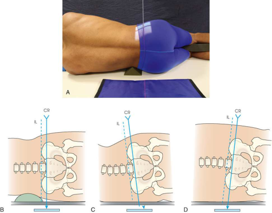
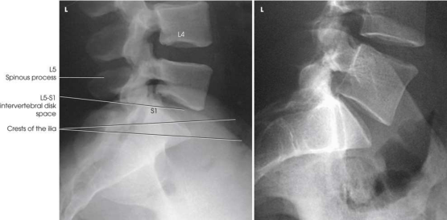

# Rx L5–S1 Joncțiune lombosacrată — Incidență de profil (lateral) — Profil drept sau stâng

  📷 Radiografie Convențională (Rx)
  <strong>Actualizat:</strong> 2026-09-16
  <strong>Autor:</strong> Referință Merrill

---

-   __1. Rezumat Clinic & Indicații__

    ---

    === "Indicații Clinice"

        - Conform reperelor anatomice standard din tratat

    === "Ghid Național IRIS"

        !!! info "Referință Primară: Ghidul Național IRIS (Ordinul MS 1342/2012)"
            - **Capitol Ghid IRIS:** *Ghidul Național IRIS*
            - **Grad de Recomandare:** **De verificat pe indicație; fără grad atribuit automat**
            - **Nivel de Iradiere Estimată:** `De verificat pentru examinarea și populația selectate`

            [:octicons-search-16: Deschide Ghidul IRIS](../../iris.md){ .md-button .md-button--primary } [:material-open-in-new: Aplicația Oficială PWA](https://radiologie-pediatrica.ro/iris/){ .md-button target="_blank" rel="noopener" }
-   __2. Poziționare & Centrare Fascicul__

    ---

    - **Poziție Pacient:** Examinați regiunea lombosacrată L5–S1 cu pacientul în decubit lateral.; cu pacientul în decubit, ajustați perna pentru a plasa MSP al capului în același plan cu coloana vertebrală. Ajustați MCP al corpului (care trece prin șolduri și umeri) astfel încât să fie aliniat perpendicular pe receptorul de imagine (RI). Flectați cotul pacientului și ajustați brațul dependent în poziție perpendiculară pe corp (Fig. 9.93A). Flectați șoldurile și genunchii pacientului, suprapuneți genunchii și plasați un suport între aceștia. Așa cum este descris pentru incidența de profil, plasați un suport radiotransparent sub partea inferioară a toracelui și ajustați-l astfel încât axa longitudinală a coloanei vertebrale să fie orizontală (vezi Fig. 9.93A). Aceasta este metoda preferată. Efectuați ecranarea gonadelor cu șorț plumbat.
    - **Punct de Centrare Fascicul:** Spina iliacă antero-superioară (SIAS) este ușor palpabilă și poate fi identificată la toți pacienții aflați în decubit lateral. SIAS oferă un punct de reper standardizat și precis pentru centrarea joncțiunii L5–S1. Centrați în plan coronal la 2 inches (5 cm) posterior de SIAS și la 1.5 inches (3.8 cm) inferior de crestele iliace. Centrați receptorul de imagine pe raza centrală. Când coloana vertebrală nu poate fi poziționată orizontal, raza centrală este înclinată cu 5 grade caudal pentru pacienții de sex masculin și cu 8 grade caudal pentru pacienții de sex feminin. Francis 20 a identificat o tehnică alternativă pentru evidențierea deschisă a spațiului discului intervertebral L5–S1 atunci când coloana vertebrală nu este orizontală: 1. Cu pacientul în incidență de profil, identificați ambele creste iliace. 2. Trasați o linie imaginară între cele două puncte (plan interiliac). 3. Ajustați angulația razei centrale astfel încât să fie paralelă cu linia interiliacă (vezi Fig. 9.93B–D).
    - **Distanță Focar-Film (DFF / SID):** Nespecificat în fragmentul extras; de verificat în sursă
    - **Comandă Respiratorie:** apnee (oprirea respirației).

-   __3. Parametri Tehnici Expunere__

    ---

    | Parametru Tehnic | Valoare Configurare Generator / Tub |
    |:-----------------|:-------------------------------------|
    | **Tensiune Tub (kV)** | DE CONFIGURAT PE APARAT |
    | **Sarcină / Produs Curent-Timp (mAs)** | DE CONFIGURAT PE APARAT |
    | **Distanță Focar-Film (DFF / SID)** | Nespecificat în fragmentul extras; de verificat în sursă |
    | **Grilă Antidifuzoare (Bucky)** | DE CONFIGURAT PE APARAT |
    | **Dimensiune Focar** | DE CONFIGURAT PE APARAT |
    | **Camere de Ionizare AEC** | DE CONFIGURAT PE APARAT |
    | **Colimare Fascicul** | Ajustați câmpul de iradiere la formatul 15 × 20 cm pe colimator. Aceasta este o incidență cu împrăștiere mare. Colimarea strânsă este esențială. Plasați markerul de lateralitate (D/S) în câmpul de expunere colimat. |
    | **Filtrare Tub** | DE CONFIGURAT PE APARAT |

-   __4. Criterii de Calitate & Reușită Imagine__

    ---

    - Criterii radiologice de calitate a imaginii:
    - Evidențierea colimării corecte și prezența markerului de lateralitate (D/S), plasat fără a se suprapune peste anatomia de interes
    - Articulația lombosacrată în centrul imaginii
    - Spațiul deschis al discului intervertebral lombosacrat
    - Crestele iliace se suprapun îndeaproape una peste cealaltă atunci când fasciculul de raze X nu este înclinat
    - Detalii trabeculare osoase și țesuturile moi înconjurătoare

-   __5. Protecție Radiologică (ALARA)__

    ---

    - Nespecificat în fragmentul extras; de verificat în sursă

!!! note "Observații Clinice & Tehnice"
    Conform reperelor anatomice standard din tratat

### 🖼️ Imagini

<figure class="protocol-image-card" markdown>

<figcaption><strong>Merrill — pagina 732, imaginea 1</strong> — Imagine din fragmentul sursă; asocierea necesită revizie.</figcaption>

</figure>

<figure class="protocol-image-card" markdown>

<figcaption><strong>Merrill — pagina 733, imaginea 2</strong> — Imagine din fragmentul sursă; asocierea necesită revizie.</figcaption>

</figure>

=== "Ghid Rapid de Execuție"

    1. **Identificarea și verificarea pacientului:** verificare identitate, zonă de examinat, consimțământ conform procedurii și evaluarea posibilității unei sarcini, când este relevantă.
    2. **Pregătire:** îndepărtarea oricăror obiecte radiopace (bijuterii, agrafe, fermoare, proteze, pansamente dense).
    3. **Poziționare precisă:** alinierea receptorului de imagine și a tubului la distanța prescrisă (Nespecificat în fragmentul extras; de verificat în sursă).
    4. **Colimare strictă:** adaptarea fasciculului strict la regiunea de diagnostic pentru scăderea iradierii și reducerea radiației difuze.
    5. **Radioprotecție:** verificarea [politicii RX](../radioprotectie.md), cu măsuri distincte pentru pacient, personal și însoțitor.

## Surse de documentare

- [Merrill’s Atlas, 9. Vertebral Column, pagini 731–733](https://books.google.com/books/about/Merrill_s_Atlas_of_Radiographic_Position.html?id=BM0lEQAAQBAJ)

## Fragmente sursă traduse (referință tehnică)

### anatomie

Joncțiunea lombosacrată, una sau două vertebre lombare inferioare și partea superioară a sacrului (Fig. 9.94).

### colimare

• Ajustați câmpul de iradiere la formatul 15 × 20 cm pe colimator. Aceasta este o incidență cu împrăștiere mare. Colimarea strânsă este esențială. Plasați markerul de lateralitate (D/S) în câmpul de expunere colimat.

### raza centrală

• Spina iliacă antero-superioară (SIAS) este ușor palpabilă și poate fi identificată la toți pacienții aflați în decubit lateral. SIAS oferă un punct de reper standardizat și precis pentru centrarea joncțiunii L5–S1.
• Centrați în plan coronal la 2 inches (5 cm) posterior de SIAS și la 1.5 inches (3.8 cm) inferior de crestele iliace.
• Centrați receptorul de imagine pe raza centrală.
• Când coloana vertebrală nu poate fi poziționată orizontal, raza centrală este înclinată cu 5 grade caudal pentru pacienții de sex masculin și cu 8 grade caudal pentru pacienții de sex feminin.
• Francis 20 a identificat o tehnică alternativă pentru evidențierea deschisă a spațiului discului intervertebral L5–S1 atunci când coloana vertebrală nu este orizontală:
1. Cu pacientul în poziție de profil, identificați ambele creste iliace.
2. Trasați o linie imaginară între cele două puncte (plan interiliac).
3. Ajustați angulația razei centrale astfel încât să fie paralelă cu linia interiliacă (vezi Fig. 9.93B–D).

### criterii

Criterii radiologice de calitate a imaginii:
• Evidența colimării corecte și prezența markerului de lateralitate (D/S), plasat clar în afara anatomiei de interes
• Articulația lombosacrată în centrul imaginii
• Spațiul deschis al discului intervertebral lombosacrat
• Crestele iliace se suprapun îndeaproape una peste cealaltă atunci când fasciculul de raze X nu este înclinat
• Detalii osoase trabeculare și țesuturile moi înconjurătoare

### part_pos

• Cu pacientul în poziție de decubit, ajustați perna pentru a plasa MSP al capului în același plan cu coloana vertebrală.
• Ajustați MCP al corpului (care trece prin șolduri și umeri) astfel încât să fie aliniat perpendicular pe receptorul de imagine (RI).
• Flectați cotul pacientului și ajustați brațul dependent în poziție perpendiculară pe corp (Fig. 9.93A).
• Flectați șoldurile și genunchii pacientului, suprapuneți genunchii și plasați un suport între aceștia.
• Așa cum este descris pentru incidența laterală, plasați un suport radiotransparent sub partea inferioară a toracelui și ajustați-l astfel încât axa longitudinală a coloanei vertebrale să fie orizontală (vezi Fig. 9.93A). Aceasta este metoda preferată.
• Efectuați ecranarea gonadelor cu șorț plumbat.

### patient_pos

• Examinați regiunea lombosacrată L5–S1 cu pacientul în decubit lateral.

### respirație

apnee (oprirea respirației).

### tehnică

Poziționat conform indicațiilor producătorului sau protocolului departamentului pentru orientarea corectă a afișării structurilor anatomice; placă pentru raza centrală: 10 × 12 țoli (24 ×
30 cm), longitudinal.

