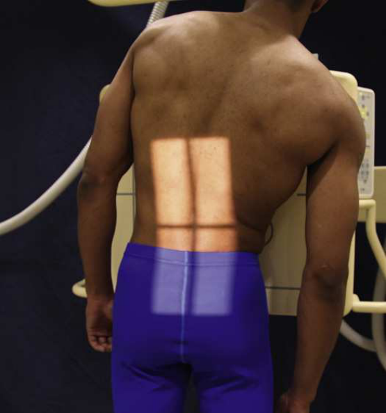

# Rx Lumbar Intervertebral Joints — Incidență Postero-Anterioară (PA) — În Încărcare (Ortostatism) Method Right and left bending (Merrill)

  📷 Radiografie Convențională (Rx)
  <strong>Actualizat:</strong> 2026-09-16
  <strong>Autor:</strong> Referință Merrill

---

-   __1. Rezumat Clinic & Indicații__

    ---

    === "Indicații Clinice"

        - Conform reperelor anatomice standard din tratat

    === "Ghid Național IRIS"

        !!! info "Referință Primară: Ghidul Național IRIS (Ordinul MS 1342/2012)"
            - **Capitol Ghid IRIS:** *Ghidul Național IRIS*
            - **Grad de Recomandare:** **De verificat pe indicație; fără grad atribuit automat**
            - **Nivel de Iradiere Estimată:** `De verificat pentru examinarea și populația selectate`

            [:octicons-search-16: Deschide Ghidul IRIS](../../iris.md){ .md-button .md-button--primary } [:material-open-in-new: Aplicația Oficială PWA](https://radiologie-pediatrica.ro/iris/){ .md-button target="_blank" rel="noopener" }
-   __2. Poziționare & Centrare Fascicul__

    ---

    - **Poziție Pacient:** Perform this examination cu pacientul în ortostatism poziție. Duncan și Hoen 26 recommended that Incidență Postero-Anterioară (PA) fie used because, în this direction, divergent rays sunt more nearly paralel cu intervertebral disk spaces.; cu pacientul facing stativ vertical Bucky, se ajustează height de receptorul de imagine la fie centrat la nivelul level de L3. se ajustează pacient’s Bazin (bazin (pelvis)) pentru rotație prin ensuring that spină iliacă antero-superioară (SIAS) sunt echidistant față de receptorul de imagine. se centrează MSP de pacientul’s corp la linia mediană stativ vertical Bucky (Fig. 9.129). Let pacientul’s brațe hang unsupported prin sides. Make one radiografie cu pacientul bending la drept și one cu pacientul bending la stâng (Fig. 9.130). Se instruiește pacientul să lean directly lateral ca far ca possible fără rotație și fără elevation de Picior. grade de bending trebuie să nu fie forced, și pacientul trebuie să nu fie sprijinit în poziție. Ensure that MSP de lower Coloană Lombară și Sacru remains centrat pe grila device ca upper portion moves laterally. se efectuează ecranarea gonadelor cu șorț plumbat.
    - **Punct de Centrare Fascicul:** orientat perpendicular la L3 sau through L4–L5 sau L5–S1 intervertebral disk spaces, if these sunt areas de interest
    - **Distanță Focar-Film (DFF / SID):** Nespecificat în fragmentul extras; de verificat în sursă
    - **Comandă Respiratorie:** apnee (oprirea respirației).

-   __3. Parametri Tehnici Expunere__

    ---

    | Parametru Tehnic | Valoare Configurare Generator / Tub |
    |:-----------------|:-------------------------------------|
    | **Tensiune Tub (kV)** | DE CONFIGURAT PE APARAT |
    | **Sarcină / Produs Curent-Timp (mAs)** | DE CONFIGURAT PE APARAT |
    | **Distanță Focar-Film (DFF / SID)** | Nespecificat în fragmentul extras; de verificat în sursă |
    | **Grilă Antidifuzoare (Bucky)** | DE CONFIGURAT PE APARAT |
    | **Dimensiune Focar** | DE CONFIGURAT PE APARAT |
    | **Camere de Ionizare AEC** | DE CONFIGURAT PE APARAT |
    | **Colimare Fascicul** | Conform reperelor anatomice standard din tratat |
    | **Filtrare Tub** | DE CONFIGURAT PE APARAT |

-   __4. Criterii de Calitate & Reușită Imagine__

    ---

    - Conform reperelor anatomice standard din tratat

-   __5. Protecție Radiologică (ALARA)__

    ---

    - Nespecificat în fragmentul extras; de verificat în sursă

!!! note "Observații Clinice & Tehnice"
    Conform reperelor anatomice standard din tratat

### 🖼️ Imagini

<figure class="protocol-image-card" markdown>

<figcaption><strong>Merrill — pagina PDF 760, imaginea 1</strong> — Imagine din fragmentul sursă; asocierea necesită revizie.</figcaption>

</figure>

=== "Ghid Rapid de Execuție"

    1. **Identificarea și verificarea pacientului:** verificare identitate, zonă de examinat, consimțământ conform procedurii și evaluarea posibilității unei sarcini, când este relevantă.
    2. **Pregătire:** îndepărtarea oricăror obiecte radiopace (bijuterii, agrafe, fermoare, proteze, pansamente dense).
    3. **Poziționare precisă:** alinierea receptorului de imagine și a tubului la distanța prescrisă (Nespecificat în fragmentul extras; de verificat în sursă).
    4. **Colimare strictă:** adaptarea fasciculului strict la regiunea de diagnostic pentru scăderea iradierii și reducerea radiației difuze.
    5. **Radioprotecție:** verificarea [politicii RX](../radioprotectie.md), cu măsuri distincte pentru pacient, personal și însoțitor.

## Surse de documentare

- [Merrill’s Atlas, 9. Vertebral Column, pagini PDF 759–760](../../assets/protocols/sources/a56d45c16829_Merrills_Atlas_of_Radiographic_Positioning__Procedures_3Vol_Set.pdf#page=759)

## Fragmente sursă traduse (referință tehnică)

### cr

• orientat perpendicular la L3 sau through L4–L5 sau L5–S1 intervertebral disk spaces, if these sunt areas de interest

### part_pos

• cu pacientul facing stativ vertical Bucky, se ajustează height de receptorul de imagine la fie centrat la nivelul level de L3.
• se ajustează pacient’s bazin (pelvis) pentru rotație prin ensuring that spină iliacă antero-superioară (SIAS) sunt echidistant față de receptorul de imagine.
• se centrează MSP de pacientul’s corp la linia mediană stativ vertical Bucky (Fig. 9.129).
• Let pacientul’s brațe hang unsupported prin sides.
• Make one radiografie cu pacientul bending la drept și one cu pacientul bending la stâng (Fig. 9.130).
• Se instruiește pacientul să lean directly lateral ca far ca possible fără rotație și fără elevation de picior. grade de bending trebuie să
nu fie forced, și pacientul trebuie să nu fie sprijinit în poziție.
• Ensure that MSP de lower lumbar coloană vertebrală și sacrum remains centrat pe grila device ca upper portion moves laterally.
• se efectuează ecranarea gonadelor cu șorț plumbat.

### patient_pos

• Perform this examination cu pacientul în ortostatism poziție. Duncan și Hoen 26 recommended that PA incidență fie used
because, în this direction, divergent rays sunt more nearly paralel cu intervertebral disk spaces.

### respiration

apnee (oprirea respirației).

### tech

poziționat prin manufacturer sau department protocol pentru corect anatomy display orientation; raza centrală plate: 14 × 17 inches (35 ×
43 cm) longitudinal.

