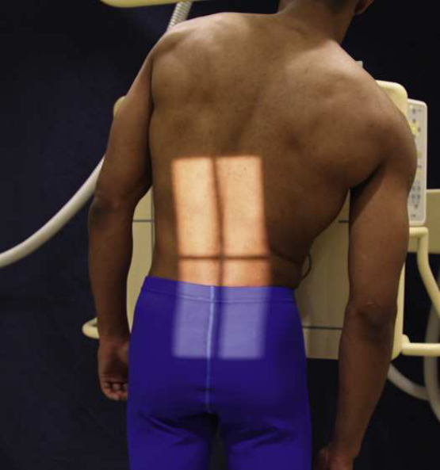

# Rx articulațiile intervertebrale lombare — Incidență postero-anterioară (PA) — În încărcare (ortostatism) — Metoda flexiei spre dreapta și spre stânga (Merrill)

  📷 Radiografie Convențională (Rx)
  <strong>Actualizat:</strong> 2026-09-16
  <strong>Autor:</strong> Referință Merrill

---

-   __1. Rezumat Clinic & Indicații__

    ---

    === "Indicații Clinice"

        - Conform reperelor anatomice standard din tratat

    === "Ghid Național IRIS"

        !!! info "Referință Primară: Ghidul Național IRIS (Ordinul MS 1342/2012)"
            - **Capitol Ghid IRIS:** *Ghidul Național IRIS*
            - **Grad de Recomandare:** **De verificat pe indicație; fără grad atribuit automat**
            - **Nivel de Iradiere Estimată:** `De verificat pentru examinarea și populația selectate`

            [:octicons-search-16: Deschide Ghidul IRIS](../../iris.md){ .md-button .md-button--primary } [:material-open-in-new: Aplicația Oficială PWA](https://radiologie-pediatrica.ro/iris/){ .md-button target="_blank" rel="noopener" }
-   __2. Poziționare & Centrare Fascicul__

    ---

    - **Poziție Pacient:** Efectuați această examinare cu pacientul în ortostatism. Duncan și Hoen 26 au recomandat utilizarea incidenței postero-anterioare (PA) deoarece, în această direcție, razele divergente sunt mai aproape paralele cu spațiile discale intervertebrale.; cu pacientul orientat către stativul vertical Bucky, ajustați înălțimea receptorului de imagine astfel încât să fie centrat la nivelul L3. Ajustați bazinul pacientului pentru rotație, asigurându-vă că spinele iliace antero-superioare (SIAS) sunt echidistante față de receptorul de imagine. Centrați MSP al corpului pacientului pe linia mediană a stativului vertical Bucky (Fig. 9.129). Lăsați brațele pacientului să atârne liber pe lângă corp. Efectuați o radiografie cu pacientul înclinat la dreapta și una cu pacientul înclinat la stânga (Fig. 9.130). Instruiți pacientul să se încline direct lateral cât mai mult posibil, fără rotație și fără ridicarea piciorului. Gradul de înclinare nu trebuie forțat, iar pacientul nu trebuie sprijinit în această poziție. Asigurați-vă că MSP al porțiunii inferioare a coloanei lombare și al sacrului rămâne centrat pe dispozitivul cu grilă în timp ce porțiunea superioară se deplasează lateral. Efectuați ecranarea gonadelor cu șorț plumbat.
    - **Punct de Centrare Fascicul:** orientat perpendicular pe L3 sau prin spațiile discale intervertebrale L4–L5 sau L5–S1, dacă acestea sunt regiunile de interes
    - **Distanță Focar-Film (DFF / SID):** Nespecificat în fragmentul extras; de verificat în sursă
    - **Comandă Respiratorie:** apnee (oprirea respirației).

-   __3. Parametri Tehnici Expunere__

    ---

    | Parametru Tehnic | Valoare Configurare Generator / Tub |
    |:-----------------|:-------------------------------------|
    | **Tensiune Tub (kV)** | DE CONFIGURAT PE APARAT |
    | **Sarcină / Produs Curent-Timp (mAs)** | DE CONFIGURAT PE APARAT |
    | **Distanță Focar-Film (DFF / SID)** | Nespecificat în fragmentul extras; de verificat în sursă |
    | **Grilă Antidifuzoare (Bucky)** | DE CONFIGURAT PE APARAT |
    | **Dimensiune Focar** | DE CONFIGURAT PE APARAT |
    | **Camere de Ionizare AEC** | DE CONFIGURAT PE APARAT |
    | **Colimare Fascicul** | Conform reperelor anatomice standard din tratat |
    | **Filtrare Tub** | DE CONFIGURAT PE APARAT |

-   __4. Criterii de Calitate & Reușită Imagine__

    ---

    - Conform reperelor anatomice standard din tratat

-   __5. Protecție Radiologică (ALARA)__

    ---

    - Nespecificat în fragmentul extras; de verificat în sursă

!!! note "Observații Clinice & Tehnice"
    Conform reperelor anatomice standard din tratat

### 🖼️ Imagini

<figure class="protocol-image-card" markdown>

<figcaption><strong>Merrill — pagina 760, imaginea 1</strong> — Imagine din fragmentul sursă; asocierea necesită revizie.</figcaption>

</figure>

=== "Ghid Rapid de Execuție"

    1. **Identificarea și verificarea pacientului:** verificare identitate, zonă de examinat, consimțământ conform procedurii și evaluarea posibilității unei sarcini, când este relevantă.
    2. **Pregătire:** îndepărtarea oricăror obiecte radiopace (bijuterii, agrafe, fermoare, proteze, pansamente dense).
    3. **Poziționare precisă:** alinierea receptorului de imagine și a tubului la distanța prescrisă (Nespecificat în fragmentul extras; de verificat în sursă).
    4. **Colimare strictă:** adaptarea fasciculului strict la regiunea de diagnostic pentru scăderea iradierii și reducerea radiației difuze.
    5. **Radioprotecție:** verificarea [politicii RX](../radioprotectie.md), cu măsuri distincte pentru pacient, personal și însoțitor.

## Surse de documentare

- [Merrill’s Atlas, 9. Vertebral Column, pagini 759–760](https://books.google.com/books/about/Merrill_s_Atlas_of_Radiographic_Position.html?id=BM0lEQAAQBAJ)

## Fragmente sursă traduse (referință tehnică)

### raza centrală

• orientat perpendicular pe L3 sau prin spațiile discale intervertebrale L4–L5 sau L5–S1, dacă acestea sunt regiunile de interes

### part_pos

• Cu pacientul cu fața spre stativul vertical Bucky, se ajustează înălțimea receptorului de imagine pentru a fi centrat la nivelul L3.
• Se ajustează bazinul pacientului pentru rotație, asigurându-se că spinele iliace antero-superioare (SIAS) sunt echidistante față de receptorul de imagine.
• Se centrează MSP al corpului pacientului pe linia mediană a stativului vertical Bucky (Fig. 9.129).
• Se lasă brațele pacientului să atârne nesusținute pe lângă corp.
• Se efectuează o radiografie cu pacientul în flexie spre dreapta și una cu pacientul în flexie spre stânga (Fig. 9.130).
• Se instruiește pacientul să se încline direct lateral cât mai mult posibil, fără rotație și fără ridicarea piciorului. Gradul de flexie nu trebuie forțat, iar pacientul nu trebuie sprijinit în această poziție.
• Se asigură că MSP al coloanei lombare inferioare și al sacrului rămâne centrat pe grila dispozitivului pe măsură ce partea superioară se deplasează lateral.
• Se efectuează ecranarea gonadelor cu șorț plumbat.

### patient_pos

• Se efectuează această examinare cu pacientul în ortostatism. Duncan și Hoen 26 au recomandat utilizarea incidenței PA deoarece, în această direcție, razele divergente sunt mai aproape de paralelism cu spațiile discale intervertebrale.

### respirație

apnee (oprirea respirației).

### tehnică

Poziționat conform indicațiilor producătorului sau protocolului departamentului pentru orientarea corectă a afișării structurilor anatomice; raza centrală, placă: 14 × 17 țoli (35 ×
43 cm), longitudinal.

