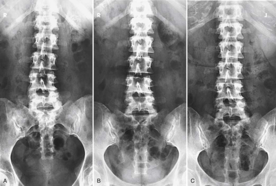
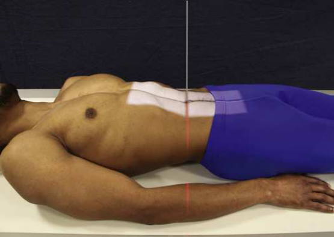
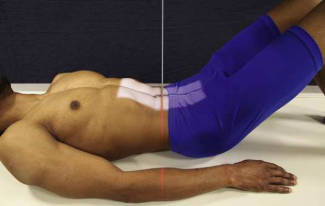
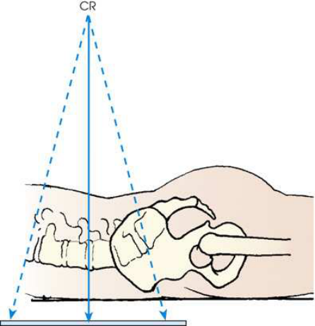
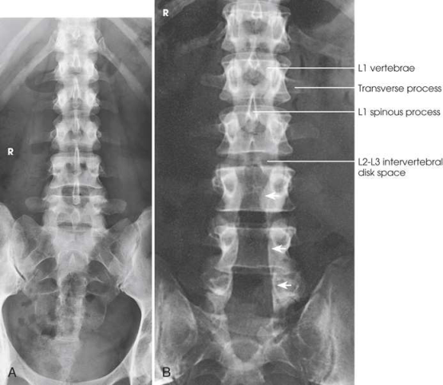
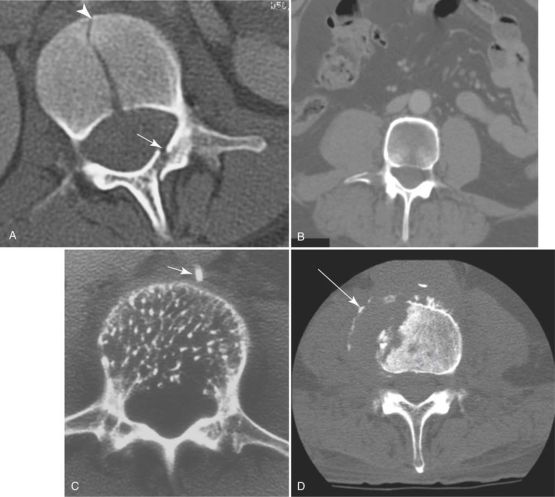

# Rx Lumbar-Lumbosacral Vertebrae — Incidență Antero-Posterioară (AP) — Incidență Postero-Anterioară (PA) (Optional) generated within a filled bladder. (Merrill)

  📷 Radiografie Convențională (Rx)
  <strong>Actualizat:</strong> 2026-09-16
  <strong>Autor:</strong> Referință Merrill

---

-   __1. Rezumat Clinic & Indicații__

    ---

    === "Indicații Clinice"

        - Conform reperelor anatomice standard din tratat

    === "Ghid Național IRIS"

        !!! info "Referință Primară: Ghidul Național IRIS (Ordinul MS 1342/2012)"
            - **Capitol Ghid IRIS:** *Ghidul Național IRIS*
            - **Grad de Recomandare:** **De verificat pe indicație; fără grad atribuit automat**
            - **Nivel de Iradiere Estimată:** `De verificat pentru examinarea și populația selectate`

            [:octicons-search-16: Deschide Ghidul IRIS](../../iris.md){ .md-button .md-button--primary } [:material-open-in-new: Aplicația Oficială PWA](https://radiologie-pediatrica.ro/iris/){ .md-button target="_blank" rel="noopener" }
-   __2. Poziționare & Centrare Fascicul__

    ---

    - **Poziție Pacient:** Examine lumbar sau lumbosacral coloană vertebrală cu pacientul Decubit.; se centrează MSP de pacientul’s corp la linia mediană grilă. se ajustează pacient’s umeri și hips la lie în same plan orizontal. se flectează pacient’s coate și place mâinile pe upper Torace astfel încât forearms do nu lie within expunere field. radiolucent support under lower pelvic side poate fie used la reduce rotație when necessary. Reduce lumbar lordosis prin flexing pacientul’s hips și genunchi enough la place back în firm contact cu table (see Fig. 9.86). la show Coloană Lombară și Sacru, se centrează 14 × 17 inches (35 × 43 cm) receptorul de imagine la nivelul crestele iliace (L4). la show Coloană Lombară only, se centrează receptorul de imagine 1.5 inches (3.8 cm) above crestele iliace (L3). se efectuează ecranarea gonadelor cu șorț plumbat.
    - **Punct de Centrare Fascicul:** perpendicular pe receptorul de imagine (RI) la nivelul crestele iliace (L4) pentru lumbosacral examination sau 1.5 inches (3.8 cm) above crestele iliace pentru Coloană Lombară only
    - **Distanță Focar-Film (DFF / SID):** 48 inches (122 cm) is suСested to reduce distortion and open the intervertebral disk spaces more completely.
    - **Comandă Respiratorie:** Apnee la sfârșitul expirului complet.

-   __3. Parametri Tehnici Expunere__

    ---

    | Parametru Tehnic | Valoare Configurare Generator / Tub |
    |:-----------------|:-------------------------------------|
    | **Tensiune Tub (kV)** | DE CONFIGURAT PE APARAT |
    | **Sarcină / Produs Curent-Timp (mAs)** | DE CONFIGURAT PE APARAT |
    | **Distanță Focar-Film (DFF / SID)** | 48 inches (122 cm) is suСested to reduce distortion and open the intervertebral disk spaces more completely. |
    | **Grilă Antidifuzoare (Bucky)** | DE CONFIGURAT PE APARAT |
    | **Dimensiune Focar** | DE CONFIGURAT PE APARAT |
    | **Camere de Ionizare AEC** | DE CONFIGURAT PE APARAT |
    | **Colimare Fascicul** | Adjust la 8 × 17 inches (18 × 43 cm) pe collimator pentru lumbosacral coloană vertebrală. Ensure that sacroiliac articulații sunt included. pentru Coloană Lombară only, collimation poate fie reduced la 8 × 14 inches (18 × 35 cm). Place marker de lateralitate (D/S) în collimated expunere field. |
    | **Filtrare Tub** | DE CONFIGURAT PE APARAT |

-   __4. Criterii de Calitate & Reușită Imagine__

    ---

    - Criterii radiologice de calitate imaginii:
    - Evidence de corect collimation și presence de marker de lateralitate (D/S) plasat clear de anatomy de interest
    - Area de la lower coloană toracală la Sacru
    - X-ray fascicul collimated la lateral margin de psoas muscles
    - fără artifact across midabdomen de la orice elastic în pacientul’s underclothing
    - Absența rotației anatomice (simetrie bilaterală perfectă)
    - simetric vertebre, cu procese spinoase centrat pe corpuri
    - Sacroiliac articulații echidistant față de coloană vertebrală
    - Open intervertebral disk spaces
    - Bony detalii trabeculare osoase și surrounding soft tissues

-   __5. Protecție Radiologică (ALARA)__

    ---

    - Nespecificat în fragmentul extras; de verificat în sursă

!!! note "Observații Clinice & Tehnice"
    Conform reperelor anatomice standard din tratat

### 🖼️ Imagini

<figure class="protocol-image-card" markdown>

<figcaption><strong>Merrill — pagina PDF 724, imaginea 1</strong> — Imagine din fragmentul sursă; asocierea necesită revizie.</figcaption>

</figure>

<figure class="protocol-image-card" markdown>

<figcaption><strong>Merrill — pagina PDF 725, imaginea 2</strong> — Imagine din fragmentul sursă; asocierea necesită revizie.</figcaption>

</figure>

<figure class="protocol-image-card" markdown>

<figcaption><strong>Merrill — pagina PDF 725, imaginea 3</strong> — Imagine din fragmentul sursă; asocierea necesită revizie.</figcaption>

</figure>

<figure class="protocol-image-card" markdown>

<figcaption><strong>Merrill — pagina PDF 726, imaginea 4</strong> — Imagine din fragmentul sursă; asocierea necesită revizie.</figcaption>

</figure>

<figure class="protocol-image-card" markdown>

<figcaption><strong>Merrill — pagina PDF 727, imaginea 5</strong> — Imagine din fragmentul sursă; asocierea necesită revizie.</figcaption>

</figure>

<figure class="protocol-image-card" markdown>

<figcaption><strong>Merrill — pagina PDF 728, imaginea 6</strong> — Imagine din fragmentul sursă; asocierea necesită revizie.</figcaption>

</figure>

=== "Ghid Rapid de Execuție"

    1. **Identificarea și verificarea pacientului:** verificare identitate, zonă de examinat, consimțământ conform procedurii și evaluarea posibilității unei sarcini, când este relevantă.
    2. **Pregătire:** îndepărtarea oricăror obiecte radiopace (bijuterii, agrafe, fermoare, proteze, pansamente dense).
    3. **Poziționare precisă:** alinierea receptorului de imagine și a tubului la distanța prescrisă (48 inches (122 cm) is suСested to reduce distortion and open the intervertebral disk spaces more completely.).
    4. **Colimare strictă:** adaptarea fasciculului strict la regiunea de diagnostic pentru scăderea iradierii și reducerea radiației difuze.
    5. **Radioprotecție:** verificarea [politicii RX](../radioprotectie.md), cu măsuri distincte pentru pacient, personal și însoțitor.

## Surse de documentare

- [Merrill’s Atlas, 9. Vertebral Column, pagini PDF 723–728](../../assets/protocols/sources/a56d45c16829_Merrills_Atlas_of_Radiographic_Positioning__Procedures_3Vol_Set.pdf#page=723)

## Fragmente sursă traduse (referință tehnică)

### collimation

• Adjust la 8 × 17 inches (18 × 43 cm) pe collimator pentru lumbosacral coloană vertebrală. Ensure that sacroiliac articulații sunt included. pentru
lumbar coloană vertebrală only, collimation poate fie reduced la 8 × 14 inches (18 × 35 cm). Place marker de lateralitate (D/S) în collimated expunere field.

### cr

• perpendicular pe receptorul de imagine (RI) la nivelul crestele iliace (L4) pentru lumbosacral examination sau 1.5 inches (3.8 cm) above crestele iliace pentru
lumbar coloană vertebrală only

### criteria

Criterii radiologice de calitate imaginii:
• Evidence de corect collimation și presence de marker de lateralitate (D/S) plasat clear de anatomy de interest
• Area de la lower coloană toracală la sacrum
• X-ray fascicul collimated la lateral margin de psoas muscles
• fără artifact across midabdomen de la orice elastic în pacientul’s underclothing
• Absența rotației anatomice (simetrie bilaterală perfectă)
• simetric vertebre, cu procese spinoase centrat pe corpuri
• Sacroiliac articulații echidistant față de coloană vertebrală
• Open intervertebral disk spaces
• Bony detalii trabeculare osoase și surrounding soft tissues

### part_pos

• se centrează MSP de pacientul’s corp la linia mediană grilă.
• se ajustează pacient’s umeri și hips la lie în same plan orizontal.
• se flectează pacient’s coate și place mâinile pe upper chest astfel încât forearms do nu lie within expunere field.
• radiolucent support under lower pelvic side poate fie used la reduce rotație when necessary.
• Reduce lumbar lordosis prin flexing pacientul’s hips și genunchi enough la place back în firm contact cu table (see Fig. 9.86).
• la show lumbar coloană vertebrală și sacrum, se centrează 14 × 17 inches (35 × 43 cm) receptorul de imagine la nivelul crestele iliace (L4).
• la show lumbar coloană vertebrală only, se centrează receptorul de imagine 1.5 inches (3.8 cm) above crestele iliace (L3).
• se efectuează ecranarea gonadelor cu șorț plumbat.

### patient_pos

• Examine lumbar sau lumbosacral coloană vertebrală cu pacientul recumbent.

### respiration

Apnee la sfârșitul expirului complet.

### sid

48 inches (122 cm) este suСested la reduce distortion și open intervertebral disk spaces more completely.

### tech

poziționat prin manufacturer sau department protocol pentru corect anatomy display orientation; raza centrală plate: 14 × 17 inches (35
× 43 cm) longitudinal.

