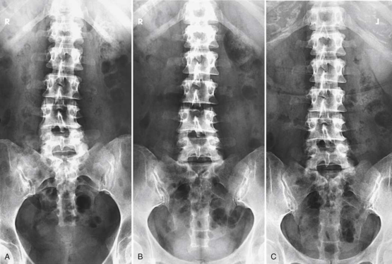
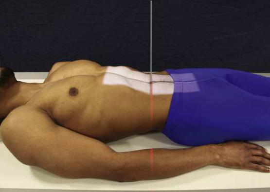
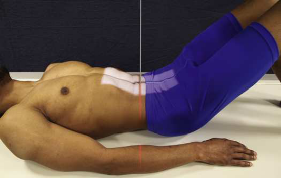
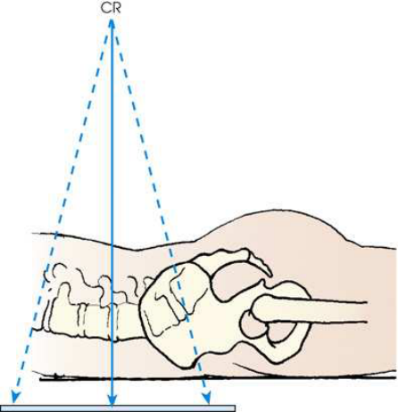
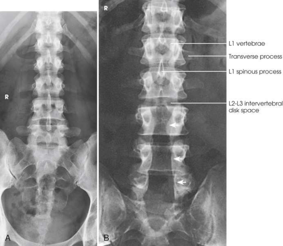
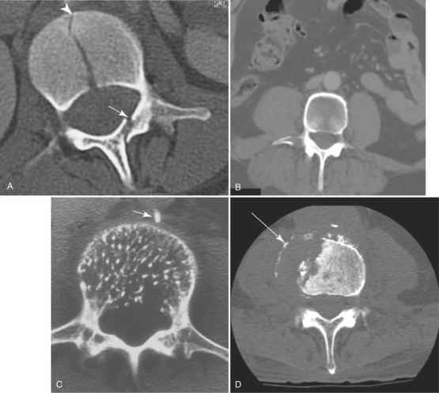

# Rx vertebrele lombare-lombosacrale — Incidență antero-posterioară (AP) — Incidență postero-anterioară (PA) (opțional), obținute cu vezica urinară plină. (Merrill)

  📷 Radiografie Convențională (Rx)
  <strong>Actualizat:</strong> 2026-09-16
  <strong>Autor:</strong> Referință Merrill

---

-   __1. Rezumat Clinic & Indicații__

    ---

    === "Indicații Clinice"

        - Conform reperelor anatomice standard din tratat

    === "Ghid Național IRIS"

        !!! info "Referință Primară: Ghidul Național IRIS (Ordinul MS 1342/2012)"
            - **Capitol Ghid IRIS:** *Ghidul Național IRIS*
            - **Grad de Recomandare:** **De verificat pe indicație; fără grad atribuit automat**
            - **Nivel de Iradiere Estimată:** `De verificat pentru examinarea și populația selectate`

            [:octicons-search-16: Deschide Ghidul IRIS](../../iris.md){ .md-button .md-button--primary } [:material-open-in-new: Aplicația Oficială PWA](https://radiologie-pediatrica.ro/iris/){ .md-button target="_blank" rel="noopener" }
-   __2. Poziționare & Centrare Fascicul__

    ---

    - **Poziție Pacient:** Se examinează coloana lombară sau lombosacrală cu pacientul în decubit; se centrează MSP al corpului pacientului pe linia mediană a grilei. Se ajustează umerii și șoldurile pacientului pentru a se afla în același plan orizontal. Se flectează coatele pacientului și se așază mâinile pe toracele superior, astfel încât antebrațele să nu se afle în câmpul de expunere. Se poate utiliza un suport radiotransparent sub partea pelvină inferioară pentru reducerea rotației, când este necesar. Se reduce lordoza lombară prin flexia șoldurilor și genunchilor pacientului suficient pentru a așeza spatele în contact ferm cu masa (vezi Fig. 9.86). Pentru evidențierea coloanei lombare și a sacrului, se centrează receptorul de imagine de 14 × 17 inches (35 × 43 cm) la nivelul crestelor iliace (L4). Pentru evidențierea numai a coloanei lombare, se centrează receptorul de imagine la 1.5 inches (3.8 cm) deasupra crestelor iliace (L3). Se efectuează ecranarea gonadelor cu șorț plumbat.
    - **Punct de Centrare Fascicul:** perpendicular pe receptorul de imagine (RI), la nivelul crestelor iliace (L4) pentru examinarea lombosacrală sau la 1.5 inches (3.8 cm) deasupra crestelor iliace pentru coloana lombară בלבד
    - **Distanță Focar-Film (DFF / SID):** Se recomandă o distanță de 48 inci (122 cm), pentru a reduce distorsiunea și a evidenția mai complet spațiile discale intervertebrale.
    - **Comandă Respiratorie:** Apnee la sfârșitul expirului complet.

-   __3. Parametri Tehnici Expunere__

    ---

    | Parametru Tehnic | Valoare Configurare Generator / Tub |
    |:-----------------|:-------------------------------------|
    | **Tensiune Tub (kV)** | DE CONFIGURAT PE APARAT |
    | **Sarcină / Produs Curent-Timp (mAs)** | DE CONFIGURAT PE APARAT |
    | **Distanță Focar-Film (DFF / SID)** | Se recomandă o distanță de 48 inci (122 cm), pentru a reduce distorsiunea și a evidenția mai complet spațiile discale intervertebrale. |
    | **Grilă Antidifuzoare (Bucky)** | DE CONFIGURAT PE APARAT |
    | **Dimensiune Focar** | DE CONFIGURAT PE APARAT |
    | **Camere de Ionizare AEC** | DE CONFIGURAT PE APARAT |
    | **Colimare Fascicul** | Se ajustează la 8 × 17 inches (18 × 43 cm) pe colimator pentru coloana lombosacrală. Se asigură includerea articulațiilor sacroiliace. Pentru coloana lombară בלבד, colimarea poate fi redusă la 8 × 14 inches (18 × 35 cm). Se plasează markerul de lateralitate (D/S) în câmpul de expunere colimat. |
    | **Filtrare Tub** | DE CONFIGURAT PE APARAT |

-   __4. Criterii de Calitate & Reușită Imagine__

    ---

    - Criterii radiologice de calitate a imaginii:
    - Evidențierea colimării corecte și prezența markerului de lateralitate (D/S), plasat fără a se suprapune peste anatomia de interes
    - Regiunea de la coloana toracală inferioară până la sacru
    - Fasciculul de raze X colimat la marginea laterală a mușchilor psoas
    - fără artefact la nivelul mezogastrului, produs de orice elastic din lenjeria pacientului
    - Absența rotației anatomice (simetrie bilaterală perfectă)
    - vertebre simetrice, cu procesele spinoase centrate pe corpurile vertebrale
    - Articulațiile sacroiliace echidistante față de coloana vertebrală
    - Spații discale intervertebrale deschise
    - Detalii trabeculare osoase și țesuturile moi înconjurătoare

-   __5. Protecție Radiologică (ALARA)__

    ---

    - Nespecificat în fragmentul extras; de verificat în sursă

!!! note "Observații Clinice & Tehnice"
    Conform reperelor anatomice standard din tratat

### 🖼️ Imagini

<figure class="protocol-image-card" markdown>

<figcaption><strong>Merrill — pagina 724, imaginea 1</strong> — Imagine din fragmentul sursă; asocierea necesită revizie.</figcaption>

</figure>

<figure class="protocol-image-card" markdown>

<figcaption><strong>Merrill — pagina 725, imaginea 2</strong> — Imagine din fragmentul sursă; asocierea necesită revizie.</figcaption>

</figure>

<figure class="protocol-image-card" markdown>

<figcaption><strong>Merrill — pagina 725, imaginea 3</strong> — Imagine din fragmentul sursă; asocierea necesită revizie.</figcaption>

</figure>

<figure class="protocol-image-card" markdown>

<figcaption><strong>Merrill — pagina 726, imaginea 4</strong> — Imagine din fragmentul sursă; asocierea necesită revizie.</figcaption>

</figure>

<figure class="protocol-image-card" markdown>

<figcaption><strong>Merrill — pagina 727, imaginea 5</strong> — Imagine din fragmentul sursă; asocierea necesită revizie.</figcaption>

</figure>

<figure class="protocol-image-card" markdown>

<figcaption><strong>Merrill — pagina 728, imaginea 6</strong> — Imagine din fragmentul sursă; asocierea necesită revizie.</figcaption>

</figure>

=== "Ghid Rapid de Execuție"

    1. **Identificarea și verificarea pacientului:** verificare identitate, zonă de examinat, consimțământ conform procedurii și evaluarea posibilității unei sarcini, când este relevantă.
    2. **Pregătire:** îndepărtarea oricăror obiecte radiopace (bijuterii, agrafe, fermoare, proteze, pansamente dense).
    3. **Poziționare precisă:** alinierea receptorului de imagine și a tubului la distanța prescrisă (Se recomandă o distanță de 48 inci (122 cm), pentru a reduce distorsiunea și a evidenția mai complet spațiile discale intervertebrale.).
    4. **Colimare strictă:** adaptarea fasciculului strict la regiunea de diagnostic pentru scăderea iradierii și reducerea radiației difuze.
    5. **Radioprotecție:** verificarea [politicii RX](../radioprotectie.md), cu măsuri distincte pentru pacient, personal și însoțitor.

## Surse de documentare

- [Merrill’s Atlas, 9. Vertebral Column, pagini 723–728](https://books.google.com/books/about/Merrill_s_Atlas_of_Radiographic_Position.html?id=BM0lEQAAQBAJ)

## Fragmente sursă traduse (referință tehnică)

### colimare

• Se ajustează la 8 × 17 inches (18 × 43 cm) pe colimator pentru coloana lombosacrală. Se asigură includerea articulațiilor sacroiliace. Pentru coloana lombară בלבד, colimarea poate fi redusă la 8 × 14 inches (18 × 35 cm). Se plasează markerul de lateralitate (D/S) în câmpul de expunere colimat.

### raza centrală

• perpendicular pe receptorul de imagine (RI), la nivelul crestelor iliace (L4) pentru examinarea lombosacrală sau la 1.5 inches (3.8 cm) deasupra crestelor iliace pentru coloana lombară בלבד

### criterii

Criterii radiologice de calitate a imaginii:
• Dovada colimării corecte și prezența markerului de lateralitate (D/S), plasat clar față de anatomia de interes
• Regiunea de la coloana toracală inferioară până la sacru
• Fasciculul de raze X colimat la marginea laterală a mușchilor psoas
• Fără artefact la nivelul mezogastrului, produs de orice elastic din lenjeria pacientului
• Absența rotației anatomice (simetrie bilaterală perfectă)
• Vertebre simetrice, cu procesele spinoase centrate pe corpurile vertebrale
• Articulațiile sacroiliace echidistante față de coloana vertebrală
• Spații discale intervertebrale deschise
• Detalii trabeculare osoase și țesuturi moi adiacente

### part_pos

• Se centrează MSP al corpului pacientului pe linia mediană a grilei.
• Se ajustează umerii și șoldurile pacientului pentru a se afla în același plan orizontal.
• Se flectează coatele pacientului și se așază mâinile pe toracele superior, astfel încât antebrațele să nu se afle în câmpul de expunere.
• Se poate utiliza un suport radiotransparent sub partea pelvină inferioară pentru reducerea rotației, când este necesar.
• Se reduce lordoza lombară prin flexia șoldurilor și genunchilor pacientului suficient pentru a așeza spatele în contact ferm cu masa (vezi Fig. 9.86).
• Pentru evidențierea coloanei lombare și a sacrului, se centrează receptorul de imagine de 14 × 17 inches (35 × 43 cm) la nivelul crestelor iliace (L4).
• Pentru evidențierea numai a coloanei lombare, se centrează receptorul de imagine la 1.5 inches (3.8 cm) deasupra crestelor iliace (L3).
• Se efectuează ecranarea gonadelor cu șorț plumbat.

### patient_pos

• Se examinează coloana lombară sau lombosacrală cu pacientul în decubit.

### respirație

Apnee la sfârșitul expirului complet.

### sid

48 inches (122 cm) este recomandat pentru reducerea distorsiunii și deschiderea mai completă a spațiilor discale intervertebrale.

### tehnică

poziționat conform protocolului producătorului sau al departamentului pentru afișarea corectă a orientării anatomice; receptorul de imagine: 14 × 17 inches (35 × 43 cm), longitudinal.

