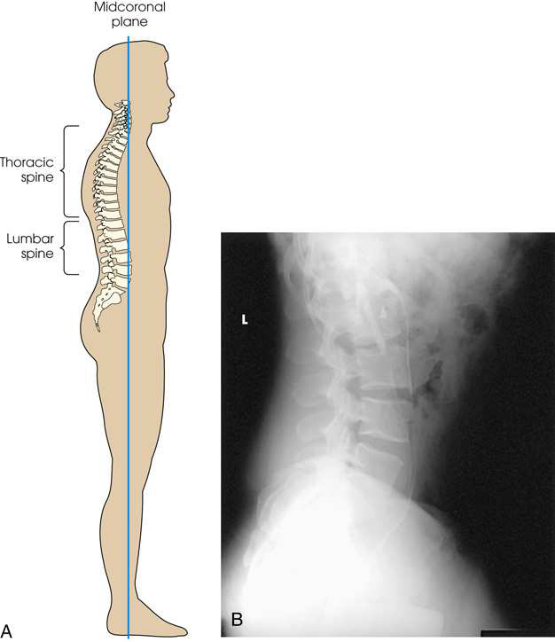

# Rx Lumbar-Lumbosacral Vertebrae — Incidență de Profil (Lateral) — Profil (Drept sau Stâng) (Merrill)

  📷 Radiografie Convențională (Rx)
  <strong>Actualizat:</strong> 2026-09-16
  <strong>Autor:</strong> Referință Merrill

---

-   __1. Rezumat Clinic & Indicații__

    ---

    === "Indicații Clinice"

        - Conform reperelor anatomice standard din tratat

    === "Ghid Național IRIS"

        !!! info "Referință Primară: Ghidul Național IRIS (Ordinul MS 1342/2012)"
            - **Capitol Ghid IRIS:** *Ghidul Național IRIS*
            - **Grad de Recomandare:** **De verificat pe indicație; fără grad atribuit automat**
            - **Nivel de Iradiere Estimată:** `De verificat pentru examinarea și populația selectate`

            [:octicons-search-16: Deschide Ghidul IRIS](../../iris.md){ .md-button .md-button--primary } [:material-open-in-new: Aplicația Oficială PWA](https://radiologie-pediatrica.ro/iris/){ .md-button target="_blank" rel="noopener" }
-   __2. Poziționare & Centrare Fascicul__

    ---

    - **Poziție Pacient:** pentru Incidență de Profil (lateral), use same corp poziție (Decubit sau în ortostatism) ca pentru AP sau Incidență Postero-Anterioară (PA). Se instruiește pacientul să dressed în open-backed gown astfel încât coloană vertebrală poate fie exposed pentru final adjustment de poziție.; Se instruiește pacientul să turn onto afected side și se flectează hips și genunchi la comfortable poziție. When examining thin pacient, adjust suitable pad under dependent Șold la relieve pressure. Align MCP de corp la linia mediană grilă și ensure that it este vertical. pe most pacienți, axa longitudinală de corpuri de Coloană Lombară este situated în planul mediocoronal (Fig. 9.90). cu pacientul’s Cot flectat, se ajustează dependent braț în unghi drept față de corp. la prevent rotație, superimpose genunchii exactly, și place small sponge sau cloth între them. Place suitable radiolucent support under lower thorax, then adjust it astfel încât axa longitudinală de coloană vertebrală este horizon̍ al (Fig. 9.91A). This este preferred method de positioning coloană vertebrală. se centrează receptorul de imagine la nivelul crestele iliace (L4) pentru lumbosacral coloană vertebrală. la show Coloană Lombară only, se centrează receptorul de imagine 1.5 inches (3.8 cm) above crestele iliace (L3). se efectuează ecranarea gonadelor cu șorț plumbat.
    - **Punct de Centrare Fascicul:** perpendicular; la nivelul crestele iliace (L4) pentru lumbosacral coloană vertebrală sau 1.5 inches (3.8 cm) above crestele iliace (L3) pentru Coloană Lombară only. raza centrală enters planul mediocoronal (see Fig. 9.91A). When coloană vertebrală cannot fie ajustat so that it este orizontal, angle raza centrală caudal so that it este perpendicular pe axa longitudinală (see
    - **Distanță Focar-Film (DFF / SID):** Nespecificat în fragmentul extras; de verificat în sursă
    - **Comandă Respiratorie:** Apnee la sfârșitul expirului complet.

-   __3. Parametri Tehnici Expunere__

    ---

    | Parametru Tehnic | Valoare Configurare Generator / Tub |
    |:-----------------|:-------------------------------------|
    | **Tensiune Tub (kV)** | DE CONFIGURAT PE APARAT |
    | **Sarcină / Produs Curent-Timp (mAs)** | DE CONFIGURAT PE APARAT |
    | **Distanță Focar-Film (DFF / SID)** | Nespecificat în fragmentul extras; de verificat în sursă |
    | **Grilă Antidifuzoare (Bucky)** | DE CONFIGURAT PE APARAT |
    | **Dimensiune Focar** | DE CONFIGURAT PE APARAT |
    | **Camere de Ionizare AEC** | DE CONFIGURAT PE APARAT |
    | **Colimare Fascicul** | Se ajustează câmpul de iradiere la formatul 18 × 43 cm pe colimator. pentru Coloană Lombară only, collimation poate fie reduced la 8 × 14 inches (18 × 35 cm). Place marker de lateralitate (D/S) în collimated expunere field. |
    | **Filtrare Tub** | DE CONFIGURAT PE APARAT |

-   __4. Criterii de Calitate & Reușită Imagine__

    ---

    - Criterii radiologice de calitate imaginii:
    - Evidence de corect collimation și presence de marker de lateralitate (D/S) plasat clear de anatomy de interest
    - Area de la lower coloană toracală la Coccis pentru lumbosacral coloană vertebrală procedure
    - Area de la lower coloană toracală la proximal Sacru pentru lumbar only
    - vertebre aliniat down middle de imagine
    - Absența rotației anatomice (simetrie bilaterală perfectă)
    - Superimposed posterior margins de fiecare vertebral corp
    - Nearly superimposed creste de ilia when x-ray fascicul este nu înclinat
    - procese spinoase în profile
    - Open intervertebral disk spaces și intervertebral foramina (L1–L4)
    - Bony detalii trabeculare osoase și surrounding soft tissues

-   __5. Protecție Radiologică (ALARA)__

    ---

    - Nespecificat în fragmentul extras; de verificat în sursă

!!! note "Observații Clinice & Tehnice"
    Conform reperelor anatomice standard din tratat

### 🖼️ Imagini

<figure class="protocol-image-card" markdown>

<figcaption><strong>Merrill — pagina PDF 730, imaginea 1</strong> — Imagine din fragmentul sursă; asocierea necesită revizie.</figcaption>

</figure>

=== "Ghid Rapid de Execuție"

    1. **Identificarea și verificarea pacientului:** verificare identitate, zonă de examinat, consimțământ conform procedurii și evaluarea posibilității unei sarcini, când este relevantă.
    2. **Pregătire:** îndepărtarea oricăror obiecte radiopace (bijuterii, agrafe, fermoare, proteze, pansamente dense).
    3. **Poziționare precisă:** alinierea receptorului de imagine și a tubului la distanța prescrisă (Nespecificat în fragmentul extras; de verificat în sursă).
    4. **Colimare strictă:** adaptarea fasciculului strict la regiunea de diagnostic pentru scăderea iradierii și reducerea radiației difuze.
    5. **Radioprotecție:** verificarea [politicii RX](../radioprotectie.md), cu măsuri distincte pentru pacient, personal și însoțitor.

## Surse de documentare

- [Merrill’s Atlas, 9. Vertebral Column, pagini PDF 728–730](../../assets/protocols/sources/a56d45c16829_Merrills_Atlas_of_Radiographic_Positioning__Procedures_3Vol_Set.pdf#page=728)

## Fragmente sursă traduse (referință tehnică)

### anatomy

lumbar corpuri și their intervertebral disk spaces, procese spinoase, și lumbosacral junction (Fig. 9.92). This incidență gives profile imagine de intervertebral foramina de L1–L4. L5 intervertebral foramina (drept și stâng) sunt nu usually well seen în this incidență
because de their oblic direction. Consequently, oblic incidențe sunt used pentru these foramina.

### collimation

• Se ajustează câmpul de iradiere la formatul 18 × 43 cm pe colimator. pentru lumbar coloană vertebrală only, collimation poate fie reduced la 8 × 14 inches
(18 × 35 cm). Place marker de lateralitate (D/S) în collimated expunere field.

### cr

• perpendicular; la nivelul crestele iliace (L4) pentru lumbosacral coloană vertebrală sau 1.5 inches (3.8 cm) above crestele iliace (L3) pentru lumbar
coloană vertebrală only. raza centrală enters planul mediocoronal (see Fig. 9.91A).
• When coloană vertebrală cannot fie ajustat so that it este orizontal, angle raza centrală caudal so that it este perpendicular pe axa longitudinală (see

### criteria

Criterii radiologice de calitate imaginii:
• Evidence de corect collimation și presence de marker de lateralitate (D/S) plasat clear de anatomy de interest
• Area de la lower coloană toracală la coccyx pentru lumbosacral coloană vertebrală procedure
• Area de la lower coloană toracală la proximal sacrum pentru lumbar only
• vertebre aliniat down middle de imagine
• Absența rotației anatomice (simetrie bilaterală perfectă)
• Superimposed posterior margins de fiecare vertebral corp
• Nearly superimposed creste de ilia when x-ray fascicul este nu înclinat
• procese spinoase în profile
• Open intervertebral disk spaces și intervertebral foramina (L1–L4)
• Bony detalii trabeculare osoase și surrounding soft tissues

### part_pos

• Se instruiește pacientul să turn onto afected side și se flectează hips și genunchi la comfortable poziție.
• When examining thin pacient, adjust suitable pad under dependent hip la relieve pressure.
• Align MCP de corp la linia mediană grilă și ensure that it este vertical. pe most pacienți, axa longitudinală de corpuri de lumbar coloană vertebrală este situated în planul mediocoronal (Fig. 9.90).
• cu pacientul’s cot flectat, se ajustează dependent braț în unghi drept față de corp.
• la prevent rotație, superimpose genunchii exactly, și place small sponge sau cloth între them.
• Place suitable radiolucent support under lower thorax, then adjust it astfel încât axa longitudinală de coloană vertebrală este horizon̍ al (Fig. 9.91A).
This este preferred method de positioning coloană vertebrală.
• se centrează receptorul de imagine la nivelul crestele iliace (L4) pentru lumbosacral coloană vertebrală.
• la show lumbar coloană vertebrală only, se centrează receptorul de imagine 1.5 inches (3.8 cm) above crestele iliace (L3).
• se efectuează ecranarea gonadelor cu șorț plumbat.

### patient_pos

• pentru poziție de profil (lateral), use same corp poziție (recumbent sau în ortostatism) ca pentru AP sau PA incidență.
• Se instruiește pacientul să dressed în open-backed gown astfel încât coloană vertebrală poate fie exposed pentru final adjustment de poziție.

### respiration

Apnee la sfârșitul expirului complet.

### tech

poziționat prin manufacturer sau department protocol pentru corect anatomy display orientation; raza centrală plate: 14 × 17 inches (35 ×
43 cm) longitudinal.

