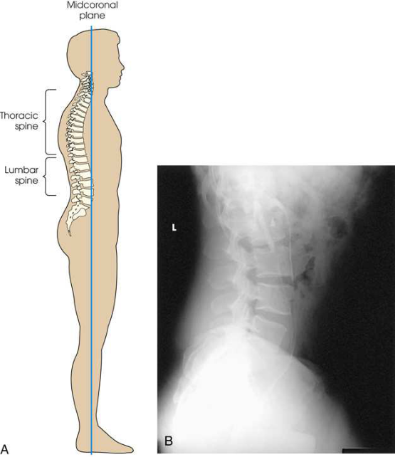

# Rx vertebrele lombare-lombosacrale — Incidență de profil (laterală) — Profil drept sau stâng (Merrill)

  📷 Radiografie Convențională (Rx)
  <strong>Actualizat:</strong> 2026-09-16
  <strong>Autor:</strong> Referință Merrill

---

-   __1. Rezumat Clinic & Indicații__

    ---

    === "Indicații Clinice"

        - Conform reperelor anatomice standard din tratat

    === "Ghid Național IRIS"

        !!! info "Referință Primară: Ghidul Național IRIS (Ordinul MS 1342/2012)"
            - **Capitol Ghid IRIS:** *Coloană vertebrală*
            - **Grad de Recomandare:** **Grad A**
            - **Nivel de Iradiere Estimată:** `Clasa 2 (Foarte mică ~ 1.0 - 1.5 mSv)`

            [:octicons-search-16: Deschide Ghidul IRIS](../../iris.md){ .md-button .md-button--primary } [:material-open-in-new: Aplicația Oficială PWA](https://radiologie-pediatrica.ro/iris/){ .md-button target="_blank" rel="noopener" }

-   __2. Poziționare & Centrare Fascicul__

    ---

    - **Poziție Pacient:** Pentru incidența de profil (laterală), se utilizează aceeași poziție a corpului (în decubit sau în ortostatism) ca pentru incidența AP sau PA. Se instruiește pacientul să îmbrace un halat deschis la spate, astfel încât coloana vertebrală să poată fi expusă pentru ajustarea finală a poziției. Se instruiește pacientul să se întoarcă pe partea afectată și se flectează șoldurile și genunchii într-o poziție confortabilă. La examinarea unui pacient slab, se ajustează un suport adecvat sub șoldul dependent pentru a reduce presiunea. Se aliniază MCP al corpului pe linia mediană a grilei și se asigură verticalitatea acestuia. La majoritatea pacienților, axa longitudinală a corpurilor vertebrale lombare este situată în planul mediocoronal (Fig. 9.90). Cu cotul pacientului flectat, se ajustează brațul dependent în unghi drept față de corp. Pentru prevenirea rotației, se suprapun exact genunchii și se așază un burete mic sau o pânză între aceștia. Se plasează un suport radiotransparent adecvat sub toracele inferior, apoi se ajustează astfel încât axa longitudinală a coloanei vertebrale să fie orizontală (Fig. 9.91A). Aceasta este metoda preferată de poziționare a coloanei vertebrale. Se centrează receptorul de imagine la nivelul crestelor iliace (L4) pentru coloana lombosacrală. Pentru evidențierea numai a coloanei lombare, se centrează receptorul de imagine la 1.5 țoli (3.8 cm) deasupra crestelor iliace (L3). Se efectuează ecranarea gonadelor cu șorț plumbat.
    - **Punct de Centrare Fascicul:** perpendicular; la nivelul crestelor iliace (L4) pentru coloana lombosacrală sau la 1.5 țoli (3.8 cm) deasupra crestelor iliace (L3) pentru coloana lombară בלבד. Raza centrală intră în planul mediocoronal (vezi Fig. 9.91A). Când coloana vertebrală nu poate fi ajustată astfel încât să fie orizontală, se angulează raza centrală caudal astfel încât să fie perpendiculară pe axa longitudinală (vezi
    - **Distanță Focar-Film (DFF / SID):** Nespecificat în fragmentul extras; de verificat în sursă
    - **Comandă Respiratorie:** Apnee la sfârșitul expirului complet.

-   __3. Parametri Tehnici Expunere__

    ---

    | Parametru Tehnic | Valoare Configurare Generator / Tub |
    |:-----------------|:-------------------------------------|
    | **Tensiune Tub (kV)** | DE CONFIGURAT PE APARAT |
    | **Sarcină / Produs Curent-Timp (mAs)** | DE CONFIGURAT PE APARAT |
    | **Distanță Focar-Film (DFF / SID)** | Nespecificat în fragmentul extras; de verificat în sursă |
    | **Grilă Antidifuzoare (Bucky)** | DE CONFIGURAT PE APARAT |
    | **Dimensiune Focar** | DE CONFIGURAT PE APARAT |
    | **Camere de Ionizare AEC** | DE CONFIGURAT PE APARAT |
    | **Colimare Fascicul** | Se ajustează câmpul de iradiere la formatul 18 × 43 cm pe colimator. Pentru coloana lombară בלבד, colimarea poate fi redusă la 8 × 14 țoli (18 × 35 cm). Se plasează markerul de lateralitate (D/S) în câmpul de expunere colimat. |
    | **Filtrare Tub** | DE CONFIGURAT PE APARAT |

-   __4. Criterii de Calitate & Reușită Imagine__

    ---

    - Criterii radiologice de calitate a imaginii:
    - Evidențierea colimării corecte și prezența markerului de lateralitate (D/S), plasat fără a se suprapune peste anatomia de interes
    - Regiunea de la coloana toracală inferioară până la coccis pentru procedura coloanei lombosacrale
    - Regiunea de la coloana toracală inferioară până la sacrul proximal, numai pentru coloana lombară
    - vertebrele aliniate pe mijlocul imaginii
    - Absența rotației anatomice (simetrie bilaterală perfectă)
    - Marginile posterioare suprapuse ale fiecărui corp vertebral
    - Crestele iliace aproape suprapuse când fasciculul de raze X nu este înclinat
    - procesele spinoase în profil
    - Spații discale intervertebrale și foramene intervertebrale deschise (L1–L4)
    - Detalii trabeculare osoase și țesuturile moi înconjurătoare

-   __5. Protecție Radiologică (ALARA)__

    ---

    - Nespecificat în fragmentul extras; de verificat în sursă

!!! note "Observații Clinice & Tehnice"
    Conform reperelor anatomice standard din tratat

### 🖼️ Imagini

<figure class="protocol-image-card" markdown>

<figcaption><strong>Merrill — pagina 730, imaginea 1</strong> — Imagine din fragmentul sursă; asocierea necesită revizie.</figcaption>

</figure>

=== "Ghid Rapid de Execuție"

    1. **Identificarea și verificarea pacientului:** verificare identitate, zonă de examinat, consimțământ conform procedurii și evaluarea posibilității unei sarcini, când este relevantă.
    2. **Pregătire:** îndepărtarea oricăror obiecte radiopace (bijuterii, agrafe, fermoare, proteze, pansamente dense).
    3. **Poziționare precisă:** alinierea receptorului de imagine și a tubului la distanța prescrisă (Nespecificat în fragmentul extras; de verificat în sursă).
    4. **Colimare strictă:** adaptarea fasciculului strict la regiunea de diagnostic pentru scăderea iradierii și reducerea radiației difuze.
    5. **Radioprotecție:** verificarea [politicii RX](../radioprotectie.md), cu măsuri distincte pentru pacient, personal și însoțitor.

## Surse de documentare

- [Merrill’s Atlas, 9. Vertebral Column, pagini 728–730](https://books.google.com/books/about/Merrill_s_Atlas_of_Radiographic_Position.html?id=BM0lEQAAQBAJ)
