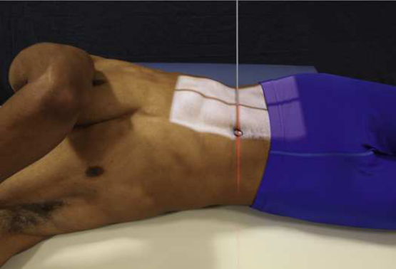
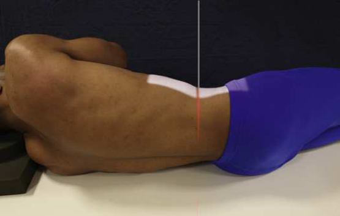
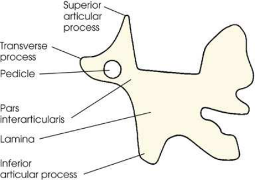
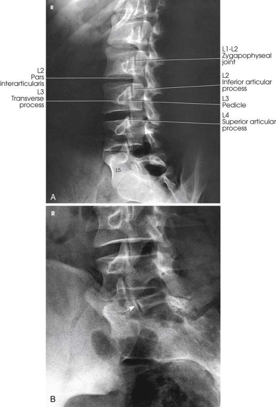
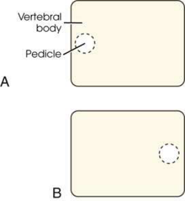

# Rx Lumbar Zygapophyseal Joints — Oblică Antero-Posterioară (AP) — RPO and Oblică Posterioară Stângă (OPS / LPO)s radiographs are obtained. (Merrill)

  📷 Radiografie Convențională (Rx)
  <strong>Actualizat:</strong> 2026-09-16
  <strong>Autor:</strong> Referință Merrill

---

-   __1. Rezumat Clinic & Indicații__

    ---

    === "Indicații Clinice"

        - Conform reperelor anatomice standard din tratat

    === "Ghid Național IRIS"

        !!! info "Referință Primară: Ghidul Național IRIS (Ordinul MS 1342/2012)"
            - **Capitol Ghid IRIS:** *Ghidul Național IRIS*
            - **Grad de Recomandare:** **De verificat pe indicație; fără grad atribuit automat**
            - **Nivel de Iradiere Estimată:** `De verificat pentru examinarea și populația selectate`

            [:octicons-search-16: Deschide Ghidul IRIS](../../iris.md){ .md-button .md-button--primary } [:material-open-in-new: Aplicația Oficială PWA](https://radiologie-pediatrica.ro/iris/){ .md-button target="_blank" rel="noopener" }
-   __2. Poziționare & Centrare Fascicul__

    ---

    - **Poziție Pacient:** When oblic incidențe sunt indicated, they sunt generally performed immediately after Incidență Antero-Posterioară (AP) și în same corp poziție (Decubit sau în ortostatism).; Se instruiește pacientul să turn de la Decubit dorsal poziție spre side de interest approximately 45 grade la show articulații cel mai apropiat de receptorul de imagine. oblic corp poziție 60 grade de la plane de receptorul de imagine poate fie needed la show L5–S1 zygapophyseal articulații. se ajustează pacient’s corp astfel încât axa longitudinală de pacientul este paralel cu axa longitudinală de masa radiologică. se centrează pacient’s coloană vertebrală la linia mediană grilă. în Incidență Oblică, Coloană Lombară lies în longitudinal plane that passes 2 inches (5 cm) medial la ridicat spină iliacă antero-superioară (SIAS). Se instruiește pacientul să place brațele în comfortable poziție. support poate fie plasat under ridicat Umăr, Șold, și Genunchi la avoid pacient mișcare (Figs. 9.95 și 9.96). se efectuează ecranarea gonadelor cu șorț plumbat.
    - **Punct de Centrare Fascicul:** Lumbar region perpendicular la enter 2 inches (5 cm) medial la ridicat spină iliacă antero-superioară (SIAS) și 1 la 1.5 inches (2.5 la 3.8 cm) above crestele iliace (L3) L5–S1 zygapophyseal articulație perpendicular la enter 2 inches (5 cm) medial la ridicat spină iliacă antero-superioară (SIAS) și la point midway între creste iliace și spină iliacă antero-superioară (SIAS) Se centrează receptorul de imagine pe raza centrală.
    - **Distanță Focar-Film (DFF / SID):** Nespecificat în fragmentul extras; de verificat în sursă
    - **Comandă Respiratorie:** Apnee la sfârșitul expirului complet.

-   __3. Parametri Tehnici Expunere__

    ---

    | Parametru Tehnic | Valoare Configurare Generator / Tub |
    |:-----------------|:-------------------------------------|
    | **Tensiune Tub (kV)** | DE CONFIGURAT PE APARAT |
    | **Sarcină / Produs Curent-Timp (mAs)** | DE CONFIGURAT PE APARAT |
    | **Distanță Focar-Film (DFF / SID)** | Nespecificat în fragmentul extras; de verificat în sursă |
    | **Grilă Antidifuzoare (Bucky)** | DE CONFIGURAT PE APARAT |
    | **Dimensiune Focar** | DE CONFIGURAT PE APARAT |
    | **Camere de Ionizare AEC** | DE CONFIGURAT PE APARAT |
    | **Colimare Fascicul** | Adjust câmp de iradiere la: 9 × 12 inches (23 × 30 cm) pe collimator pentru 10 × 12 inches (24 × 30 cm) receptorul de imagine 9 × 14 inches (23 × 35 cm) pe collimator pentru 14 × 17 inches (35 × 43 cm) receptorul de imagine 8 × 10 inches (18 × 24 cm) pe collimator pentru L5–S1 zygapophyseal articulație Place marker de lateralitate (D/S) în collimated expunere field. |
    | **Filtrare Tub** | DE CONFIGURAT PE APARAT |

-   __4. Criterii de Calitate & Reușită Imagine__

    ---

    - Criterii radiologice de calitate imaginii:
    - Evidence de corect collimation și presence de marker de lateralitate (D/S) plasat clear de anatomy de interest
    - Area de la lower coloană toracală la Sacru
    - Zygapophyseal articulații cel mai apropiat de receptorul de imagine—open și uniformly vizibil through vertebral corpuri
    - When articulație este nu well seen, și pedicle este anterior pe vertebral corp, pacientul este nu rotit enough (Fig. 9.99A).
    - When articulație este nu well seen, și pedicle este posterior pe vertebral corp, pacientul este rotit too much (see Fig. 9.99B).
    - coloană vertebrală paralel cu tabletop so that T12–L1 și L1–L2 intervertebral spații articulare remain open
    - Bony detalii trabeculare osoase și surrounding soft tissues

-   __5. Protecție Radiologică (ALARA)__

    ---

    - Nespecificat în fragmentul extras; de verificat în sursă

!!! note "Observații Clinice & Tehnice"
    Although customary 45-grade oblic corp poziție shows most L3–S1 zygapophyseal spații articulare, 25% de L1–L2 și L2–L3 articulații sunt vizualizat pe Incidență Antero-Posterioară (AP), și small percentage de L4–L5 și L5–S1 articulații sunt seen pe Incidență de Profil (lateral). 21

### 🖼️ Imagini

<figure class="protocol-image-card" markdown>

<figcaption><strong>Merrill — pagina PDF 735, imaginea 1</strong> — Imagine din fragmentul sursă; asocierea necesită revizie.</figcaption>

</figure>

<figure class="protocol-image-card" markdown>

<figcaption><strong>Merrill — pagina PDF 735, imaginea 2</strong> — Imagine din fragmentul sursă; asocierea necesită revizie.</figcaption>

</figure>

<figure class="protocol-image-card" markdown>

<figcaption><strong>Merrill — pagina PDF 736, imaginea 3</strong> — Imagine din fragmentul sursă; asocierea necesită revizie.</figcaption>

</figure>

<figure class="protocol-image-card" markdown>

<figcaption><strong>Merrill — pagina PDF 737, imaginea 4</strong> — Imagine din fragmentul sursă; asocierea necesită revizie.</figcaption>

</figure>

<figure class="protocol-image-card" markdown>

<figcaption><strong>Merrill — pagina PDF 738, imaginea 5</strong> — Imagine din fragmentul sursă; asocierea necesită revizie.</figcaption>

</figure>

=== "Ghid Rapid de Execuție"

    1. **Identificarea și verificarea pacientului:** verificare identitate, zonă de examinat, consimțământ conform procedurii și evaluarea posibilității unei sarcini, când este relevantă.
    2. **Pregătire:** îndepărtarea oricăror obiecte radiopace (bijuterii, agrafe, fermoare, proteze, pansamente dense).
    3. **Poziționare precisă:** alinierea receptorului de imagine și a tubului la distanța prescrisă (Nespecificat în fragmentul extras; de verificat în sursă).
    4. **Colimare strictă:** adaptarea fasciculului strict la regiunea de diagnostic pentru scăderea iradierii și reducerea radiației difuze.
    5. **Radioprotecție:** verificarea [politicii RX](../radioprotectie.md), cu măsuri distincte pentru pacient, personal și însoțitor.

## Surse de documentare

- [Merrill’s Atlas, 9. Vertebral Column, pagini PDF 734–738](../../assets/protocols/sources/a56d45c16829_Merrills_Atlas_of_Radiographic_Positioning__Procedures_3Vol_Set.pdf#page=734)

## Fragmente sursă traduse (referință tehnică)

### anatomy

lumbar sau lumbosacral coloană vertebrală sau ambele, evidențiind articular processes de side cel mai apropiat de receptorul de imagine. ambele părți (bilateral) sunt examined pentru comparison
(Figs. 9.97 și 9.98).
When corp este plasat în a 45-grade oblic poziție și lumbar coloană vertebrală este radiographed, articular processes și zygapophyseal
articulații sunt vizualizat. When pacientul has been properly poziționat, imagini de coloană lombară have appearance de Scottie dogs. See Fig.
9.97 shows vertebral structures that compose Scottie dog. (See Summary de oblic incidențe, p. 440.)

### collimation

• Adjust câmp de iradiere la:
• 9 × 12 inches (23 × 30 cm) pe collimator pentru 10 × 12 inches (24 × 30 cm) receptorul de imagine
• 9 × 14 inches (23 × 35 cm) pe collimator pentru 14 × 17 inches (35 × 43 cm) receptorul de imagine
• 8 × 10 inches (18 × 24 cm) pe collimator pentru L5–S1 zygapophyseal articulație
• Place marker de lateralitate (D/S) în collimated expunere field.

### cr

Lumbar region
• perpendicular la enter 2 inches (5 cm) medial la ridicat spină iliacă antero-superioară (SIAS) și 1 la 1.5 inches (2.5 la 3.8 cm) above crestele iliace (L3)
L5–S1 zygapophyseal articulație
• perpendicular la enter 2 inches (5 cm) medial la ridicat spină iliacă antero-superioară (SIAS) și la point midway între creste iliace și spină iliacă antero-superioară (SIAS)
• Se centrează receptorul de imagine pe raza centrală.

### criteria

Criterii radiologice de calitate imaginii:
• Evidence de corect collimation și presence de marker de lateralitate (D/S) plasat clear de anatomy de interest
• Area de la lower coloană toracală la sacrum
• Zygapophyseal articulații cel mai apropiat de receptorul de imagine—open și uniformly vizibil through vertebral corpuri
• When articulație este nu well seen, și pedicle este anterior pe vertebral corp, pacientul este nu rotit enough (Fig. 9.99A).
• When articulație este nu well seen, și pedicle este posterior pe vertebral corp, pacientul este rotit too much (see Fig. 9.99B).
• coloană vertebrală paralel cu tabletop so that T12–L1 și L1–L2 intervertebral spații articulare remain open
• Bony detalii trabeculare osoase și surrounding soft tissues

### notes

Although customary 45-grade oblic corp poziție shows most L3–S1 zygapophyseal spații articulare, 25% de L1–L2 și L2–L3 articulații
sunt vizualizat pe AP incidență, și small percentage de L4–L5 și L5–S1 articulații sunt seen pe lateral incidență. 21

### part_pos

• Se instruiește pacientul să turn de la decubit dorsal spre side de interest approximately 45 grade la show articulații cel mai apropiat de receptorul de imagine.
oblic corp poziție 60 grade de la plane de receptorul de imagine poate fie needed la show L5–S1 zygapophyseal articulații.
• se ajustează pacient’s corp astfel încât axa longitudinală de pacientul este paralel cu axa longitudinală de masa radiologică.
• se centrează pacient’s coloană vertebrală la linia mediană grilă. în oblic poziție, lumbar coloană vertebrală lies în longitudinal plane that passes
2 inches (5 cm) medial la ridicat spină iliacă antero-superioară (SIAS).
• Se instruiește pacientul să place brațele în comfortable poziție. support poate fie plasat under ridicat umăr, hip, și genunchi la
avoid pacient mișcare (Figs. 9.95 și 9.96).
• se efectuează ecranarea gonadelor cu șorț plumbat.

### patient_pos

• When oblic incidențe sunt indicated, they sunt generally performed immediately after AP incidență și în same corp
poziție (recumbent sau în ortostatism).

### respiration

Apnee la sfârșitul expirului complet.

### tech

poziționat prin manufacturer sau department protocol pentru corect anatomy display orientation; raza centrală plate: 10 × 12 inches (24
× 30 cm) sau 14 × 17 inches (35 × 43 cm) longitudinal.

