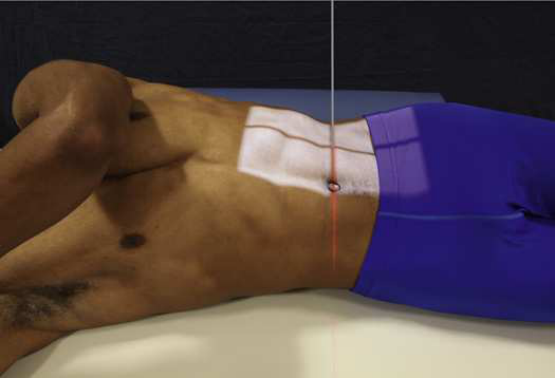
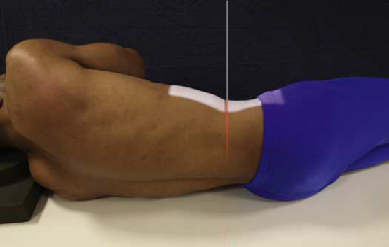
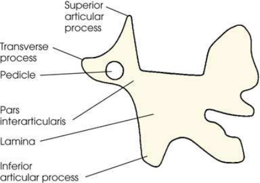
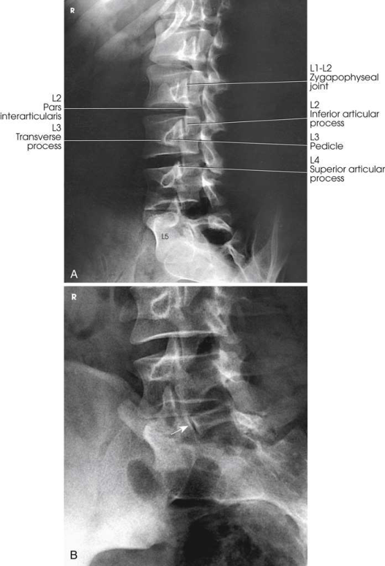
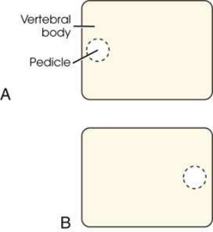

# Rx Articulațiile zigapofizare lombare — Incidență Oblică Antero-Posterioară (AP) — Se obțin radiografii RPO și Oblică Posterioară Stângă (OPS / LPO). (Merrill)

  📷 Radiografie Convențională (Rx)
  <strong>Actualizat:</strong> 2026-09-16
  <strong>Autor:</strong> Referință Merrill

---

-   __1. Rezumat Clinic & Indicații__

    ---

    === "Indicații Clinice"

        - Conform reperelor anatomice standard din tratat

    === "Ghid Național IRIS"

        !!! info "Referință Primară: Ghidul Național IRIS (Ordinul MS 1342/2012)"
            - **Capitol Ghid IRIS:** *Ghidul Național IRIS*
            - **Grad de Recomandare:** **De verificat pe indicație; fără grad atribuit automat**
            - **Nivel de Iradiere Estimată:** `De verificat pentru examinarea și populația selectate`

            [:octicons-search-16: Deschide Ghidul IRIS](../../iris.md){ .md-button .md-button--primary } [:material-open-in-new: Aplicația Oficială PWA](https://radiologie-pediatrica.ro/iris/){ .md-button target="_blank" rel="noopener" }
-   __2. Poziționare & Centrare Fascicul__

    ---

    - **Poziție Pacient:** Când sunt indicate incidențele oblice, acestea se efectuează în general imediat după incidența Antero-Posterioară (AP) și în aceeași poziție a corpului (în decubit sau în ortostatism). Se instruiește pacientul să se rotească din decubit dorsal spre partea de interes cu aproximativ 45 de grade pentru a evidenția articulațiile cele mai apropiate de receptorul de imagine. Poziția oblică a corpului la 60 de grade față de planul receptorului de imagine poate fi necesară pentru a evidenția articulațiile zigapofizare L5–S1. Se ajustează corpul pacientului astfel încât axa longitudinală a pacientului să fie paralelă cu axa longitudinală a mesei radiologice. Se centrează coloana vertebrală a pacientului pe linia mediană a grilei. În Incidență Oblică, Coloana Lombară se află în planul longitudinal care trece la 2 inches (5 cm) medial de spina iliacă antero-superioară (SIAS) ridicată. Se instruiește pacientul să plaseze brațele într-o poziție confortabilă. Un suport poate fi plasat sub Umărul, Șoldul și Genunchiul ridicate pentru a evita mișcarea pacientului (Figs. 9.95 și 9.96). Se efectuează ecranarea gonadelor cu șorț plumbat.
    - **Punct de Centrare Fascicul:** Regiunea lombară: perpendicular, pentru a intra la 2 inches (5 cm) medial față de SIAS ridicată și la 1–1.5 inches (2.5–3.8 cm) deasupra crestelor iliace (L3). Articulația zigapofizară L5–S1: perpendicular, pentru a intra la 2 inches (5 cm) medial față de SIAS ridicată și la punctul situat la jumătatea distanței dintre creasta iliacă și SIAS. Se centrează receptorul de imagine pe raza centrală.
    - **Distanță Focar-Film (DFF / SID):** Nespecificat în fragmentul extras; de verificat în sursă
    - **Comandă Respiratorie:** Apnee la sfârșitul expirului complet.

-   __3. Parametri Tehnici Expunere__

    ---

    | Parametru Tehnic | Valoare Configurare Generator / Tub |
    |:-----------------|:-------------------------------------|
    | **Tensiune Tub (kV)** | DE CONFIGURAT PE APARAT |
    | **Sarcină / Produs Curent-Timp (mAs)** | DE CONFIGURAT PE APARAT |
    | **Distanță Focar-Film (DFF / SID)** | Nespecificat în fragmentul extras; de verificat în sursă |
    | **Grilă Antidifuzoare (Bucky)** | DE CONFIGURAT PE APARAT |
    | **Dimensiune Focar** | DE CONFIGURAT PE APARAT |
    | **Camere de Ionizare AEC** | DE CONFIGURAT PE APARAT |
    | **Colimare Fascicul** | Ajustați câmpul de iradiere la: 9 × 12 inches (23 × 30 cm) pe colimator pentru receptorul de imagine de 10 × 12 inches (24 × 30 cm); 9 × 14 inches (23 × 35 cm) pe colimator pentru receptorul de imagine de 14 × 17 inches (35 × 43 cm); 8 × 10 inches (18 × 24 cm) pe colimator pentru articulația zigapofizară L5–S1. Plasați markerul de lateralitate (D/S) în câmpul de expunere colimat. |
    | **Filtrare Tub** | DE CONFIGURAT PE APARAT |

-   __4. Criterii de Calitate & Reușită Imagine__

    ---

    - Criterii radiologice de calitate a imaginii:
    - Evidențierea colimării corecte și prezența markerului de lateralitate (D/S), plasat fără a se suprapune peste anatomia de interes
    - Regiunea de la coloana toracală inferioară până la sacru
    - Articulațiile zigapofizare cele mai apropiate de receptorul de imagine — deschise și vizibile uniform prin corpurile vertebrale
    - Când articulația nu este bine vizibilă, iar pediculul este anterior pe corpul vertebral, pacientul nu este rotit suficient (Fig. 9.99A).
    - Când articulația nu este bine vizibilă, iar pediculul este posterior pe corpul vertebral, pacientul este rotit prea mult (vezi Fig. 9.99B).
    - Coloana vertebrală paralelă cu masa radiologică, astfel încât spațiile articulare intervertebrale T12–L1 și L1–L2 să rămână deschise
    - Detalii trabeculare osoase și țesuturile moi înconjurătoare

-   __5. Protecție Radiologică (ALARA)__

    ---

    - Nespecificat în fragmentul extras; de verificat în sursă

!!! note "Observații Clinice & Tehnice"
    Deși poziția obișnuită a corpului în oblică la 45 de grade evidențiază majoritatea spațiilor articulare zigapofizare L3–S1, 25% dintre articulațiile L1–L2 și L2–L3 sunt vizualizate în incidența AP, iar un procent mic dintre articulațiile L4–L5 și L5–S1 sunt vizibile în incidența de profil (laterală). 21

### 🖼️ Imagini

<figure class="protocol-image-card" markdown>

<figcaption><strong>Merrill — pagina 735, imaginea 1</strong> — Imagine din fragmentul sursă; asocierea necesită revizie.</figcaption>

</figure>

<figure class="protocol-image-card" markdown>

<figcaption><strong>Merrill — pagina 735, imaginea 2</strong> — Imagine din fragmentul sursă; asocierea necesită revizie.</figcaption>

</figure>

<figure class="protocol-image-card" markdown>

<figcaption><strong>Merrill — pagina 736, imaginea 3</strong> — Imagine din fragmentul sursă; asocierea necesită revizie.</figcaption>

</figure>

<figure class="protocol-image-card" markdown>

<figcaption><strong>Merrill — pagina 737, imaginea 4</strong> — Imagine din fragmentul sursă; asocierea necesită revizie.</figcaption>

</figure>

<figure class="protocol-image-card" markdown>

<figcaption><strong>Merrill — pagina 738, imaginea 5</strong> — Imagine din fragmentul sursă; asocierea necesită revizie.</figcaption>

</figure>

=== "Ghid Rapid de Execuție"

    1. **Identificarea și verificarea pacientului:** verificare identitate, zonă de examinat, consimțământ conform procedurii și evaluarea posibilității unei sarcini, când este relevantă.
    2. **Pregătire:** îndepărtarea oricăror obiecte radiopace (bijuterii, agrafe, fermoare, proteze, pansamente dense).
    3. **Poziționare precisă:** alinierea receptorului de imagine și a tubului la distanța prescrisă (Nespecificat în fragmentul extras; de verificat în sursă).
    4. **Colimare strictă:** adaptarea fasciculului strict la regiunea de diagnostic pentru scăderea iradierii și reducerea radiației difuze.
    5. **Radioprotecție:** verificarea [politicii RX](../radioprotectie.md), cu măsuri distincte pentru pacient, personal și însoțitor.

## Surse de documentare

- [Merrill’s Atlas, 9. Vertebral Column, pagini 734–738](https://books.google.com/books/about/Merrill_s_Atlas_of_Radiographic_Position.html?id=BM0lEQAAQBAJ)

## Fragmente sursă traduse (referință tehnică)

### anatomie

Coloana vertebrală lombară sau lombosacrală sau ambele, evidențiind procesele articulare de partea cea mai apropiată de receptorul de imagine. Ambele părți (bilateral) sunt examinate pentru comparație
(Figs. 9.97 și 9.98).
Când corpul este plasat într-o poziție oblică de 45 de grade și coloana vertebrală lombară este radiografiată, procesele articulare și articulațiile zigapofizare sunt vizualizate. Când pacientul a fost poziționat corect, imaginile coloanei lombare au aspectul unor câini Scottie. Vezi Fig.
9.97, care prezintă structurile vertebrale ce alcătuiesc câinele Scottie. (Vezi Rezumatul incidențelor oblice, p. 440.)

### colimare

• Ajustați câmpul de iradiere la:
• 9 × 12 inches (23 × 30 cm) pe colimator pentru receptorul de imagine de 10 × 12 inches (24 × 30 cm)
• 9 × 14 inches (23 × 35 cm) pe colimator pentru receptorul de imagine de 14 × 17 inches (35 × 43 cm)
• 8 × 10 inches (18 × 24 cm) pe colimator pentru articulația zigapofizară L5–S1
• Plasați markerul de lateralitate (D/S) în câmpul de expunere colimat.

### raza centrală

Regiunea lombară
• perpendicular pentru a intra la 2 inches (5 cm) medial de spina iliacă antero-superioară (SIAS) ridicată și la 1 la 1.5 inches (2.5 la 3.8 cm) deasupra crestelor iliace (L3)
Articulația zigapofizară L5–S1
• perpendicular pentru a intra la 2 inches (5 cm) medial de spina iliacă antero-superioară (SIAS) ridicată și în punctul situat la jumătatea distanței dintre crestele iliace și spina iliacă antero-superioară (SIAS)
• Se centrează receptorul de imagine pe raza centrală.

### criterii

Criterii radiologice de calitate a imaginii:
• Dovezi de colimare corectă și prezența unui marker de lateralitate (D/S) plasat clar față de anatomia de interes
• Regiunea de la coloana toracală inferioară până la sacrum
• Articulațiile zigapofizare cele mai apropiate de receptorul de imagine — deschise și vizibile uniform prin corpurile vertebrale
• Când articulația nu este bine vizibilă, iar pediculul este anterior pe corpul vertebral, pacientul nu este rotit suficient (Fig. 9.99A).
• Când articulația nu este bine vizibilă, iar pediculul este posterior pe corpul vertebral, pacientul este rotit prea mult (vezi Fig. 9.99B).
• Coloana vertebrală paralelă cu masa radiologică, astfel încât spațiile articulare intervertebrale T12–L1 și L1–L2 să rămână deschise
• Detalii osoase trabeculare și țesuturile moi înconjurătoare

### note

Deși poziția oblică obișnuită a corpului, la 45 de grade, evidențiază majoritatea spațiilor articulare zigapofizare L3–S1, 25% dintre articulațiile L1–L2 și L2–L3 sunt vizualizate pe incidența AP, iar un procent mic dintre articulațiile L4–L5 și L5–S1 sunt vizibile pe incidența de profil. 21

### part_pos

• Se instruiește pacientul să se rotească din decubit dorsal spre partea de interes cu aproximativ 45 de grade pentru a evidenția articulațiile cele mai apropiate de receptorul de imagine.
Poziția oblică a corpului la 60 de grade față de planul receptorului de imagine poate fi necesară pentru a evidenția articulațiile zigapofizare L5–S1.
• Se ajustează corpul pacientului astfel încât axa longitudinală a pacientului să fie paralelă cu axa longitudinală a mesei radiologice.
• Se centrează coloana vertebrală a pacientului pe linia mediană a grilei. În poziția oblică, coloana vertebrală lombară se află în planul longitudinal care trece la 2 inches (5 cm) medial de spina iliacă antero-superioară (SIAS) ridicată.
• Se instruiește pacientul să plaseze brațele într-o poziție confortabilă. Un suport poate fi plasat sub umărul, șoldul și genunchiul ridicate pentru a evita mișcarea pacientului (Figs. 9.95 și 9.96).
• Se efectuează ecranarea gonadelor cu șorț plumbat.

### patient_pos

• Când sunt indicate incidențele oblice, acestea se efectuează în general imediat după incidența AP și în aceeași poziție a corpului (în decubit sau în ortostatism).

### respirație

Apnee la sfârșitul expirului complet.

### tehnică

Poziționat de producător sau prin protocolul departamentului pentru afișarea corectă a orientării anatomice; placa pentru raza centrală: 10 × 12 inches (24 × 30 cm) sau 14 × 17 inches (35 × 43 cm), longitudinal.

