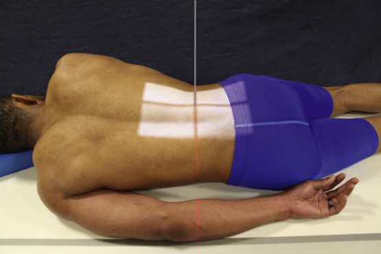
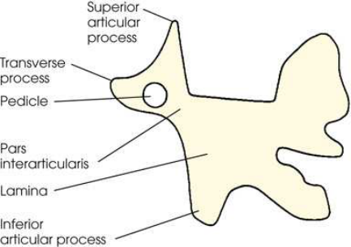

# Rx Lumbar Zygapophyseal Joints — Oblică Postero-Anterioară (PA) — RAO and Oblică Anterioară Stângă (OAS / LAO)s (Merrill)

  📷 Radiografie Convențională (Rx)
  <strong>Actualizat:</strong> 2026-09-16
  <strong>Autor:</strong> Referință Merrill

---

-   __1. Rezumat Clinic & Indicații__

    ---

    === "Indicații Clinice"

        - Conform reperelor anatomice standard din tratat

    === "Ghid Național IRIS"

        !!! info "Referință Primară: Ghidul Național IRIS (Ordinul MS 1342/2012)"
            - **Capitol Ghid IRIS:** *Ghidul Național IRIS*
            - **Grad de Recomandare:** **De verificat pe indicație; fără grad atribuit automat**
            - **Nivel de Iradiere Estimată:** `De verificat pentru examinarea și populația selectate`

            [:octicons-search-16: Deschide Ghidul IRIS](../../iris.md){ .md-button .md-button--primary } [:material-open-in-new: Aplicația Oficială PWA](https://radiologie-pediatrica.ro/iris/){ .md-button target="_blank" rel="noopener" }
-   __2. Poziționare & Centrare Fascicul__

    ---

    - **Poziție Pacient:** Examine pacientul în ortostatism sau Decubit Decubit ventral poziție. Decubit poziție este generally used because it facilitates imobilizare. Greater ease în positioning pacientul și resultant higher percentage de success în duplicating results make semiprone poziție preferable la semisupine poziție. OID este increased, however, which poate afect resolution.; de la Decubit ventral poziție, Se instruiește pacientul să turn away de la side de interest approximately 45 grade la show zygapophyseal articulații ̌ arthest de la receptorul de imagine și support corp pe Antebraț și flectat Genunchi. oblic corp poziție 60 grade de la plane de receptorul de imagine poate fie needed la show L5–S1 zygapophyseal articulații. se ajustează pacient’s corp astfel încât axa longitudinală de pacientul este paralel cu axa longitudinală de masa radiologică. se centrează pacient’s coloană vertebrală la linia mediană grilă. în Incidență Oblică, Coloană Lombară lies în longitudinal plane that passes 2 inches (5 cm) lateral la procese spinoase (Fig. 9.100). se efectuează ecranarea gonadelor cu șorț plumbat.
    - **Punct de Centrare Fascicul:** Lumbar region perpendicular la enter ridicat side approximately 2 inches (5 cm) lateral la palpable spinous process și 1 la 1.5 inches (2.5 la 3.8 cm) above crestele iliace. L5–S1 zygapophyseal articulație perpendicular la enter ridicat side 2 inches (5 cm) lateral la spinous process și la point midway între creste iliace și spină iliacă antero-superioară (SIAS). Se centrează receptorul de imagine pe raza centrală.
    - **Distanță Focar-Film (DFF / SID):** Nespecificat în fragmentul extras; de verificat în sursă
    - **Comandă Respiratorie:** Apnee la sfârșitul expirului complet.

-   __3. Parametri Tehnici Expunere__

    ---

    | Parametru Tehnic | Valoare Configurare Generator / Tub |
    |:-----------------|:-------------------------------------|
    | **Tensiune Tub (kV)** | DE CONFIGURAT PE APARAT |
    | **Sarcină / Produs Curent-Timp (mAs)** | DE CONFIGURAT PE APARAT |
    | **Distanță Focar-Film (DFF / SID)** | Nespecificat în fragmentul extras; de verificat în sursă |
    | **Grilă Antidifuzoare (Bucky)** | DE CONFIGURAT PE APARAT |
    | **Dimensiune Focar** | DE CONFIGURAT PE APARAT |
    | **Camere de Ionizare AEC** | DE CONFIGURAT PE APARAT |
    | **Colimare Fascicul** | Adjust câmp de iradiere la: 9 × 12 inches (23 × 30 cm) pe collimator pentru 10 × 12 inches (24 × 30 cm) receptorul de imagine 9 × 14 inches (23 × 35 cm) pe collimator pentru 14 × 17 inches (35 × 43 cm) receptorul de imagine 8 × 10 inches (18 × 24 cm) pe collimator pentru L5–S1 zygapophyseal articulație Place marker de lateralitate (D/S) în collimated expunere field. |
    | **Filtrare Tub** | DE CONFIGURAT PE APARAT |

-   __4. Criterii de Calitate & Reușită Imagine__

    ---

    - Criterii radiologice de calitate imaginii:
    - Evidence de corect collimation și presence de marker de lateralitate (D/S) plasat clear de anatomy de interest
    - Area de la lower coloană toracală la Sacru
    - Zygapophyseal articulații ̌ arthest de la receptorul de imagine
    - When articulație este nu well seen și pedicle este quite anterior pe vertebral corp, pacientul este nu rotit enough.
    - When articulație este nu well seen și pedicle este quite posterior pe vertebral corp, pacientul este rotit too much.
    - coloană vertebrală paralel cu tabletop astfel încât T12–L1 și L1–L2 intervertebral spații articulare remain open
    - Bony detalii trabeculare osoase și surrounding soft tissues

-   __5. Protecție Radiologică (ALARA)__

    ---

    - Nespecificat în fragmentul extras; de verificat în sursă

!!! note "Observații Clinice & Tehnice"
    Conform reperelor anatomice standard din tratat

### 🖼️ Imagini

<figure class="protocol-image-card" markdown>

<figcaption><strong>Merrill — pagina PDF 739, imaginea 1</strong> — Imagine din fragmentul sursă; asocierea necesită revizie.</figcaption>

</figure>

<figure class="protocol-image-card" markdown>

<figcaption><strong>Merrill — pagina PDF 740, imaginea 2</strong> — Imagine din fragmentul sursă; asocierea necesită revizie.</figcaption>

</figure>

=== "Ghid Rapid de Execuție"

    1. **Identificarea și verificarea pacientului:** verificare identitate, zonă de examinat, consimțământ conform procedurii și evaluarea posibilității unei sarcini, când este relevantă.
    2. **Pregătire:** îndepărtarea oricăror obiecte radiopace (bijuterii, agrafe, fermoare, proteze, pansamente dense).
    3. **Poziționare precisă:** alinierea receptorului de imagine și a tubului la distanța prescrisă (Nespecificat în fragmentul extras; de verificat în sursă).
    4. **Colimare strictă:** adaptarea fasciculului strict la regiunea de diagnostic pentru scăderea iradierii și reducerea radiației difuze.
    5. **Radioprotecție:** verificarea [politicii RX](../radioprotectie.md), cu măsuri distincte pentru pacient, personal și însoțitor.

## Surse de documentare

- [Merrill’s Atlas, 9. Vertebral Column, pagini PDF 738–740](../../assets/protocols/sources/a56d45c16829_Merrills_Atlas_of_Radiographic_Positioning__Procedures_3Vol_Set.pdf#page=738)

## Fragmente sursă traduse (referință tehnică)

### anatomy

lumbar sau lumbosacral vertebre, evidențiind articular processes de side ̌ arther de la receptorul de imagine (Figs. 9.101–9.103). T12–L1 articulation
între twelfth thoracic și first coloană lombară, having same direction ca those în lumbar region, este vizualizat pe larger receptorul de imagine. fifth lumbosacral articulație este usually well vizualizat în oblic poziții (see Fig. 9.103).
When corp este plasat în a 45-grade oblic poziție, și lumbar coloană vertebrală este radiographed, articular processes și zygapophyseal
articulații sunt vizualizat. When pacientul has been properly poziționat, imagini de coloană lombară have appearance de Scottie dogs. Fig. 9.101
identifies vertebral structures that compose Scottie dog. (See Summary de oblic incidențe, p. 440.)

### collimation

• Adjust câmp de iradiere la:
• 9 × 12 inches (23 × 30 cm) pe collimator pentru 10 × 12 inches (24 × 30 cm) receptorul de imagine
• 9 × 14 inches (23 × 35 cm) pe collimator pentru 14 × 17 inches (35 × 43 cm) receptorul de imagine
• 8 × 10 inches (18 × 24 cm) pe collimator pentru L5–S1 zygapophyseal articulație
• Place marker de lateralitate (D/S) în collimated expunere field.

### cr

Lumbar region
• perpendicular la enter ridicat side approximately 2 inches (5 cm) lateral la palpable spinous process și 1 la 1.5 inches (2.5 la
3.8 cm) above crestele iliace.
L5–S1 zygapophyseal articulație
• perpendicular la enter ridicat side 2 inches (5 cm) lateral la spinous process și la point midway între creste iliace și
spină iliacă antero-superioară (SIAS).
• Se centrează receptorul de imagine pe raza centrală.

### criteria

Criterii radiologice de calitate imaginii:
• Evidence de corect collimation și presence de marker de lateralitate (D/S) plasat clear de anatomy de interest
• Area de la lower coloană toracală la sacrum
• Zygapophyseal articulații ̌ arthest de la receptorul de imagine
• When articulație este nu well seen și pedicle este quite anterior pe vertebral corp, pacientul este nu rotit enough.
• When articulație este nu well seen și pedicle este quite posterior pe vertebral corp, pacientul este rotit too much.
• coloană vertebrală paralel cu tabletop astfel încât T12–L1 și L1–L2 intervertebral spații articulare remain open
• Bony detalii trabeculare osoase și surrounding soft tissues

### part_pos

• de la decubit ventral, Se instruiește pacientul să turn away de la side de interest approximately 45 grade la show zygapophyseal
articulații ̌ arthest de la receptorul de imagine și support corp pe forearm și flectat genunchi. oblic corp poziție 60 grade de la plane
de receptorul de imagine poate fie needed la show L5–S1 zygapophyseal articulații.
• se ajustează pacient’s corp astfel încât axa longitudinală de pacientul este paralel cu axa longitudinală de masa radiologică.
• se centrează pacient’s coloană vertebrală la linia mediană grilă. în oblic poziție, lumbar coloană vertebrală lies în longitudinal plane that passes
2 inches (5 cm) lateral la procese spinoase (Fig. 9.100).
• se efectuează ecranarea gonadelor cu șorț plumbat.

### patient_pos

• Examine pacientul în ortostatism sau recumbent decubit ventral. recumbent poziție este generally used because it facilitates
imobilizare.
• Greater ease în positioning pacientul și resultant higher percentage de success în duplicating results make semiprone poziție
preferable la semisupine poziție. OID este increased, however, which poate afect resolution.

### respiration

Apnee la sfârșitul expirului complet.

### tech

10 × 12 inches (24 × 30 cm) sau 14 × 17 inches (35 × 43 cm) longitudinal.

