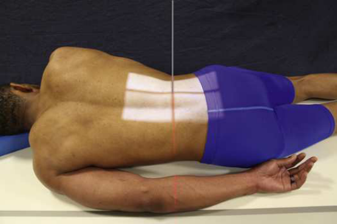
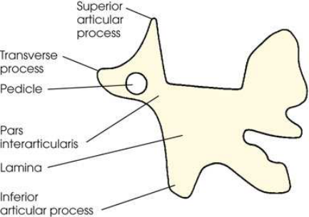

# Rx Articulațiile zigapofizare lombare — Incidență Oblică Postero-Anterioară (PA) — Se obțin radiografii RAO și Oblică Anterioară Stângă (OAS / LAO). (Merrill)

  📷 Radiografie Convențională (Rx)
  <strong>Actualizat:</strong> 2026-09-16
  <strong>Autor:</strong> Referință Merrill

---

-   __1. Rezumat Clinic & Indicații__

    ---

    === "Indicații Clinice"

        - Conform reperelor anatomice standard din tratat

    === "Ghid Național IRIS"

        !!! info "Referință Primară: Ghidul Național IRIS (Ordinul MS 1342/2012)"
            - **Capitol Ghid IRIS:** *Coloană vertebrală*
            - **Grad de Recomandare:** **Grad A**
            - **Nivel de Iradiere Estimată:** `Clasa 2 (Foarte mică ~ 1.0 - 1.5 mSv)`

            [:octicons-search-16: Deschide Ghidul IRIS](../../iris.md){ .md-button .md-button--primary } [:material-open-in-new: Aplicația Oficială PWA](https://radiologie-pediatrica.ro/iris/){ .md-button target="_blank" rel="noopener" }

-   __2. Poziționare & Centrare Fascicul__

    ---

    - **Poziție Pacient:** Examinați pacientul în ortostatism sau în decubit ventral. Poziția în decubit este utilizată în general deoarece facilitează imobilizarea. Ușurința mai mare în poziționarea pacientului și procentul mai mare de reușită rezultat în reproducerea rezultatelor fac ca poziția semipronă să fie preferabilă poziției semisupine. OID este crescut, însă, ceea ce poate afecta rezoluția. Din poziția în decubit ventral, se instruiește pacientul să se rotească în direcția opusă părții de interes cu aproximativ 45 de grade pentru a evidenția articulațiile zigapofizare cele mai îndepărtate de receptorul de imagine și să-și sprijine corpul pe antebraț și genunchiul flectat. Poziția oblică a corpului la 60 de grade față de planul receptorului de imagine poate fi necesară pentru a evidenția articulațiile zigapofizare L5–S1. Se ajustează corpul pacientului astfel încât axa longitudinală a pacientului să fie paralelă cu axa longitudinală a mesei radiologice. Se centrează coloana vertebrală a pacientului pe linia mediană a grilei. În Incidență Oblică, Coloana Lombară se află în planul longitudinal care trece la 2 țoli (5 cm) lateral de procesele spinoase (Fig. 9.100). Se efectuează ecranarea gonadelor cu șorț plumbat.
    - **Punct de Centrare Fascicul:** Regiunea lombară: perpendicular pentru a intra de partea ridicată, la aproximativ 2 țoli (5 cm) lateral de procesul spinos palpabil și la 1 la 1.5 țoli (2.5 la 3.8 cm) deasupra crestelor iliace. Articulația zigapofizară L5–S1: perpendicular pentru a intra de partea ridicată, la 2 țoli (5 cm) lateral de procesul spinos și în punctul situat la jumătatea distanței dintre crestele iliace și spina iliacă antero-superioară (SIAS). Se centrează receptorul de imagine pe raza centrală.
    - **Distanță Focar-Film (DFF / SID):** Nespecificat în fragmentul extras; de verificat în sursă
    - **Comandă Respiratorie:** Apnee la sfârșitul expirului complet.

-   __3. Parametri Tehnici Expunere__

    ---

    | Parametru Tehnic | Valoare Configurare Generator / Tub |
    |:-----------------|:-------------------------------------|
    | **Tensiune Tub (kV)** | DE CONFIGURAT PE APARAT |
    | **Sarcină / Produs Curent-Timp (mAs)** | DE CONFIGURAT PE APARAT |
    | **Distanță Focar-Film (DFF / SID)** | Nespecificat în fragmentul extras; de verificat în sursă |
    | **Grilă Antidifuzoare (Bucky)** | DE CONFIGURAT PE APARAT |
    | **Dimensiune Focar** | DE CONFIGURAT PE APARAT |
    | **Camere de Ionizare AEC** | DE CONFIGURAT PE APARAT |
    | **Colimare Fascicul** | Ajustați câmpul de iradiere la: 9 × 12 țoli (23 × 30 cm) pe colimator pentru receptorul de imagine de 10 × 12 țoli (24 × 30 cm); 9 × 14 țoli (23 × 35 cm) pe colimator pentru receptorul de imagine de 14 × 17 țoli (35 × 43 cm); 8 × 10 țoli (18 × 24 cm) pe colimator pentru articulația zigapofizară L5–S1. Plasați markerul de lateralitate (D/S) în câmpul de expunere colimat. |
    | **Filtrare Tub** | DE CONFIGURAT PE APARAT |

-   __4. Criterii de Calitate & Reușită Imagine__

    ---

    - Criterii radiologice de calitate a imaginii:
    - Evidențierea colimării corecte și prezența markerului de lateralitate (D/S), plasat fără a se suprapune peste anatomia de interes
    - Regiunea de la coloana toracală inferioară până la sacru
    - Articulațiile zigapofizare cele mai îndepărtate de receptorul de imagine
    - Când articulația nu este bine vizibilă, iar pediculul este foarte anterior pe corpul vertebral, pacientul nu este rotit suficient.
    - Când articulația nu este bine vizibilă, iar pediculul este foarte posterior pe corpul vertebral, pacientul este rotit prea mult.
    - Coloana vertebrală paralelă cu masa radiologică, astfel încât spațiile articulare intervertebrale T12–L1 și L1–L2 să rămână deschise
    - Detalii trabeculare osoase și țesuturile moi înconjurătoare

-   __5. Protecție Radiologică (ALARA)__

    ---

    - Nespecificat în fragmentul extras; de verificat în sursă

!!! note "Observații Clinice & Tehnice"
    Conform reperelor anatomice standard din tratat

### 🖼️ Imagini

<figure class="protocol-image-card" markdown>

<figcaption><strong>Merrill — pagina 739, imaginea 1</strong> — Imagine din fragmentul sursă; asocierea necesită revizie.</figcaption>

</figure>

<figure class="protocol-image-card" markdown>

<figcaption><strong>Merrill — pagina 740, imaginea 2</strong> — Imagine din fragmentul sursă; asocierea necesită revizie.</figcaption>

</figure>

=== "Ghid Rapid de Execuție"

    1. **Identificarea și verificarea pacientului:** verificare identitate, zonă de examinat, consimțământ conform procedurii și evaluarea posibilității unei sarcini, când este relevantă.
    2. **Pregătire:** îndepărtarea oricăror obiecte radiopace (bijuterii, agrafe, fermoare, proteze, pansamente dense).
    3. **Poziționare precisă:** alinierea receptorului de imagine și a tubului la distanța prescrisă (Nespecificat în fragmentul extras; de verificat în sursă).
    4. **Colimare strictă:** adaptarea fasciculului strict la regiunea de diagnostic pentru scăderea iradierii și reducerea radiației difuze.
    5. **Radioprotecție:** verificarea [politicii RX](../radioprotectie.md), cu măsuri distincte pentru pacient, personal și însoțitor.

## Surse de documentare

- [Merrill’s Atlas, 9. Vertebral Column, pagini 738–740](https://books.google.com/books/about/Merrill_s_Atlas_of_Radiographic_Position.html?id=BM0lEQAAQBAJ)
