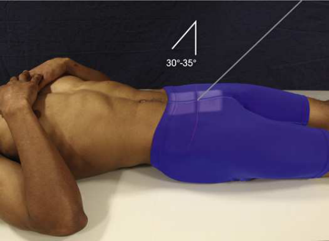
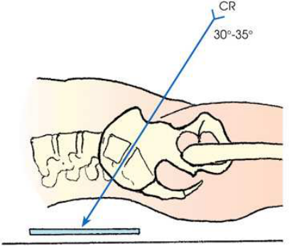
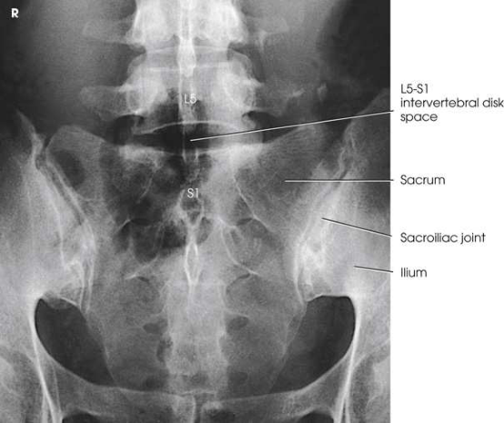
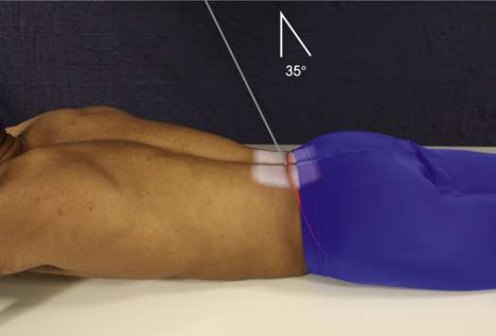

# Rx Lumbosacral Junction and Sacroiliac Joints — Ap or Incidență PA Axială — Incidență Scolioză / Joncțiune L5-S1 (Metoda Ferguson) 22 (Merrill)

  📷 Radiografie Convențională (Rx)
  <strong>Actualizat:</strong> 2026-09-16
  <strong>Autor:</strong> Referință Merrill

---

-   __1. Rezumat Clinic & Indicații__

    ---

    === "Indicații Clinice"

        - Conform reperelor anatomice standard din tratat

    === "Ghid Național IRIS"

        !!! info "Referință Primară: Ghidul Național IRIS (Ordinul MS 1342/2012)"
            - **Capitol Ghid IRIS:** *Ghidul Național IRIS*
            - **Grad de Recomandare:** **De verificat pe indicație; fără grad atribuit automat**
            - **Nivel de Iradiere Estimată:** `De verificat pentru examinarea și populația selectate`

            [:octicons-search-16: Deschide Ghidul IRIS](../../iris.md){ .md-button .md-button--primary } [:material-open-in-new: Aplicația Oficială PWA](https://radiologie-pediatrica.ro/iris/){ .md-button target="_blank" rel="noopener" }
-   __2. Poziționare & Centrare Fascicul__

    ---

    - **Poziție Pacient:** pentru Incidență AP Axială de lumbosacral și sacroiliac articulații, se poziționează pacientul în Decubit dorsal poziție.; cu pacientul Decubit dorsal și MSP centrat pe grila, se extinde pacient’s lower limbs sau abduct thighs și adjust în vertical poziție (Fig. 9.104). Ensure that Bazin (bazin (pelvis)) este nu rotit. se efectuează ecranarea gonadelor cu șorț plumbat.
    - **Punct de Centrare Fascicul:** orientat through lumbosacral articulație la average angle de 30 la 35 grade cranial. 23 angulation de 30 grade în male pacienți și 35 grade în female pacienți este usually satisfactory. prin noting contour de lower back, unusual accentuation sau diminution de lumbosacral angle poate fie estimated, și raza centrală angulation poate fie varied accordingly. raza centrală enters MSP la point about 1.5 inches (3.8 cm) superior la simfiză pubiană sau 2 la 2.5 inches (5 la 6.5 cm) inferior la spină iliacă antero-superioară (SIAS) (Fig. 9.105). Ferguson originally recommended angle de 45 grade. Se centrează receptorul de imagine pe raza centrală.
    - **Distanță Focar-Film (DFF / SID):** Nespecificat în fragmentul extras; de verificat în sursă
    - **Comandă Respiratorie:** apnee (oprirea respirației).

-   __3. Parametri Tehnici Expunere__

    ---

    | Parametru Tehnic | Valoare Configurare Generator / Tub |
    |:-----------------|:-------------------------------------|
    | **Tensiune Tub (kV)** | DE CONFIGURAT PE APARAT |
    | **Sarcină / Produs Curent-Timp (mAs)** | DE CONFIGURAT PE APARAT |
    | **Distanță Focar-Film (DFF / SID)** | Nespecificat în fragmentul extras; de verificat în sursă |
    | **Grilă Antidifuzoare (Bucky)** | DE CONFIGURAT PE APARAT |
    | **Dimensiune Focar** | DE CONFIGURAT PE APARAT |
    | **Camere de Ionizare AEC** | DE CONFIGURAT PE APARAT |
    | **Colimare Fascicul** | Se ajustează câmpul de iradiere la formatul 18 × 24 cm pe colimator. Place marker de lateralitate (D/S) în collimated expunere field. |
    | **Filtrare Tub** | DE CONFIGURAT PE APARAT |

-   __4. Criterii de Calitate & Reușită Imagine__

    ---

    - Criterii radiologice de calitate imaginii:
    - Evidence de corect collimation și presence de marker de lateralitate (D/S) plasat clear de anatomy de interest
    - Lumbosacral junction și Sacru
    - Open intervertebral disk space între L5 și S1
    - ambele sacroiliac articulații
    - Bony detalii trabeculare osoase și surrounding soft tissues

-   __5. Protecție Radiologică (ALARA)__

    ---

    - Nespecificat în fragmentul extras; de verificat în sursă

!!! note "Observații Clinice & Tehnice"
    Incidență PA Axială pentru lumbosacral junction poate fie modified în accordance cu Incidență AP Axială just described. cu pacientul în Decubit ventral poziție, raza centrală este orientat through lumbosacral articulație la midpoint de receptorul de imagine la average angle de 35 grade caudal. raza centrală enters spinous process de L4 (Figs. 9.107 și 9.108). Meese 24 recommended Decubit ventral poziție pentru examinations de sacroiliac articulații because their obliquity places them în poziție more nearly paralel cu divergence de fascicul de radiation. raza centrală este orientat perpendicularly și este centrat la nivelul level de spină iliacă antero-superioară (SIAS). It enters linia mediană pacient about 2 inches (5 cm) distal la spinous process de L5 (Fig. 9.109).

### 🖼️ Imagini

<figure class="protocol-image-card" markdown>

<figcaption><strong>Merrill — pagina PDF 742, imaginea 1</strong> — Imagine din fragmentul sursă; asocierea necesită revizie.</figcaption>

</figure>

<figure class="protocol-image-card" markdown>

<figcaption><strong>Merrill — pagina PDF 743, imaginea 2</strong> — Imagine din fragmentul sursă; asocierea necesită revizie.</figcaption>

</figure>

<figure class="protocol-image-card" markdown>

<figcaption><strong>Merrill — pagina PDF 743, imaginea 3</strong> — Imagine din fragmentul sursă; asocierea necesită revizie.</figcaption>

</figure>

<figure class="protocol-image-card" markdown>

<figcaption><strong>Merrill — pagina PDF 744, imaginea 4</strong> — Imagine din fragmentul sursă; asocierea necesită revizie.</figcaption>

</figure>

=== "Ghid Rapid de Execuție"

    1. **Identificarea și verificarea pacientului:** verificare identitate, zonă de examinat, consimțământ conform procedurii și evaluarea posibilității unei sarcini, când este relevantă.
    2. **Pregătire:** îndepărtarea oricăror obiecte radiopace (bijuterii, agrafe, fermoare, proteze, pansamente dense).
    3. **Poziționare precisă:** alinierea receptorului de imagine și a tubului la distanța prescrisă (Nespecificat în fragmentul extras; de verificat în sursă).
    4. **Colimare strictă:** adaptarea fasciculului strict la regiunea de diagnostic pentru scăderea iradierii și reducerea radiației difuze.
    5. **Radioprotecție:** verificarea [politicii RX](../radioprotectie.md), cu măsuri distincte pentru pacient, personal și însoțitor.

## Surse de documentare

- [Merrill’s Atlas, 9. Vertebral Column, pagini PDF 742–744](../../assets/protocols/sources/a56d45c16829_Merrills_Atlas_of_Radiographic_Positioning__Procedures_3Vol_Set.pdf#page=742)

## Fragmente sursă traduse (referință tehnică)

### anatomy

lumbosacral articulație și simetric imagine de ambele sacroiliac articulații liber de superimposition (Fig. 9.106).

### collimation

• Se ajustează câmpul de iradiere la formatul 18 × 24 cm pe colimator. Place marker de lateralitate (D/S) în collimated expunere field.

### cr

• orientat through lumbosacral articulație la average angle de 30 la 35 grade cranial. 23
• angulation de 30 grade în male pacienți și 35 grade în female pacienți este usually satisfactory. prin noting contour de lower
back, unusual accentuation sau diminution de lumbosacral angle poate fie estimated, și raza centrală angulation poate fie varied
accordingly.
• raza centrală enters MSP la point about 1.5 inches (3.8 cm) superior la simfiză pubiană sau 2 la 2.5 inches (5 la 6.5 cm)
inferior la spină iliacă antero-superioară (SIAS) (Fig. 9.105).
• Ferguson originally recommended angle de 45 grade.
• Se centrează receptorul de imagine pe raza centrală.

### criteria

Criterii radiologice de calitate imaginii:
• Evidence de corect collimation și presence de marker de lateralitate (D/S) plasat clear de anatomy de interest
• Lumbosacral junction și sacrum
• Open intervertebral disk space între L5 și S1
• ambele sacroiliac articulații
• Bony detalii trabeculare osoase și surrounding soft tissues

### notes

PA axial incidență pentru lumbosacral junction poate fie modified în accordance cu AP axial incidență just described. cu
pacientul în decubit ventral, raza centrală este orientat through lumbosacral articulație la midpoint de receptorul de imagine la average angle de 35
grade caudal. raza centrală enters spinous process de L4 (Figs. 9.107 și 9.108).
Meese 24 recommended decubit ventral pentru examinations de sacroiliac articulații because their obliquity places them în poziție more
nearly paralel cu divergence de fascicul de radiation. raza centrală este orientat perpendicularly și este centrat la nivelul level de spină iliacă antero-superioară (SIAS). It
enters linia mediană pacient about 2 inches (5 cm) distal la spinous process de L5 (Fig. 9.109).

### part_pos

• cu pacientul în decubit dorsal și MSP centrat pe grila, se extinde pacient’s lower limbs sau abduct thighs și adjust în vertical poziție (Fig. 9.104).
• Ensure that bazinul este nu rotit.
• se efectuează ecranarea gonadelor cu șorț plumbat.

### patient_pos

• pentru AP axial incidență de lumbosacral și sacroiliac articulații, se poziționează pacientul în decubit dorsal.

### respiration

apnee (oprirea respirației).

### tech

poziționat prin manufacturer sau department protocol pentru corect anatomy display orientation; raza centrală plate: 10 × 12 inches (24 ×
30 cm) longitudinal.

