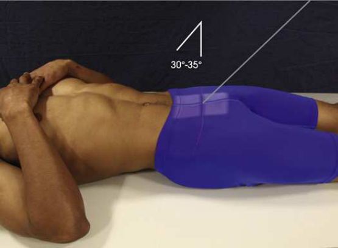
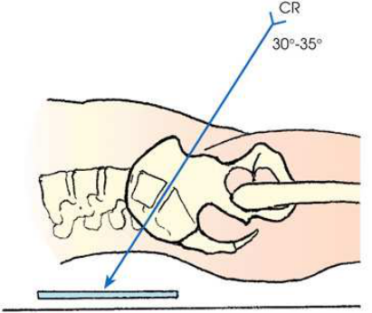
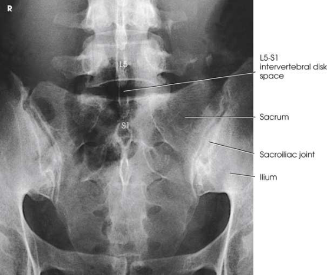
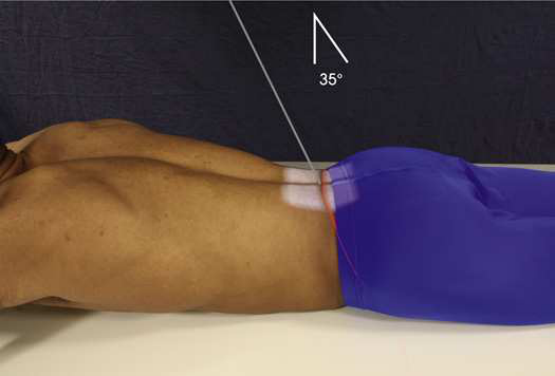

# Rx joncțiunea lumbosacrală și articulațiile sacroiliace — AP sau incidența PA axială — incidența pentru scolioză / joncțiunea L5-S1 (metoda Ferguson) 22 (Merrill)

  📷 Radiografie Convențională (Rx)
  <strong>Actualizat:</strong> 2026-09-16
  <strong>Autor:</strong> Referință Merrill

---

-   __1. Rezumat Clinic & Indicații__

    ---

    === "Indicații Clinice"

        - Conform reperelor anatomice standard din tratat

    === "Ghid Național IRIS"

        !!! info "Referință Primară: Ghidul Național IRIS (Ordinul MS 1342/2012)"
            - **Capitol Ghid IRIS:** *Coloană vertebrală*
            - **Grad de Recomandare:** **Grad A**
            - **Nivel de Iradiere Estimată:** `Clasa 2 (Foarte mică ~ 1.0 - 1.5 mSv)`

            [:octicons-search-16: Deschide Ghidul IRIS](../../iris.md){ .md-button .md-button--primary } [:material-open-in-new: Aplicația Oficială PWA](https://radiologie-pediatrica.ro/iris/){ .md-button target="_blank" rel="noopener" }

-   __2. Poziționare & Centrare Fascicul__

    ---

    - **Poziție Pacient:** Pentru incidența AP axială a articulațiilor lumbosacrale și sacroiliace, se poziționează pacientul în decubit dorsal; cu pacientul în decubit dorsal și MSP centrat pe grilă, se extind membrele inferioare ale pacientului sau se abduc coapsele și se ajustează în poziție verticală (Fig. 9.104). Se asigură că bazinul nu este rotit. Se efectuează ecranarea gonadelor cu șorț plumbat.
    - **Punct de Centrare Fascicul:** Orientată prin articulația lombosacrală la un unghi mediu de 30 la 35 de grade cranial. 23 O angulare de 30 de grade la pacienții de sex masculin și de 35 de grade la pacienții de sex feminin este de obicei satisfăcătoare. Prin observarea conturului regiunii lombare inferioare, accentuarea sau diminuarea neobișnuită a unghiului lombosacral poate fi estimată, iar angularea razei centrale poate fi variată corespunzător. Raza centrală pătrunde în MSP într-un punct situat la aproximativ 1.5 țoli (3.8 cm) superior de simfiza pubiană sau la 2 la 2.5 țoli (5 la 6.5 cm) inferior de spina iliacă antero-superioară (SIAS) (Fig. 9.105). Ferguson a recomandat inițial un unghi de 45 de grade. Se centrează receptorul de imagine pe raza centrală.
    - **Distanță Focar-Film (DFF / SID):** Nespecificat în fragmentul extras; de verificat în sursă
    - **Comandă Respiratorie:** apnee (oprirea respirației).

-   __3. Parametri Tehnici Expunere__

    ---

    | Parametru Tehnic | Valoare Configurare Generator / Tub |
    |:-----------------|:-------------------------------------|
    | **Tensiune Tub (kV)** | DE CONFIGURAT PE APARAT |
    | **Sarcină / Produs Curent-Timp (mAs)** | DE CONFIGURAT PE APARAT |
    | **Distanță Focar-Film (DFF / SID)** | Nespecificat în fragmentul extras; de verificat în sursă |
    | **Grilă Antidifuzoare (Bucky)** | DE CONFIGURAT PE APARAT |
    | **Dimensiune Focar** | DE CONFIGURAT PE APARAT |
    | **Camere de Ionizare AEC** | DE CONFIGURAT PE APARAT |
    | **Colimare Fascicul** | Se ajustează câmpul de iradiere la formatul 18 × 24 cm pe colimator. Se plasează markerul de lateralitate (D/S) în câmpul de expunere colimat. |
    | **Filtrare Tub** | DE CONFIGURAT PE APARAT |

-   __4. Criterii de Calitate & Reușită Imagine__

    ---

    - Criterii radiologice de calitate a imaginii:
    - Evidențierea colimării corecte și prezența markerului de lateralitate (D/S), plasat fără a se suprapune peste anatomia de interes
    - Joncțiunea lumbosacrală și sacrul
    - Spațiul discal intervertebral deschis între L5 și S1
    - Ambele articulații sacroiliace
    - Detalii trabeculare osoase și țesuturile moi înconjurătoare

-   __5. Protecție Radiologică (ALARA)__

    ---

    - Nespecificat în fragmentul extras; de verificat în sursă

!!! note "Observații Clinice & Tehnice"
    Incidența PA axială pentru joncțiunea lumbosacrală poate fi modificată conform incidenței AP axiale descrise anterior. Cu pacientul în decubit ventral, raza centrală este orientată prin articulația lumbosacrală către punctul median al receptorului de imagine, la un unghi mediu de 35 grade caudal. Raza centrală intră la nivelul procesului spinos al L4 (Fig. 9.107 și 9.108). Meese 24 a recomandat poziția în decubit ventral pentru examinările articulațiilor sacroiliace, deoarece oblicitatea lor le plasează într-o poziție mai aproape paralelă cu divergența fasciculului de radiație. Raza centrală este orientată perpendicular și centrată la nivelul spinei iliace anterosuperioare (SIAS). Aceasta intră pe linia mediană a pacientului la aproximativ 2 țoli (5 cm) distal față de procesul spinos al L5 (Fig. 9.109).

### 🖼️ Imagini

<figure class="protocol-image-card" markdown>

<figcaption><strong>Merrill — pagina 742, imaginea 1</strong> — Imagine din fragmentul sursă; asocierea necesită revizie.</figcaption>

</figure>

<figure class="protocol-image-card" markdown>

<figcaption><strong>Merrill — pagina 743, imaginea 2</strong> — Imagine din fragmentul sursă; asocierea necesită revizie.</figcaption>

</figure>

<figure class="protocol-image-card" markdown>

<figcaption><strong>Merrill — pagina 743, imaginea 3</strong> — Imagine din fragmentul sursă; asocierea necesită revizie.</figcaption>

</figure>

<figure class="protocol-image-card" markdown>

<figcaption><strong>Merrill — pagina 744, imaginea 4</strong> — Imagine din fragmentul sursă; asocierea necesită revizie.</figcaption>

</figure>

=== "Ghid Rapid de Execuție"

    1. **Identificarea și verificarea pacientului:** verificare identitate, zonă de examinat, consimțământ conform procedurii și evaluarea posibilității unei sarcini, când este relevantă.
    2. **Pregătire:** îndepărtarea oricăror obiecte radiopace (bijuterii, agrafe, fermoare, proteze, pansamente dense).
    3. **Poziționare precisă:** alinierea receptorului de imagine și a tubului la distanța prescrisă (Nespecificat în fragmentul extras; de verificat în sursă).
    4. **Colimare strictă:** adaptarea fasciculului strict la regiunea de diagnostic pentru scăderea iradierii și reducerea radiației difuze.
    5. **Radioprotecție:** verificarea [politicii RX](../radioprotectie.md), cu măsuri distincte pentru pacient, personal și însoțitor.

## Surse de documentare

- [Merrill’s Atlas, 9. Vertebral Column, pagini 742–744](https://books.google.com/books/about/Merrill_s_Atlas_of_Radiographic_Position.html?id=BM0lEQAAQBAJ)
