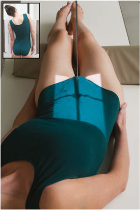
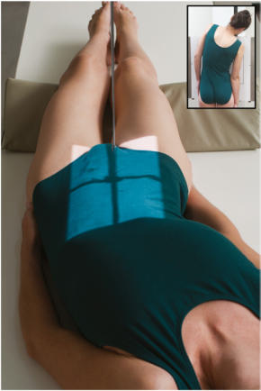
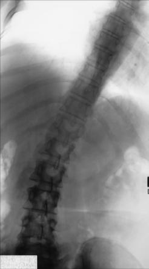
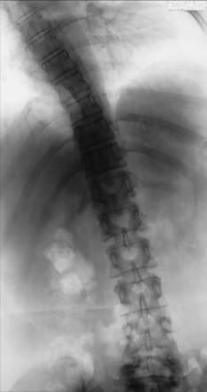

# Rx RIGHT AND LEFT BENDING PA (AP) Incidență (scolioză / vicii de postură ale coloanei SERIES)

  📷 Radiografie Convențională (Rx)
  <strong>Actualizat:</strong> 2026-09-15
  <strong>Autor:</strong> Departamentul de Radiologie / Referință Bontrager

---

-   __1. Rezumat Clinic & Indicații__

    ---

    === "Indicații Clinice"

        - Assessment de range de mișcare de coloană vertebrală

    === "Ghid Național IRIS"

        !!! info "Referință Primară: Ghidul Național IRIS (Ordinul MS 1342/2012)"
            - **Capitol Ghid IRIS:** *Ghidul Național IRIS*
            - **Grad de Recomandare:** **De verificat pe indicație; fără grad atribuit automat**
            - **Nivel de Iradiere Estimată:** `De verificat pentru examinarea și populația selectate`

            [:octicons-search-16: Deschide Ghidul IRIS](../../iris.md){ .md-button .md-button--primary } [:material-open-in-new: Aplicația Oficială PWA](https://radiologie-pediatrica.ro/iris/){ .md-button target="_blank" rel="noopener" }
-   __2. Poziționare & Centrare Fascicul__

    ---

    - **Poziție Pacient:** Pacient: Ortostatism sau Decubit poziție pacient Ortostatism (preferred) sau Decubit (în Decubit dorsal poziție), cu brațe la side (see NOTES).; Regiune anatomică: Align plan mediosagital la raza centrală și linia mediană mesei și/sau receptorul de imagine. Se verifică absența rotației: claviculele sunt riguros echidistante față de linia proceselor spinoase thorax sau Bazin (bazin (pelvis)) exists, if possible. Place bottom edge de receptorul de imagine 1 la 2 inches (2.5 la 5 cm) below creasta iliacă (corespunzător L4-L5). cu Bazin (bazin (pelvis)) acting ca fulcrum, ask pacient la bend laterally (lateral flexion) ca far ca possible la either side (Figs. 9.56 și 9.57). If Decubit, move ambele upper torso și membre inferioare la achieve maximum lateral flexion. Repeat above steps pentru opposite side.
    - **Punct de Centrare Fascicul:** perpendicular pe receptorul de imagine. Se centrează receptorul de imagine pe raza centrală.
    - **Distanță Focar-Film (DFF / SID):** 150 cm
    - **Comandă Respiratorie:** Apnee pe durata expunerii pe expiration.

-   __3. Parametri Tehnici Expunere__

    ---

    | Parametru Tehnic | Valoare Configurare Generator / Tub |
    |:-----------------|:-------------------------------------|
    | **Tensiune Tub (kV)** | DE CONFIGURAT PE APARAT |
    | **Sarcină / Produs Curent-Timp (mAs)** | DE CONFIGURAT PE APARAT |
    | **Distanță Focar-Film (DFF / SID)** | 150 cm |
    | **Grilă Antidifuzoare (Bucky)** | Conform grosimii anatomice (> 10 cm cu grilă) |
    | **Dimensiune Focar** | Focar Mare (1.0 - 1.2 mm) |
    | **Camere de Ionizare AEC** | DE CONFIGURAT PE APARAT |
    | **Colimare Fascicul** | Field Size Collimate pe two sides la anatomy de interest (four sides este possible) |
    | **Filtrare Tub** | Totală ≥ 2.5 mm Al echivalent |

-   __4. Criterii de Calitate & Reușită Imagine__

    ---

    - Thoracic și coloană lombară including 1 la 2 inches (2.5 la 5 cm) de creasta iliacă (corespunzător L4-L5)s (Figs. 9.58 și 9.59). poziție
    - Spinal column aliniat paralel cu receptorul de imagine (RI), ca indicated prin open intervertebral foramina și open intervertebral spații articulare.
    - Absența rotației anatomice: clavicule echidistante față de linia apofizelor spinoase indicated prin superimposed greater sciatic notches și posterior vertebral corpuri.
    - Collimation field size la aria de interes diagnostic. expunere
    - optim receptorul de imagine expunere și contrast. Clear demonstration de bony margins și trabecular markings de thoracic și coloană lombară.
    - fără mișcare. Fig. 9.56 AP Decubit dorsal—L bending. Inset, PA Ortostatism—L bending. Fig. 9.57 AP Decubit dorsal—R bending. Inset, PA Ortostatism—R bending. R Fig. 9.59 AP—R bending.

-   __5. Protecție Radiologică (ALARA)__

    ---

    - Ecranare gonadică și a organelor radiosensibile conform procedurilor locale de radioprotecție ALARA.
    - Colimare strictă la aria de interes pentru limitarea radiației difuze.
    - Verificarea posibilității unei sarcini la pacientele de vârstă fertilă înainte de expunere.

!!! note "Observații Clinice & Tehnice"
    S: Bazin (bazin (pelvis)) trebuie să remain ca stationary ca possible during positioning. Bazin (bazin (pelvis)) acts ca fulcrum (pivot point) during changes în poziție. PA incidențe sunt recommended when performed Ortostatism la reduce expunere significantly la radiationsensitive organs. Fig. 9.58 AP—L bending. scolioză / vicii de postură ale coloanei SERIES SPECIAL PA—Incidență Scolioză / Joncțiune L5-S1 (Metoda Ferguson) PA—R și L bending

### 🖼️ Imagini

<figure class="protocol-image-card" markdown>

<figcaption><strong>Fig. 9.58 AP—L bending.</strong> — Poziționare pacient conform Ghidului Bontrager (Fig. 9.58 AP—L bending.)</figcaption>

</figure>

<figure class="protocol-image-card" markdown>

<figcaption><strong>Fig. 9.56 AP Decubit dorsal—L bending. Inset, PA Ortostatism—L bending.</strong> — Aspect radiografic de referință conform Ghidului Bontrager (Fig. 9.56 AP în decubit dorsal—L bending. Inset, PA în ortostatism—L bending.)</figcaption>

</figure>

<figure class="protocol-image-card" markdown>

<figcaption><strong>Fig. 9.57 AP Decubit dorsal—R bending. Inset, PA Ortostatism—R bending.</strong> — Aspect radiografic de referință conform Ghidului Bontrager (Fig. 9.57 AP în decubit dorsal—R bending. Inset, PA în ortostatism—R bending.)</figcaption>

</figure>

<figure class="protocol-image-card" markdown>

<figcaption><strong>Fig. 9.59 AP—R bending.</strong> — Aspect radiografic de referință conform Ghidului Bontrager (Fig. 9.59 AP—R bending.)</figcaption>

</figure>

=== "Ghid Rapid de Execuție"

    1. **Identificarea și verificarea pacientului:** verificare identitate, zonă de examinat, consimțământ conform procedurii și evaluarea posibilității unei sarcini, când este relevantă.
    2. **Pregătire:** îndepărtarea oricăror obiecte radiopace (bijuterii, agrafe, fermoare, proteze, pansamente dense).
    3. **Poziționare precisă:** alinierea receptorului de imagine și a tubului la distanța prescrisă (150 cm).
    4. **Colimare strictă:** adaptarea fasciculului strict la regiunea de diagnostic pentru scăderea iradierii și reducerea radiației difuze.
    5. **Radioprotecție:** verificarea [politicii RX](../radioprotectie.md), cu măsuri distincte pentru pacient, personal și însoțitor.

## Surse de documentare

- [Bontrager's Textbook of Radiographic Positioning (Ed. 9/10), Pagina 369](https://www.elsevier.com/books/textbook-of-radiographic-positioning-and-related-anatomy/lampignano/978-0-323-65367-1)
