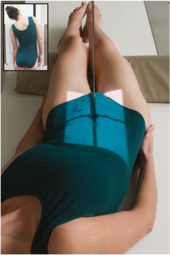
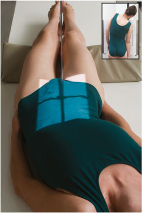
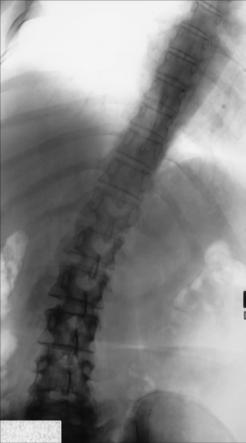
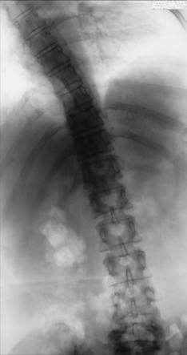

# Rx INCIDENȚĂ PA PENTRU ÎNCLINARE SPRE DREAPTA ȘI STÂNGA (AP) (SERIE PENTRU SCOLIOZĂ / VICII DE POSTURĂ ALE COLOANEI)

  📷 Radiografie Convențională (Rx)
  <strong>Actualizat:</strong> 2026-09-15
  <strong>Autor:</strong> Departamentul de Radiologie / Referință Bontrager

---

-   __1. Rezumat Clinic & Indicații__

    ---

    === "Indicații Clinice"

        - Evaluarea amplitudinii de mișcare a coloanei vertebrale

    === "Ghid Național IRIS"

        !!! info "Referință Primară: Ghidul Național IRIS (Ordinul MS 1342/2012)"
            - **Capitol Ghid IRIS:** *Coloană vertebrală*
            - **Grad de Recomandare:** **Grad A**
            - **Nivel de Iradiere Estimată:** `Clasa 2 (Foarte mică ~ 1.0 - 1.5 mSv)`

            [:octicons-search-16: Deschide Ghidul IRIS](../../iris.md){ .md-button .md-button--primary } [:material-open-in-new: Aplicația Oficială PWA](https://radiologie-pediatrica.ro/iris/){ .md-button target="_blank" rel="noopener" }

-   __2. Poziționare & Centrare Fascicul__

    ---

    - **Poziție Pacient:** Pacient: Pacient în ortostatism sau decubit, ortostatism (preferat) sau decubit (în decubit dorsal), cu brațele pe lângă corp (vezi NOTE).; Regiune anatomică: Se aliniază planul mediosagital cu raza centrală și cu linia mediană a mesei și/sau a receptorului de imagine. Se verifică absența rotației: claviculele sunt riguros echidistante față de linia proceselor spinoase ale toracelui sau ale bazinului, dacă acesta este prezent, pe cât posibil. Se plasează marginea inferioară a receptorului de imagine la 1 la 2 țoli (2.5 la 5 cm) sub creasta iliacă (corespunzător L4-L5). Cu bazinul acționând ca punct de sprijin, se cere pacientului să se încline lateral (flexie laterală) cât mai mult posibil spre fiecare parte (Fig. 9.56 și 9.57). Dacă pacientul este în decubit, se deplasează simultan partea superioară a trunchiului și membrele inferioare pentru a obține flexia laterală maximă. Se repetă pașii de mai sus pentru partea opusă.
    - **Punct de Centrare Fascicul:** Perpendicular pe receptorul de imagine. Se centrează receptorul de imagine pe raza centrală.
    - **Distanță Focar-Film (DFF / SID):** 150 cm
    - **Comandă Respiratorie:** Apnee pe durata expunerii, la sfârșitul expirului.

-   __3. Parametri Tehnici Expunere__

    ---

    | Parametru Tehnic | Valoare Configurare Generator / Tub |
    |:-----------------|:-------------------------------------|
    | **Tensiune Tub (kV)** | DE CONFIGURAT PE APARAT |
    | **Sarcină / Produs Curent-Timp (mAs)** | DE CONFIGURAT PE APARAT |
    | **Distanță Focar-Film (DFF / SID)** | 150 cm |
    | **Grilă Antidifuzoare (Bucky)** | Conform grosimii anatomice (> 10 cm cu grilă) |
    | **Dimensiune Focar** | Focar Mare (1.0 - 1.2 mm) |
    | **Camere de Ionizare AEC** | DE CONFIGURAT PE APARAT |
    | **Colimare Fascicul** | Dimensiunea câmpului: se colimează pe două laturi până la anatomia de interes (sunt posibile patru laturi) |
    | **Filtrare Tub** | Totală ≥ 2.5 mm Al echivalent |

-   __4. Criterii de Calitate & Reușită Imagine__

    ---

    - Coloana toracică și lombară, inclusiv 1 la 2 țoli (2.5 la 5 cm) din creasta iliacă (corespunzător L4-L5) (Fig. 9.58 și 9.59). poziție
    - Coloana vertebrală este aliniată paralel cu receptorul de imagine (RI), după cum indică deschiderea găurilor intervertebrale și a spațiilor articulare intervertebrale.
    - Absența rotației anatomice: clavicule echidistante față de linia apofizelor spinoase, indicată prin suprapunerea incizurilor sciatice mari și a corpilor vertebrali posteriori.
    - Colimarea câmpului la dimensiunea ariei de interes diagnostic. Expunere
    - Expunere și contrast optime la receptorul de imagine. Demonstrarea clară a marginilor osoase și a desenului trabecular al coloanei toracale și lombare.
    - Fără mișcare. Fig. 9.56 AP în decubit dorsal—înclinare spre stânga. Inserție, PA în ortostatism—înclinare spre stânga. Fig. 9.57 AP în decubit dorsal—înclinare spre dreapta. Inserție, PA în ortostatism—înclinare spre dreapta. R Fig. 9.59 AP—înclinare spre dreapta.

-   __5. Protecție Radiologică (ALARA)__

    ---

    - Ecranare gonadică și a organelor radiosensibile conform procedurilor locale de radioprotecție ALARA.
    - Colimare strictă la aria de interes pentru limitarea radiației difuze.
    - Verificarea posibilității unei sarcini la pacientele de vârstă fertilă înainte de expunere.

!!! note "Observații Clinice & Tehnice"
    S: Bazinul trebuie să rămână cât mai staționar posibil în timpul poziționării. Bazinul acționează ca punct de sprijin în timpul modificărilor de poziție. Incidențele PA sunt recomandate când sunt efectuate în ortostatism pentru a reduce semnificativ expunerea organelor radiosensibile. Fig. 9.58 AP—înclinare spre stânga. Incidența pentru scolioză / vicii de postură ale coloanei SPECIALĂ PA—incidența pentru scolioză / joncțiunea L5-S1 (metoda Ferguson) PA—înclinare spre dreapta și stânga

### 🖼️ Imagini

<figure class="protocol-image-card" markdown>

<figcaption><strong>Fig. 9.58 AP—înclinare spre stânga.</strong> — Poziționarea pacientului conform Ghidului Bontrager (Fig. 9.58 AP—înclinare spre stânga.)</figcaption>

</figure>

<figure class="protocol-image-card" markdown>

<figcaption><strong>Fig. 9.56 AP în decubit dorsal—înclinare spre stânga. Inserție, PA în ortostatism—înclinare spre stânga.</strong> — Aspect radiografic de referință conform Ghidului Bontrager (Fig. 9.56 AP în decubit dorsal—înclinare spre stânga. Inserție, PA în ortostatism—înclinare spre stânga.)</figcaption>

</figure>

<figure class="protocol-image-card" markdown>

<figcaption><strong>Fig. 9.57 AP în decubit dorsal—înclinare spre dreapta. Inserție, PA în ortostatism—înclinare spre dreapta.</strong> — Aspect radiografic de referință conform Ghidului Bontrager (Fig. 9.57 AP în decubit dorsal—înclinare spre dreapta. Inserție, PA în ortostatism—înclinare spre dreapta.)</figcaption>

</figure>

<figure class="protocol-image-card" markdown>

<figcaption><strong>Fig. 9.59 AP—înclinare spre dreapta.</strong> — Aspect radiografic de referință conform Ghidului Bontrager (Fig. 9.59 AP—înclinare spre dreapta.)</figcaption>

</figure>

=== "Ghid Rapid de Execuție"

    1. **Identificarea și verificarea pacientului:** verificare identitate, zonă de examinat, consimțământ conform procedurii și evaluarea posibilității unei sarcini, când este relevantă.
    2. **Pregătire:** îndepărtarea oricăror obiecte radiopace (bijuterii, agrafe, fermoare, proteze, pansamente dense).
    3. **Poziționare precisă:** alinierea receptorului de imagine și a tubului la distanța prescrisă (150 cm).
    4. **Colimare strictă:** adaptarea fasciculului strict la regiunea de diagnostic pentru scăderea iradierii și reducerea radiației difuze.
    5. **Radioprotecție:** verificarea [politicii RX](../radioprotectie.md), cu măsuri distincte pentru pacient, personal și însoțitor.

## Surse de documentare

- [Bontrager's Textbook of Radiographic Positioning (Ed. 9/10), Pagina 369](https://www.elsevier.com/books/textbook-of-radiographic-positioning-and-related-anatomy/lampignano/978-0-323-65367-1)
