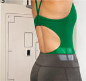
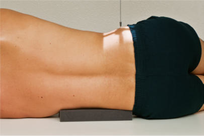
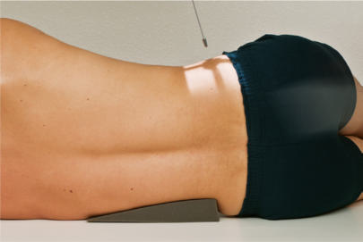
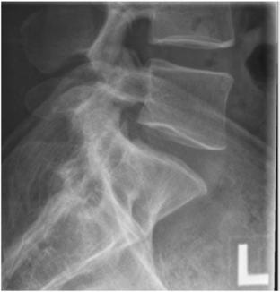
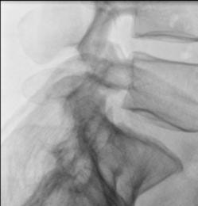

# Rx S1 Poziționare LATERALĂ L5 (Coloana lombară)

  📷 Radiografie Convențională (Rx)
  <strong>Actualizat:</strong> 2026-09-15
  <strong>Autor:</strong> Departamentul de Radiologie / Referință Bontrager

---

-   __1. Rezumat Clinic & Indicații__

    ---

    === "Indicații Clinice"

        - Spondilolistezis care implică L4–L5 sau L5-S1 și alte patologii L5–S1

    === "Ghid Național IRIS"

        !!! info "Referință Primară: Ghidul Național IRIS (Ordinul MS 1342/2012)"
            - **Capitol Ghid IRIS:** *Coloană vertebrală*
            - **Grad de Recomandare:** **Grad A**
            - **Nivel de Iradiere Estimată:** `Clasa 2 (Foarte mică ~ 1.0 - 1.5 mSv)`

            [:octicons-search-16: Deschide Ghidul IRIS](../../iris.md){ .md-button .md-button--primary } [:material-open-in-new: Aplicația Oficială PWA](https://radiologie-pediatrica.ro/iris/){ .md-button target="_blank" rel="noopener" }

-   __2. Poziționare & Centrare Fascicul__

    ---

    - **Poziție Pacient:** Pacient: Incidență de profil. Se plasează pacientul în decubit lateral, cu capul pe pernă, genunchii flectați, cu suport între genunchi și glezne pentru a menține mai bine incidența de profil adevărată și pentru a asigura confortul pacientului.; Regiune anatomică: Se aliniază planul mediocoronal cu raza centrală și cu linia mediană a mesei și/sau a receptorului de imagine (Fig. 9.38). Se plasează un suport radiotransparent sub regiunea lombară, după cum este necesar, pentru a poziționa axa longitudinală a coloanei vertebrale aproape paralel cu masa (se palpează procesele spinoase pentru determinare; vezi NOTE mai jos). Se verifică absența rotației: claviculele sunt riguros echidistante față de linia proceselor spinoase ale toracelui sau ale bazinului, dacă acesta este prezent.
    - **Punct de Centrare Fascicul:** Perpendicular pe receptorul de imagine, cu suport lombar suficient, sau angulație de 5° la 8° caudal, cu suport redus (vezi NOTE). Se direcționează raza centrală la 1.5 țoli (4 cm) inferior față de creasta iliacă (corespunzător L4-L5) și la 2 țoli (5 cm) posterior față de spina iliacă anterosuperioară (SIAS). Se centrează receptorul de imagine pe raza centrală.
    - **Distanță Focar-Film (DFF / SID):** 100 cm
    - **Comandă Respiratorie:** Apnee pe durata expunerii pentru prevenirea artefactelor de mișcare ale pacientului.

-   __3. Parametri Tehnici Expunere__

    ---

    | Parametru Tehnic | Valoare Configurare Generator / Tub |
    |:-----------------|:-------------------------------------|
    | **Tensiune Tub (kV)** | 85-95 kV |
    | **Sarcină / Produs Curent-Timp (mAs)** | DE CONFIGURAT PE APARAT |
    | **Distanță Focar-Film (DFF / SID)** | 100 cm |
    | **Grilă Antidifuzoare (Bucky)** | Cu grilă antidifuzoare Bucky |
    | **Dimensiune Focar** | Focar Mare (1.0 - 1.2 mm) |
    | **Camere de Ionizare AEC** | Camerele laterale (sau camera centrală, în funcție de regiune) |
    | **Colimare Fascicul** | Dimensiunea câmpului Colimați pe cele patru laturi la regiunea anatomică de interes. |
    | **Filtrare Tub** | Totală ≥ 2.5 mm Al echivalent |

-   __4. Criterii de Calitate & Reușită Imagine__

    ---

    - Corpul vertebral L5, primul și al doilea segment sacral și spațiile articulare L5–S1 (Fig. 9.40 și 9.41). poziție
    - Absența rotației anatomice: claviculele echidistante față de linia apofizelor spinoase ale pacientului, evidențiată prin suprapunerea incizurilor sciatice mari și a marginilor posterioare ale corpurilor vertebrale.
    - Alinierea corectă a coloanei vertebrale și a razei centrale, indicată prin spațiile articulare L5–S1 deschise.
    - Colimarea câmpului la dimensiunea ariei de interes diagnostic. Expunere
    - Expunere și contrast optime ale receptorului de imagine. Demonstrarea clară a marginilor osoase și a desenului trabecular din regiunea L5–S1.
    - fără mișcare.

-   __5. Protecție Radiologică (ALARA)__

    ---

    - Ecranare gonadică și a organelor radiosensibile conform procedurilor locale de radioprotecție ALARA.
    - Colimare strictă la aria de interes pentru limitarea radiației difuze.
    - Verificarea posibilității unei sarcini la pacientele de vârstă fertilă înainte de expunere.

!!! note "Observații Clinice & Tehnice"
    S: Dacă regiunea lombară nu este susținută suficient, rezultând în curbarea coloanei vertebrale, raza centrală trebuie înclinată cu 5° la 8° caudal pentru a fi paralelă cu linia interiliacă3 (linia imaginară dintre crestele iliace (corespunzător L4-L5) [Fig. 9.39]). Se generează cantități mari de radiație secundară sau difuză ca rezultat al grosimii părții examinate. Colimarea strânsă este esențială, împreună cu plasarea unei protecții plumbate pe blatul mesei, în spatele pacientului. Acest lucru este deosebit de important în imagistica digitală. Coloana lombară RUTINĂ AP (sau PA) oblică—posterior sau anterior lateral lateral L5–S1 Fig. 9.38 laterală stângă L5–S1 cu suport suficient; unghiul razei centrale 0°. Fig. 9.40 laterală L5–S1. Linia interiliacă Fig. 9.39 laterală stângă L5–S1 cu suport redus; raza centrală 5° la 8° caudal (raza centrală paralelă cu linia interiliacă). Articulația intervertebrală lumbosacrală (L5-S1), corpul (L5), promontoriul sacrului Fig. 9.41 laterală L5–S1.

### 🖼️ Imagini

<figure class="protocol-image-card" markdown>

<figcaption><strong>Fig. 9.38 laterală stângă L5–S1 cu suport suficient; unghiul razei centrale 0°.</strong> — Poziționarea pacientului conform Ghidului Bontrager (Fig. 9.38 laterală stângă L5–S1 cu suport suficient; unghiul razei centrale 0°.)</figcaption>

</figure>

<figure class="protocol-image-card" markdown>

<figcaption><strong>Fig. 9.40 laterală L5–S1.</strong> — Aspect radiografic de referință conform Ghidului Bontrager (Fig. 9.40 laterală L5–S1.)</figcaption>

</figure>

<figure class="protocol-image-card" markdown>

<figcaption><strong>Fig. 9.39 laterală stângă L5–S1 cu suport redus; raza centrală 5° la 8° caudal</strong> — Aspect radiografic de referință conform Ghidului Bontrager (Fig. 9.39 laterală stângă L5–S1 cu suport redus; raza centrală 5° la 8° caudal)</figcaption>

</figure>

<figure class="protocol-image-card" markdown>

<figcaption><strong>Fig. 9.41 laterală L5–S1.</strong> — Aspect radiografic de referință conform Ghidului Bontrager (Fig. 9.41 laterală L5–S1.)</figcaption>

</figure>

<figure class="protocol-image-card" markdown>

<figcaption><strong>Figura 5</strong> — Aspect radiografic de referință conform Ghidului Bontrager (Figura 5)</figcaption>

</figure>

=== "Ghid Rapid de Execuție"

    1. **Identificarea și verificarea pacientului:** verificare identitate, zonă de examinat, consimțământ conform procedurii și evaluarea posibilității unei sarcini, când este relevantă.
    2. **Pregătire:** îndepărtarea oricăror obiecte radiopace (bijuterii, agrafe, fermoare, proteze, pansamente dense).
    3. **Poziționare precisă:** alinierea receptorului de imagine și a tubului la distanța prescrisă (100 cm).
    4. **Colimare strictă:** adaptarea fasciculului strict la regiunea de diagnostic pentru scăderea iradierii și reducerea radiației difuze.
    5. **Radioprotecție:** verificarea [politicii RX](../radioprotectie.md), cu măsuri distincte pentru pacient, personal și însoțitor.

## Surse de documentare

- [Bontrager's Textbook of Radiographic Positioning (Ed. 9/10), Pagina 363](https://www.elsevier.com/books/textbook-of-radiographic-positioning-and-related-anatomy/lampignano/978-0-323-65367-1)
