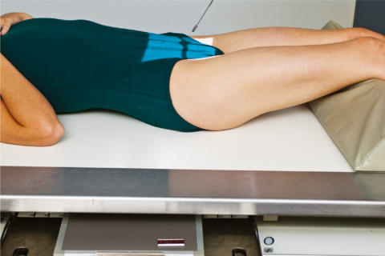
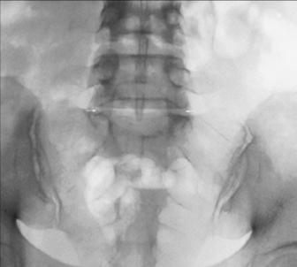

# Rx S1 Incidență AP AXIALĂ L5 (Coloana lombară)

  📷 Radiografie Convențională (Rx)
  <strong>Actualizat:</strong> 2026-09-15
  <strong>Autor:</strong> Departamentul de Radiologie / Referință Bontrager

---

-   __1. Rezumat Clinic & Indicații__

    ---

    === "Indicații Clinice"

        - Patologia L5–S1 și a articulațiilor sacroiliace

    === "Ghid Național IRIS"

        !!! info "Referință Primară: Ghidul Național IRIS (Ordinul MS 1342/2012)"
            - **Capitol Ghid IRIS:** *Coloană vertebrală*
            - **Grad de Recomandare:** **Grad A**
            - **Nivel de Iradiere Estimată:** `Clasa 2 (Foarte mică ~ 1.0 - 1.5 mSv)`

            [:octicons-search-16: Deschide Ghidul IRIS](../../iris.md){ .md-button .md-button--primary } [:material-open-in-new: Aplicația Oficială PWA](https://radiologie-pediatrica.ro/iris/){ .md-button target="_blank" rel="noopener" }

-   __2. Poziționare & Centrare Fascicul__

    ---

    - **Poziție Pacient:** Pacient: Pacient în decubit dorsal, în decubit dorsal cu brațele pe lângă corp și capul pe pernă, cu membrele inferioare extinse și suport sub genunchi pentru confort.; Regiune anatomică: Se aliniază planul mediosagital cu raza centrală și cu linia mediană a mesei și/sau a receptorului de imagine (Fig. 9.42). Se verifică absența rotației: claviculele sunt riguros echidistante față de linia proceselor spinoase ale toracelui sau ale bazinului, dacă acesta este prezent.
    - **Punct de Centrare Fascicul:** Fig. 9.42 AP axială L5–S1—35° cranial.
    - **Distanță Focar-Film (DFF / SID):** 100 cm
    - **Comandă Respiratorie:** Apnee pe durata expunerii pentru prevenirea artefactelor de mișcare ale pacientului.

-   __3. Parametri Tehnici Expunere__

    ---

    | Parametru Tehnic | Valoare Configurare Generator / Tub |
    |:-----------------|:-------------------------------------|
    | **Tensiune Tub (kV)** | 80-90 kV |
    | **Sarcină / Produs Curent-Timp (mAs)** | DE CONFIGURAT PE APARAT |
    | **Distanță Focar-Film (DFF / SID)** | 100 cm |
    | **Grilă Antidifuzoare (Bucky)** | Cu grilă antidifuzoare Bucky |
    | **Dimensiune Focar** | Focar Mare (1.0 - 1.2 mm) |
    | **Camere de Ionizare AEC** | Camerele laterale (sau camera centrală, în funcție de regiune) |
    | **Colimare Fascicul** | Dimensiunea câmpului Colimați pe cele patru laturi la regiunea anatomică de interes. |
    | **Filtrare Tub** | Totală ≥ 2.5 mm Al echivalent |

-   __4. Criterii de Calitate & Reușită Imagine__

    ---

    - Spațiile articulare L5–S1 și articulațiile sacroiliace (Fig. 9.43 și 9.44). poziție
    - Articulațiile sacroiliace prezintă distanțe egale față de coloana vertebrală, indicând absența rotației pelvine.
    - Alinierea corectă a razei centrale și a L5–S1, evidențiată prin spațiile articulare deschise.
    - Colimarea câmpului la dimensiunea ariei de interes diagnostic. Expunere
    - Expunere și contrast optime ale receptorului de imagine. Demonstrarea clară a marginilor osoase și a desenului trabecular din regiunea L5–S1.
    - Fără mișcare. R Fig. 9.43 AP axială L5–S1—35° cranial. Articulația intervertebrală lumbosacrală (L5-S1), articulația sacroiliacă R Fig. 9.44 AP axială L5–S1. 24 18 R

-   __5. Protecție Radiologică (ALARA)__

    ---

    - Ecranare gonadică și a organelor radiosensibile conform procedurilor locale de radioprotecție ALARA.
    - Colimare strictă la aria de interes pentru limitarea radiației difuze.
    - Verificarea posibilității unei sarcini la pacientele de vârstă fertilă înainte de expunere.

!!! note "Observații Clinice & Tehnice"
    S: Incidența anteroposterioară (AP) înclinată „deschide” articulația L5–S1. Incidența laterală a L5–S1 oferă în general mai multe informații decât incidența anteroposterioară (AP). Această incidență poate fi efectuată și în decubit ventral, cu angulație caudală a razei centrale (crește distanța obiect–receptorul de imagine [OID]). Coloana lombară SPECIALĂ AP axială L5–S1 30°-35°

### 🖼️ Imagini

<figure class="protocol-image-card" markdown>

<figcaption><strong>Fig. 9.42 AP axială L5–S1—35° cranial.</strong> — Poziționare pacient conform Ghidului Bontrager (Fig. 9.42 AP axial L5–S1—35° cranial.)</figcaption>

</figure>

<figure class="protocol-image-card" markdown>

<figcaption><strong>Fig. 9.43 AP axial L5–S1—35° cranial.</strong> — Aspect radiografic de referință conform Ghidului Bontrager (Fig. 9.43 AP axial L5–S1—35° cranial.)</figcaption>

</figure>

<figure class="protocol-image-card" markdown>

<figcaption><strong>Fig. 9.44 AP axial L5–S1.</strong> — Aspect radiografic de referință conform Ghidului Bontrager (Fig. 9.44 AP axial L5–S1.)</figcaption>

</figure>

=== "Ghid Rapid de Execuție"

    1. **Identificarea și verificarea pacientului:** verificare identitate, zonă de examinat, consimțământ conform procedurii și evaluarea posibilității unei sarcini, când este relevantă.
    2. **Pregătire:** îndepărtarea oricăror obiecte radiopace (bijuterii, agrafe, fermoare, proteze, pansamente dense).
    3. **Poziționare precisă:** alinierea receptorului de imagine și a tubului la distanța prescrisă (100 cm).
    4. **Colimare strictă:** adaptarea fasciculului strict la regiunea de diagnostic pentru scăderea iradierii și reducerea radiației difuze.
    5. **Radioprotecție:** verificarea [politicii RX](../radioprotectie.md), cu măsuri distincte pentru pacient, personal și însoțitor.

## Surse de documentare

- [Bontrager's Textbook of Radiographic Positioning (Ed. 9/10), Pagina 364](https://www.elsevier.com/books/textbook-of-radiographic-positioning-and-related-anatomy/lampignano/978-0-323-65367-1)
