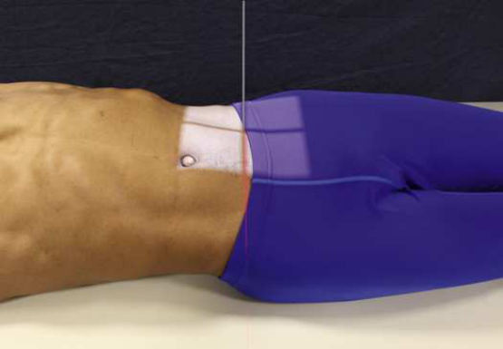
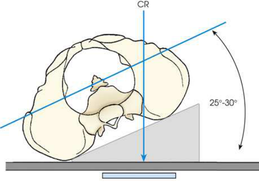
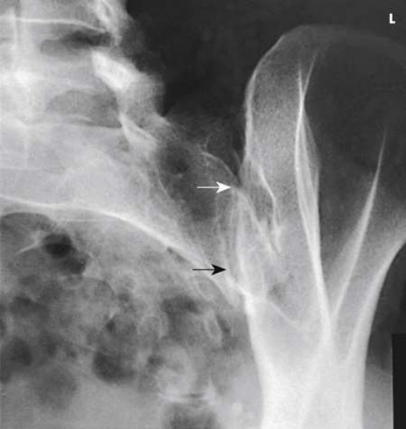
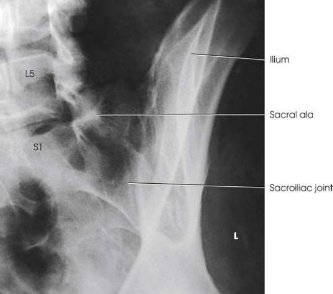

# Rx Sacroiliac Joints — Oblică Antero-Posterioară (AP) — RPO and Oblică Posterioară Stângă (OPS / LPO)s (Merrill)

  📷 Radiografie Convențională (Rx)
  <strong>Actualizat:</strong> 2026-09-16
  <strong>Autor:</strong> Referință Merrill

---

-   __1. Rezumat Clinic & Indicații__

    ---

    === "Indicații Clinice"

        - Conform reperelor anatomice standard din tratat

    === "Ghid Național IRIS"

        !!! info "Referință Primară: Ghidul Național IRIS (Ordinul MS 1342/2012)"
            - **Capitol Ghid IRIS:** *Ghidul Național IRIS*
            - **Grad de Recomandare:** **De verificat pe indicație; fără grad atribuit automat**
            - **Nivel de Iradiere Estimată:** `De verificat pentru examinarea și populația selectate`

            [:octicons-search-16: Deschide Ghidul IRIS](../../iris.md){ .md-button .md-button--primary } [:material-open-in-new: Aplicația Oficială PWA](https://radiologie-pediatrica.ro/iris/){ .md-button target="_blank" rel="noopener" }
-   __2. Poziționare & Centrare Fascicul__

    ---

    - **Poziție Pacient:** se așază pacientul în Decubit dorsal poziție și elevate capul pe firm pillow.; Elevate side de interest approximately 25 la 30 grade, și support Umăr, lower thorax, și upper thigh (Figs. 9.110 și 9.111). side being examined este ̌ arther de la receptorul de imagine. Use poziție oblică posterioară stângă (OPS / LPO) la show drept articulație și poziție oblică posterioară dreaptă (OPD / RPO) la show stâng articulație. se ajustează pacient’s corp so that its axa longitudinală este paralel cu axa longitudinală de masa radiologică. se aliniază corp so that plan sagital passing 1 inch (2.5 cm) medial la spină iliacă antero-superioară (SIAS) de ridicat side este centrat pe linia mediană grilă. Check rotație la several points along back. se centrează receptorul de imagine la nivelul spină iliacă antero-superioară (SIAS). se efectuează ecranarea gonadelor cu șorț plumbat. Collimating close la articulație poate shield gonads în male pacienți. It poate fie dificult la use contact shielding în female pacienți.
    - **Punct de Centrare Fascicul:** perpendicular pe centrul receptorului de imagine, entering 1 inch (2.5 cm) medial la ridicat spină iliacă antero-superioară (SIAS)
    - **Distanță Focar-Film (DFF / SID):** Nespecificat în fragmentul extras; de verificat în sursă
    - **Comandă Respiratorie:** apnee (oprirea respirației).

-   __3. Parametri Tehnici Expunere__

    ---

    | Parametru Tehnic | Valoare Configurare Generator / Tub |
    |:-----------------|:-------------------------------------|
    | **Tensiune Tub (kV)** | DE CONFIGURAT PE APARAT |
    | **Sarcină / Produs Curent-Timp (mAs)** | DE CONFIGURAT PE APARAT |
    | **Distanță Focar-Film (DFF / SID)** | Nespecificat în fragmentul extras; de verificat în sursă |
    | **Grilă Antidifuzoare (Bucky)** | DE CONFIGURAT PE APARAT |
    | **Dimensiune Focar** | DE CONFIGURAT PE APARAT |
    | **Camere de Ionizare AEC** | DE CONFIGURAT PE APARAT |
    | **Colimare Fascicul** | Se ajustează câmpul de iradiere la formatul 15 × 24 cm pe colimator. Place marker de lateralitate (D/S) în collimated expunere field. |
    | **Filtrare Tub** | DE CONFIGURAT PE APARAT |

-   __4. Criterii de Calitate & Reușită Imagine__

    ---

    - Criterii radiologice de calitate imaginii:
    - Evidence de corect collimation și presence de marker de lateralitate (D/S) plasat clear de anatomy de interest
    - Open sacroiliac spații articulare ̌ arthest de la receptorul de imagine cu minimal overlapping de ilium și Sacru
    - articulație centrat pe radiografie
    - Bony detalii trabeculare osoase și surrounding soft tissues

-   __5. Protecție Radiologică (ALARA)__

    ---

    - Nespecificat în fragmentul extras; de verificat în sursă

!!! note "Observații Clinice & Tehnice"
    AP axial oblic poate fie obtained prin positioning pacientul ca described. pentru AP axial oblic, raza centrală este orientat la un unghi de 20 la 25 grade cranial, entering 1 inch (2.5 cm) medial și 1½ inches (3.8 cm) distal la ridicat spină iliacă antero-superioară (SIAS) (Fig. 9.113). Brower și Kransdorf 25 summarized dificulties în imaging sacroiliac articulații because de pacient positioning și variability.

### 🖼️ Imagini

<figure class="protocol-image-card" markdown>

<figcaption><strong>Merrill — pagina PDF 746, imaginea 1</strong> — Imagine din fragmentul sursă; asocierea necesită revizie.</figcaption>

</figure>

<figure class="protocol-image-card" markdown>

<figcaption><strong>Merrill — pagina PDF 747, imaginea 2</strong> — Imagine din fragmentul sursă; asocierea necesită revizie.</figcaption>

</figure>

<figure class="protocol-image-card" markdown>

<figcaption><strong>Merrill — pagina PDF 748, imaginea 3</strong> — Imagine din fragmentul sursă; asocierea necesită revizie.</figcaption>

</figure>

<figure class="protocol-image-card" markdown>

<figcaption><strong>Merrill — pagina PDF 748, imaginea 4</strong> — Imagine din fragmentul sursă; asocierea necesită revizie.</figcaption>

</figure>

=== "Ghid Rapid de Execuție"

    1. **Identificarea și verificarea pacientului:** verificare identitate, zonă de examinat, consimțământ conform procedurii și evaluarea posibilității unei sarcini, când este relevantă.
    2. **Pregătire:** îndepărtarea oricăror obiecte radiopace (bijuterii, agrafe, fermoare, proteze, pansamente dense).
    3. **Poziționare precisă:** alinierea receptorului de imagine și a tubului la distanța prescrisă (Nespecificat în fragmentul extras; de verificat în sursă).
    4. **Colimare strictă:** adaptarea fasciculului strict la regiunea de diagnostic pentru scăderea iradierii și reducerea radiației difuze.
    5. **Radioprotecție:** verificarea [politicii RX](../radioprotectie.md), cu măsuri distincte pentru pacient, personal și însoțitor.

## Surse de documentare

- [Merrill’s Atlas, 9. Vertebral Column, pagini PDF 745–748](../../assets/protocols/sources/a56d45c16829_Merrills_Atlas_of_Radiographic_Positioning__Procedures_3Vol_Set.pdf#page=745)

## Fragmente sursă traduse (referință tehnică)

### anatomy

sacroiliac articulație ̌ arthest de la receptorul de imagine și oblic incidență de adjacent structures. ambele părți (bilateral) sunt examined pentru comparison (Fig. 9.112).
(See Summary de oblic incidențe, p. 440.)

### collimation

• Se ajustează câmpul de iradiere la formatul 15 × 24 cm pe colimator. Place marker de lateralitate (D/S) în collimated expunere field.

### cr

• perpendicular pe centrul receptorului de imagine, entering 1 inch (2.5 cm) medial la ridicat spină iliacă antero-superioară (SIAS)

### criteria

Criterii radiologice de calitate imaginii:
• Evidence de corect collimation și presence de marker de lateralitate (D/S) plasat clear de anatomy de interest
• Open sacroiliac spații articulare ̌ arthest de la receptorul de imagine cu minimal overlapping de ilium și sacrum
• articulație centrat pe radiografie
• Bony detalii trabeculare osoase și surrounding soft tissues

### notes

AP axial oblic poate fie obtained prin positioning pacientul ca described. pentru AP axial oblic, raza centrală este orientat la
angle de 20 la 25 grade cranial, entering 1 inch (2.5 cm) medial și 1½ inches (3.8 cm) distal la ridicat spină iliacă antero-superioară (SIAS) (Fig. 9.113).
Brower și Kransdorf 25 summarized dificulties în imaging sacroiliac articulații because de pacient positioning și variability.

### part_pos

• Elevate side de interest approximately 25 la 30 grade, și support umăr, lower thorax, și upper thigh (Figs. 9.110 și
9.111).
• side being examined este ̌ arther de la receptorul de imagine. Use poziție oblică posterioară stângă (OPS / LPO) la show drept articulație și poziție oblică posterioară dreaptă (OPD / RPO) la show stâng
articulație.
• se ajustează pacient’s corp so that its axa longitudinală este paralel cu axa longitudinală de masa radiologică.
• se aliniază corp so that plan sagital passing 1 inch (2.5 cm) medial la spină iliacă antero-superioară (SIAS) de ridicat side este centrat pe linia mediană grilă.
• Check rotație la several points along back.
• se centrează receptorul de imagine la nivelul spină iliacă antero-superioară (SIAS).
• se efectuează ecranarea gonadelor cu șorț plumbat. Collimating close la articulație poate shield gonads în male pacienți. It poate fie dificult la use contact shielding în female
pacienți.

### patient_pos

• se așază pacientul în decubit dorsal și elevate capul pe firm pillow.

### respiration

apnee (oprirea respirației).

### tech

poziționat prin manufacturer sau department protocol pentru corect anatomy display orientation; raza centrală plate: 10 × 12 inches (24 ×
30 cm) longitudinal. ambele obliques sunt usually obtained pentru comparison.

