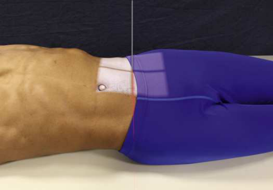
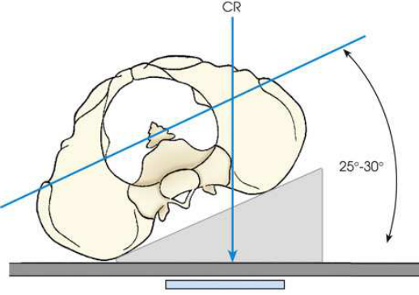
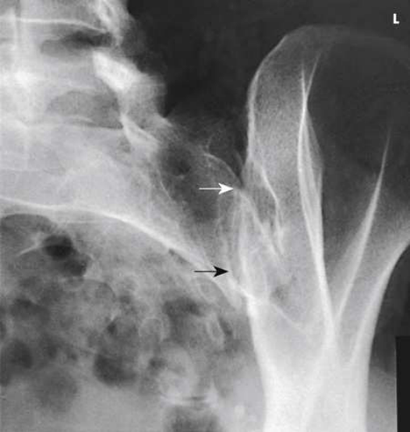
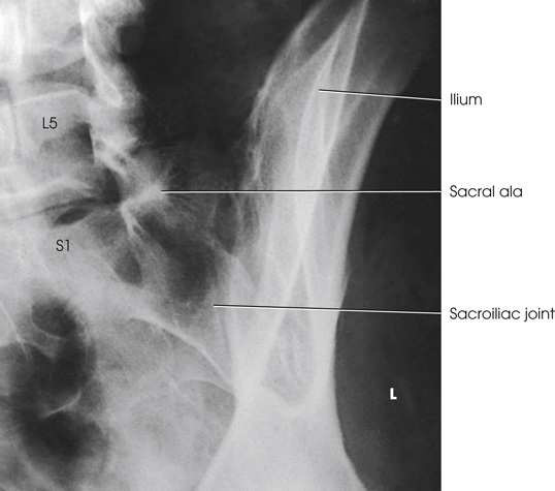

# Articulațiile sacroiliace — incidențe oblice antero-posterioare (AP) — RPO și oblică posterioară stângă (OPS / LPO) (Merrill)

  📷 Radiografie Convențională (Rx)
  <strong>Actualizat:</strong> 2026-09-16
  <strong>Autor:</strong> Referință Merrill

---

-   __1. Rezumat Clinic & Indicații__

    ---

    === "Indicații Clinice"

        - Conform reperelor anatomice standard din tratat

    === "Ghid Național IRIS"

        !!! info "Referință Primară: Ghidul Național IRIS (Ordinul MS 1342/2012)"
            - **Capitol Ghid IRIS:** *Ghidul Național IRIS*
            - **Grad de Recomandare:** **De verificat pe indicație; fără grad atribuit automat**
            - **Nivel de Iradiere Estimată:** `De verificat pentru examinarea și populația selectate`

            [:octicons-search-16: Deschide Ghidul IRIS](../../iris.md){ .md-button .md-button--primary } [:material-open-in-new: Aplicația Oficială PWA](https://radiologie-pediatrica.ro/iris/){ .md-button target="_blank" rel="noopener" }
-   __2. Poziționare & Centrare Fascicul__

    ---

    - **Poziție Pacient:** Se așază pacientul în decubit dorsal și se ridică capul pe o pernă fermă. Se ridică partea de interes aproximativ 25 la 30 grade și se susțin umărul, toracele inferior și coapsa superioară (Fig. 9.110 și 9.111). Partea examinată este cea mai îndepărtată de receptorul de imagine. Se utilizează poziția oblică posterioară stângă (OPS / LPO) pentru evidențierea articulației drepte și poziția oblică posterioară dreaptă (OPD / RPO) pentru evidențierea articulației stângi. Se ajustează corpul pacientului astfel încât axa longitudinală să fie paralelă cu axa longitudinală a mesei radiologice. Se aliniază corpul astfel încât planul sagital care trece la 1 inch (2.5 cm) medial față de SIAS a părții ridicate să fie centrat pe linia mediană a grilei. Se verifică rotația în mai multe puncte de-a lungul spatelui. Se centrează receptorul de imagine la nivelul SIAS. Se efectuează ecranarea gonadelor cu șorț plumbat. Colimarea strânsă la nivelul articulației poate proteja gonadele la pacienții de sex masculin. Poate fi dificilă utilizarea ecranării de contact la pacienții de sex feminin.
    - **Punct de Centrare Fascicul:** perpendicular pe centrul receptorului de imagine, cu intrarea la 1 inch (2.5 cm) medial față de SIAS elevată
    - **Distanță Focar-Film (DFF / SID):** Nespecificat în fragmentul extras; de verificat în sursă
    - **Comandă Respiratorie:** apnee (oprirea respirației).

-   __3. Parametri Tehnici Expunere__

    ---

    | Parametru Tehnic | Valoare Configurare Generator / Tub |
    |:-----------------|:-------------------------------------|
    | **Tensiune Tub (kV)** | DE CONFIGURAT PE APARAT |
    | **Sarcină / Produs Curent-Timp (mAs)** | DE CONFIGURAT PE APARAT |
    | **Distanță Focar-Film (DFF / SID)** | Nespecificat în fragmentul extras; de verificat în sursă |
    | **Grilă Antidifuzoare (Bucky)** | DE CONFIGURAT PE APARAT |
    | **Dimensiune Focar** | DE CONFIGURAT PE APARAT |
    | **Camere de Ionizare AEC** | DE CONFIGURAT PE APARAT |
    | **Colimare Fascicul** | Se ajustează câmpul de iradiere la formatul 15 × 24 cm pe colimator. Se plasează markerul de lateralitate (D/S) în câmpul de expunere colimat. |
    | **Filtrare Tub** | DE CONFIGURAT PE APARAT |

-   __4. Criterii de Calitate & Reușită Imagine__

    ---

    - Criterii radiologice de calitate a imaginii:
    - Evidențierea colimării corecte și prezența markerului de lateralitate (D/S), plasat fără a se suprapune peste anatomia de interes
    - Spațiile articulare sacroiliace deschise, cele mai îndepărtate de receptorul de imagine, cu suprapunere minimă a ilionului și sacrului
    - articulația centrată pe radiografie
    - Detalii trabeculare osoase și țesuturile moi înconjurătoare

-   __5. Protecție Radiologică (ALARA)__

    ---

    - Nespecificat în fragmentul extras; de verificat în sursă

!!! note "Observații Clinice & Tehnice"
    Incidența AP axială oblică poate fi obținută prin poziționarea pacientului conform descrierii. Pentru incidența AP axială oblică, raza centrală este orientată la un unghi de 20 la 25 grade cranial, cu intrarea la 1 inch (2.5 cm) medial și 1½ inches (3.8 cm) distal față de SIAS elevată (Fig. 9.113). Brower și Kransdorf 25 au rezumat dificultățile în explorarea imagistică a articulațiilor sacroiliace din cauza poziționării pacientului și a variabilității.

### 🖼️ Imagini

<figure class="protocol-image-card" markdown>

<figcaption><strong>Merrill — pagina 746, imaginea 1</strong> — Imagine din fragmentul sursă; asocierea necesită revizie.</figcaption>

</figure>

<figure class="protocol-image-card" markdown>

<figcaption><strong>Merrill — pagina 747, imaginea 2</strong> — Imagine din fragmentul sursă; asocierea necesită revizie.</figcaption>

</figure>

<figure class="protocol-image-card" markdown>

<figcaption><strong>Merrill — pagina 748, imaginea 3</strong> — Imagine din fragmentul sursă; asocierea necesită revizie.</figcaption>

</figure>

<figure class="protocol-image-card" markdown>

<figcaption><strong>Merrill — pagina 748, imaginea 4</strong> — Imagine din fragmentul sursă; asocierea necesită revizie.</figcaption>

</figure>

=== "Ghid Rapid de Execuție"

    1. **Identificarea și verificarea pacientului:** verificare identitate, zonă de examinat, consimțământ conform procedurii și evaluarea posibilității unei sarcini, când este relevantă.
    2. **Pregătire:** îndepărtarea oricăror obiecte radiopace (bijuterii, agrafe, fermoare, proteze, pansamente dense).
    3. **Poziționare precisă:** alinierea receptorului de imagine și a tubului la distanța prescrisă (Nespecificat în fragmentul extras; de verificat în sursă).
    4. **Colimare strictă:** adaptarea fasciculului strict la regiunea de diagnostic pentru scăderea iradierii și reducerea radiației difuze.
    5. **Radioprotecție:** verificarea [politicii RX](../radioprotectie.md), cu măsuri distincte pentru pacient, personal și însoțitor.

## Surse de documentare

- [Merrill’s Atlas, 9. Vertebral Column, pagini 745–748](https://books.google.com/books/about/Merrill_s_Atlas_of_Radiographic_Position.html?id=BM0lEQAAQBAJ)

## Fragmente sursă traduse (referință tehnică)

### anatomie

articulația sacroiliacă cea mai îndepărtată de receptorul de imagine și incidența oblică a structurilor adiacente. Ambele părți (bilateral) sunt examinate pentru comparație (Fig. 9.112).
(Vezi Rezumatul incidențelor oblice, p. 440.)

### colimare

• Se ajustează câmpul de iradiere la formatul 15 × 24 cm pe colimator. Se plasează markerul de lateralitate (D/S) în câmpul de expunere colimat.

### raza centrală

• perpendicular pe centrul receptorului de imagine, cu intrarea la 1 inch (2.5 cm) medial față de SIAS elevată

### criterii

Criterii radiologice de calitate a imaginii:
• Dovezi ale colimării corecte și prezența markerului de lateralitate (D/S), plasat clar față de anatomia de interes
• Spații articulare sacroiliace deschise, cele mai îndepărtate de receptorul de imagine, cu suprapunere minimă a ilionului și sacrului
• articulația centrată pe radiografie
• Detalii osoase trabeculare și țesuturile moi din jur

### note

Incidența AP axială oblică poate fi obținută prin poziționarea pacientului conform descrierii. Pentru incidența AP axială oblică, raza centrală este orientată la un unghi de 20 la 25 grade cranial, cu intrarea la 1 inch (2.5 cm) medial și 1½ inches (3.8 cm) distal față de SIAS elevată (Fig. 9.113).
Brower și Kransdorf 25 au rezumat dificultățile în explorarea imagistică a articulațiilor sacroiliace din cauza poziționării pacientului și a variabilității.

### part_pos

• Se ridică partea de interes aproximativ 25 la 30 grade și se susțin umărul, toracele inferior și coapsa superioară (Fig. 9.110 și
9.111).
• Partea examinată este cea mai îndepărtată de receptorul de imagine. Se utilizează poziția oblică posterioară stângă (OPS / LPO) pentru evidențierea articulației drepte și poziția oblică posterioară dreaptă (OPD / RPO) pentru evidențierea articulației stângi.
• Se ajustează corpul pacientului astfel încât axa longitudinală să fie paralelă cu axa longitudinală a mesei radiologice.
• Se aliniază corpul astfel încât planul sagital care trece la 1 inch (2.5 cm) medial față de SIAS a părții ridicate să fie centrat pe linia mediană a grilei.
• Se verifică rotația în mai multe puncte de-a lungul spatelui.
• Se centrează receptorul de imagine la nivelul SIAS.
• Se efectuează ecranarea gonadelor cu șorț plumbat. Colimarea strânsă la nivelul articulației poate proteja gonadele la pacienții de sex masculin. Poate fi dificilă utilizarea ecranării de contact la pacienții de sex feminin.

### patient_pos

• Se așază pacientul în decubit dorsal și se ridică capul pe o pernă fermă.

### respirație

apnee (oprirea respirației).

### tehnică

poziționat conform protocolului producătorului sau al departamentului pentru afișarea corectă a orientării anatomice; receptorul de imagine: 10 × 12 inches (24 ×
30 cm), longitudinal. Ambele incidențe oblice sunt de obicei obținute pentru comparație.

