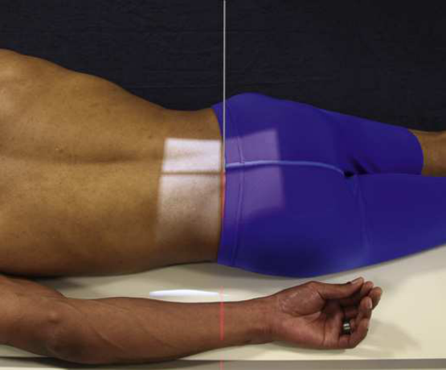
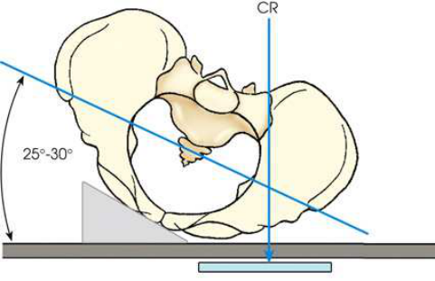
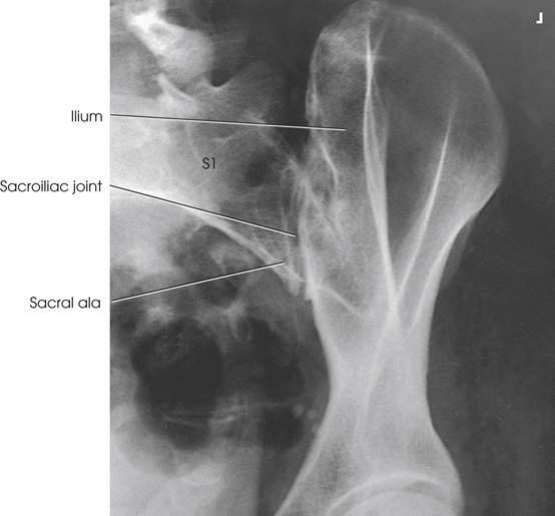

# Articulațiile sacroiliace — incidențe oblice postero-anterioare (PA) — RAO și oblică anterioară stângă (OAS / LAO) (Merrill)

  📷 Radiografie Convențională (Rx)
  <strong>Actualizat:</strong> 2026-09-16
  <strong>Autor:</strong> Referință Merrill

---

-   __1. Rezumat Clinic & Indicații__

    ---

    === "Indicații Clinice"

        - Conform reperelor anatomice standard din tratat

    === "Ghid Național IRIS"

        !!! info "Referință Primară: Ghidul Național IRIS (Ordinul MS 1342/2012)"
            - **Capitol Ghid IRIS:** *Ghidul Național IRIS*
            - **Grad de Recomandare:** **De verificat pe indicație; fără grad atribuit automat**
            - **Nivel de Iradiere Estimată:** `De verificat pentru examinarea și populația selectate`

            [:octicons-search-16: Deschide Ghidul IRIS](../../iris.md){ .md-button .md-button--primary } [:material-open-in-new: Aplicația Oficială PWA](https://radiologie-pediatrica.ro/iris/){ .md-button target="_blank" rel="noopener" }
-   __2. Poziționare & Centrare Fascicul__

    ---

    - **Poziție Pacient:** Se așază pacientul în decubit ventral. Se plasează o pernă mică și fermă sub cap. Se ajustează pacientul prin rotirea părții de interes spre masa radiologică până când se obține o rotație a corpului de 25 la 30 grade. Se instruiește pacientul să se sprijine pe antebraț și să flecteze genunchiul părții ridicate. Partea examinată trebuie să fie mai apropiată de receptorul de imagine. Se utilizează poziția oblică anterioară dreaptă (OAD / RAO) pentru evidențierea articulației drepte și poziția oblică anterioară stângă (OAS / LAO) pentru evidențierea articulației stângi. Se verifică gradul de rotație în mai multe puncte de-a lungul suprafeței anterioare a corpului pacientului. Se ajustează corpul pacientului astfel încât axa longitudinală să fie paralelă cu axa longitudinală a mesei de examinare. Se centrează corpul astfel încât punctul situat la 1 inch (2.5 cm) medial față de SIAS cea mai apropiată de receptorul de imagine să fie centrat pe grilă (Fig. 9.114 și 9.115). Se centrează receptorul de imagine la nivelul SIAS. Se efectuează ecranarea gonadelor cu șorț plumbat. Colimarea strânsă la nivelul articulației poate proteja gonadele la pacienții de sex masculin. Poate fi dificilă utilizarea ecranării de contact la pacienții de sex feminin.
    - **Punct de Centrare Fascicul:** perpendicular pe receptorul de imagine (RI) și centrat la 1 inch (2.5 cm) medial față de SIAS cea mai apropiată de receptorul de imagine
    - **Distanță Focar-Film (DFF / SID):** Nespecificat în fragmentul extras; de verificat în sursă
    - **Comandă Respiratorie:** apnee (oprirea respirației).

-   __3. Parametri Tehnici Expunere__

    ---

    | Parametru Tehnic | Valoare Configurare Generator / Tub |
    |:-----------------|:-------------------------------------|
    | **Tensiune Tub (kV)** | DE CONFIGURAT PE APARAT |
    | **Sarcină / Produs Curent-Timp (mAs)** | DE CONFIGURAT PE APARAT |
    | **Distanță Focar-Film (DFF / SID)** | Nespecificat în fragmentul extras; de verificat în sursă |
    | **Grilă Antidifuzoare (Bucky)** | DE CONFIGURAT PE APARAT |
    | **Dimensiune Focar** | DE CONFIGURAT PE APARAT |
    | **Camere de Ionizare AEC** | DE CONFIGURAT PE APARAT |
    | **Colimare Fascicul** | Se ajustează câmpul de iradiere la formatul 15 × 24 cm pe colimator. Se plasează markerul de lateralitate (D/S) în câmpul de expunere colimat. |
    | **Filtrare Tub** | DE CONFIGURAT PE APARAT |

-   __4. Criterii de Calitate & Reușită Imagine__

    ---

    - Criterii radiologice de calitate a imaginii:
    - Evidențierea colimării corecte și prezența markerului de lateralitate (D/S), plasat fără a se suprapune peste anatomia de interes
    - Spațiile articulare sacroiliace deschise, cele mai apropiate de receptorul de imagine, sau suprapunere minimă a ilionului și sacrului
    - articulația centrată pe radiografie
    - Detalii trabeculare osoase și țesuturile moi înconjurătoare

-   __5. Protecție Radiologică (ALARA)__

    ---

    - Nespecificat în fragmentul extras; de verificat în sursă

!!! note "Observații Clinice & Tehnice"
    Incidența PA axială oblică poate fi obținută prin poziționarea pacientului conform descrierii anterioare. Pentru incidența PA axială oblică, raza centrală este orientată la 20 la 25 grade caudal, intră în pacient la nivelul planului transversal, trece la 1½ inches (3.8 cm) distal față de procesul spinos L5 și iese la nivelul SIAS (Fig. 9.117).

### 🖼️ Imagini

<figure class="protocol-image-card" markdown>

<figcaption><strong>Merrill — pagina 749, imaginea 1</strong> — Imagine din fragmentul sursă; asocierea necesită revizie.</figcaption>

</figure>

<figure class="protocol-image-card" markdown>

<figcaption><strong>Merrill — pagina 750, imaginea 2</strong> — Imagine din fragmentul sursă; asocierea necesită revizie.</figcaption>

</figure>

<figure class="protocol-image-card" markdown>

<figcaption><strong>Merrill — pagina 751, imaginea 3</strong> — Imagine din fragmentul sursă; asocierea necesită revizie.</figcaption>

</figure>

=== "Ghid Rapid de Execuție"

    1. **Identificarea și verificarea pacientului:** verificare identitate, zonă de examinat, consimțământ conform procedurii și evaluarea posibilității unei sarcini, când este relevantă.
    2. **Pregătire:** îndepărtarea oricăror obiecte radiopace (bijuterii, agrafe, fermoare, proteze, pansamente dense).
    3. **Poziționare precisă:** alinierea receptorului de imagine și a tubului la distanța prescrisă (Nespecificat în fragmentul extras; de verificat în sursă).
    4. **Colimare strictă:** adaptarea fasciculului strict la regiunea de diagnostic pentru scăderea iradierii și reducerea radiației difuze.
    5. **Radioprotecție:** verificarea [politicii RX](../radioprotectie.md), cu măsuri distincte pentru pacient, personal și însoțitor.

## Surse de documentare

- [Merrill’s Atlas, 9. Vertebral Column, pagini 748–751](https://books.google.com/books/about/Merrill_s_Atlas_of_Radiographic_Position.html?id=BM0lEQAAQBAJ)

## Fragmente sursă traduse (referință tehnică)

### anatomie

articulația sacroiliacă cea mai apropiată de receptorul de imagine (Fig. 9.116). (Vezi Rezumatul incidențelor oblice, p. 440.)

### colimare

• Se ajustează câmpul de iradiere la formatul 15 × 24 cm pe colimator. Se plasează markerul de lateralitate (D/S) în câmpul de expunere colimat.

### raza centrală

• perpendicular pe receptorul de imagine (RI) și centrat la 1 inch (2.5 cm) medial față de SIAS cea mai apropiată de receptorul de imagine

### criterii

Criterii radiologice de calitate a imaginii:
• Dovezi ale colimării corecte și prezența markerului de lateralitate (D/S), plasat clar față de anatomia de interes
• Spații articulare sacroiliace deschise, cele mai apropiate de receptorul de imagine, sau suprapunere minimă a ilionului și sacrului
• articulația centrată pe radiografie
• Detalii osoase trabeculare și țesuturile moi din jur

### note

Incidența PA axială oblică poate fi obținută prin poziționarea pacientului conform descrierii anterioare. Pentru incidența PA axială oblică, raza centrală este
orientată la 20 la 25 grade caudal, intră în pacient la nivelul planului transversal, trece la 1½ inches (3.8 cm) distal față de procesul spinos L5
și iese la nivelul SIAS (Fig. 9.117).

### part_pos

• Se ajustează pacientul prin rotirea părții de interes spre masa radiologică până când se obține o rotație a corpului de 25 la 30 grade.
Se instruiește pacientul să se sprijine pe antebraț și să flecteze genunchiul părții ridicate.
• Partea examinată trebuie să fie mai apropiată de receptorul de imagine. Se utilizează poziția oblică anterioară dreaptă (OAD / RAO) pentru evidențierea articulației drepte și poziția oblică anterioară stângă (OAS / LAO) pentru evidențierea articulației stângi.
• Se verifică gradul de rotație în mai multe puncte de-a lungul suprafeței anterioare a corpului pacientului.
• Se ajustează corpul pacientului astfel încât axa longitudinală să fie paralelă cu axa longitudinală a mesei de examinare.
• Se centrează corpul astfel încât punctul situat la 1 inch (2.5 cm) medial față de SIAS cea mai apropiată de receptorul de imagine să fie centrat pe grilă (Fig. 9.114 și 9.115).
• Se centrează receptorul de imagine la nivelul SIAS.
• Se efectuează ecranarea gonadelor cu șorț plumbat. Colimarea strânsă la nivelul articulației poate proteja gonadele la pacienții de sex masculin. Poate fi dificilă utilizarea ecranării de contact la pacienții de sex feminin.

### patient_pos

• Se așază pacientul în decubit ventral.
• Se plasează o pernă mică și fermă sub cap.

### respirație

apnee (oprirea respirației).

### tehnică

poziționat conform protocolului producătorului sau al departamentului pentru afișarea corectă a orientării anatomice; receptorul de imagine: 10 × 12 inches (24 ×
30 cm), longitudinal. Ambele incidențe oblice sunt de obicei obținute pentru comparație.

