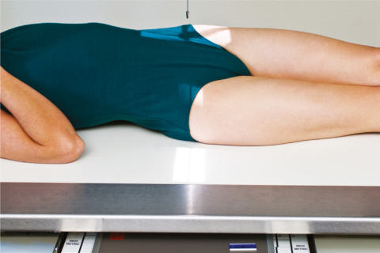
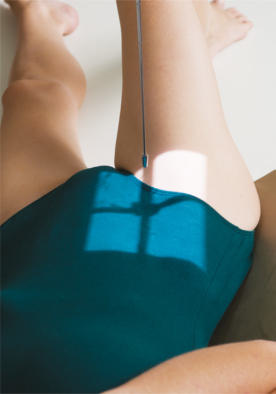
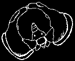
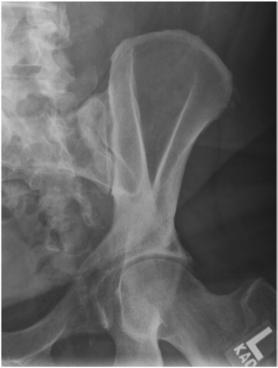

# Rx SACROILIAC JOINTS POSTERIOR OBLIQUE Poziționare (LPO AND RPO)

  📷 Radiografie Convențională (Rx)
  <strong>Actualizat:</strong> 2026-09-15
  <strong>Autor:</strong> Departamentul de Radiologie / Referință Bontrager

---

-   __1. Rezumat Clinic & Indicații__

    ---

    === "Indicații Clinice"

        - pathology de SI articulație, including luxație / subluxație articulară sau subluxation
        - bilateral study pentru comparison

    === "Ghid Național IRIS"

        !!! info "Referință Primară: Ghidul Național IRIS (Ordinul MS 1342/2012)"
            - **Capitol Ghid IRIS:** *Ghidul Național IRIS*
            - **Grad de Recomandare:** **De verificat pe indicație; fără grad atribuit automat**
            - **Nivel de Iradiere Estimată:** `De verificat pentru examinarea și populația selectate`

            [:octicons-search-16: Deschide Ghidul IRIS](../../iris.md){ .md-button .md-button--primary } [:material-open-in-new: Aplicația Oficială PWA](https://radiologie-pediatrica.ro/iris/){ .md-button target="_blank" rel="noopener" }
-   __2. Poziționare & Centrare Fascicul__

    ---

    - **Poziție Pacient:** Pacient: Decubit dorsal poziție pacient Decubit dorsal cu brațe la side și cap pe pillow.; Regiune anatomică: Rotate corp into 25° la 30° posterior oblic, cu side de interest ridicat (LPO pentru drept articulație și RPO pentru stâng articulație) (Figs. 9.75 și 9.76). Align articulație de interest la raza centrală și linia mediană mesei și/sau receptorul de imagine. Use anglemeasuring device la ensure correct și consistent angles pe ambele oblic poziții. Place support under ridicat Șold și flex ridicat Genunchi.
    - **Punct de Centrare Fascicul:** 25-30q Fig. 9.77 LPO de SI articulații. Fig. 9.78 RPO incidență pentru stâng (upside) SI articulații.
    - **Distanță Focar-Film (DFF / SID):** 100 cm
    - **Comandă Respiratorie:** Apnee pe durata expunerii pentru prevenirea artefactelor de mișcare ale pacientului.

-   __3. Parametri Tehnici Expunere__

    ---

    | Parametru Tehnic | Valoare Configurare Generator / Tub |
    |:-----------------|:-------------------------------------|
    | **Tensiune Tub (kV)** | 80-95 kV |
    | **Sarcină / Produs Curent-Timp (mAs)** | DE CONFIGURAT PE APARAT |
    | **Distanță Focar-Film (DFF / SID)** | 100 cm |
    | **Grilă Antidifuzoare (Bucky)** | Cu grilă antidifuzoare Bucky |
    | **Dimensiune Focar** | Focar Mare (1.0 - 1.2 mm) |
    | **Camere de Ionizare AEC** | Camerele laterale (sau camera centrală funcție de regiune) |
    | **Colimare Fascicul** | Field Size Collimate pe four sides la anatomy de interest. |
    | **Filtrare Tub** | Totală ≥ 2.5 mm Al echivalent |

-   __4. Criterii de Calitate & Reușită Imagine__

    ---

    - Sacroiliac articulație farthest de la receptorul de imagine (Fig. 9.78). poziție
    - precis rotație de pacientul indicated prin fără superimposition de ala de ilium și Sacru cu open SI articulație.
    - Collimation field size la aria de interes diagnostic. expunere
    - optim receptorul de imagine expunere și contrast. Clear demonstration de bony margins și trabecular markings de Sacru.
    - fără mișcare. Fig. 9.75 RPO pentru stâng side (upside) SI articulații. Fig. 9.76 LPO pentru drept side (upside) SI articulații. 1 în.

-   __5. Protecție Radiologică (ALARA)__

    ---

    - Ecranare gonadică și a organelor radiosensibile conform procedurilor locale de radioprotecție ALARA.
    - Colimare strictă la aria de interes pentru limitarea radiației difuze.
    - Verificarea posibilității unei sarcini la pacientele de vârstă fertilă înainte de expunere.

!!! note "Observații Clinice & Tehnice"
    la evidențiază inferior sau distal part de articulație more clearly, raza centrală poate fie înclinat 15° la 20° cranial. SACROILIAC articulații ROUTINE AP axial posterior oblic incidențe

### 🖼️ Imagini

<figure class="protocol-image-card" markdown>

<figcaption><strong>Fig. 9.75 RPO pentru stâng side (upside) SI articulații.</strong> — Poziționare pacient conform Ghidului Bontrager (Fig. 9.75 RPO pentru stâng side (upside) SI articulații.)</figcaption>

</figure>

<figure class="protocol-image-card" markdown>

<figcaption><strong>Fig. 9.76 LPO pentru drept side (upside) SI articulații.</strong> — Aspect radiografic de referință conform Ghidului Bontrager (Fig. 9.76 LPO pentru drept side (upside) SI articulații.)</figcaption>

</figure>

<figure class="protocol-image-card" markdown>

<figcaption><strong>Fig. 9.77 LPO de SI articulații.</strong> — Aspect radiografic de referință conform Ghidului Bontrager (Fig. 9.77 LPO de SI articulații.)</figcaption>

</figure>

<figure class="protocol-image-card" markdown>

<figcaption><strong>Fig. 9.78 RPO incidență pentru stâng (upside) SI articulații.</strong> — Aspect radiografic de referință conform Ghidului Bontrager (Fig. 9.78 RPO incidență pentru stâng (upside) SI articulații.)</figcaption>

</figure>

=== "Ghid Rapid de Execuție"

    1. **Identificarea și verificarea pacientului:** verificare identitate, zonă de examinat, consimțământ conform procedurii și evaluarea posibilității unei sarcini, când este relevantă.
    2. **Pregătire:** îndepărtarea oricăror obiecte radiopace (bijuterii, agrafe, fermoare, proteze, pansamente dense).
    3. **Poziționare precisă:** alinierea receptorului de imagine și a tubului la distanța prescrisă (100 cm).
    4. **Colimare strictă:** adaptarea fasciculului strict la regiunea de diagnostic pentru scăderea iradierii și reducerea radiației difuze.
    5. **Radioprotecție:** verificarea [politicii RX](../radioprotectie.md), cu măsuri distincte pentru pacient, personal și însoțitor.

## Surse de documentare

- [Bontrager's Textbook of Radiographic Positioning (Ed. 9/10), Pagina 376](https://www.elsevier.com/books/textbook-of-radiographic-positioning-and-related-anatomy/lampignano/978-0-323-65367-1)
