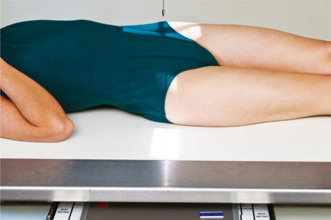
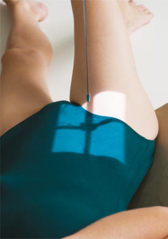
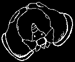
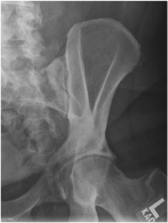

# ARTICULAȚIILE SACROILIACE — INCIDENȚE OB切ICE POSTERIOARE — Poziționare (LPO ȘI RPO)

  📷 Radiografie Convențională (Rx)
  <strong>Actualizat:</strong> 2026-09-15
  <strong>Autor:</strong> Departamentul de Radiologie / Referință Bontrager

---

-   __1. Rezumat Clinic & Indicații__

    ---

    === "Indicații Clinice"

        - patologia articulației SI, inclusiv luxația / subluxația articulară sau subluxația
        - examinare bilaterală pentru comparație

    === "Ghid Național IRIS"

        !!! info "Referință Primară: Ghidul Național IRIS (Ordinul MS 1342/2012)"
            - **Capitol Ghid IRIS:** *Ghidul Național IRIS*
            - **Grad de Recomandare:** **De verificat pe indicație; fără grad atribuit automat**
            - **Nivel de Iradiere Estimată:** `De verificat pentru examinarea și populația selectate`

            [:octicons-search-16: Deschide Ghidul IRIS](../../iris.md){ .md-button .md-button--primary } [:material-open-in-new: Aplicația Oficială PWA](https://radiologie-pediatrica.ro/iris/){ .md-button target="_blank" rel="noopener" }
-   __2. Poziționare & Centrare Fascicul__

    ---

    - **Poziție Pacient:** Pacient: poziția pacientului în decubit dorsal, cu brațele pe lângă corp și capul pe o pernă. Regiune anatomică: Se rotește corpul în oblică posterioară cu 25° la 30°, cu partea de interes ridicată (LPO pentru articulația dreaptă și RPO pentru articulația stângă) (Fig. 9.75 și 9.76). Se aliniază articulația de interes cu raza centrală și linia mediană a mesei și/sau cu receptorul de imagine. Se utilizează un dispozitiv de măsurare a unghiului pentru a asigura unghiuri corecte și constante în ambele poziții oblice. Se plasează un suport sub șoldul ridicat și se flectează genunchiul ridicat.
    - **Punct de Centrare Fascicul:** 25-30q Fig. 9.77 LPO pentru articulațiile SI. Fig. 9.78 Incidență RPO pentru articulațiile SI stângi (partea ridicată).
    - **Distanță Focar-Film (DFF / SID):** 100 cm
    - **Comandă Respiratorie:** Apnee pe durata expunerii pentru prevenirea artefactelor de mișcare ale pacientului.

-   __3. Parametri Tehnici Expunere__

    ---

    | Parametru Tehnic | Valoare Configurare Generator / Tub |
    |:-----------------|:-------------------------------------|
    | **Tensiune Tub (kV)** | 80-95 kV |
    | **Sarcină / Produs Curent-Timp (mAs)** | DE CONFIGURAT PE APARAT |
    | **Distanță Focar-Film (DFF / SID)** | 100 cm |
    | **Grilă Antidifuzoare (Bucky)** | Cu grilă antidifuzoare Bucky |
    | **Dimensiune Focar** | Focar Mare (1.0 - 1.2 mm) |
    | **Camere de Ionizare AEC** | Camerele laterale (sau camera centrală, în funcție de regiune) |
    | **Colimare Fascicul** | Dimensiunea câmpului Colimați pe cele patru laturi la regiunea anatomică de interes. |
    | **Filtrare Tub** | Totală ≥ 2.5 mm Al echivalent |

-   __4. Criterii de Calitate & Reușită Imagine__

    ---

    - Articulația sacroiliacă cea mai îndepărtată de receptorul de imagine (Fig. 9.78). poziție
    - rotația precisă a pacientului indicată prin lipsa suprapunerii aripii ilionului și sacrului, cu articulația SI deschisă.
    - Colimarea câmpului la dimensiunea ariei de interes diagnostic. Expunere
    - expunerea optimă a receptorului de imagine și contrast. Evidențiere clară a marginilor osoase și a desenului trabecular al sacrului.
    - fără mișcare. Fig. 9.75 RPO pentru partea stângă (ridicată) — articulațiile SI. Fig. 9.76 LPO pentru partea dreaptă (ridicată) — articulațiile SI. 1 în.

-   __5. Protecție Radiologică (ALARA)__

    ---

    - Ecranare gonadică și a organelor radiosensibile conform procedurilor locale de radioprotecție ALARA.
    - Colimare strictă la aria de interes pentru limitarea radiației difuze.
    - Verificarea posibilității unei sarcini la pacientele de vârstă fertilă înainte de expunere.

!!! note "Observații Clinice & Tehnice"
    Pentru evidențierea mai clară a părții inferioare sau distale a articulației, raza centrală poate fi înclinată cu 15° la 20° cranial. ARTICULAȚIILE SACROILIACE — incidențe AP axiale oblice posterioare de rutină

### 🖼️ Imagini

<figure class="protocol-image-card" markdown>

<figcaption><strong>Fig. 9.75 RPO pentru partea stângă (ridicată) — articulațiile SI.</strong> — Poziționare pacient conform Ghidului Bontrager (Fig. 9.75 RPO pentru partea stângă (ridicată) — articulațiile SI.)</figcaption>

</figure>

<figure class="protocol-image-card" markdown>

<figcaption><strong>Fig. 9.76 LPO pentru partea dreaptă (ridicată) — articulațiile SI.</strong> — Aspect radiografic de referință conform Ghidului Bontrager (Fig. 9.76 LPO pentru partea dreaptă (ridicată) — articulațiile SI.)</figcaption>

</figure>

<figure class="protocol-image-card" markdown>

<figcaption><strong>Fig. 9.77 LPO pentru articulațiile SI.</strong> — Aspect radiografic de referință conform Ghidului Bontrager (Fig. 9.77 LPO pentru articulațiile SI.)</figcaption>

</figure>

<figure class="protocol-image-card" markdown>

<figcaption><strong>Fig. 9.78 Incidență RPO pentru articulațiile SI stângi (partea ridicată).</strong> — Aspect radiografic de referință conform Ghidului Bontrager (Fig. 9.78 Incidență RPO pentru articulațiile SI stângi (partea ridicată).)</figcaption>

</figure>

=== "Ghid Rapid de Execuție"

    1. **Identificarea și verificarea pacientului:** verificare identitate, zonă de examinat, consimțământ conform procedurii și evaluarea posibilității unei sarcini, când este relevantă.
    2. **Pregătire:** îndepărtarea oricăror obiecte radiopace (bijuterii, agrafe, fermoare, proteze, pansamente dense).
    3. **Poziționare precisă:** alinierea receptorului de imagine și a tubului la distanța prescrisă (100 cm).
    4. **Colimare strictă:** adaptarea fasciculului strict la regiunea de diagnostic pentru scăderea iradierii și reducerea radiației difuze.
    5. **Radioprotecție:** verificarea [politicii RX](../radioprotectie.md), cu măsuri distincte pentru pacient, personal și însoțitor.

## Surse de documentare

- [Bontrager's Textbook of Radiographic Positioning (Ed. 9/10), Pagina 376](https://www.elsevier.com/books/textbook-of-radiographic-positioning-and-related-anatomy/lampignano/978-0-323-65367-1)
